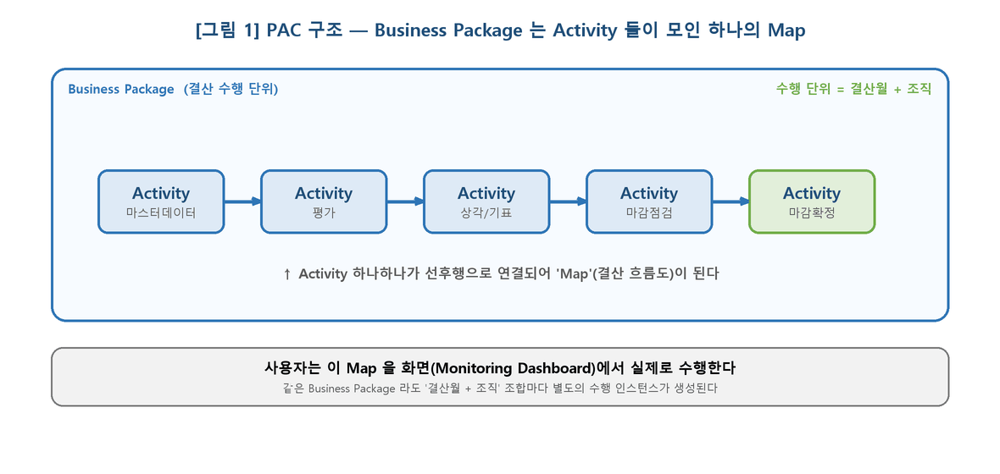
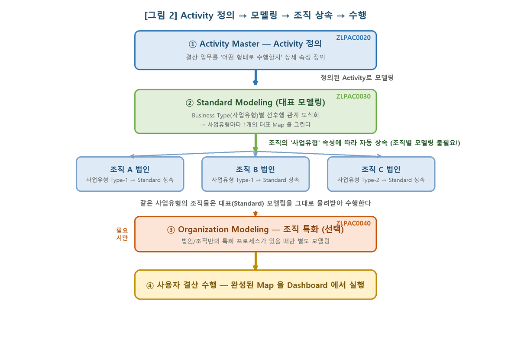
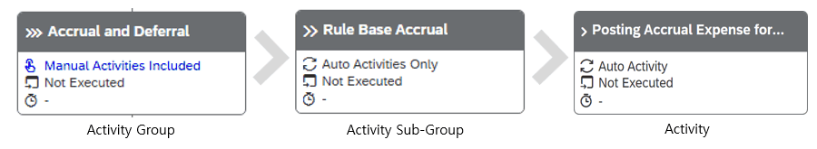
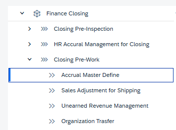
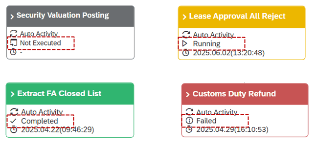
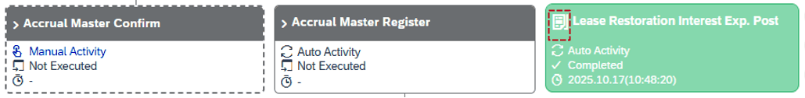

# 2. 큰 그림 — PAC 구조 한눈에

## 2.1 한 문장 요약

PAC는 **결산 수행 단위**인 **Business Package** 를 **결산월 + 조직** 으로 수행하는 솔루션이고, 그 안에서 수행되는 작업 하나하나가 **Activity** 이며, 이 Activity 들이 선후행으로 모여 만든 **Map(결산 흐름도)** 을 사용자가 실제로 수행합니다.

## 2.2 꼭 알아야 할 4가지 개념

| 개념 | 한 줄 설명 |
|---|---|
| Business Package | 결산 수행 단위(묶음). '결산월 + 조직' 조합마다 한 번씩 수행된다. |
| Activity | 수행될 작업 하나하나(= Closing ID). 결산 업무를 '어떤 형태로 수행할지' 상세 속성으로 정의한다. |
| Map | Activity 들을 선후행 관계로 도식화한 결산 흐름도. 사용자가 이 Map 을 보고 수행한다. |
| Modeling | Activity 들을 선후행으로 연결해 Map 을 그리는 과정. (Activity 정의가 먼저 되어 있어야 함) |

그림 1. Business Package 는 Activity 들이 모여 만든 하나의 Map 이다.

## 2.3 정의 → 모델링 → 조직 상속 → 수행 (전체 흐름)

Map 을 만들려면 먼저 그 안에 들어갈 Activity 들이 Activity Master 에 정의되어 있어야 합니다. 정의된 Activity Master 를 가지고 Activity Modeling(선후행 도식화)을 수행합니다. 순서는 다음과 같습니다.

1. **① Activity 정의 — ZLPAC0020 (Activity Master):** 결산 업무를 어떤 형태로 수행할지 상세 속성으로 정의한다. (본 매뉴얼의 주 대상)
2. **② Standard Modeling — ZLPAC0030:** Business Type(사업유형)별 '대표 모델링'을 한다. 정의된 Activity 들을 선후행으로 연결해 사업유형마다 1개의 대표 Map 을 그린다.
3. **③ 조직별 상속(자동):** Business Package 의 조직 속성에 지정된 사업유형(Business Type)에 따라, 각 조직이 Standard Modeling 을 그대로 상속받아 수행한다.

> [ 안내 ] 핵심: 같은 사업유형의 조직들은 Standard Modeling 을 물려받으므로 조직마다 따로 모델링할 필요가 없습니다. 사업유형별로 한 번만 대표 모델링을 하면 됩니다.

1. **④ Organization Modeling — ZLPAC0040 (선택):** 특정 조직/법인만의 특화 프로세스가 있을 때만, 그 조직에 한해 별도의 조직 특화 모델링을 추가로 수행한다.
2. **⑤ 사용자 수행:** 완성된 Map 을 Monitoring Dashboard 에서 결산월·조직 단위로 실제 수행한다.

그림 2. Activity 정의(ZLPAC0020) → Standard Modeling(ZLPAC0030) → 사업유형별 조직 상속 → 필요 시 Organization Modeling(ZLPAC0040) → 수행.

> [ 안내 ] 이 매뉴얼의 위치: 본 매뉴얼은 위 흐름의 ① Activity 정의(ZLPAC0020) 를 다룹니다. ②~④ 모델링(ZLPAC0030/0040)은 7장에서 연계 작업으로 안내합니다.

## 2.4 PAC와 Activity란

결산의 각 작업 단위를 Activity(액티비티, = Closing ID(LG전자)) 라고 부릅니다. Activity Master는 이 Activity들과 그 수행 방식을 정의하는 마스터이며, 그 정의 화면이 바로 ZLPAC0020 입니다.

## 2.5 Activity 3-Level 구조

PAC는 Business Package 아래 최대 3 Level로 구성되며, 각 Level의 구성 항목을 Activity Master에서 정의합니다.

| 구성 | 설명 | 아이콘 표시 |
|---|---|---|
| Business Package | PAC를 구성하는 기본 수행 단위 (최상위 묶음) | - |
| Activity Group (상위) | 하위 Activity 묶음 단위 (Activity의 모음) | >>> |
| Activity Sub-Group (중간) | 하위 Activity(Closing ID) 묶음 단위 | >> |
| Activity (최하위) | 실제로 수행되는 프로그램이 설정된 단계 | > |

그림1) Monitoring dashboard의 MAP에 표시되는 Activity 노드 표시 아이콘

그림2)Monitoring Dashboard 의 좌측 Activity List에 표시되는 레벨별 아이콘

> [ 안내 ] 모델링 레벨에 따른 계층구조( MDLVL ) ZLPAC0010 Business Package Config 에서는 Bupak별 레벨을 설정할수 있다. 모델링레벨이 2 Lv.이면 Activity Group + Activity 2단계, 모델링레벨이 3 Lv.이면 Activity Group + Activity Sub-Group + Activity 3단계로 구성됩니다.

## 2.6 Activity Status (상태 색상)

| 색상 | 상태 | 의미 |
|---|---|---|
| Black | Not Executed | 수행 전 |
| Yellow | Running | 진행 중 |
| Green | Completed | 완료 |
| Red | Error / Failed / Rework | 오류 또는 재작업 발생 |

그림)Activity Status 참고

## 2.7 Auto / Manual 과 Posting

- Auto Activity와 Manual Activiy 에 대한 컨셉을 잡고 Activity Master에 반영하게 된다. 두가지는 Map 에서 노드 테두리가 점선과 실선 형태로 구분되어 표시된다.
- **점선(Manual Activity):** 수작업 수행 Activity. 사용자가 직접 입력·확인 후 'Complete'.
- **실선(Auto Activity):** 자동 수행 Activity. 'Start'로 자동 수행 가능한 단계.
- **Posting Activity:** 기표(전표 생성)가 발생한 Activity. 전표 번호·건수 확인 가능, Detail Log로 정상/에러 상세 조회. ZLPAC0074에 메시지 등록할경우 기표 아이콘 표시됨.
그림) Manual Activity / Auto Activity / Posting Activity에 대한 노드 표시

