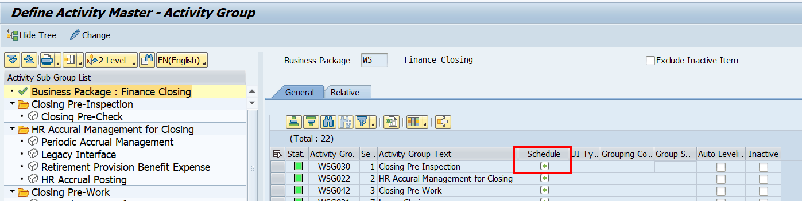
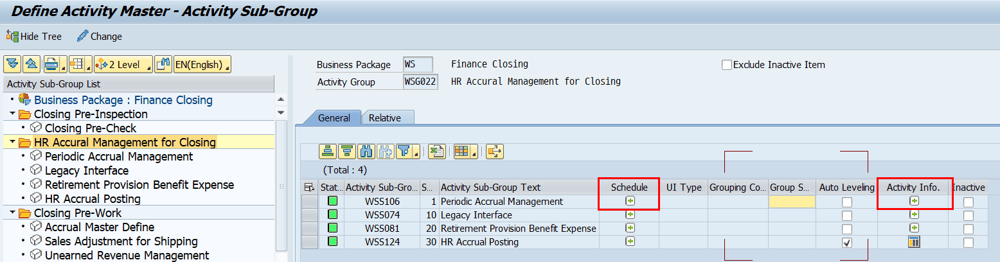
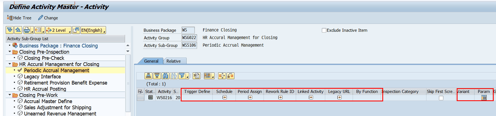
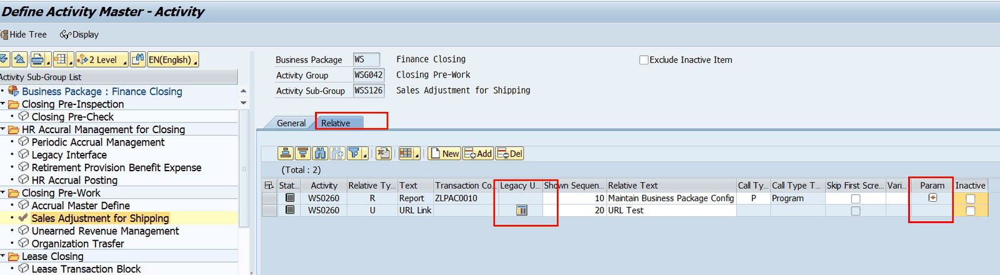

# 3. 관련 트랜잭션 · 함수 · 테이블 (검증됨)

아래 목록은 SAP MCP(ADT)로 객체의 실재·설명·함수그룹을 직접 확인한 것입니다. (검증 기준일 2026-06)

Activity Master 등록과 관련된 프로그램

## 3.1 관련 트랜잭션 / 프로그램

| Tcode | SAP 설명 | 운영 관점 역할 | 관계 |
|---|---|---|---|
| ZLPAC0020 | Define Activity Master | Activity Master 정의(본 매뉴얼 대상) | 본화면 |
| ZLPAC0070 | Define Trigger Code | Auto Trigger용 Trigger Code 정의 | Trigger Activity 정의하기 전 사전작업 |
| ZLPAC3000 | Define Rework Rule ID Maintain Re-work Rule ID | Rework Rule ID 조회/생성 Rework Rule(G/L 계정 등) 관리 | Activity의 Rework 속성 맵핑 전 사전작업(ZLPAC3000->ZLPAC3010) |
| ZFCLR0010 | (lg전자 프로그램 ) Manage Closing Account Category | Closing Category 저장→Rework Rule ID 동기화 | LG전자는 Closing Category 를 Rework Rule ID로 사용함. 해당 프로그램의 저장 시점에 PAC Rework 테이블로 동기화 됨. |
| ZLPAC0130 | Function Report (Execute Activity By Function) | Function 실행 리포트 (Activity Guide 연결) | 연계 |
| ZLPAC0030 | Maintain Standard Map | 등록한 Sub-Group으로 표준 Map 구성 | 후속작업 |
| ZLPAC0040 | Maintain Organization Map | 조직별 Map 구성 | 후속작업 |

## 3.2 항목 셋업 시 호출되는 핵심 함수 (✔ 검증)

ZLPAC0020에서 각 버튼/항목을 셋업할 때 호출되는 사용자정의 함수입니다. 모두 패키지 ZPAC, 유형 Function Module로 검증되었습니다. (함수그룹·SAP 설명 포함)

Activity Master의 각 속성들은 단순하게 필드에 직접 속성값을 입력하기도 하지만 여러 정보가 필요한 속성의 경우에는 상세 정보에 대해서 function으로 띄워서 상세 정보를 입력하여 저장할수있도록 되어있는 구조임.

아래 표시한 각 속성별 function 위치를 참고하여 디버깅포인트를 찍고 ZLPAC0020 직접 들어가서 실행시켜볼수 있다.

Activity Group(1레벨) 속성

Activity Sub-group(2레벨) 속성

Activity 레벨(3레벨) 속성

Relative

| 함수 | 함수그룹 | SAP 설명 | 셋업 항목 |
|---|---|---|---|
| ZFPAC_PID_DETAIL_SEARCH | ZPAC018 | Detail Search by Pid | Detail Search 버튼 |
| ZFPAC_CLOSING_ASSIGN | ZPAC130 | Assign Schedule ID to Activity ID | Schedule 지정 |
| ZFPAC_LINKED_PID_ASSIGN | ZPAC022 | Assign Linked Acitivty ID | Linked Activity |
| ZFPAC_PID_PERIOD | ZPAC013 | Assign Activity Period | 수행 주기(Period) |
| ZFPAC_PID_INFO | ZPAC011 | Activity Info. Management | Activity Info/User Manual |
| ZFPAC_SET_LEGACY_URL | ZPAC017 | Set Legacy URL | Legacy URL/RFC |
| ZFPAC_PID_BY_FUNCTION | ZPAC014 | Define Execution Function by Pid | By Function (N type) |
| ZFPAC_SKIP_PID_ASSIGN | ZPAC028 | Assign Organization Skip By Pid | Organization Skip |
| ZFPAC_SET_TRIGINFO | ZPAC055 | Set Trigger Information | Trigger Define (X type) |
| ZFPAC_RULE_TO_ACTIVITY | ZPAC023 | Assign Re-work Rule ID to Activity | Rework Rule ID |
| ZFPAC_REP_PARAM | ZPAC026 | Assign Common Parameter | Variant/Log Param |
| ZFPAC_REL_PARAM | ZPAC025 | Assign Relative Parameter | Relative Parameter |

## 3.3 주요 테이블

| 테이블 | 용도 |
|---|---|
| ZTPAC_PROC / ZTPAC_PROCT | Activity Definition Master(본 테이블) / 다국어 텍스트 (✔ ZTPAC_PROC 검증) |
| ZTPAC_RELATIVE / ZTPAC_RELATIVET | Relative(연관 프로그램) 정의 / 텍스트 |
| ZTPAC_PROC_RCLOS | Activity별 Closing Schedule ID 매핑 |
| ZTPAC_REWORK_LKD | Linked Activity(선후행 연결) 정보 |
| ZTPAC_PROC_PER | Activity 수행 주기(Period/월) 지정 |
| ZTPAC_CROSS_IF | Trigger Code(모듈/시스템 간 I/F) 정의 |
| ZTPAC_RW_RULEID | Rework Rule ID 마스터 |
| ZTPAC_PROC_FUNC / ZTPAC_PROC_SKIP | By Function 지정 / Organization Skip 지정 |
| ZTPAC_PROC_MEMO | Activity Info / User Manual 메모 |
| ZTPAC_REL_PARAM / ZTPAC_LOG_PARAM | Relative 파라미터 / Log·Screen 파라미터 |
| ZTPAC_CIS_CID | Closing Inspection Category ID |
| ZTPAC_CONFIG | Business Package별 모델링 Level/회사코드 필수 설정 |
| ZTPAC_STD_NODE / ORG_NODE / STD_LINK / ORG_LINK / ZTPAC_STATUS | Map 등록·수행 이력(삭제·Move 제약 체크용) |

운영포인트) Activity Master의 삭제시 기존 모델링 삭제, 수행 이력에 대한 삭제가 필요함. 모델링 삭제는 사용자들이 가능하지만, 수행이력의 삭제에 대해서는 PAC 운영 담당자의 지원이 필요함. (추후 운영환경에서는 이력관리를 위해 과거 Activity에 대해서는 완전한 삭제가 아닌 Inactive로 관리하도록 할수 있음).
