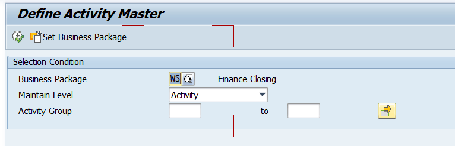
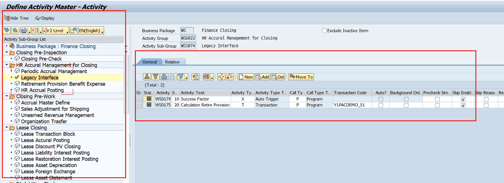
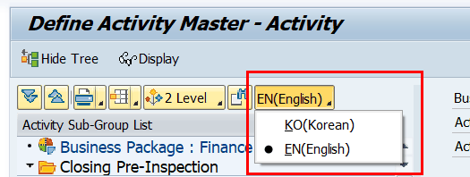
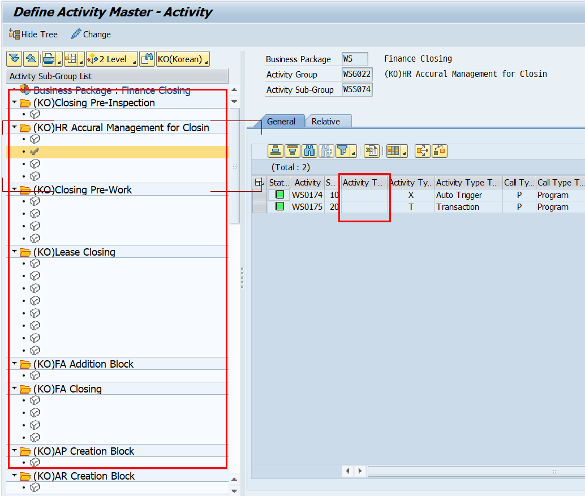
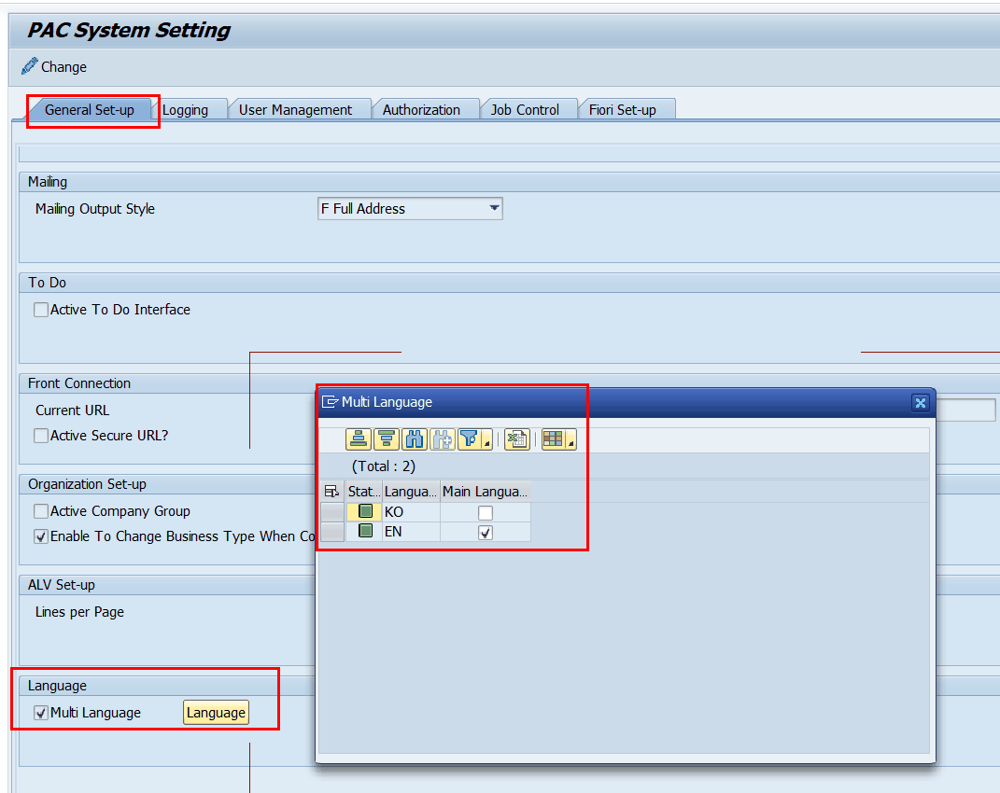
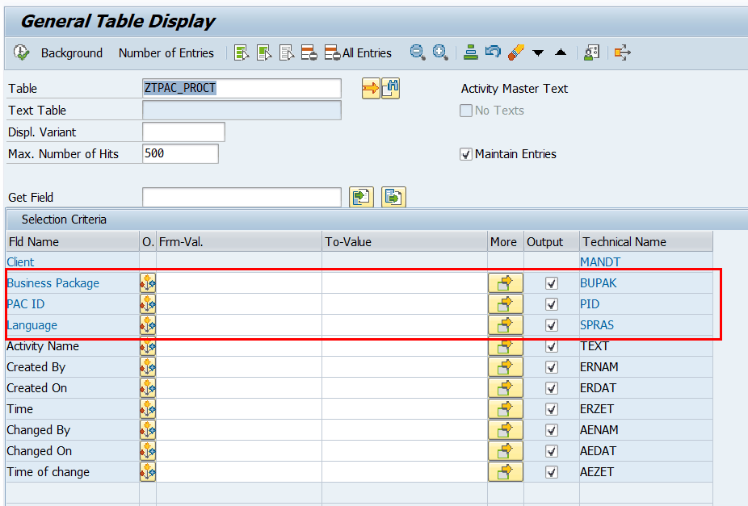
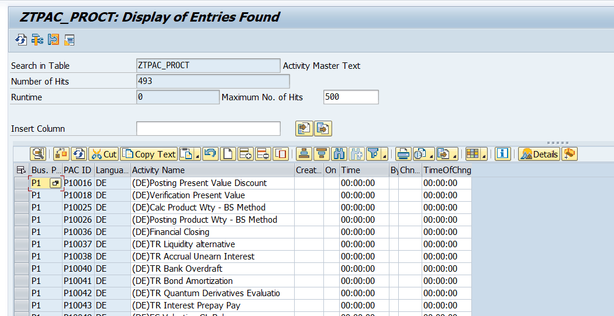

# 4. 화면 구성 및 진입

## 4.1 초기 조회 조건 (Selection Screen)

ZLPAC0020 실행 시 먼저 조회 조건을 입력합니다.

| 파라미터 | 필수 | 설명 |
|---|---|---|
| Business Package | 필수 | 조회할 Business Package 입력. 입력값은 ZFPAC_SET_BUPAK 으로 유효성·텍스트 확인 |
| Maintain Level | 필수 | 실행할 Level. 모델링 Level에 따라 List 상이 — 2 Lv.: Group/Activity, 3 Lv.: Group/Sub-Group/Activity |
| Activity Group | 선택 | 특정 Group만 조회. 미입력 시 전체. (Maintain Level=3, Activity 선택 시에만 활성화) |

> [ 화면 캡처 필요 ] ZLPAC0020 초기 조회 조건 화면(Business Package / Maintain Level / Activity Group)을 캡처. 

## 4.2 메인 화면 — Tree + ALV + 2개 탭

- **좌측 Tree:** Business Package > Activity Group > Sub-Group > Activity 계층 구조.
- **우측 ALV:** 선택한 노드의 하위 목록. 각 행에 세부 속성 버튼(아이콘)이 있음.
- **General 탭:** 액티비티 수행 정보 정의 (서브스크린 0110).
- **Relative 탭:** 액티비티별 연관 프로그램 등록 (서브스크린 0150).
- **Detail Search 버튼:** Activity 코드/코드명/TCODE/Type으로 검색 — ZFPAC_PID_DETAIL_SEARCH 호출.

> [ 화면 캡처 필요 ] ZLPAC0020 메인 화면(좌측 Tree + 우측 ALV + General/Relative 탭)을 캡처. 

## 4.3 초기 화면의 다국어 설정관련 참고

**초기화면의 좌측 Tree의 상단에 있는 다국어 설정 버튼을 클릭하여 activity master text의 다국어 설정이 가능하다.**

선택된 언어에 대해서 적용할 Activity Text를 입력할수 있다.

전제조건) ZLPACSYS 프로그램에서 General set-up 탭의 language 속성에서 Multi Language를 활성화 한 경우 위 리스트박스가 활성화 된다.

Activity Master Text는 ZTPAC_PROCT 테이블에 저장된다. BUPAK, PID, SPRAS 가 Key

다국어 active 후 적용되는 기준은 현재버전으로는 로그인 언어 기준으로 사전 세팅된 언어로 보여지도록 어느정도 기능이 구현되어 있으나 , 최종 테스트 필요한 상태임.

추후 결산 조직별 언어 적용에 대한 니즈가 있을것으로 예상되어 , 조직별로 표시할 language 정보를 company master 등 조직마스터 정보에 저장하고, 해당 Language로 표시하는 기능 구현에 대해 검토중(확인필요)

LXI 특화 – A000(본사) 결산 수행시, Activity info 부가정보로 Activity text(KO) 표시 요청 , 다른 기능에 대해서는 제외.
