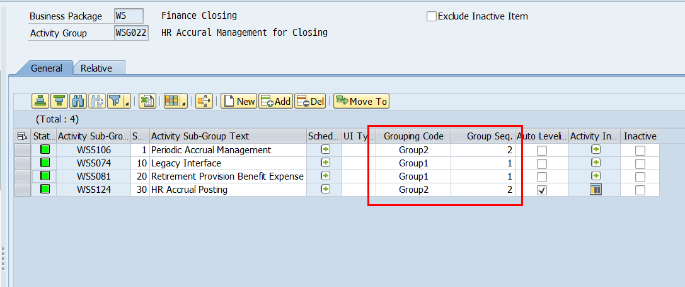
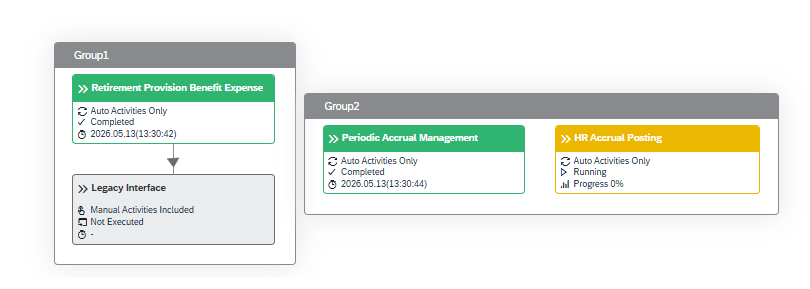
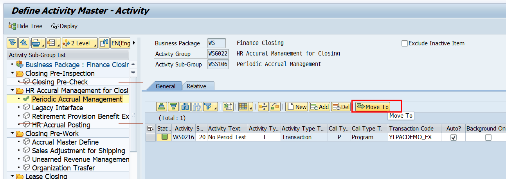

# 5. 초기 운영자 셋업 절차 (단계별)

초기 운영자가 Activity Master를 구성하는 순서입니다. 상위 → 하위 Level로 진행합니다. 각 항목 설정 시 호출되는 Function을 함께 표기합니다.

## 5.1 STEP 1 — Activity Group / Sub-Group 정의 (General 탭)

Tree에서 상위 노드 선택 후 ALV에 Group/Sub-Group 행을 추가합니다. 코드는 자동 채번되어 변경 불가합니다.

| 항목 | 설정 내용 |
|---|---|
| Group / Sub-Group 코드 | 자동 채번(변경 불가). Group=Bus.Pkg+G+3자리(ex.WSG001), Sub=Bus.Pkg+S+3자리(ex.WSS001) |
| Seq. (필수) | Monitoring Dashboard Menu Tree 순서. 마지막 Seq.+10 자동 채번(변경 가능) |
| Activity Group Text (필수) | Group 설명 (최대 36자) |
| Schedule | Schedule 등록 시 해당 Schedule이 Open인 동안에만 수행 가능 → [Schedule] 버튼 |
| UI Type | Dashboard 아이콘. 빈칸=기본 네모모양,
C=Closing Schedule(with time), W=(without time) 피오리에 표현될 Activity의 모양을 정의할수 있다. |
| Grouping Code / Group Seq. | Grouping할 Group에 동일 Code 기재(동일 Code=동일 Seq.로 저장) 적용 예시 캡쳐   주요 문의 NetGraph를 통한 Activity 모델링 시, 표시 순서를 직접 지정하여 Fiori 화면의 원하는 위치에 배치할 수 있는지 문의. Zlpac0030에 모델링한것과 피오리에 표시되는 위치가 달라요… 답변 : UI5 프레임워크에서 내부적으로 복잡한 규칙에 의해서 최적의 순서를 자동 계산해서 표시하는 방식임. 이부분은 별도의 커스터마이징으로 해결이 불가한 부분. 이라고 안내하고 있으나, 커스터마이징으로 해결이 가능할것같기도 함. ..사실검증 필요함 |
| Auto Leveling | 체크 시 하위 Grouping Code·Seq.대로 자동 Leveling (전 하위 Grouping·Group간 Link 없을 때) |
| Inactive | 해당 Group 비활성화 |
| Activity Info. | 관련 정보·User Manual 첨부 → [Activity Info] 버튼 |
| Move To | Sub→다른 Group, Activity→다른 Sub로 이동 (※모델링된 경우 이동 불가) |

> [ ✔ 검증 ] [Schedule] 버튼 → ZFPAC_CLOSING_ASSIGN (FG ZPAC130, 'Assign Schedule ID to Activity ID') [Activity Info] 버튼 → ZFPAC_PID_INFO (FG ZPAC011, 'Activity Info. Management'). 첨부 삭제 시 ZFPAC_GOS_DELETE.

> [ 안내 ] Move To는 함수가 아니라 화면 600(MODULE GET_PCSUB/PCSGP_TEXT_600 → FORM MOVE_TO_WHEN_0600)에서 UPDATE ZTPAC_PROC로 처리됩니다. 

> [ 화면 캡처 필요 ] General 탭에서 Group/Sub-Group 행과 Schedule·Activity Info 버튼이 보이는 ALV를 캡처.
