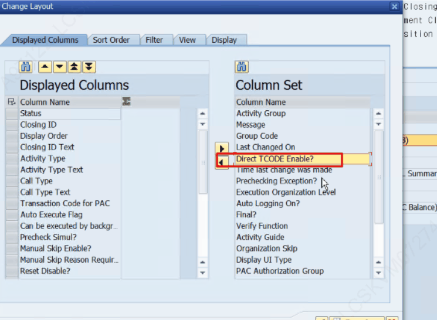
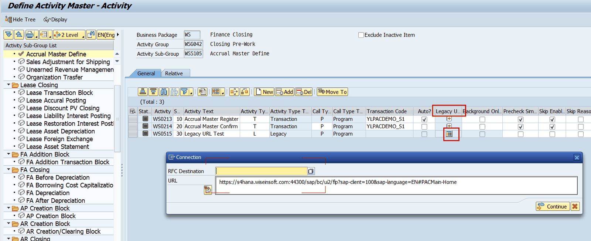

# 5. 초기 운영자 셋업 절차 (단계별)

## 5.2 STEP 2 — Activity 정의 (Activity Type / Call Type)

Sub-Group 하위에 Activity(Closing ID)를 추가합니다. Activity 코드는 Bus.Pkg+4자리(ex.WS0001)로 자동 채번됩니다. Activity Type에 따라 활성 항목과 호출 Function이 달라집니다.

PAC 운영담당자는 Activity Type 별로 어떤 용도로 모델링 하는지,어떻게 수행되는지 알고있어야 합니다.

| Type | 설명 | 용도 |
|---|---|---|
| C | Closing Schedule | 결산 일정 유형 – 사전 정의 필요 |
| F | Confirmation | 단순 Confirm |
| I | Closing Inspection | 결산 점검 – 사전 정의 필요 |
| L | Legacy | Legacy URL 연결 |
| M | Dummy | 1.개발예정인 프로그램 자리에 Dummy로 임시로 모델링가능 2.LG전자의 경우 royalty closing 이라는 FI Activity 하위에 Dummy 액티비티가 존재함(Closing Category 단위) –>RT Business Package에서 EKHQ 하위의 BA단위로 모두 기표가 최종적으로 일어나게 되면 (Trigger out) -> FI 에서 Royalty Closing이라는 Trigger in 되면서 하위에 dummy activity가 자동수행되는 구조임. (Closing Category 별로 기표되었다 라는 의미를 map상에서 인지하기위해 dummy 모델링 함) |
| N | Function Execute | Function 연결 – PAC 개발 가이드 적용 필요 Function 의 수행 결과를 TT_RESULT 구조에 담도록 개발하고, PAC에서 수행 결과를 ALV로 표시하는 기능을 제공한다. (별도의 스크린 개발 필요없이 Function 개발만으로도 가시적으로 결과 확인이 가능함) |
| T | Transaction | 가장 많이 사용하는 유형, Activity의 수행을 Transaction 또는 Program으로 할 경우 선택한다.
Call type 속성에 따라서 프로그램 호출방식(Submit),Tcode 호출방식(Call Transaction)이 정해진다. |
| X | Auto Trigger | Trigger 설정 완성된 프로세스를 특정한 다음 프로세스로 진행하고자 Trigger가 필요한 경우. 사전에 Trigger Code가 정의되어 있어야 한다. 예시) legacy에서 정상 수행된 경우 Trigger를 발생시켜서 특정 Activity 에서 받아서 수행될수있도록 inbound 로 등록 |

**Call Type:** P(Program)=표준·Auto 필수 지정 / T(Transaction)=Manual 일부 프로그램.

### Activity Type = Transaction (T)

| 항목 | 설정 내용 |
|---|---|
| Auto? | 자동 수행 여부 (Default 체크). 미체크 시 Manual Activity로 사용자가 직접 입력·Complete (수정필요)엘지전자의 경우 manual인 경우 수행하고난뒤 표시되는 스크린 우하단에 confirm 이라는 버튼을 표시하여 이 버튼을 눌렀을 때 Manual Confirm 을 처리할수 있도록 하였음. 원래는 manual activity의 경우에는 액티비티 부가메뉴의 Manual Skip 버튼을 눌러서 complete 처리함. *반자동 프로그램- LG 특화 개념 Auto Activity로 설정해서 수행되고 Failed 된 경우, Manual Skip 하지 않고, 사용자가 스크린을 보고 Manual Activity 처럼 우하단의 Compelte 버튼을 눌러서 완료처리 하는 Activity 들이 존재함. Auto 프로그램이므로 로그가 저장된다. 반대로 Manual 프로그램에서 complete 버튼을 클릭하면 로그가 남지 않는다는 차이점이 있다. |
| Background Only? | Background로만 수행. 체크 시 팝업 Yes 후 수행 감가상각과 같이 시간이 오래 소요되는 프로그램의 경우 foreground 수행했을때 예기치못한 사유로 중단되는 경우를 방지하기 위해서 해당 옵션을 선택하는 것을 권장한다. |
| Precheck Simul? | 결산 점검 Simulation Run 대상 (시뮬 가능 프로그램만)-> 설정하면 zlpac5300에 표시된다. |
| Skip Enable? / Skip Reason? | Manual Skip 버튼 사용/사유 작성 여부 (운영 권장X) 용도는 에러이지만 confirm 버튼을 눌러서 skip 할수 있도록 하기 위함인데, 아예 수행하지 않고도 skip 처리를 할수 있는 기능이므로, 해당 설정의 활성화는 권장하지 않음. Zlpac0080에서의 특정 결산기간, 조직별 skip 가능자를 등록할수 있는 방법도 존재함. |
| Reset Disable? | Reset 불가 여부 한번만 수행해야 하는 프로세스가 있다면 사용한다. |
| Period Assign | 수행 주기(미설정=매월, By Quarter/Full Year/Clear) → [기간] 버튼 |
| Skip First Screen | 수행 시 조회 화면 Skip 여부 |
| Variant / Param | 프로그램 Variant 설정 / 호출 파라미터(Log Field·Screen Param·Constant) → [Param] 버튼. Variant∪Param 합집합 수행 Variant를 사용할 경우 개발환경과 운영환경 동일하게 variant도 이관해서 관리해야 테스트에 문제가 없다. |
| Rework Rule ID | 재기표 영향 Activity에 전표속성 지정 → [Rework] 버튼 (5.4) Rework rule id 에 있는 계정으로 기표되면 프로세스를 다시 수행하도록 에러로 표시해준다. (Rework Occurred) |
| Linked Activity | 선후행 후행 Activity 등록 → [Link] 버튼 (5.5) 1~3까지의 순차 액티비티가 모두 수행되었고, 1번 액티비티의 재수행이 되었을 때 2,3번의 Activity가 재수행이 필요하도록 발생시키기 위해 등록. |

운영자 참고 – 숨김 필드 중 Direct Tcode Enable 속성

PAC에 Auto로 등록된 프로그램의 경우, 운영환경에서는 Direct Tcode로 수행할수 없도록 제한된다. (ZLPAC0010의 General-Authorization의 ‘Direct Tcode Access Enable?’ 속성)

특정 사유로 인해 운영환경에서 PAC가 아닌 SAP GUI에서 돌려야만 하는 경우에 해당 속성을 PAC 담당자가 적용시켜줄수 있다. (실제 사용자들에게 open하는 기능은 아님..)

> [ ✔ 검증 ] [기간] → ZFPAC_PID_PERIOD (FG ZPAC013, 'Assign Activity Period') [Param] → ZFPAC_REP_PARAM (FG ZPAC026, 'Assign Common Parameter') Variant 존재 확인은 표준 RS_VARIANT_EXISTS / RS_VARIANT_CATALOG.

### Activity Type = Legacy URL (T / X / L)

그림) Activity Master – URL 입력

| 항목 | 설정 내용 |
|---|---|
| Legacy URL | Activity에 URL 연결 (Type T/X/L에서 가능) |
| RFC Destination | 타 시스템 데이터 연동 시 시스템 ID |
| URL | 연결할 URL |
| URL Link Type | URL 뒤 '필드=&1' 형식(최대 5개). 호출 시 자동 기입 |

개발->품질 이관후에 테스트하려는 URL이 바라보고있는 링크나 destination이 개발에서 테스트하는 서버들 기준일수 있기 때문에, 이관할때마다 일괄로 변경작업이 필요할수 있음.

> [ ✔ 검증 ] [URL] 버튼 → ZFPAC_SET_LEGACY_URL (FG ZPAC017, 'Set Legacy URL'). General 탭은 디스패치 Form CALL_SCREEN_LEGACY_URL.

### Activity Type = Closing Inspection (I)

Inspection Category 필수 입력. 사전에 Closing Category ID와 시나리오가 정의되어 있어야 함(ZTPAC_CIS_CID)- 결산점검 운영자 매뉴얼 참고

### Activity Type = Closing Schedule (C)

- **Type 'C':** 실제 Schedule ID 매핑, 해당 스케줄을 Close (Check Only 자동 비활성화).
- **Type 'C' 아님:** Schedule ID의 Open/Close 여부로 Activity 수행 통제 (Check Only 자동 선택).
- **결산일정 운영자 매뉴얼 참고**

> [ ✔ 검증 ] Schedule 매핑 → ZFPAC_CLOSING_ASSIGN (FG ZPAC130).

### Activity Type = Auto Trigger (X)

사전 작업으로 ZLPAC0070(Define Trigger Code)에서 Trigger Code를 정의한 뒤, ZLPAC0020에서 Activity에 매핑(Trigger Define)합니다.

| 항목 | 설정 내용 |
|---|---|
| Trigger In/Out | I=Inbound / O=Outbound |
| Trigger Code | ZLPAC0070에서 생성된 Code 선택 |
| Trigger Type | From Legacy·Other Module → Inbound만 / Between Bus.Pkg·Between Org → Inbound+Outbound 필수 |
| Assigned Display | 해당 Trigger Code 사용 조직 확인 |

> [ ✔ 검증 ] [Trigger Define]\(CRS_ICON) → ZFPAC_SET_TRIGINFO (FG ZPAC055, 'Set Trigger Information'). 디스패치 Form CALL_ZFPAC_SET_TRIGINFO.

> [ 주의 / 확인 필요 ] Between 유형을 Inbound만 설정하면 오류 메시지가 표시됩니다. Legacy/Other Module에서 Trigger를 발생시키는 API는 PAC에서 제공합니다.

### Activity Type = By Function (N)

| 항목 | 설정 내용 |
|---|---|
| Function Type | Function 유형 ('Remote Function' 선택 시 RFC Destination 필수) |
| Check 버튼 | 필수 파라미터 점검 (Check 완료되어야 저장 가능) |
| Set Screen Layout / Set Parameter Value | ALV Layout 설정 / Parameter별 value 추가 |

BW등 다른서버에서 실행시키는 RFC Destination으로 매핑한 Activity가 있는 경우 이관후 rfc destination을 수작업으로 바꿔줘야 할수있음(LG 의 AC Business Pacakge 는 그렇게해서 오픈초반에 바꿔주었음)

> [ ✔ 검증 ] [By Function]\(BYFUNC_ICON) → ZFPAC_PID_BY_FUNCTION (FG ZPAC014, 'Define Execution Function by Pid') [Organization Skip]\(ORGSKIP_ICON) → ZFPAC_SKIP_PID_ASSIGN (FG ZPAC028, 'Assign Organization Skip By Pid')
