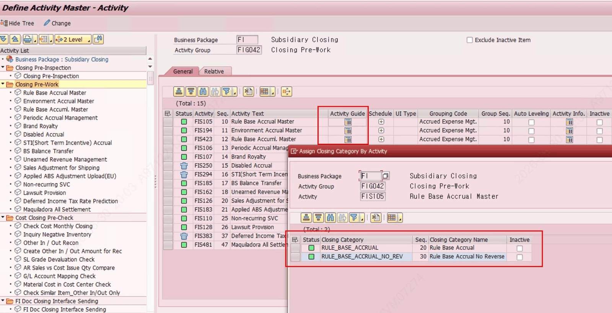
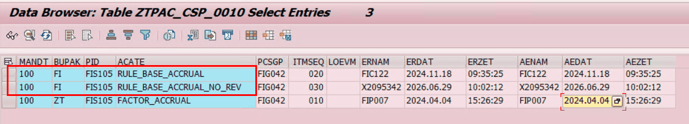
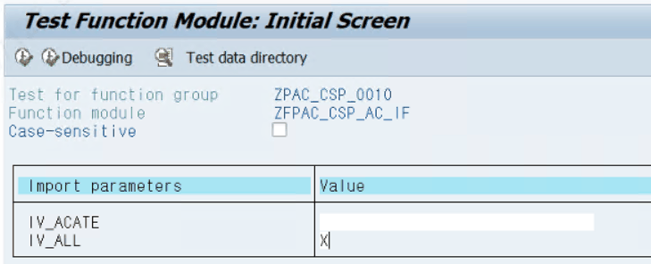
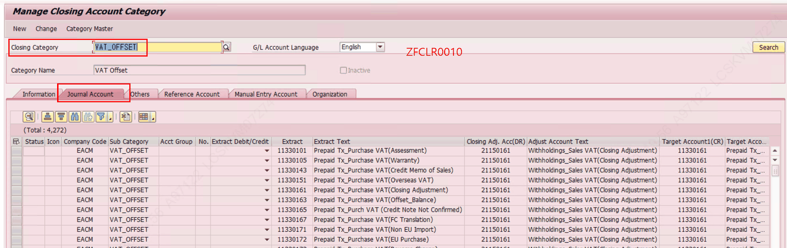
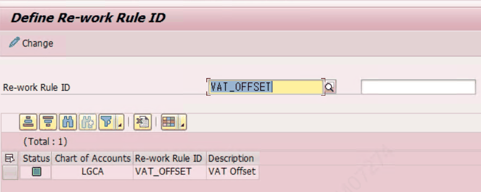
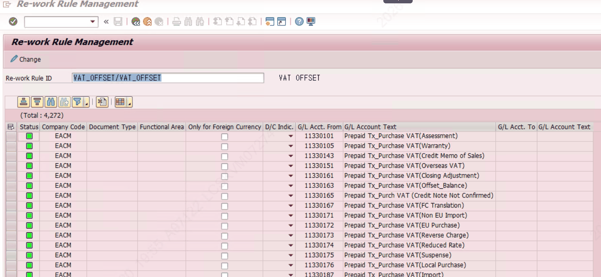
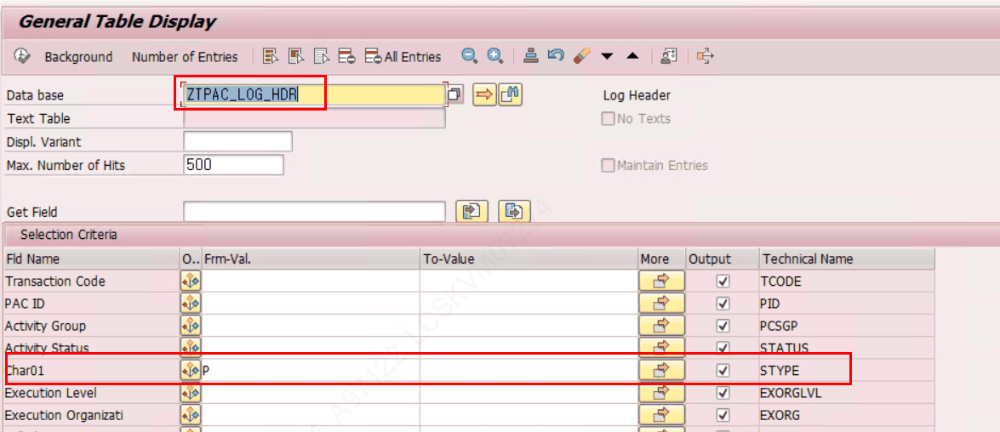

# 5. 초기 운영자 셋업 절차 (단계별)

## 5.4 STEP 3 — Rework Rule ID 등록 (재작업 감지)

이미 Completed된 Activity에 추가 기표가 감지되면 재수행(Rework)이 필요함을 알리는 기능입니다. 기표가 발생하는 Activity에 Rework Rule ID를 Assign합니다.

| 항목 | 설정 내용 |
|---|---|
| Rework Rule ID | 등록할 Rule ID 입력 (사전 ZLPAC3000/3010 정의) |
| [Rule 관리] 버튼 | Re-work Rule Management(ZLPAC3010)로 연결 |
| Rework Function | 옵션)Rule ID에 추가 함수로 Rework 체크 (체크 순서: Rule ID → Function) |
| External Code | 한 Function에서 여러 프로세스 구분용 코드(Function 파라미터로 전달) |
| Rework Auto Resolution | Rework 발생 시 자동 재수행 설정 |

> [ ✔ 검증 ] [Rework]\(REWORK_ICON) → ZFPAC_RULE_TO_ACTIVITY (FG ZPAC023, 'Assign Re-work Rule ID to Activity'). 구조 ZSPAC_RULE_ACTIVITY.

> [ 안내 ] 사전 동기화: ZFCLR0010(Manage Closing Account Category) 저장 시 계정정보를 I/F 받아 동일 Category명으로 Rework Rule ID가 자동 생성됨 → ZLPAC0020에서 프로세스에 맞게 Mapping. (ZFCLR0010은 본 시스템 미검증 — 8.3 참고)

**▶ 참고 (Rework 심화) — Rework Rule ID 개념 · AC Category(LG전자) · 기표 Activity 식별. STEP 3(Rework) 설정 시 함께 참고하세요.**

*참고) Rework Rule id 란?

특정 기표의 발생을 인지하는 규칙.

Rework Rule id는 각 담당자가 생성하게 됨.

어떠한 company code, document type,  특정 조건으로 기표가 되면 Rework Rule Id가 설정된 액티비티 마스터의 closing id에 Rework이 걸린다.

중요 운영 특이사항 ) Rework Rule ID 와 Account Closing Category(LG전자 개념)

LG전자에서는 Account Closing Category라고해서 기표 발생시 어떤 종류의 기표인지 이 Closing category를 반드시 입력하도록 하고 있음. (Posting 이 발생되는 경우, 2레벨 activity Sub-group=LG전자에서는 Activity 레벨의 Activity Guide에 필수적으로 등록하도록 함.)

LG전자 AC Category 의 목적 2가지

1. 결산기표를 위한 기준정보 setup : 추출계정, 기표계정, 계산기준 등
2. 결산 매뉴얼 : CWF Activity에서 각 결산단계의 메뉴얼 확인
3. 나중에 AC Category 별로 집계해서 보고자 하는 니즈가 있음.
PAC의 Closing Category(결산점검 카테고리) 와 다른 개념임.

참고 캡쳐 – Activity Master의 2레벨에 등록된 AC Category 확인-> ZTPAC_CSP_0010에 저장됨

PAC에서 Rework 은 특정 기표가 감지되었을 때 해당 Activity를 Rework Occurred로 변화시켜 사용자에게 재수행이 필요하다고 알려주도록 하는 기능임.

Rework 기능을 사용하려면 Activity Master의 Rework 필드에 Rework Rule ID  를 등록해야 함.

등록하기 위해서는 Rework Rule ID 가 사전 정의되어 있어야 하는데, 이는 일반적으로 ZLPAC3000 -> ZLPAC3010 에서 사전 정의해야 함.

LG전자는 ZFCLR0010이라는 별도 프로그램을 통해서 Account Closing Category(AC Category) 를 등록하여 사용함. PAC의 Rework Rule ID 관리 테이블에는 해당 프로그램의 저장 시점에 I/F 되어 자동 업데이트가 되는 구조임. PAC의 Reowrk Rule ID를 통해서 등록할 일이 없음.

참고) AC Category -PAC 관련 Cut over activity (앞으로 수행할일은 없음)

Closing Category의 등록을 통해서 Rework rule id 가 i/f 되어지는데,

가장 초기 시점에는 closing category 데이터 이관이 통째로 되기 때문에 PAC 테이블에 강제로 저장시켜주기위해서 함수돌려서 받아줘야 했었음. 최초 1회. ZFPAC_CSP_AC_IF.

그림-ZFPAC_CSP_AC_IF 수행예시

저장 구조 참고 :  ZFCLR0010 – Account Closing category 등록 -> ZFCLT0010,11 테이블에 저장, 저장시점에 ZFPAC_CSP_AC_IF 펑션이 수행되면서 AC Category가 PAC 테이블인 ZTPAC_RW_RULEID로 저장되는 구조임. (아래 그림 참고)

Rework Function 활용 예시

환평가시 환율 변동에 영향이 있는 액티비티 인 경우, 추가적으로 함수를 등록해서 Rework 이 발생해야할지 체크해볼수 있다.

함수에서 이 영향도(추가 기표가 되었을때, 해당 시점의 환율 변동이 있는지 여부) 를 분석해서 리턴해주면, Rework 이 발생할지 안할지를 결정할수있도록 활용할수 있음.

참고) 기표 Activity를 찾는 방법

과거 로그 기록을 통해서 확인할수 있다. => ZTPAC_LOG_HDR 에서 STYPE 이 ‘P’ 인 경우 기표가 발생하는 액티비티를 찾을수 있다.(space or ‘P’ 만 들어가는 필드임.)

ZTPAC_LOG_HDR-STYPE = ‘P’ 가 들어가는 케이스

: ZCL_PAC_LOG=>WRITE_LOG_DETAIL ZTPAC_LOG_DTL 테이블에 기록중인 메시지로 특정 메시지가 감지될 때 (ZTPAC0074 Define Posted Doc Message로 등록, ZTPAC_LOG_BLMSG 테이블에 등록되어 있는 메시지가 기록될 때)
