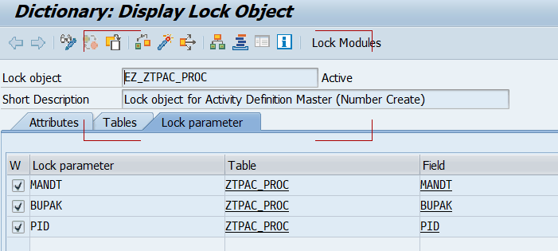

# 5. 초기 운영자 셋업 절차 (단계별)

## 5.7 STEP 6 — 저장

상단 [저장]\(SAVE_100) → FORM SAVE_DATA_0100. Lock 후 MODIFY ZTPAC_PROC / ZTPAC_PROCT / ZTPAC_RELATIVE 등에 반영하고 COMMIT 합니다.

| 구분 | 내용 |
|---|---|
| Lock 처리 | ENQUEUE_EZ_ZTPAC_PROC / DEQUEUE_EZ_ZTPAC_PROC BUPAK, PID기준으로 Lock  |
| 저장 처리 | SAVE_DATA_0100 → MODIFY ZTPAC_PROC / ZTPAC_PROCT / ZTPAC_PROC_AUTH / ZTPAC_RELATIVE |
| 버튼 내부 저장형 | Schedule·Linked·Period·By Function·Skip·Rework·Info : Function 내부에서 저장 후 리턴 |
| 본화면 동시 저장형 | Legacy URL·Trigger Define : 본 화면 [저장] 시 함께 반영 |
