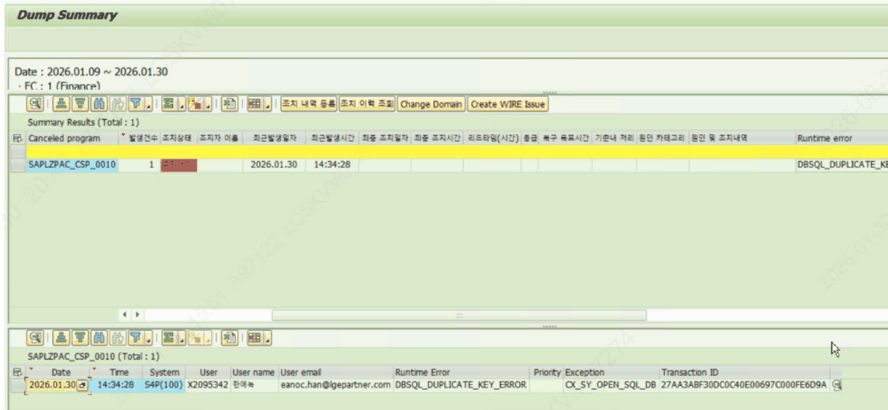
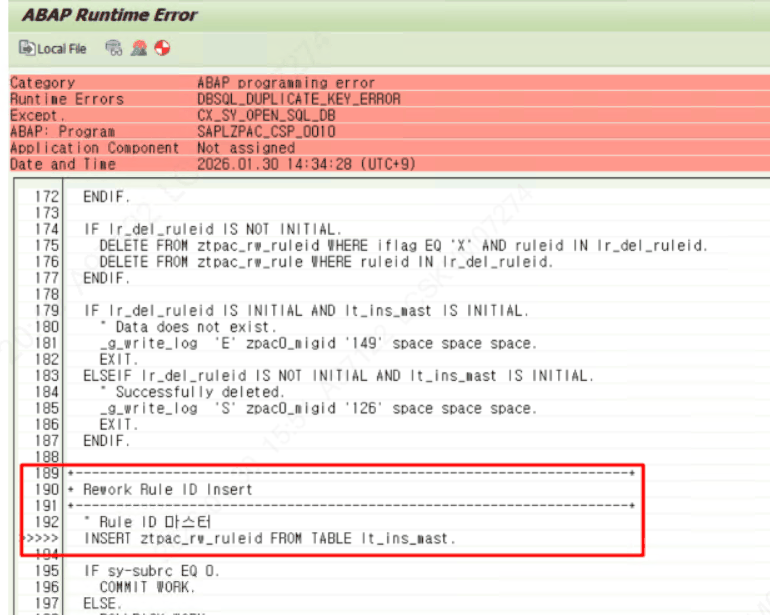

# 8. 트러블슈팅 & 디버깅 가이드

## 8.1 문의 대응 케이스 (증상 → 원인 → 조치)

| 증상 | 원인 / 점검 | 확인 위치 |
|---|---|---|
| 버튼 클릭 시 'Save first' | 신규 행은 PID 채번 전이라 버튼 동작 불가 | 먼저 저장 후 버튼 사용 |
| 코드를 못 바꿈 | Group/Sub/Activity 코드는 자동 채번(설계상 변경 불가) | 5장 STEP1/STEP2 |
| 삭제·Move To가 안 됨 | Map 등록(STD/ORG_NODE·LINK) 또는 수행 이력(ZTPAC_STATUS) 존재 | SE16N: 해당 테이블 |
| Rework 미발생 | Rule ID·G/L 계정 범위 또는 Rework Function 조건 | ZLPAC3010 / ZTPAC_RW_RULEID |

## 8.2 디버깅 포인트 (중단점 위치)

문제 원인을 코드 레벨에서 확인할 때 아래 위치에 중단점을 겁니다. 디버깅은 개발/품질 시스템에서 수행을 원칙으로 합니다.

> [ 디버깅 포인트 ] 디버깅 시작: SE38에서 ZLPAC0020(또는 해당 인클루드 F01/F02)을 열고 줄에 중단점 설정 → 화면에서 해당 버튼 실행. 버튼 Function(ZFPAC_*)은 SE37에서 직접 열거나, FORM CALL_ZFPAC_* 라인에서 진입해 추적. 백그라운드 실행/배치가 의심되면 SM37(잡)·SM50(프로세스), 덤프는 ST22에서 확인.

## 8.3 운영 사례 — ZFCLR0010 / AC Category 동기화 덤프

운영 case) 운영서버에서의 ZFPAC_CSP_AC_IF 덤프 케이스

ZFCLR0010 프로그램에서 Closing Category의 journal account탭의 데이터 삭제나 추가시에 덤프 발생하는 현상이 있었음.

원인- ZFCLR0010에서 AC Category 인터페이스를 통해서 Rework rule ID가 자동으로 인터페이스 되어지고 있는데도 불구하고(ZTPAC_RW_RULEID에 이미 저장되어있음), 사용자가 Rework Rule ID 에서도 같은 AC Categor=Rework Rule ID를 정의해놓은 상태에서 ZFCLR0010에서 Account 추가하여 저장시도했을 때 Dump 발생함.

이유는, ZFCLR0010에서 상세 계정 추가후 저장했을때 I/F Flag가 있는것에 대해서만 Delete후 Insert를 시도하는 방식임. 그런데 Rework Rule ID 프로그램을 통해서 저장한 AC Category=Rework Rule ID 의 경우에는 ZTPAC_RW_RULEID 테이블의 I/F Flag 가 공란으로 저장되는데,  그렇게되면 저장시점에 I/F Flag가 공란인 것은 아직 삭제되지않고 남아있는 상태에서 Insert 를 시도하게 되므로 키값 중복으로 Insert시 덤프가 발생한것임.

조치방법은 ZTPAC_RW_RULEID 테이블에 있는 Rework Rule ID를 삭제하고 ZFCLR0010 프로그램에서 등록시도했던 AC Category 를 다시 저장하도록 가이드 후 ZTPAC_RW_RULEID에 정상 반영되었는지 확인함.

> [ 주의 / 확인 필요 ] ZFCLR0010(Manage Closing Account Category)은 엘지전자 운영서버에서 확인 필요함.
