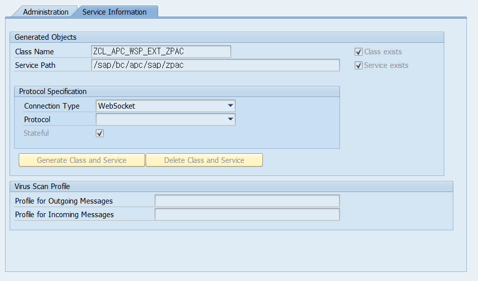
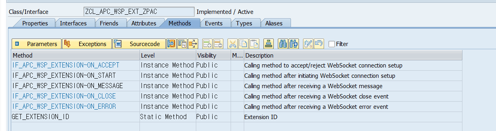
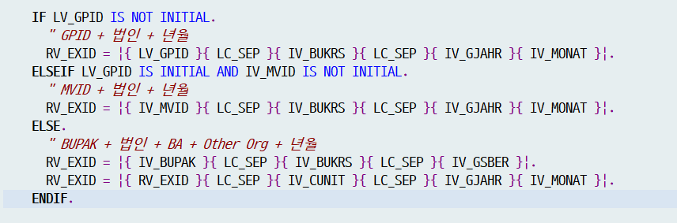
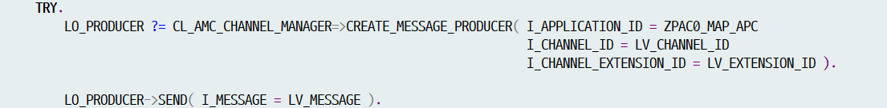
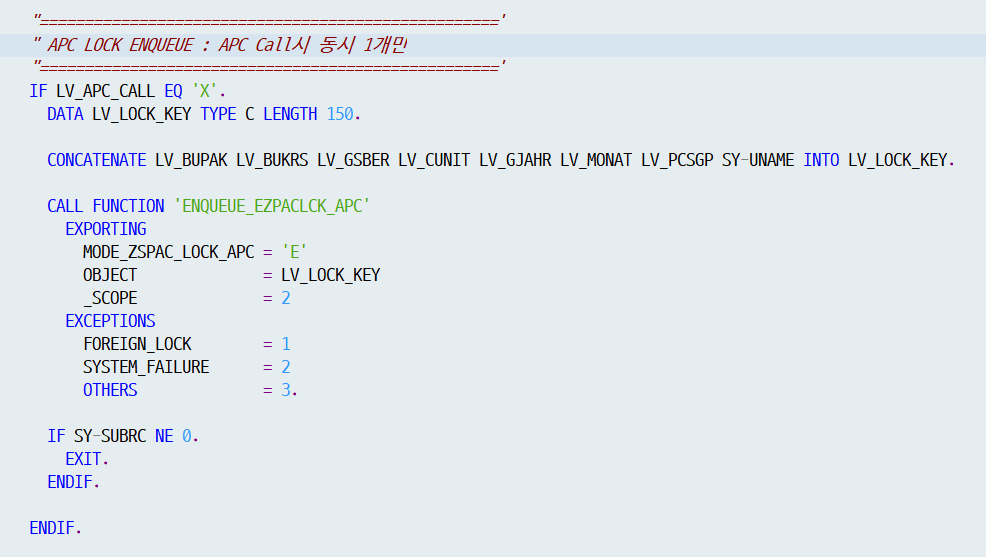
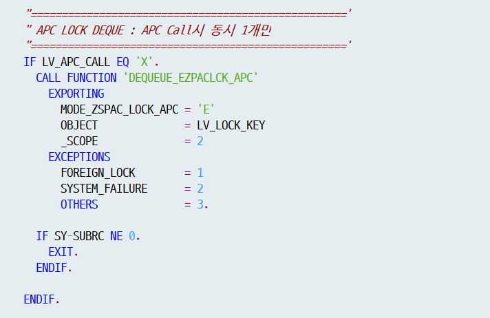

# APC 운영자 매뉴얼

> ABAP Push Channel 기본 개념과 PAC이 사용하는 3개 APC(ZPAC/ZPAC_TODO/ZPAC_NOTICE)의 생성·환경 구성·상세 동작·점검 가이드

| 문서명 | APC 운영자 메뉴얼 |
|---|---|
| 대상 솔루션 | PAC (Process Automatic Channel) |
| 대상 독자 | SAP 결산자동화 운영 · 유지보수 담당자 |
| 문서 버전 | v1.0 |
| 작성일 | 2026-06-16 |

## 1. APC 기본 개념

### 1.1 APC란 무엇인가

APC(ABAP Push Channel)는 ABAP 서버와 클라이언트(Fiori 화면) 사이에 양방향 실시간 통신을 가능하게 하는 SAP 표준 기술입니다. 일반적인 웹 화면은 사용자가 '새로고침'을 눌러야 서버의 최신 데이터를 가져오지만, APC를 사용하면 클라이언트의 요청이 없어도 서버(ABAP)가 화면(Fiori)으로 메시지를 먼저 보낼(Push) 수 있습니다.

통신은 WebSocket 프로토콜을 사용합니다. WebSocket은 한 번 연결되면 끊지 않고 유지하면서 서버와 클라이언트가 서로 자유롭게 메시지를 주고받는 표준 방식(IETF RFC 6455)입니다.

> 보완 설명 (SAP 표준 확인) APC는 트랜잭션 SAPC 에서 생성하며, WebSocket 외에 TCP Socket 방식도 지원합니다(PAC는 WebSocket 사용). 보안을 위해 SAP는 평문 ws:// 가 아닌 암호화된 wss:// 사용을 권장합니다. APC는 개발(D)·품질(Q)·운영(P) 서버에서 동작하며, 로컬 환경에서는 동작하지 않습니다.

### 1.2 APC와 AMC의 관계

APC는 단독으로 동작하지 않고, AMC(ABAP Messaging Channel)와 짝을 이루어 동작합니다. 둘의 역할은 다음과 같이 나뉩니다.

| 구분 | 역할 |
|---|---|
| APC (ABAP Push Channel) | 메시지의 송·수신 처리를 담당. WebSocket 연결을 열고 닫고, 메시지를 보내고 받는다. |
| AMC (ABAP Messaging Channel) | 실제 메시지를 채널에 실어 나르는 통로 역할. 하나의 APC에 여러 개의 채널을 둘 수 있다. |

쉽게 비유하면, AMC는 '메시지를 실어 나르는 도로(채널)'이고 APC는 '그 도로를 통해 메시지를 보내고 받는 우체부'입니다. 둘을 연결(Bind)하면 ABAP 프로그램이 보낸 메시지가 해당 채널에 연결된 모든 Fiori 세션으로 전달됩니다.

### 1.3 PAC가 APC를 사용하는 이유

PAC는 결산 자동화 솔루션으로, Back-End(SAP)에서 결산 Activity가 자동으로 수행되면서 상태가 수시로 바뀝니다. 이 상태 변경을 사용자가 직접 새로고침하지 않아도 Front-End(Fiori) 화면에 실시간으로 반영하기 위해 APC를 사용합니다.

> 핵심 포인트 PAC의 자동수행 화면에는 'Refresh(새로고침)' 버튼이 없습니다. Back-End에서 발생한 상태 변경 내역이 APC를 통해 자동으로 Front-End로 전달되어 화면이 스스로 갱신되기 때문입니다. 단, Activity가 연속 자동수행되면 짧은 시간에 갱신 요청이 여러 번 몰릴 수 있습니다. 이를 위해 Front-End는 OData를 호출한 뒤 응답을 받기 전까지 추가로 들어온 APC 호출을 잠시 보류(HOLD)하는 기능을 두고 있습니다.

## 2. PAC의 APC 구성 한눈에 보기

### 2.1 PAC에서 사용하는 3개의 APC

PAC는 용도가 다른 3개의 APC를 사용합니다. 각 APC가 어떤 상황에서 호출되고, 어떤 함수가 호출하며, 어느 Fiori 화면이 수신하는지는 아래 표와 같습니다.

| APC 명 | 용도 | 호출 Function | Fiori 프로그램 | 수신 시 호출 OData |
|---|---|---|---|---|
| ZPAC | 프로세스 변경에 따른 화면 Refresh | ZFPAC_CALL_APC | zfrpac00010 | ZGWPAC_MAIN>NODESET_GET_ENTITYSET / LINKSET_GET_ENTITYSET |
| ZPAC_NOTICE | 공지사항 변경에 따른 APC 발생 | ZFPAC_CALL_APC_NOTICE | zfrpac00020 | ZGWPAC_MONITOR>NOTICE_PORTALSET_GET_ENTITYSET |
| ZPAC_TODO | To Do에 대한 APC 발생 | ZFPAC_CALL_APC_TODO | zfrpac00020 | ZGWPAC_MONITOR>TODO_PORTALSET_GET_ENTITY / TODO_PORTAL_HDRS_GET_ENTITY |

### 2.2 APC 호출의 3가지 ID

APC로 메시지를 보낼 때는 '누구에게 보낼지'를 3개의 ID 조합으로 지정합니다. 이 3개 ID로 연결(Connection)된 Fiori의 열린 세션 모두에 동일한 메시지가 전달됩니다.

| ID | 설명 |
|---|---|
| Application ID | APC 명과 일치하여 지정된다. (예: ZPAC) |
| Channel ID | AMC에서 지정한 Channel ID. |
| Extension ID | 확장 ID. APC 핸들러 클래스의 GET_EXTENSION_ID 메소드에서 지정한다. 조직·기간·사용자 등 '메시지를 받을 대상 범위'를 좁히는 키로 사용된다. |

### 2.3 메시지 전달 흐름

Back-End 상태 변경부터 Fiori 화면 갱신까지의 전체 흐름은 다음과 같습니다.

1. Back-End(SAP)에서 결산 Activity가 자동 수행되어 상태(ZTPAC_STATUS)가 변경된다.
2. 상태 변경 지점에서 호출 함수(ZFPAC_CALL_APC 등)가 APC를 호출한다.
3. 호출 함수는 3개의 ID(Application/Channel/Extension)와 약속된 형식의 메시지를 만들어 전송한다.
4. 해당 ID 조합으로 연결된 Fiori의 모든 열린 세션이 메시지를 수신한다.
5. Fiori는 메시지 내용을 분석해 현재 열려 있는 화면에 영향이 있는지 판단하고, 영향이 있으면 해당 OData를 다시 호출(Refresh)하여 화면을 갱신한다.

## 3. APC / AMC 생성 및 환경 구성

> 본 장의 화면 예시는 일반적인 APC 적용 절차를 따른 것으로, 예시 애플리케이션 명으로 ZFICSM_BA(서비스 경로 /sap/bc/apc/sap/zficsm_ba)를 사용합니다. PAC 솔루션의 실제 APC는 ZPAC(클래스 ZCL_APC_WSP_EXT_ZPAC, 서비스 경로 /sap/bc/apc/sap/zpac)입니다. 절차는 동일하며 이름만 다르다는 점에 유의하십시오.

### 3.1 APC 생성 (T-Code SAPC)

APC는 Front-End에 생성합니다. 트랜잭션 SAPC에서 애플리케이션 명을 입력해 생성하면, 핸들러 클래스와 ICF 서비스가 자동으로 생성됩니다.

- Connection Type: **WebSocket**
- Class Name: 자동 할당됨. 생성 시 CL_APC_WSP_EXT_STATELESS_BASE 를 상속받아 생성된다.
- Active(활성화) 시 'Class exists', 'Service exists' 항목이 체크되어야 정상이다.

z

> 보완 설명 — Stateless vs Stateful (PAC의 ZPAC 주의) SAP 표준상 WebSocket APC 핸들러 클래스는 Stateless인 경우 CL_APC_WSP_EXT_STATELESS_BASE 를, Stateful인 경우 CL_APC_WSP_EXT_STATEFUL_BASE 를 상속합니다.

### 3.2 APC 핸들러 클래스의 메소드

APC 생성 시 자동으로 만들어지는 핸들러 클래스는 표준 인터페이스 IF_APC_WSP_EXTENSION의 메소드를 재정의(redefine)하여 동작을 구현합니다. 주요 메소드는 다음과 같습니다.

| 메소드 | 역할 |
|---|---|
| ON_START | WebSocket 연결이 시작될 때 실행되는 로직 (필수 구현). Fiori와의 APC 통신/AMC 바인딩 로직이 들어간다. |
| ON_MESSAGE | Fiori로부터 메시지를 수신했을 때 실행되는 로직. |
| ON_ACCEPT / ON_CLOSE / ON_ERROR | 연결 수락·종료·오류 이벤트 처리(표준 제공). |
| GET_EXTENSION_ID | Extension ID(확장 ID)를 결정하는 메소드. PAC는 여기서 조직·기간·사용자 단위로 연결 범위를 지정한다. |

[그림 3-3] ZCL_APC_WSP_EXT_ZPAC의 메소드 목록 — IF_APC_WSP_EXTENSION의 ON_* 메소드와 GET_EXTENSION_ID.

### 3.3 AMC 생성 (T-Code SAMC)

AMC는 트랜잭션 SAMC에서 생성합니다. APC를 실제로 실어 나르는 역할을 하며, 하나의 APC에 여러 개의 Channel을 할당할 수 있습니다.

- Channel: 메시지를 실어 나를 채널(예: /status). Message Type ID는 TEXT 등으로 지정.
- Activity Scope: 메시지를 받을 수 있는 범위(System / Client / User)를 지정.
- **Authorized Program(인가 프로그램):** 이 채널에 등록된 프로그램만 송·수신이 가능하다. (화이트리스트)
  - - **Receive via APCWebSocket** : APC 핸들러 클래스를 등록 (수신측, ON_MESSAGE로 수신).
  - - **Send** : 메시지를 Push 하는 프로그램을 등록 (송신측). 함수는 Function Group 단위로 등록 가능.

> 보완 설명 (SAP 표준 확인) 메시지 송신 시에는 표준 클래스 CL_AMC_CHANNEL_MANAGER 의 CREATE_MESSAGE_PRODUCER 팩토리 메소드로 송신 객체를 만든 뒤 SEND 로 전송합니다. 인가되지 않은 프로그램이 채널을 사용하려 하면 표준 예외 CX_AMC_ERROR 가 발생합니다. 따라서 송·수신 프로그램은 반드시 Authorized Program에 등록되어 있어야 합니다.

### 3.4 서비스 활성화 (T-Code SICF)

APC 생성 시 ICF에 WebSocket 서비스 경로가 함께 생성됩니다. 이 서비스는 신규 설치 시 기본적으로 '비활성(inactive)' 상태이므로, 사용하려면 SICF에서 반드시 활성화(Activate Service)해야 합니다.

- 서비스 경로 형식: /sap/bc/apc/<네임스페이스>/<애플리케이션명>
- PAC ZPAC의 경로(예): /sap/bc/apc/sap/zpac

> 운영 점검 포인트 APC가 동작하지 않는 가장 흔한 원인 중 하나가 SICF 서비스 비활성화입니다. APC 갱신이 전혀 되지 않을 때는 SICF에서 해당 APC 서비스 경로가 활성(녹색) 상태인지 가장 먼저 확인하십시오.

### 3.5 APC 연결 테스트 (SAPC Test Run)

트랜잭션 SAPC에서 'Test Run'을 클릭하면 APC WebSocket 테스트 URL로 이동하여, 해당 화면에서 메시지 송·수신 여부를 확인할 수 있습니다. 테스트 화면에서 메시지를 전송하면 APC 핸들러 클래스의 ON_MESSAGE로 수신됩니다.

### 3.6 Back-End → Front-End 호출 RFC (참고)

PAC의 업무 로직은 Back-End에서 수행되므로, Back-End가 Front-End의 APC를 호출하려면 별도의 RFC가 필요합니다. 공통 RFC와 Function Group 등록 방식은 다음과 같습니다.

- 공통 호출 RFC(예시): ZFPAC_CALL_APC
- 단, AMC의 Authorized Program에 Function Group ZPAC111 등록 필요(함수는 Group 단위로 등록).
- 메시지는 약속된 구조로 전송되며, 해당 WebSocket에 접속된 모든 세션으로 전달된다.

> 보완 설명 — 메시지 크기 한도 메시지는 최대 1MB까지 입력 가능한 것으로 안내됩니다. 다만 SAP 표준 문서에서는 AMC 메시지 길이를 약 30,000바이트, 초기 APC 프레임워크의 WebSocket 메시지를 약 64KB로 안내한 사례가 있어, 실제 허용 한도는 시스템 릴리스에 따라 다를 수 있습니다. 대용량 메시지를 다룰 경우 운영 릴리스 기준 한도를 확인하시기 바랍니다.

## 4. PAC APC 상세 동작

이 장은 PAC가 사용하는 각 APC(ZPAC / ZPAC_TODO / ZPAC_NOTICE)의 상세 동작을 정리합니다.

### 4.1 ZPAC — 프로세스 변경 화면 Refresh

ZPAC는 PAC 솔루션의 핵심 APC입니다. PAC 수행에 따라 Activity 상태가 변경되면 ZPAC를 호출하여, Back-End에서 발생한 변경 내역이 Front-End 화면에 자동으로 반영(Refresh)되도록 합니다. 이 때문에 PAC 자동수행 화면에는 새로고침 버튼이 없습니다.

#### 4.1.1 호출 함수 ZFPAC_CALL_APC

**① Extension ID 결정 로직**

Extension ID는 '메시지를 받을 대상 범위'를 정하는 키입니다. 일반적으로 BUPAK + 법인 + BA + 기타조직 + 년월로 조직/기간별 연결이 이루어지며, 소스에는 다음 3가지 분기가 있습니다.

- GPID(Global Package ID)가 있는 경우 → GPID + 법인(BUKRS) + 년(GJAHR) + 월(MONAT)
- GPID가 없고 MVID가 있는 경우 → MVID + 법인(BUKRS) + 년(GJAHR) + 월(MONAT)
- 그 외(일반) → BUPAK + 법인(BUKRS) + BA(GSBER) + 기타조직(CUNIT) + 년(GJAHR) + 월(MONAT)

[그림 4-1] ZFPAC_CALL_APC의 Extension ID(RV_EXID) 결정 분기 소스.

**② 호출 메시지 구조**

메시지는 약속된 형식으로 만들어 전송합니다. GPID 유무에 따라 형식이 다릅니다.

| 구분 | 메시지 형식 |
|---|---|
| GPID가 없는 경우 | S + Bus Pkg + Company Code + 년 + 월 + Activity Group ID |
| GPID가 있는 경우 | G + Global Pkg ID + Company Code + 년 + 월 |

화면이 이 메시지를 수신하면, 메시지에 담긴 정보로 현재 열린 화면의 상태가 변경되었는지 판단하여 Refresh가 일어납니다. GPID의 경우 1레벨만 조회되므로 별도의 Activity Group ID는 전달하지 않습니다(1레벨에서는 Activity Group ID = Business Package ID).

**③ 메시지 전송 (AMC Producer)**

*[그림] CL_AMC_CHANNEL_MANAGER=>CREATE_MESSAGE_PRODUCER 및 SEND 호출 소스.*

#### 4.1.2 ZPAC(APC)가 호출되는 위치

ZPAC는 상태(ZTPAC_STATUS) 변경이 발생하는 지점에서 호출됩니다. 주요 호출 위치는 다음과 같습니다.

| 호출 위치 | 호출 시점 |
|---|---|
| ZCL_PAC > UPDATE_PAC_STATUS | 최하위 레벨 노드인 Activity의 상태(ZTPAC_STATUS) 변경이 발생할 때 호출 |
| ZCL_PAC > SYNC_PCSGP_STATUS | 최하단 Activity의 상태 변경에 따라 상위 레벨(Activity Group, Activity Sub Group) 상태를 동기화할 때, 상위 레벨이 변경된 경우 호출 |
| ZCL_PAC_SAIL > RESET_ITEM | ZTPAC_STATUS 값을 초기화(Reset)하므로, 상태값 변경 후 호출 (일반적인 로그 메소드 경유 상태변경은 UPDATE_PAC_STATUS를 타므로 별도 호출 불필요) |
| ZLPAC5100 / 5110 / 5200 / 5210 / 5300 / 5310 | 결산 점검 프로그램들은 ZTPAC_STATUS 값을 직접 반영하므로, 이후 APC를 직접 호출 |

#### 4.1.3 Fiori 수신 시 동작 (OData)

ZPAC 메시지를 수신하면 Fiori는 다음 OData를 호출하여 화면을 갱신합니다.

- ZGWPAC_MAIN > NODESET_GET_ENTITYSET
- ZGWPAC_MAIN > LINKSET_GET_ENTITYSET
NODESET_GET_ENTITYSET에서는 다음 처리가 이루어집니다.

- APC에 의한 Refresh인 경우 APC_CALL 변수에 'X' 를 전달하여 APC 호출 여부를 구분한다.
- Bus Pkg + 조직 + Period + 유저 ID로 Lock Key를 만들어 Lock을 수행, 동일 유저가 동일 건에 대해 여러 번 Refresh 하는 것을 차단한다. 데이터 호출 후 Lock을 해제한다.

#### 4.1.4 APC LOCK (중복 호출 방지)

*[그림] APC LOCK ENQUEUE — ENQUEUE_EZPACLCK_APC (MODE=E, _SCOPE=2).*

*[그림] APC LOCK DEQUEUE — DEQUEUE_EZPACLCK_APC (데이터 호출 후 해제).*

> 보완 설명 — SAP 잠금(Lock) 개념 잠금 객체(Lock Object)는 SE11에서 정의하며 이름이 'E'로 시작합니다(예: EZPACLCK_APC). 활성화하면 ENQUEUE_* (잠금)과 DEQUEUE_* (해제) 함수가 자동 생성됩니다. MODE = 'E' 는 배타적(Exclusive) 잠금으로, 잠긴 데이터를 다른 세션이 동시에 처리하지 못하게 합니다. 소스의 _SCOPE = 2 는 잠금을 업데이트 태스크로 넘기는 표준 옵션값입니다(참고). 실제 운영에서 잠금 현황은 트랜잭션 SM12 에서 조회할 수 있습니다.

### 4.2 ZPAC_TODO — My To Do 실시간 Refresh

#### 4.2.1 호출 함수 ZFPAC_CALL_APC_TODO

| 항목 | 내용 |
|---|---|
| Extension ID | Client 번호 + '-' + (입력받은 User ID 리스트) |
| 메시지 구조 | TODO + User ID |
| 호출 위치 | ZFPAC_OPEN_TODO (To Do 발생 시 호출) / ZFPAC_CLOSE_TODO (To Do 종료 시 호출) |

즉, ZPAC_TODO는 조직 단위가 아니라 사용자(개인) 단위로 연결되어, 본인에게 발생/종료된 To Do만 본인 화면에 실시간 반영되는 구조입니다.

### 4.3 ZPAC_NOTICE — 공지사항 실시간 Refresh

#### 4.3.1 호출 함수 ZFPAC_CALL_APC_NOTICE

| 항목 | 내용 |
|---|---|
| Extension ID | 미사용 |
| 메시지 구조 (전체) | N + ** + A |
| 메시지 구조 (특정 조직) | N + Bus Pkg + O + 조직 |
| 호출 위치 | [확인 필요] — 현재 주석 처리되어 호출되지 않는 것으로 보임 (파악 필요) |

## 5. 운영 · 유지보수 점검 가이드

APC 관련 동작 이상이 보고될 때, 아래 순서로 점검하면 원인 범위를 빠르게 좁힐 수 있습니다. 본 장의 점검 항목은 SAP 표준 트랜잭션을 기준으로 합니다.

### 5.1 정상 동작 확인 체크리스트

| 점검 항목 | 확인 방법 | 정상 기준 |
|---|---|---|
| SICF 서비스 활성화 | SICF에서 APC 서비스 경로(예: /sap/bc/apc/sap/zpac) 조회 | 서비스가 활성(녹색) 상태 |
| APC 메시지 송수신 | SAPC에서 해당 APC 선택 후 'Test Run' 실행 | 테스트 화면에서 메시지 송수신 확인됨 |
| AMC 인가 프로그램 | SAMC에서 채널의 Authorized Program 목록 확인 | 수신측(CLAS, Receive)·송신측(FUGR/PROG, Send) 모두 등록 |
| AMC 소비자 등록 확인 | SMAMC에서 등록된 AMC 소비자 조회 | 대상 채널의 소비자가 표시됨 |

### 5.2 증상별 점검 가이드

| 증상 | 우선 점검 사항 |
|---|---|
| 모든 화면이 전혀 자동 갱신되지 않음 | ① SICF 서비스 활성 여부 ② SAPC Test Run으로 APC 자체 송수신 ③ 네트워크/프록시의 WebSocket 차단 여부(wss) |
| 프로세스 화면(ZPAC)만 갱신 안 됨 | ① 상태 변경 지점(ZCL_PAC > UPDATE_PAC_STATUS / SYNC_PCSGP_STATUS 등)에서 ZFPAC_CALL_APC 호출 여부 ② Extension ID(조직/기간) 일치 여부 ③ OData(ZGWPAC_MAIN) 정상 여부 |
| 특정 조직만 갱신 안 됨 | Extension ID 조합(법인·BA·기타조직·년월)이 화면 세션과 일치하는지 확인 |
| My To Do가 실시간 표시 안 됨 | ① 해당 사용자가 Participant List에 To Do 수신인으로 등록되어 있는지 ② ZFPAC_OPEN_TODO/CLOSE_TODO 호출 여부 ③ Extension ID(Client-User) 확인 |
| 공지사항(Notice)이 실시간 표시 안 됨 | [확인 필요] ZFPAC_CALL_APC_NOTICE 호출부 주석 처리 여부 확인 (4.3 참조) |
| 같은 화면이 과도하게 중복 갱신/지연 | APC LOCK(EZPACLCK_APC) 잔류 잠금 여부를 SM12에서 확인 |

### 5.3 잠금(Lock) 점검 시 주의사항

> ⚠ 주의 SM12에서 잠금을 강제로 삭제하면 진행 중인 업데이트가 비정상 종료되거나 데이터 정합성 문제가 발생할 수 있습니다. APC LOCK(EZPACLCK_APC)은 보통 데이터 호출 직후 자동 해제되므로, 일시적으로 보이는 잠금은 정상일 수 있습니다. 잠금이 비정상적으로 장시간 잔류하는 경우에만, 해당 사용자/세션 상황을 확인한 뒤 신중히 조치하시기 바랍니다.
