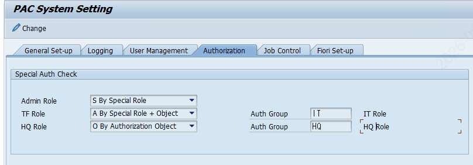
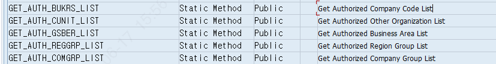

# 4. PAC 권한 체크 구조

PAC은 권한 검사 로직을 **ZCL_PAC_AUTH** 라는 ABAP 클래스에 모아두고, 각 프로그램에서 이 클래스의 메서드를 호출해 권한을 점검합니다. «어떤 메서드가 무엇을 검사하는지»만 알아도 오류 분석이 빨라집니다.

## 4.1 권한 체크 호출 예시

프로그램의 선택화면에서 Business Package를 입력하면 다음과 같이 체크 메서드가 호출됩니다 (엑셀 "권한 체크 로직" 시트 인용).

AT SELECTION-SCREEN ON P_BUPAK.   PERFORM CHECK_BUPAK_AUTH.  FORM CHECK_BUPAK_AUTH.   CALL METHOD ZCL_PAC_AUTH=>CHECK_BUPAK_AUTH     EXPORTING IV_BUPAK = P_BUPAK     IMPORTING ES_RETURN = LS_RETURN. ENDFORM.

핵심은 «권한 검사는 거의 다 **ZCL_PAC_AUTH** 클래스의 메서드로 모여 있다»는 점입니다. 그래서 권한 오류를 분석할 때는 **이 클래스의 어느 메서드에서, 무엇을 검사하다가 막혔는가**를 찾아 들어가면 됩니다. 아래는 실제로 그 길을 따라가는 방법입니다.

## 4.2 [실습] 권한 체크 로직을 직접 추적하는 법

### 준비 — 분석에 쓰는 Tcode 5개

| Tcode | 용도 | 이 실습에서 하는 일 |
|---|---|---|
| SU53 | 직전 권한오류 분석 | 어떤 Authorization Object에서 막혔는지 1차 확인 |
| SE93 | Tcode → 프로그램 찾기 | 오류 난 화면의 실제 프로그램명 확인 |
| SE80 / SE38 | 프로그램 소스 조회 | 소스에서 권한 체크 호출부 검색 |
| SE24 | 클래스 빌더 | ZCL_PAC_AUTH 메서드 소스 직접 열기 |
| /h | ABAP 디버거 | 실행 중 실제 값(권한/테이블) 추적 |

### 따라하기 — "Business Package 권한 없음" 오류 추적 시나리오

사용자가 특정 BUPAK을 선택하니 "권한이 없습니다" 오류가 났다고 가정합니다. 다음 순서로 좁혀 갑니다.

**STEP 1.오류를 재현하고 SU53로 1차 확인**

오류가 난 «직후»에 새 창에서 SU53을 실행합니다(또는 /nSU53). 마지막으로 실패한 권한 검사가 표시됩니다. 여기서 «빨간 표시»된 Authorization Object가 1차 단서입니다.

- 예: ZPAC_BUPAK 또는 S_TCODE 가 빨갛게 표시 → 어떤 권한 종류가 부족한지 방향이 잡힘
**💡 Tip** SU53는 "무엇이 막혔나"는 알려주지만 "코드의 어디서, 왜"까지는 안 알려줍니다. 그래서 STEP 2부터 코드를 따라갑니다.

**STEP 2.오류 난 화면의 프로그램명 찾기 (SE93)**

화면 상단 메뉴 **시스템 → 상태(Status)**를 보면 현재 «프로그램»과 «Tcode»가 나옵니다. Tcode만 알 때는 SE93에 Tcode를 넣어 어떤 프로그램(또는 클래스)을 실행하는지 확인합니다.

**STEP 3.소스에서 권한 체크 호출부 검색 (SE80 / SE38)**

SE38(또는 SE80)에서 프로그램을 열고 **Ctrl+F**로 아래 키워드를 검색합니다. PAC은 권한 검사를 클래스로 모아두므로 대부분 금방 찾힙니다.

검색어 예) ZCL_PAC_AUTH      " 권한 클래스 호출부 검색어 예) CHECK_            " CHECK_BUPAK_AUTH 등 체크 메서드 검색어 예) AUTHORITY-CHECK   " SAP 표준 권한 체크문

이 예시에서는 CALL METHOD ZCL_PAC_AUTH=>CHECK_BUPAK_AUTH 호출부를 찾게 됩니다.

**STEP 4.메서드 안으로 점프 (Forward Navigation)**

호출부의 메서드 이름 CHECK_BUPAK_AUTH 위에 커서를 두고 **더블클릭(또는 F2 → 표시)**하면 그 메서드의 «실제 소스»로 바로 이동합니다(이것을 Forward Navigation이라 합니다). 또는 SE24에서 ZCL_PAC_AUTH를 열어 메서드 목록에서 직접 찾아도 됩니다.

**STEP 5.메서드가 무엇을 검사하는지 읽기**

우리가 SAP에서 검증한 CHECK_BUPAK_AUTH 의 실제 동작은 다음과 같습니다(검증 결과를 읽기 쉽게 요약). 이 흐름을 알면 "어느 단계에서 막혔는지"를 짚을 수 있습니다.

METHOD CHECK_BUPAK_AUTH.   " (1) Special Role(Admin/TF) 보유자면 무조건 통과   IF CHECK_SPECIAL_AUTH( 'A' ) = 'X'   " System Admin   OR CHECK_SPECIAL_AUTH( 'T' ) = 'X'.  " Closing TF      ES_RETURN-TYPE = 'S'.  RETURN.    " → 통과   ENDIF.    " (2) 이 BUPAK에 매핑된 Auth Group / Role 조회   SELECT ... FROM ZTPAC_BUPAK          JOIN ZTPAC_AUTH_GROUP ...          JOIN ZTPAC_AUTH_ROLE  ...    " (3) 그 Role을 사용자가 보유했는지 (AGR_USERS)   " (4) 또는 해당 권한 Object를 가졌는지   AUTHORITY-CHECK OBJECT <object>        ID 'ZBUPAK' FIELD IV_BUPAK. ENDMETHOD.

즉 통과 조건은 «① Special Role이 있거나 → ② 해당 BUPAK에 매핑된 Role을 갖고 있거나 → ③ 해당 권한 Object 값을 갖고 있거나» 중 하나입니다. **셋 다 아니면 오류**가 납니다.

**STEP 6.디버거로 실제 값 확인 (/h)**

"코드는 알겠는데 내 사용자는 왜 막히지?"를 확정하려면 디버거로 실제 값을 봅니다. 오류 화면 직전에 명령창에 /h를 입력해 디버거를 켠 뒤 실행하고, CHECK_BUPAK_AUTH 에 중단점(Breakpoint)을 걸어 한 줄씩 진행합니다.

- **확인할 값 ①:** CHECK_SPECIAL_AUTH 반환값 — 'X'면 Special Role 통과, 공백이면 다음 단계로
- **확인할 값 ②:** IV_BUPAK — 검사 대상 BUPAK 값이 기대한 값인지
- **확인할 값 ③:** SELECT 결과 내부 테이블 — 이 BUPAK에 매핑된 Role이 실제로 있는지(없으면 매핑 누락)
- **확인할 값 ④:** SY-SUBRC — AUTHORITY-CHECK 직후 0이 아니면 그 Object 권한이 없는 것
**STEP 7.원인 확정 → 조치**

| 디버깅에서 본 것 | 원인 | 조치 |
|---|---|---|
| ①,② 모두 실패, ③ 매핑은 있음 | 사용자가 해당 Role 미보유 | 그 Role(예: ZV_FCW_*)을 SU01에서 부여 |
| ③ SELECT 결과가 비어 있음 | BUPAK↔Role 매핑 누락 | ZLPAC1030 / ZLPAC0010 매핑 등록 |
| ④ AUTHORITY-CHECK SUBRC≠0 | 권한 Object 값 부족 | PFCG에서 ZPAC_BUPAK 값 추가 (5.7 PFCGMASSVAL 활용) |
| Special Role을 줘야 하는 대상 | 관리자/IT인데 미등록 | ZLPAC1050에 Special Role 등록 (5.3) |

**🎓 정리 — 분석의 황금 경로** ① SU53(무엇이 막혔나) → ② SE93/시스템상태(어느 프로그램) → ③ SE38/SE80에서 'ZCL_PAC_AUTH' 검색(어디서 호출) → ④ 더블클릭으로 메서드 진입(무엇을 검사) → ⑤ /h 디버깅(내 값이 왜 실패) → ⑥ 조치. 이 경로는 BUPAK뿐 아니라 Tcode·조직·HQ 등 다른 권한 오류에도 똑같이 적용됩니다. 메서드 이름만 4.3 표에서 골라 바꾸면 됩니다.

## 4.3 주요 권한 체크 메서드 (코드 검증 결과)

| 메서드 | 하는 일 (코드 주석 기준) |
|---|---|
| CHECK_AUTH_BY_PID | PID(활동)를 수행할 수 있는 권한 체크 (실행 전 점검) |
| CHECK_BUPAK_AUTH | Business Package 권한 체크 |
| CHECK_SPECIAL_AUTH | Special Role 권한 체크 (Admin/TF/HQ) |
| CHECK_TCODE_AUTH | Tcode 실행 권한 체크 (S_TCODE) |
| CHECK_ORG_AUTH | 조직 권한 체크 (회사코드/사업영역/기타조직) |
| CHECK_AUTH_BY_AUTHGROUP | Auth Group 기준 권한 체크 (등록된 Role 보유 여부) |
| CHECK_AUTH_HQ | HQ 권한 체크 |
| GET_AUTH_BUKRS_LIST | 권한 있는 회사코드 목록 반환 |
| CHECK_CONTROLLER_AUTH | Controller 권한 체크 |

**📌 참고** ZCL_PAC_AUTH에는 위 외에도 총 26개의 public 메서드가 있습니다(조직 목록 조회, User Exit 등). 상세는 추후 «프로그램 매뉴얼»에서 다룹니다.

**🔎 심화 참고** 위 9개 메서드가 «실제로 무엇을 검사하고, 클래스 내부에서 서로 어떻게 호출되는지»(용도·내부 호출관계, 소스 검증)는 부록 12.4에 정리해 두었습니다. 트러블슈팅 시 «어느 메서드가 어느 단계에서 막았는지» 짚을 때 함께 보세요.

## 4.4 Special Auth 체크 방식 (ZLPACSYS 설정과 연계)

Special Auth는 «어떤 기준으로 검사할지»를 **ZLPACSYS**의 Authorization 탭에서 설정합니다. Admin / TF / HQ 세 종류 각각에 대해 검사 방식을 고를 수 있습니다.

**✔ SAP 검증 완료:** ZLPACSYS = "PAC System Setting" (실재 확인). CHECK_SPECIAL_AUTH가 ZTPACSYS 설정값을 읽어 분기.

| 설정값 | 의미 | 검사 방식 |
|---|---|---|
| S | Special Role | ZLPAC1050에 Special Role로 등록됐는지 검사 |
| O | Authorization Object | 지정 Auth Group에 매핑된 PFCG Role 보유 여부 검사 |
| A | Special Role + Object | 둘 중 하나라도 있으면 권한 있는 것으로 인정 |

**⚠️ 헷갈리기 쉬운 점 (중요)** 여기서의 S / O / A는 «검사 방식» 설정값입니다. 뒤의 5.3에 나오는 Special Role의 «타입 코드»(A=System Admin, T=Closing TF 등)와는 글자만 겹칠 뿐 완전히 다른 개념입니다. 혼동하지 마세요.

예: TF Role을 «A(Special Role + Object)»로 설정하면, Special Role을 부여받았거나 해당 Authorization Object를 가진 경우 권한이 있는 것으로 봅니다.

Object 방식에서 선택 가능한 Auth Group은 **ZLPAC1030**에서 미리 Role과 매핑해 둡니다.

## 4.5 클래스가 참조하는 주요 테이블·Object (코드 검증)

ZCL_PAC_AUTH 코드에서 실제로 읽는 주요 테이블과 권한 Object입니다.

- **ZTPAC_SPAUTH** — Special Role 사용자 등록(SPROLE/USRID/삭제플래그)
- **ZTPACSYS** — Special Auth 검사방식 설정(Admin/TF/HQ)
- **ZTPAC_PROC_AUTH** — 수행/Controller/Participant 권한
- **ZTPAC_AUTH_ROLE / ZTPAC_AUTH_GROUP** — Auth Group ↔ Role/Object 매핑
- **ZTPAC_BUPAK** — Business Package
- **권한 Object:** ZPAC_BUPAK(BUPAK별 권한), S_TCODE(Tcode 실행), ZBUPAK(필드)
**📷 화면** (엑셀 "권한 체크 로직"): ZLPACSYS Authorization 탭 셋업 화면, 권한 있는 조직 리턴 메서드 화면

