# 5. 권한 관리 실무 절차

이 장은 프로그램별 등록·변경 방법입니다. 화면 캡처가 필요한 자리는 노란 박스로 표시했습니다.

## 5.1 Participant 등록 (ZLPAC1000)

**✔ SAP 검증 완료:** ZLPAC1000 = Maintain Closing Activity Participants / 연계: ZLPAC1010(조회), ZLPAC1011(엑셀 업로드), ZLPAC1020(이력) 모두 실재 확인

PAC에 모델링된 각 Activity별로 «실제 수행할 담당자»를 지정해야 합니다. 권한은 다음 계층으로 상속됩니다.

Activity → Activity Sub-Group → Activity Group → Business Package(Controller)

- **Controller로 등록하면:** 해당 Business Package의 법인별 모든 Activity를 수행할 수 있는 담당자가 됩니다.
- **주의:** Participant로 등록되어 있어도, Activity에 걸린 Tcode를 실행할 SAP 권한이 없으면 수행 불가입니다.
- **운영 환경:** 등록 담당자를 지정해 일괄 또는 개별 등록. 운영 외 환경에서는 상황에 따라 PAC 담당자가 등록 가능.

### 등록 방법

1. ZLPAC1000 실행
2. 개별 등록 또는 엑셀 업로드 선택 (둘 다 가능)
3. 대상 Business Package / 조직 / Activity 레벨, 담당 User 지정
4. 저장
**📌 메일/Todo 수신 설정** 사용자에게 보내는 Mailing·Todo 수신 여부 옵션은 ZLPACSYS의 User Management 탭 설정을 따릅니다.

**📷 화면** (엑셀 "Participant 등록방법"): Participant 등록 화면 (개별/엑셀)

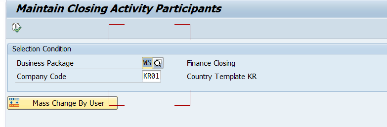

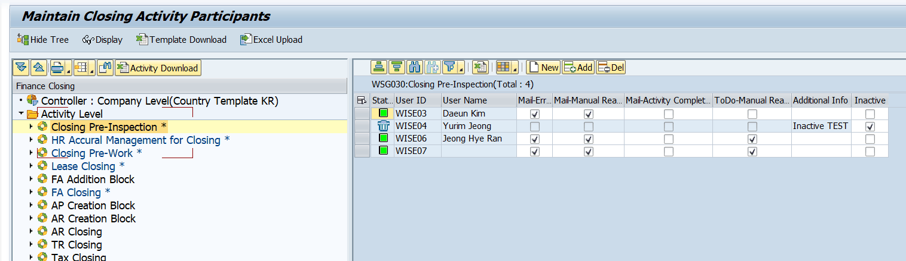

**📷 화면** (엑셀 "연관 프로그램 리스트"): Participant 등록 화면, ZLPACSYS-User Management 탭 화면

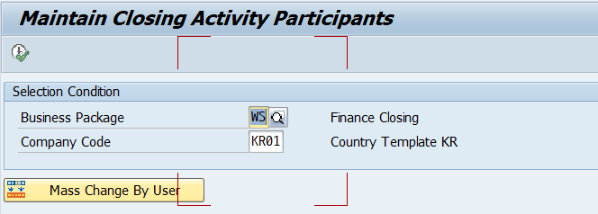

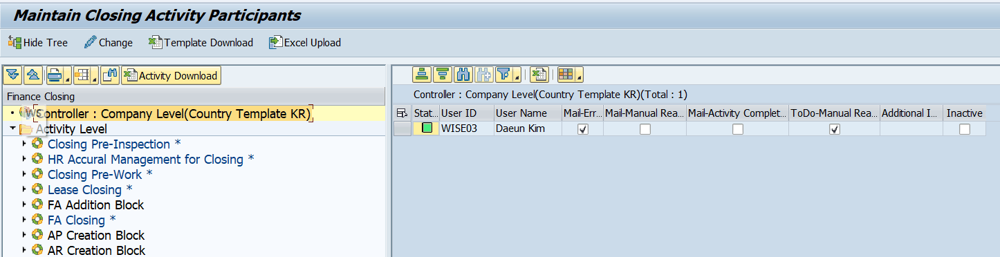

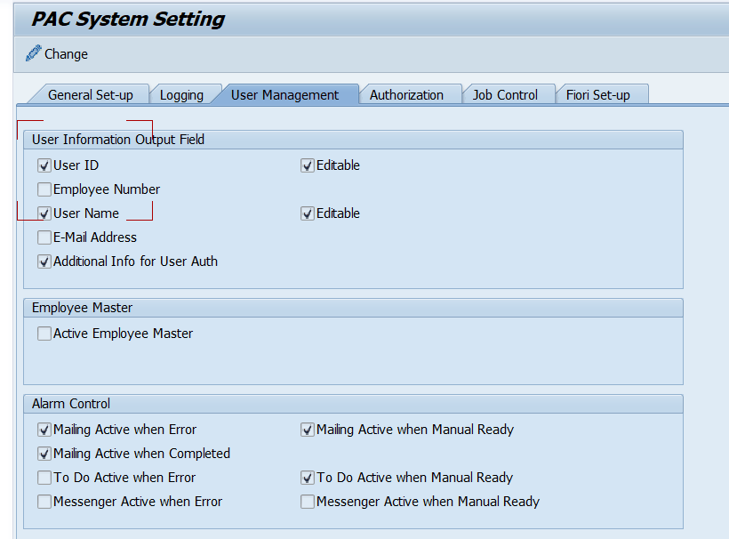

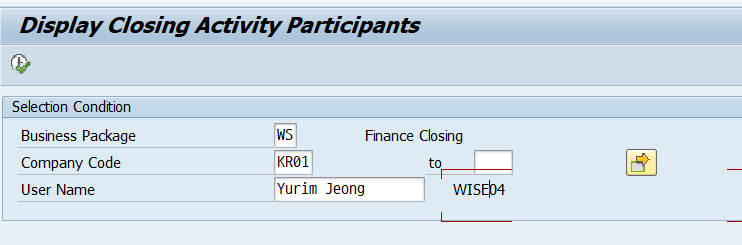

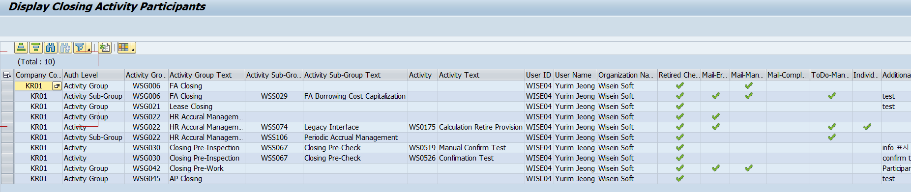

### 엑셀 일괄 등록 (ZLPAC1011)

**✔ SAP 검증 완료:** ZLPAC1011 = Excel Upload For Closing Activity Participants (실재 확인)

ZLPAC1000을 통한 참여자 일괄 등록 프로그램입니다. 조직별로 등록 가능합니다.

## 5.2 Authorization Group 등록 (ZLPAC1030)

**✔ SAP 검증 완료:** ZLPAC1030 = "Define Authorization Group" (실재 확인)

Special Auth를 «Object 방식»으로 검사할 때, 어떤 PFCG Role 보유 여부로 판정할지를 미리 매핑해 두는 화면입니다. ZLPACSYS의 Authorization 탭과 연계됩니다.

등록 구조: **Authorization Group(키값) + 실제 PAC PFCG Role**을 등록하면, 권한 체크 시 여기에 등록된 Role을 보유했는지 검사합니다.

**📌 LG전자** LG전자는 ZLPACSYS에서 IT, HQ Role을 Auth Group으로 체크하도록 ZLPAC1030에 정의했습니다. 예: Authorization Group = IT 를 체크하면 ZV_FCW_IT_ALL 보유 여부를 검사합니다. (LG는 Special Role이 아니라 «Role 기준» 체크 방식으로 전환함 — Special Role을 매번 반영하지 않아도 되기 때문)

**📷 화면** (엑셀 "AuthGroup 등록방법"): Auth Group 조회 화면, 상세 화면

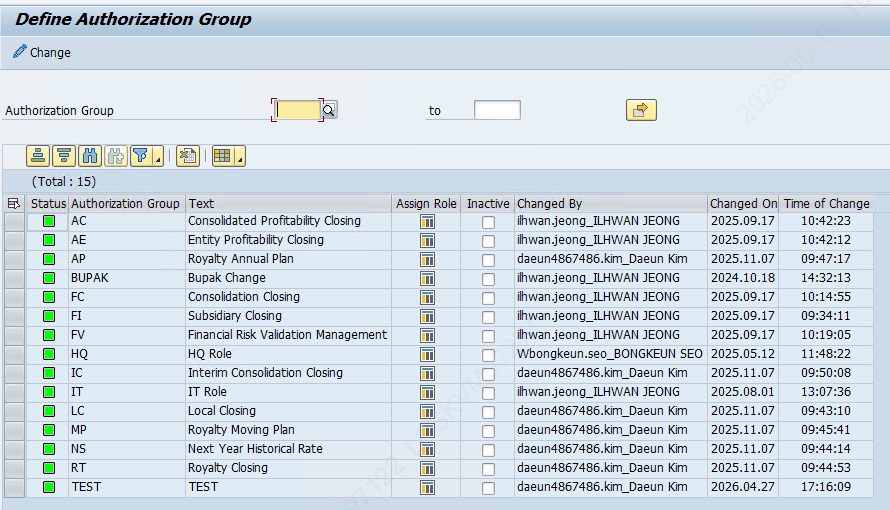

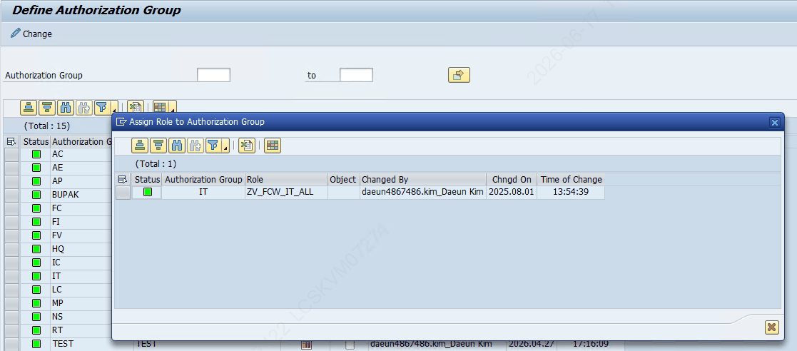

## 5.3 Special Role 등록 (ZLPAC1050)

**✔ SAP 검증 완료:** ZLPAC1050 = "Maintain Special Role" (실재 확인)

Special Role(Admin, TF 등) 권한 체크를 어떤 기준으로 할지 등록하는 프로그램입니다. 프로젝트 인원·IT 인원처럼 Participant 등록 없이 모든 BUPAK·조직의 Activity를 수행해야 하는 경우에 부여합니다. CWF 담당자가 부여합니다.

### Special Role 타입 코드 (공통)

- **A** — System Admin
- **T** — Closing TF (프로젝트 참여 인원을 참여자 등록 없이 모든 BUPAK·Activity 수행 가능하게 등록. 운영환경 제외)
**✔ SAP 검증 완료:** CHECK_SPECIAL_AUTH 코드상 Special Role 타입은 A(System Admin), T(TF), H(HQ) 3종이 ZTPAC_SPAUTH의 SPROLE과 매칭됨

### LG 특화 타입 코드

LG전자는 운영환경 모델링 변경을 CWF에서 관리하는 것이 원칙이나, Special Role을 받은 경우 운영 모델링 변경이 가능하도록 다음 구분을 추가로 운영합니다.

- **S** — Standard Period(Temp)
- **M** — Modeling-Std
- **O** — Modeling-Org
- **C** — Activity Master
**⚠️ 검증 메모** 위 LG 특화 코드(S/M/O/C)는 엑셀 기초자료 기준입니다. 현재 검증한 표준 클래스 ZCL_PAC_AUTH의 CHECK_SPECIAL_AUTH 코드에서는 Special Role 타입으로 A/T/H만 확인되었습니다. S/M/O/C는 LG 별도 구현(EXIT 등)일 수 있으므로, 실제 적용 여부는 운영 시스템에서 추가 확인이 필요합니다.

구분별 권한 체크 로직: ZCL_PAC_AUTH=>CHECK_SPECIAL_AUTH

**📷 화면** (엑셀 "Special Role 등록 방법"): Special Role 등록 화면(WS서버), 등록 화면(LG전자)

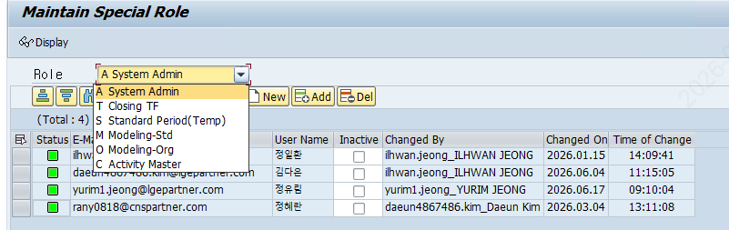

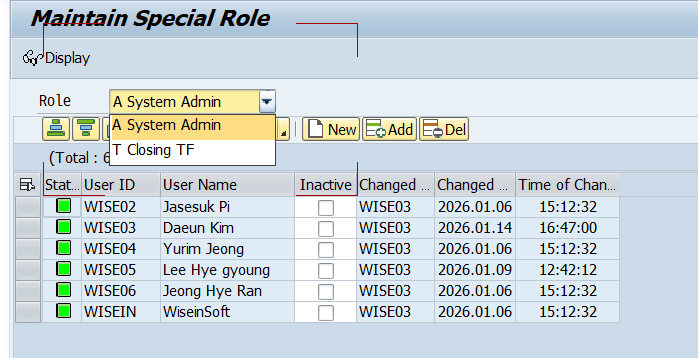

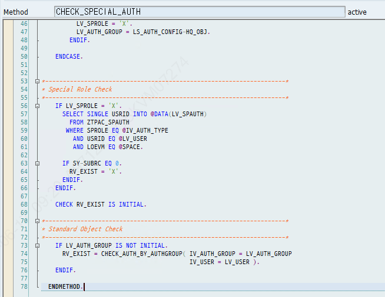

## 5.4 권한 예외 ① Manual Skip 예외자 등록 (ZLPAC0080)

**✔ SAP 검증 완료:** ZLPAC0080 = "Define Confirm(Skip) Enable Activity By Organization" (실재 확인). 저장 테이블 ZTPAC_SUPER_CONF = "Activity Manual Confirm Exception" (실재 확인)

**❗ 이전 문서 정정** 이 프로그램은 «일반 권한 예외»가 아니라 «Auto Activity를 수동으로 Skip할 수 있게 허용하는 예외자» 등록입니다. 기능을 정확히 이해하세요.

기본적으로 Auto Activity는 Manual Skip이 비활성화되어 있습니다(반드시 Activity를 실행하도록, 사용자가 임의로 Skip 못 하도록). 특정 결산월·조직에 예외 상황이 발생했을 때, Activity Skip을 허용할 담당자를 등록하는 화면입니다.

- **저장 테이블:** ZTPAC_SUPER_CONF
- **권한 체크 로직:** ZCL_PAC=>CHECK_MANUAL_ENABLE
**📷 화면** (엑셀 "권한예외_ZLPAC0080"): ZLPAC0080 실행 화면

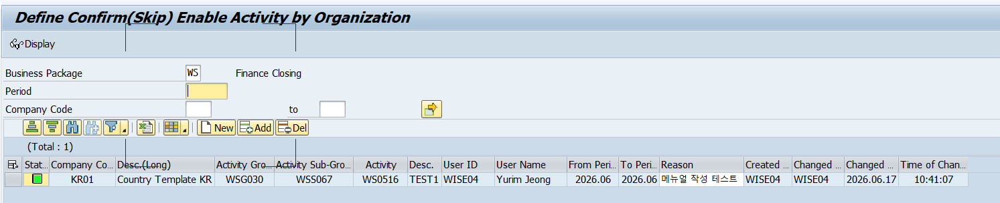

## 5.5 권한 예외 ② Posting Super User 등록 (ZLPAC7160)

**✔ SAP 검증 완료:** ZLPAC7160 = "Super User Registration" / 트랜잭션 "Posting Super User Registration" (실재 확인)

**❗ 이전 문서 정정** 이 프로그램은 SAP 전역 Super User(SAP_ALL)와 무관합니다. «결산 일정 마감(Schedule Closed)으로 Posting Block된 뒤, 예외적으로 기표를 허용»하기 위한 기표 예외자 등록입니다.

Schedule Closed로 Posting Block 된 후 예외 기표가 필요할 때 Super User로 등록합니다. 예외처리 로직은 FI 기표 시 유효성 점검 로직에 존재하며, 임시전표·전기전표 기표 시점에 수행됩니다.

- 여기에 등록하면 임시/전기 구분 없이 모든 기표를 허용합니다.
- 기표 통제·예외처리는 기표를 수행하는 «시점의 로그인 유저»를 기준으로 판단합니다.

### LG 사례 — 누구를 Super User로 등록하나

- **임시전표:** 전표 상신자가 생성 → 전표 상신자를 Super User로 등록
- **전기전표:** 최종 결재자가 승인하는 시점에 임시→전기로 전환 → 최종 결재자를 Super User로 등록
**📌 가이드** 특정 결산 단계를 재수행해 예외 기표하는 경우, System User로 등록해야 할 수도 있고 Participant 등록 유저가 기표자가 될 수도 있습니다. 이때는 Posting Block을 재오픈하고 수행하도록 가이드합니다.

**📷 [캡처 삽입 위치]** 엑셀 "권한예외_SuperUser" 시트의 (엑셀에 "로직 캡쳐해서 추가메모" 표기) 그림 → 전표 Validation Check 예외처리 로직 캡처

## 5.6 신규 Role 생성 (PFCG, Master/Variant)

신규 Role은 PFCG에서 생성합니다. Master Role을 만들고 Derive(파생)하여 Variant Role을 생성하는 구조입니다.

### Master Role 최초 생성 시 수작업 필요 항목 (LG)

- 배치수행 권한 S_PROGNAM - P_ACTION 을 전 Master Role에 넣어야 함

### Variant Role — Derive(파생) 후 반드시 해줘야 하는 것

- P_PROGNAM 값을 Variant Role에서 «*»로 변경 (모든 배치잡 생성 가능해야 하므로. Master Role에는 *를 직접 넣지 못하게 하여 권한 T/F 가이드를 따름)
- Derive하면 권한 Object 값들이 reset되므로 ZPAC_BUPAK 값도 Variant Role별로 다시 넣어줘야 함
**📌 메뉴 트리 변경 요청 시** 각 Master Role에서 폴더·Tcode를 추가하면 Variant Role에 자동 상속됩니다(Derive 불필요). ZLPAC_MENU_TREE에 동일 구조로 추가를 요청받을 수도 있습니다.

메뉴 구조 공유에는 **SE43(Area Menu)**를 활용합니다 — 6.3 참고.

## 5.7 권한값 일괄 변경 (PFCGMASSVAL)

여러 Role의 Authorization Object 값을 한 번에 바꾸는 SAP 표준 Tcode입니다. Role 수가 많을 때 PFCG에서 하나씩 고치는 수고를 크게 줄여 줍니다.

### 주요 작업

- Org Level 값 변경 (회사코드 BUKRS 등 추가·삭제·교체)
- 특정 Object 필드값을 다수 Role에 일괄 수정
- 단일 Object의 수동 권한 일괄 추가/삭제

### 실행 모드 3가지

| 모드 | 동작 |
|---|---|
| Simulation | 결과 미리보기만. 실제 저장 안 됨 |
| Execution with Previous Simulation | 시뮬레이션 후 Execute로 최종 저장 (권장) |
| Direct Execution | 검토 없이 즉시 저장 (주의) |

### 대표 사용 예시 (LG)

Master Role에 메뉴 Tcode 추가 후 Derive하면 Variant Role의 ZPAC_BUPAK 값이 «.»(전체허용)으로 초기화됩니다. → PFCGMASSVAL로 Variant Role을 일괄 선택해 원래 법인값(예: FI, CO, LC, NS, FV)으로 재입력합니다.

**⚠️ 주의사항 / Best Practice** ① 대상 Role을 반드시 지정해 실행(전체 Role 대상 금지) ② 항상 Simulation 먼저 ③ 변경 전 대상 Role 백업(Mass Download) 권장 ④ 기존 Role에 없는 Object는 추가 불가 — 신규 Object는 PFCG에서 먼저 추가 후 사용

**📷 화면** (엑셀 "PFCGMASSVAL 사용예시"): ZPAC_BUPAK 값 . → FI,CO,LC,NS,FV 일괄 변경 단계별 화면

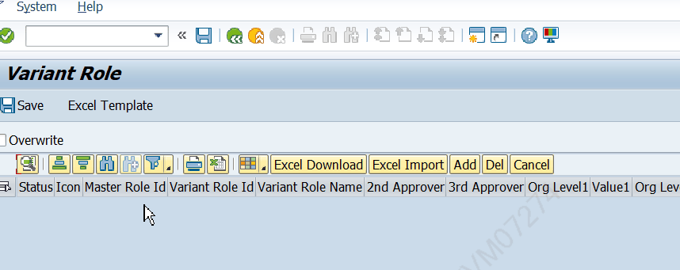

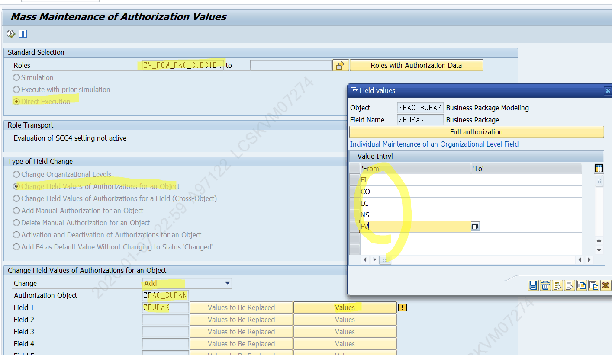

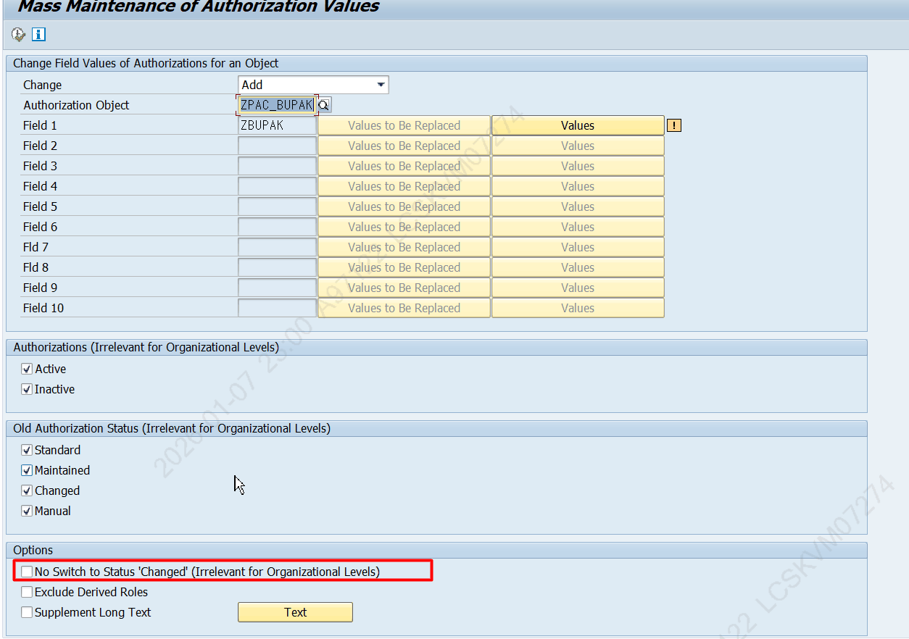

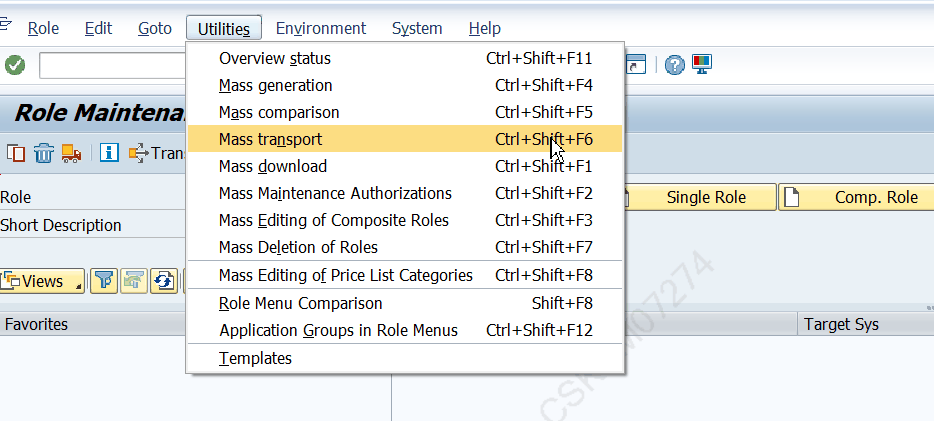

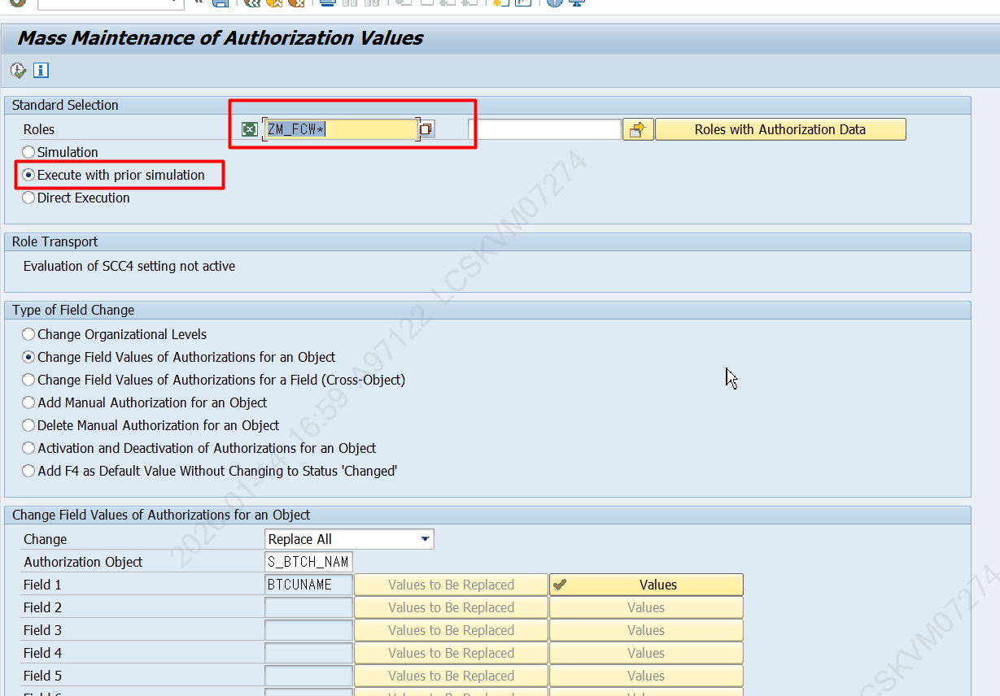

## 5.8 신규 법인 추가 시 해야 할 일

- Subsidiary ACC(법인회계팀 유저), 재무위험검증 Role에 기존 Variant Role 내용을 복사한다.
- LG의 경우, 운영환경 권한신청이 가능하도록 **ZPCMR1409**에서 신규 추가한 Role을 등록하고 결재자를 세팅한다(GL Role과 결재자 동일).
**📌 검증 메모** ZPCMR1409는 ZPCM 네임스페이스로, 현재 검증 시스템에서는 조회되지 않았습니다(LG 별도 시스템 추정). 운영 시스템에서 확인 필요.

## 5.9 Authorization Object 신규 생성 (SU21)

**📌 수정 이력** (2026-07-07 추가) Authorization Object 신규 생성 절차(SU20/SU21/SU24)를 신설했습니다.

새로운 권한 단위가 필요할 때(예: PAC의 ZPAC_BUPAK 같은 커스텀 권한 Object) Authorization Object를 직접 만드는 절차입니다. 핵심 Tcode는 **SU21**이며, SU21 초기화면에서 기존 Object 조회(예: ZPAC_BUPAK 입력 후 실행)도 가능합니다.

**✔ SAP 검증 완료:** SU21 = "Authorization Object Maintenance" / SU20 = "Maintain Authorization Fields" / SU24 = "Authorization Default Data (Cust.)" — 3개 모두 트랜잭션 실재 확인 (BC-SEC-AUT-TOO, Maintenance Transactions SU20~SU25)

**📷 화면** SU21 초기화면 (Authorization Object Maintenance) — Authorization Object 조회·생성 진입

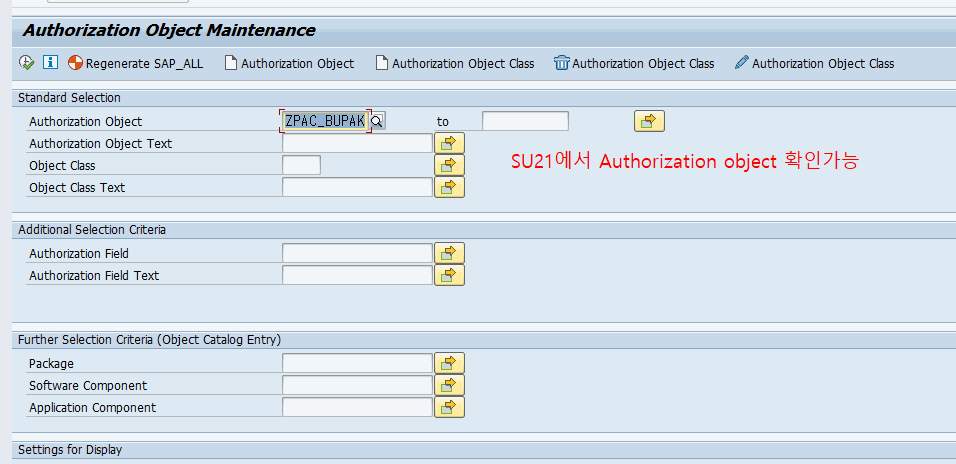

### 생성 절차 (SU20 → SU21 → 코드 → PFCG/SU24)

**STEP 1(필요 시) 권한 필드 생성 — SU20**

Object에 넣을 필드가 표준(ACTVT, BUKRS 등)에 없으면 먼저 SU20에서 Z 권한 필드를 만듭니다. 데이터요소를 연결해 생성합니다. PAC의 ZPAC_BUPAK Object는 커스텀 필드 ZBUPAK 을 사용합니다.

**STEP 2Authorization Object 생성 — SU21**

1. SU21 실행 → Object가 소속될 Object Class 선택 (전용 클래스가 없으면 «Authorization Object Class» 버튼으로 Z 클래스 먼저 생성)
2. «Authorization Object»(생성) 버튼 → Object 이름(Z~)·설명 입력
3. 필드 추가 (최대 10개) — SU20에서 만든 Z 필드 또는 표준 필드(ACTVT 등)
4. ACTVT를 넣었다면 «Permitted activities»에서 허용 활동(01 생성 / 02 변경 / 03 조회 …)을 체크
5. 저장 → 운송요청(CTS) 지정
**STEP 3코드에 체크 로직 반영 — AUTHORITY-CHECK**

Object는 만들기만 하면 동작하지 않습니다. 프로그램에서 검사해야 효력이 생깁니다.

AUTHORITY-CHECK OBJECT 'ZPAC_XXXX'   ID 'ZBUPAK' FIELD lv_bupak   ID 'ACTVT'  FIELD '03'. IF SY-SUBRC <> 0.  " 권한 없음 처리

**STEP 4Role에 배포 — PFCG (+SU24)**

- PFCG Role 권한 탭에서 **Manually** 로 Object를 추가하고 필드값 입력
- 여러 Role에 반복 사용할 Object면 **SU24** 에서 Tcode↔Object 제안값을 등록 — 해당 Tcode를 Role 메뉴에 넣을 때 PFCG가 자동 제안
**STEP 5테스트 — SU53**

대상 유저로 실행해 보고, 막히면 SU53으로 부족한 Object·필드값을 확인합니다(4.2 추적 실습 참고).

**📌 PAC 권한 체계와 연결** 신규 Object를 PAC 권한 체계에 태우려면 «Master Role에 Object 추가 → Variant Role Derive → 조직별 값 입력» 흐름(5.6)을 따릅니다. Derive 후 값이 «.»으로 초기화되는 이슈(10.3)와 PFCGMASSVAL 일괄 복원(5.7)도 함께 유의하세요. PAC의 실제 사례는 ZPAC_BUPAK(필드 ZBUPAK)이며, ZCL_PAC_AUTH=>CHECK_BUPAK_AUTH가 AUTHORITY-CHECK로 검사합니다(4장).
