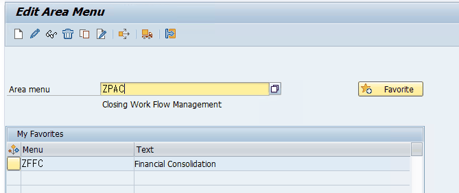
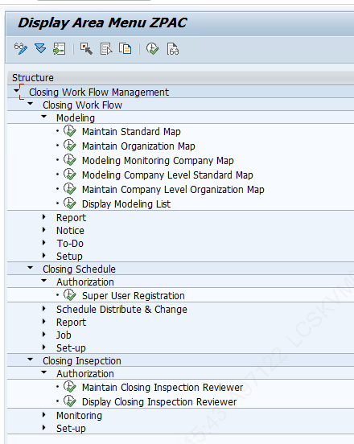
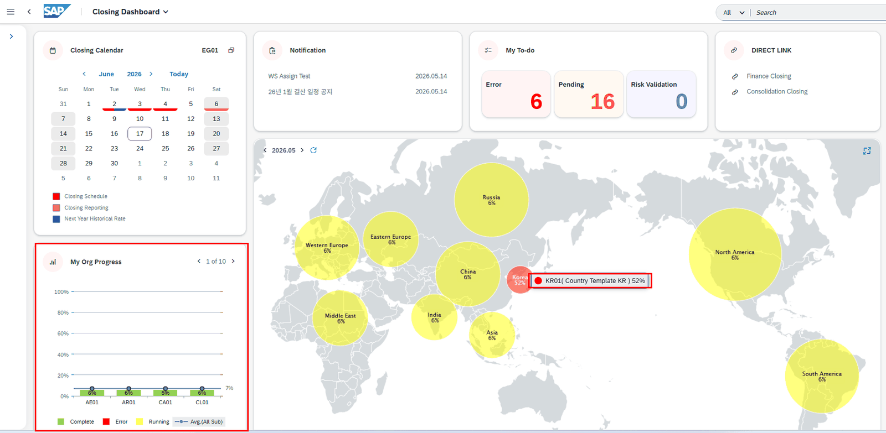
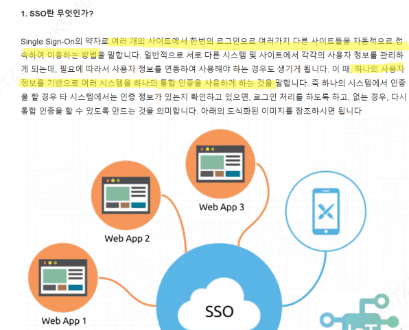

# 6. Fiori 화면과 권한

## 6.1 Fiori 기본 개념

PAC은 SAP GUI(검은 화면)가 아닌 브라우저 기반 Fiori로 동작합니다.

- **Fiori Launchpad:** 앱(타일)을 모아 놓은 시작 화면. 로그인 후 처음 보는 화면
- **Tile(App):** 각 기능의 아이콘 버튼. 클릭하면 해당 Fiori 앱으로 진입
- **Fiori Catalog:** 앱(Tile)들을 묶은 «권한 집합». PFCG Role에 Catalog을 할당하면 그 Role 보유자의 Launchpad에 타일이 나타남
- **Fiori Group:** 타일을 시각적으로 묶는 «화면 배치» 단위 (Catalog=권한, Group=디자인)
**💡 한 줄 요약** Catalog = 이 앱을 쓸 «권한»을 준다. Group = 그 앱을 Launchpad에서 «어떻게 배치»할지 정한다. Catalog 없으면 앱 자체가 안 보이고, Group 없으면 앱은 있는데 정리가 안 된 상태.

## 6.2 Catalog ≠ 실행 권한 (중요)

Catalog이 있어야 타일이 보이지만, 클릭해서 실제 데이터가 보이려면 PFCG Authorization Object 권한도 별도로 있어야 합니다. 즉 «Catalog(타일 표시) + Auth Object(데이터 접근)»가 모두 있어야 완전히 사용 가능합니다.

**PAC에서:** PAC은 자체 Fiori Catalog을 제공하며, PFCG에서 PAC Role 생성 시 해당 Catalog ID를 포함해야 PAC Fiori 화면에 접근할 수 있습니다. Catalog이 빠지면 로그인 시 바로 권한 오류가 납니다.

**📌 상세 셋업 절차는 «Fiori Setting_v2» 파일 참고 (2026-07-12 추가)** Technical Catalog·Tile 생성/등록(Semantic Object 생성 → Catalog 생성 → Target Mapping → Tile 등록 → Group 생성 → Role 할당(PFCG))과 OData Service Active(SICF) 등 Fiori 셋업 실무 절차는 이 폴더의 «Fiori Setting_v2.xlsx» 파일을 참고하세요. 시트 구성: ① Fiori Tile Set up ② Service Active(OData/Fiori Program/APC) ③ 신규BUPAK(신규 BUPAK 타일 추가 예시).

## 6.3 SE43 (Area Menu)

SE43은 SAP Area Menu(영역 메뉴) 유지보수 Tcode입니다. Role에 Tcode를 하나씩 추가하는 대신, 미리 만들어 둔 Area Menu를 통째로 삽입할 수 있어 여러 Role이 같은 메뉴 구조를 공유할 때 편리합니다.

| 기능 | 설명 |
|---|---|
| Display | 기존 Area Menu 구조 조회 |
| Change | Tcode 추가/삭제, 폴더 변경 (저장 시 해당 메뉴 쓰는 모든 Role에 즉시 반영) |
| Create | 신규 Area Menu 생성 (이름은 Z/Y로 시작) |

**PFCG 연계:** PFCG Role 편집 > 메뉴 탭 > 'From Area Menu' 버튼으로 삽입.

**⚠️ 주의** Area Menu에 Tcode를 추가해도 그 Tcode의 실행 권한(Auth Object)은 별도로 PFCG에서 부여해야 합니다. 메뉴에 보인다고 권한이 자동 생기지 않습니다.

**📷 화면** (엑셀 "SE43 Area Menu"): LG전자 Area Menu 참고 화면

## 6.4 Closing Dashboard 조직 표시 기준

«왜 특정 법인이 안 보이나요?» 같은 문의가 자주 들어옵니다. 표시 기준은 다음과 같습니다.

- **Closing Dashboard 타일 자체:** 비즈니스 카탈로그 1개를 모든 Role에 부여해 두어, CWF Role만 있으면 접속은 가능. 단 내부 화면 접근 시 권한 체크로 세부 제어
- **Direct Link:** ZLPAC0010의 BUPAK Config에서 Direct Link 표시하기로 한 BUPAK에 대해, Auth Group에 등록된 Role 보유 여부를 체크해 표시
- **My Organization Progress:** 참여자로 등록된 법인을 표시
- **World Map:** 참여자 등록을 기준으로 법인 표시. 클릭 시 권한 없으면 접속 불가 팝업
관련 OData: ZGWPAC_MONITOR=>PORTAL_LINKSET / COMPANY_GRPSET / ORG_PROGRESSET

**📷 화면** (엑셀 "Fiori 표시기준"): Closing Dashboard 표시 기준 화면

## 6.5 SSO 적용 (LG전자)

SSO(Single Sign-On)는 하나의 ID/PW로 여러 시스템에 접근하는 통합 인증입니다. LG전자는 EP 포탈 로그인 정보와 SAP 정보를 연결해 통합 로그인하도록 적용되어 있습니다.

포탈 계정과 SAP ID의 매핑 기준으로 고객사 사원마스터 테이블을 활용할 수 있습니다 — 사원마스터 연계 구조는 7.5 참고. (2026-07-06 추가)

**📷 화면** (엑셀 "SSO 적용 관련"): SSO 구성 화면

