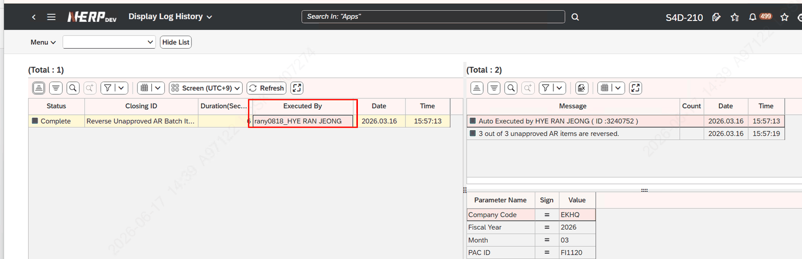

# 7. 실행 유저 / Posting User 개념

결산 Activity는 «누가 실행했는가»와 «누구 이름으로 기표되는가»가 다를 수 있습니다. 이 장에서 구분합니다.

## 7.1 Activity 실행 유저 표시 방식

- **Auto 실행:** Start 버튼을 누른 사람을 실행 유저로 표시. 순서대로 Auto 수행되면 후행 Activity는 «최초 Start를 누른 user»로 찍힘
- **Manual(Foreground) 수행:** 실제로 수행한 유저로 표시
- **실제 수행자 확인:** ZLPAC0160(Log History) 화면의 «Executed by» 필드에서 실제 실행 유저(Execute User)를 확인
**✔ SAP 검증 완료:** ZLPAC0160 = "Display Log History" (프로그램·트랜잭션 실재 확인). 실행·기표 유저 로그는 ZTPAC_LOG_HDR("Log Header") + ZTPAC_LOG_DTL("Log Detail") 테이블에 저장됨 (실재 확인)

**📷 화면** (엑셀 "Activity 실행 유저 표시"): ZLPAC0160 Log History의 Executed by 필드 화면

