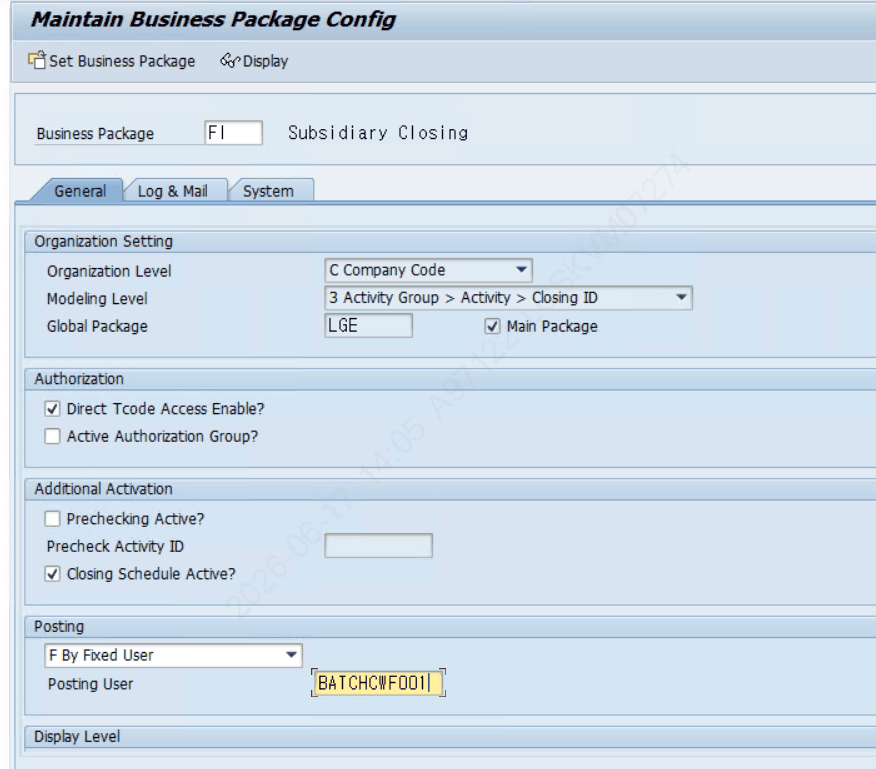
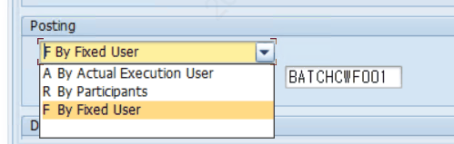

# 7. 실행 유저 / Posting User 개념

## 7.2 Posting User 셋팅 (ZLPAC0010)

**✔ SAP 검증 완료:** ZLPAC0010 = "Maintain Business Package Config" (실재 확인)

기표 시 Posting User를 누구로 표시할지 Business Package별로 설정합니다.

| 코드 | 방식 | 설명 |
|---|---|---|
| A | By Actual Execution User | 실제 Start 버튼 누른 사람이 Posting User로 기표 |
| R | By Participants | ZLPAC1000에서 대표 Posting User로 등록한 사람으로 표시 |
| F | By Fixed User | 선택한 유저로 고정 (LG전자 적용) |

**✔ SAP 검증 완료:** ZLPAC0010 설정은 저장 테이블 ZTPAC_CONFIG의 USER_TYPE(A/R/F)·POST_USER 필드에 저장되며, 실제 기표유저는 함수 ZFPAC_USER_AUTH가 이 값을 읽어 결정함 (상세 결정 로직은 7.3.3)

**📌 LG가 F(고정)를 쓰는 이유** 실행유저로 설정하면 Auto 수행된 후행 Activity에 «실제 수행자가 아닌, 일단 Start 누른 사람» 이름이 Posting User로 찍힙니다. 이를 방지하려고 BATCH User를 Posting User로 고정해 기표 주체를 일관되게 관리합니다.

**📷 화면** (엑셀 "Posting User 셋팅"): ZLPAC0010 BUPAK Config, Posting User 종류 화면

