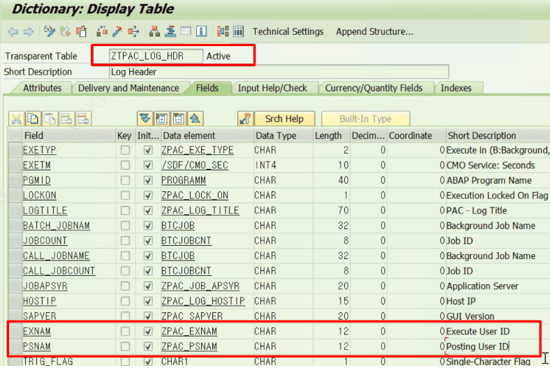
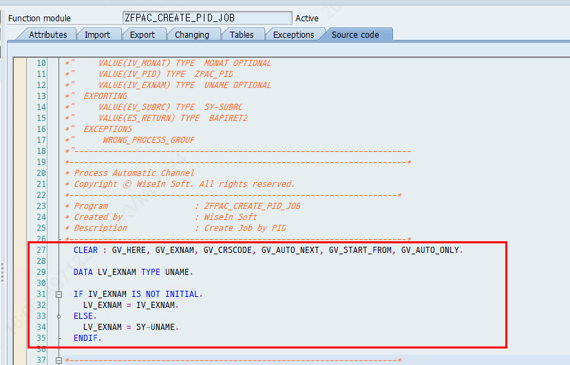

# 7. 실행 유저 / Posting User 개념

## 7.3 Posting User(기표유저) vs Execute User(실행유저)

실행 유저(Execute User, 실제 수행자)와 기표 유저(Posting User)는 **서로 다를 수 있습니다.** 두 값 모두 로그 헤더 테이블 ZTPAC_LOG_HDR(Log Header)에 기록됩니다.

**✔ SAP 검증 완료:** ZTPAC_LOG_HDR = "Log Header", ZTPAC_LOG_DTL = "Log Detail" 실재 확인

- **Execute User (실행유저):** Activity를 실제로 수행한 유저. ZLPAC0160(Log History)의 «Executed by» 필드에서 확인 (7.1)
- **Posting User (기표유저):** 기표 시 표시되는 유저. ZLPAC0010 BUPAK Config에서 선택한 조건(A/R/F — 7.2 참고)에 따라 로그에 기록
- 실행 유저 결정 함수: ZFPAC_CREATE_PID_JOB
**📌 조회 위치** 두 유저 모두 ZTPAC_LOG_HDR(Log Header)에 함께 저장되며, ZLPAC0160(Display Log History) 화면에서 실행유저(Executed by)와 기표유저(Posting User)를 함께 조회할 수 있습니다.

### 7.3.1 로그에 저장되는 방식 — 왜 두 유저가 다를 수 있나

Activity가 한 번 수행되면 ZTPAC_LOG_HDR에 «수행 로그 1건»이 생성되고, 그 안에 실행유저와 기표유저가 «각각 별도 컬럼»으로 저장됩니다. 두 값이 다른 필드이기 때문에 서로 다른 사람이 들어갈 수 있습니다.

**✔ SAP 검증 완료:** ZTPAC_LOG_HDR 필드 검증: EXNAM=ZPAC_EXNAM("Execute User ID"), PSNAM=ZPAC_PSNAM("Posting User ID") — 둘 다 도메인 USNAM(CHAR12). EXETYP=ZPAC_EXE_TYPE("B:Background/F:Foreground"), EXEBYPAC=ZPAC_EXE_BYPAC("Executed by PAC")

**📷 화면** (엑셀 "PostUser vs ExecuteUser"): Posting User vs Execute User 비교 화면

| 로그 필드 | 데이터요소 (라벨) | 무엇이 저장되나 | 결정 기준 |
|---|---|---|---|
| EXNAM | ZPAC_EXNAM (Execute User ID) | 실행유저 — 실제 수행 주체 | 수행 시점 결정 (ZFPAC_CREATE_PID_JOB) |
| PSNAM | ZPAC_PSNAM (Posting User ID) | 기표유저 — 전표에 찍히는 주체 | ZLPAC0010 BUPAK Config의 A/R/F |
| EXETYP | ZPAC_EXE_TYPE | B=Background, F=Foreground | Auto/Manual 수행 방식 |
| EXEBYPAC | ZPAC_EXE_BYPAC (Executed by PAC) | PAC 자동 수행 여부('X') | Auto 체인 수행 시 'X' |

**저장 흐름 (한 번의 수행 = 로그 1건):**

1. 사용자가 Activity를 실행하거나, Auto 체인으로 후행 Activity가 자동 실행됨
2. 실행유저(EXNAM) 결정 — Auto(Background)면 Start를 누른 사람(또는 배치유저), Manual(Foreground)이면 실제 수행자. 결정 로직은 ZFPAC_CREATE_PID_JOB 에 있음
3. 기표유저(PSNAM) 결정 — 해당 BUPAK의 ZLPAC0010 Posting User 설정(A/R/F — 7.2)을 읽어 채움
4. ZTPAC_LOG_HDR에 EXNAM·PSNAM이 «각각» 기록됨 → ZLPAC0160에서 조회
**예시 — LG처럼 Posting User를 F(Fixed=배치유저)로 설정한 경우:**

ZTPAC_LOG_HDR  (수행 로그 1건)   PID      = MONTH_END_001      " 수행한 Activity   EXETYP   = 'B'                " Background (Auto 수행)   EXEBYPAC = 'X'                " PAC가 자동 실행함   EXNAM    = 'HONG'             " 실행유저 = 실제 Start 누른 사람   PSNAM    = 'BATCHCWF001'      " 기표유저 = Fixed(배치유저) 설정   EXETM    = 100530             " 실행 시각

→ 실제로 버튼을 누른 사람은 HONG(EXNAM)이지만, 전표에 찍히는 기표자는 BATCHCWF001(PSNAM)입니다. 두 값이 별도 컬럼이라 이렇게 달라집니다.

**💡 왜 일부러 다르게 두나** Auto 연쇄 수행에서는 후행 Activity의 실행유저(EXNAM)가 «최초 Start를 누른 사람»으로 찍힙니다. 그대로 두면 기표자까지 그 사람이 되어버립니다. 그래서 LG는 기표유저(PSNAM)를 배치유저로 «고정(F)»해 기표 주체를 일관되게 관리합니다. (배치유저 개념은 7.4 참고)

### 7.3.2 실행유저(EXNAM)는 어떤 규칙으로 정해지나 — 직접 찾는 법

실행유저를 결정하는 핵심 함수는 **ZFPAC_CREATE_PID_JOB** (함수그룹 ZPAC050, "Create Job by PID")입니다. 이 함수가 Activity의 배치 Job을 만들 때 «누구 이름으로 실행할지»를 정합니다.

**✔ SAP 검증 완료:** ZFPAC_CREATE_PID_JOB 소스 확인: 실행유저 = 호출 시 넘어온 IV_EXNAM 우선, 없으면 SY-UNAME. 이 값(LV_EXNAM)을 GRF_SAIL->SAIL_PROCESS_ID( IV_USER = ... )로 전달해 Job·로그(EXNAM)에 기록

**결정 규칙 (실제 코드 인용):**

FUNCTION ZFPAC_CREATE_PID_JOB.   " 그룹 ZPAC050   IMPORTING IV_PID, IV_EXNAM TYPE UNAME OPTIONAL ...    IF IV_EXNAM IS NOT INITIAL.     LV_EXNAM = IV_EXNAM.    " ① 호출부가 실행유저를 넘기면 → 그 값   ELSE.     LV_EXNAM = SY-UNAME.    " ② 안 넘기면 → 현재 로그인 유저   ENDIF.   ...   GRF_SAIL->SAIL_PROCESS_ID(   " ③ 그 유저로 Activity Job 생성        IV_TYPE = 'T' IV_PID = IV_PID IV_USER = LV_EXNAM ). ENDFUNCTION.

정리하면 실행유저(EXNAM)는 «① 호출부가 명시한 사람 → ② 없으면 현재 로그인 유저(SY-UNAME)»로 정해지고, 그 값이 Job 생성으로 전달되어 로그의 EXNAM에 남습니다. **Auto 체인 수행**에서는 선행 Activity가 후행 Job을 만들 때 IV_EXNAM에 «최초 실행자»를 그대로 넘기기 때문에, 후행 Activity의 EXNAM도 최초 실행자로 통일됩니다(7.1의 현상과 일치).

**직접 찾아가는 법:**

1. SE37에서 ZFPAC_CREATE_PID_JOB 을 연다 (또는 SE80에서 함수그룹 ZPAC050)
2. Ctrl+F로 IV_EXNAM 검색 → 위의 IF/ELSE 결정 로직 확인 (실행유저가 정해지는 지점)
3. Ctrl+F로 SAIL_PROCESS_ID 검색 → IV_USER = LV_EXNAM 로 실행유저가 Job에 전달되는 지점 확인
4. 더 깊이: SAIL_PROCESS_ID 를 더블클릭(Forward Navigation)하면 Job 생성·로그 기록 로직으로 들어가 EXNAM이 ZTPAC_LOG_HDR에 저장되는 부분까지 추적 가능
5. 디버깅: 함수에 중단점(/h)을 걸고 LV_EXNAM 값을 watch → 내 케이스에서 실제로 누가 실행유저로 잡히는지 확인
**📌 한 단계 더 — IV_EXNAM은 누가 넘기나** «호출부가 IV_EXNAM에 무엇을 넣는가»가 궁금하면, SE80에서 ZFPAC_CREATE_PID_JOB의 «where-used(사용처)»를 조회해 호출 프로그램을 찾고, 그 호출부에서 IV_EXNAM에 넘기는 값을 따라가면 됩니다. (Auto 체인은 최초 실행자를 계속 전달)

### 7.3.3 기표유저(PSNAM)는 어떤 규칙으로 정해지나 — 직접 찾는 법

기표유저는 «Activity를 실제로 누가 실행했는지»와 별개로, 해당 Business Package의 설정에 따라 정해집니다. 결정 핵심은 함수 **ZFPAC_USER_AUTH** (함수그룹 ZPAC040, "User Authorization Information by Activity")의 EV_POST_USER 값입니다.

**✔ SAP 검증 완료:** ZFPAC_USER_AUTH 소스 확인: ZTPAC_CONFIG에서 USER_TYPE(A/R/F)·POST_USER를 읽어 기표유저(EV_POST_USER)를 CASE 분기로 결정. ZCL_PAC_SAIL→SAIL_PROCESS_ID가 최종 PGM 실행 시 이 함수를 호출해 받은 값을 Batch Job 계정(LV_JOBUSER)으로 사용 → ZFPAC_CREATE_BATCHJOB(IV_JOBUSER)로 전달

**결정 규칙 (실제 코드 인용):**

FUNCTION ZFPAC_USER_AUTH.   " 그룹 ZPAC040   " ① BUPAK별 기표유저 설정을 읽는다   SELECT SINGLE USER_TYPE, POST_USER     INTO ( @LV_ACT_USER, @LV_POST_USER )     FROM ZTPAC_CONFIG WHERE BUPAK = @IV_BUPAK.    " ② 설정값(A/R/F)에 따라 기표유저 결정   CASE LV_ACT_USER.     WHEN 'A'.   " By Actual Execution User       EV_POST_USER = SY-UNAME.           " 실제 수행자     WHEN 'R'.   " By User Role       PERFORM GET_POST_USER USING EV_POST_USER.  " Role 기반 조회     WHEN 'F'.   " By Fixed User       EV_POST_USER = LV_POST_USER.       " Config에 고정 지정된 유저   ENDCASE. ENDFUNCTION.

| USER_TYPE | 의미(코드 주석) | 기표유저(EV_POST_USER)에 들어가는 값 |
|---|---|---|
| A | By Actual Execution User | SY-UNAME (실제 수행자) |
| R | By User Role | GET_POST_USER 폼이 Role 기반으로 조회한 유저 |
| F | By Fixed User | ZTPAC_CONFIG의 POST_USER 고정값 (예: 배치유저) |

**기표유저 조회 우선순위 (함수 헤더 주석 인용):** 한 명만 반환하며 우선순위가 있습니다.

1. 1순위 — Activity(PID)에 지정된 특정 Posting 유저
2. 2순위 — Activity Group에 지정된 특정 Posting 유저
3. 3순위 — Organization에 지정된 특정 Posting 유저
**⚠️ 표기 차이 주의** 엑셀 화면자료(ZLPAC0010)에는 R을 «By Participants»로 적었지만, 실제 함수 코드의 주석은 R = «By User Role»이며 GET_POST_USER 폼으로 결정합니다. 화면 라벨과 코드 표기가 다를 수 있으니, 정확한 R 동작은 GET_POST_USER 로직(아래 찾는 법 4번)으로 확인하세요.

**직접 찾아가는 법:**

1. SE37에서 ZFPAC_USER_AUTH 을 연다 (그룹 ZPAC040)
2. Ctrl+F로 ZTPAC_CONFIG 검색 → USER_TYPE·POST_USER를 읽는 SELECT 확인
3. Ctrl+F로 EV_POST_USER 검색 → A/R/F CASE 분기 확인 (기표유저가 정해지는 지점)
4. R(Role) 방식 상세가 궁금하면 GET_POST_USER 를 더블클릭(Forward Navigation)해 내부 조회 로직 확인
5. 디버깅: 함수에 중단점(/h)을 걸고 LV_ACT_USER(A/R/F)와 EV_POST_USER 결과값을 watch → 내 BUPAK에서 누가 기표유저로 잡히는지 확인
**🎓 전체 그림 — 실행유저 vs 기표유저가 로그에 남기까지** ① Activity 수행 → ② ZFPAC_CREATE_PID_JOB이 실행유저(EXNAM=IV_EXNAM/SY-UNAME) 결정 → ③ ZCL_PAC_SAIL→SAIL_PROCESS_ID가 최종 PGM 실행 시 ZFPAC_USER_AUTH를 호출해 기표유저(EV_POST_USER)를 A/R/F로 결정 → ④ ZFPAC_CREATE_BATCHJOB(IV_JOBUSER)로 그 계정으로 Job 생성·기표 → ⑤ ZTPAC_LOG_HDR에 EXNAM·PSNAM이 각각 기록 → ⑥ ZLPAC0160에서 조회. 그래서 실행유저와 기표유저가 서로 다른 사람일 수 있습니다.
