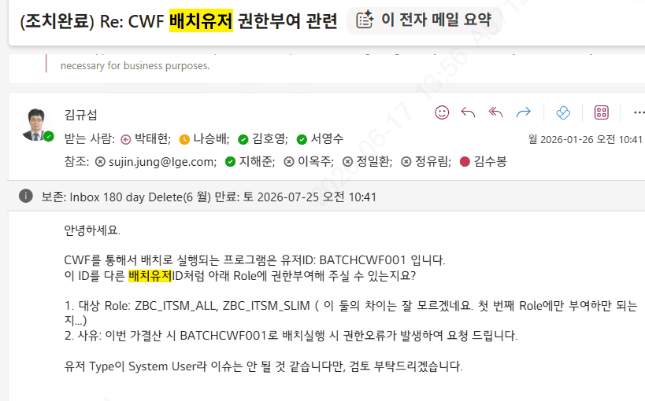
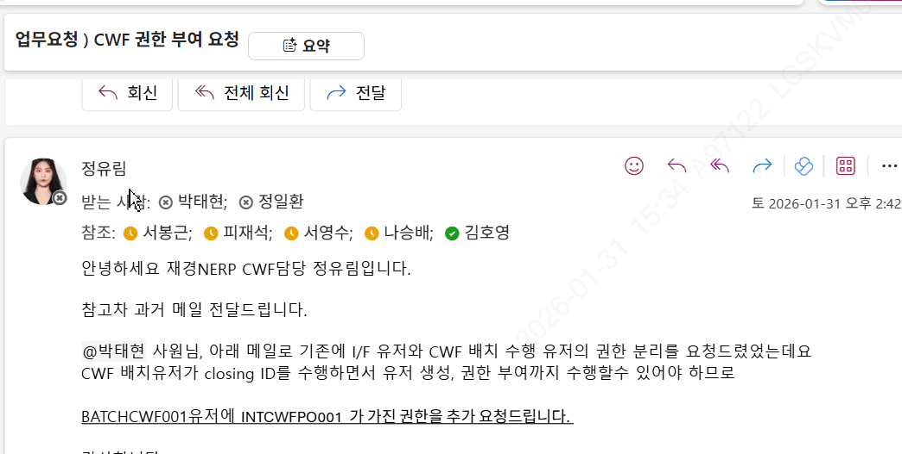
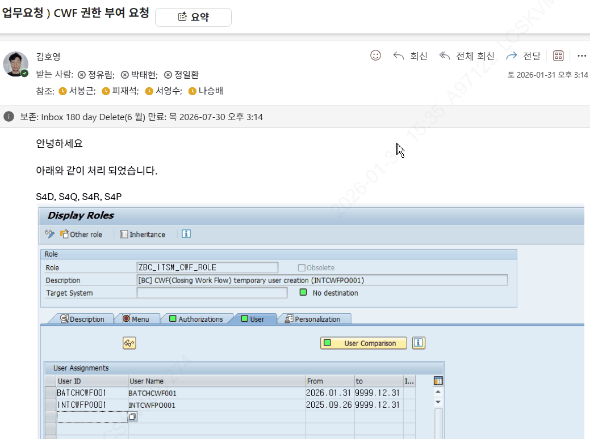

# 7. 실행 유저 / Posting User 개념

## 7.4 CWF 배치유저 (System User) — LG: BATCHCWF001

자동 수행용 시스템 유저로, 모든 프로그램 수행 권한을 가집니다(LG는 BATCHCWF001). CWF의 Special Role(ZLPAC1050)에도 등록되어 있습니다.

기표 Activity를 «실제 수행자»로 하면 그 유저의 권한에 따라 자동 수행이 막힐 수 있으므로, 풀 권한을 가진 배치유저를 만들어 자동 수행을 보장합니다(ITSM Role 부여).

**📷 화면** (엑셀 "CWF 배치유저 개념"): 배치유저 권한 구성 화면

