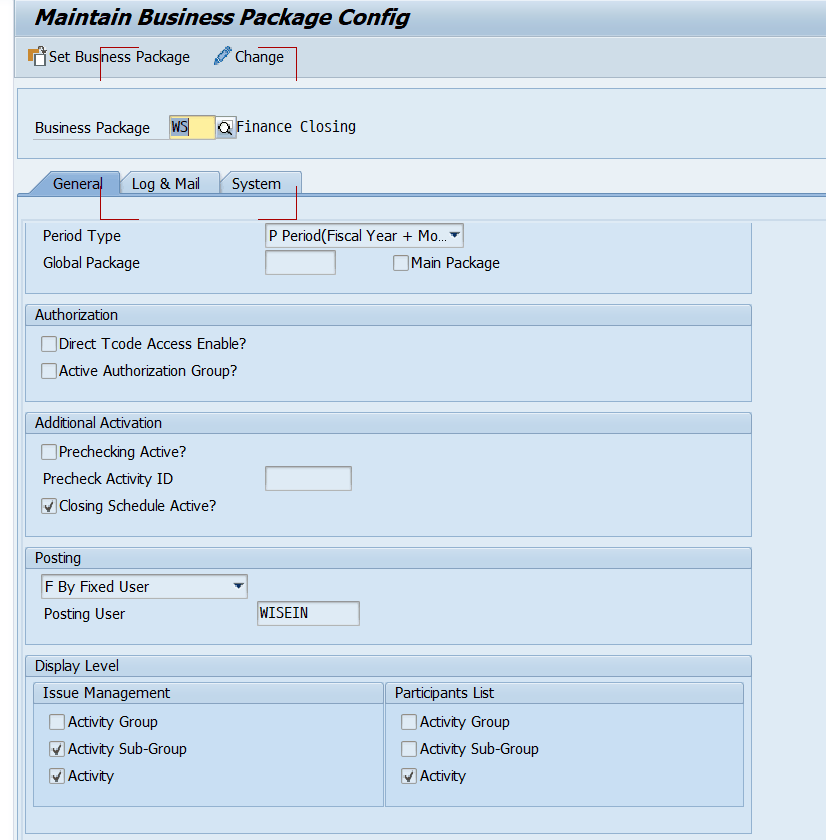
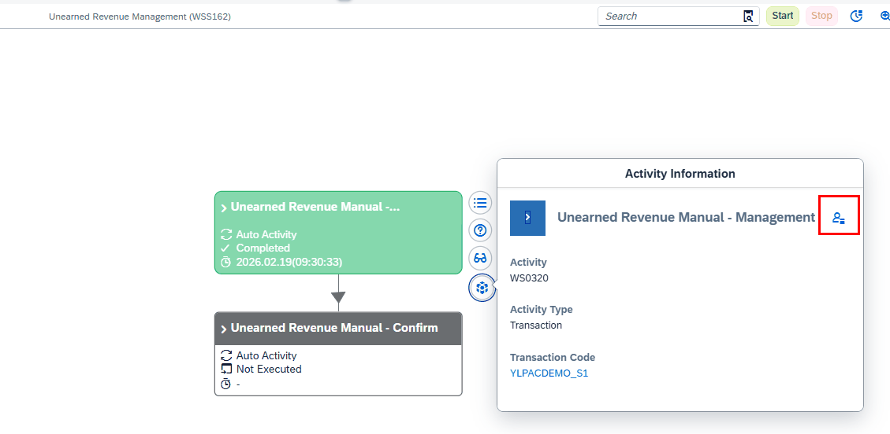
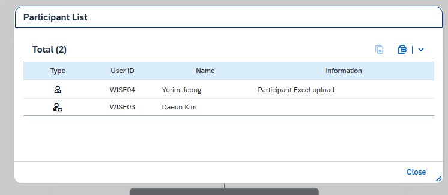
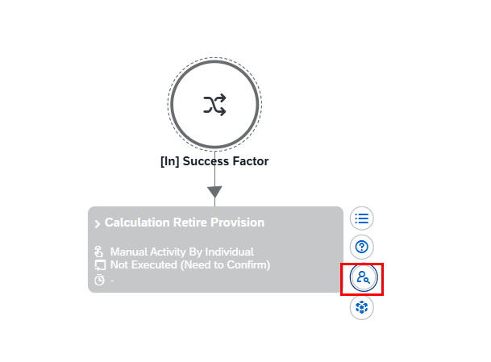
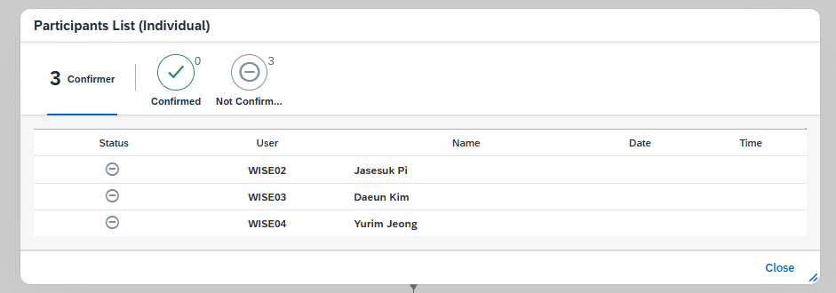

# 8. 관련 OData (참고)

PAC Fiori 화면은 OData 서비스로 데이터를 주고받습니다. 권한·참여자 관련 주요 OData만 정리합니다(상세는 추후 프로그램 매뉴얼).

| OData 메서드 | 설명 |
|---|---|
| ZCL_ZGWPAC_MAIN_DPC_EXT=>AUTHLISTSET | ZLPACSYS General 탭 Participant List에 체크된 레벨의 참여자 리스트 표시 (누가 수행했는지는 안 나옴) |
| ZCL_ZGWPAC_MAIN_DPC_EXT=>INV_STATUSSET | Individual 사용자별 승인 시간·일자까지 표시 |
| ZCL_ZGWPAC_MAIN_DPC_EXT=>CONF_STATUSSET | Participant List(Competition) |

**📌 LG 특이사항** LG전자는 AUTHLISTSET 대신 CONF_STATUSSET을 사용합니다. WS서버에서는 Individual만 INV_STATUSSET, 나머지는 AUTHLISTSET을 씁니다. (Individual일 때만 INV_STATUSSET 호출)

**📌 OData Service Active 절차는 «Fiori Setting_v2» 파일 참고 (2026-07-12 추가)** OData 서비스 활성화(Service Active, SICF 기반 — OData Service Active / Fiori Program Active / APC Service Active)와 Technical Catalog·Tile 등록 절차는 이 폴더의 «Fiori Setting_v2.xlsx» 파일(«Service Active» 시트)을 참고하세요.

**📷 화면** (엑셀 "관련 Odata"): 각 OData 호출 결과 화면 (7개)

