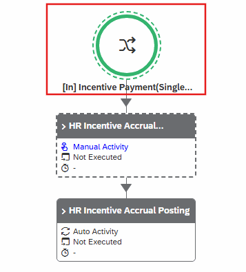
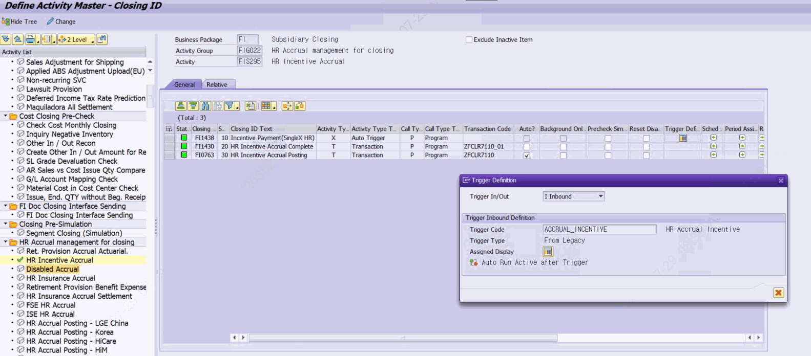

# 1. Auto Trigger 개요

## 1.1 Auto Trigger란 무엇인가

Auto Trigger는 PAC(Process Automatic Channel)에서 특정 Activity(결산 작업)가 완료되면, 사전에 정의된 후행 Activity 또는 후행 Business Package를 사람의 수동 조작 없이 자동으로 연속 기동하는 메커니즘입니다.

예를 들어, A법인의 마감 프로그램이 완료된 시점에 자동으로 B법인 또는 다음 단계 Activity가 시작되도록 설계할 수 있습니다.

> 📌 핵심 포인트
> Auto Trigger를 사용하면 결산 담당자가 각 Activity를 수동으로 기동할 필요 없이 선행 작업 완료 시 후속 작업이 자동으로 이어집니다.
> 이를 통해 야간 무인 결산 자동화, 업무시간 외 자동 수행이 가능합니다.

*[그림] PAC에서 Trigger 표시 화면*

## 1.2 Auto Trigger와 일반 자동수행(XAUTO)의 차이

PAC에는 두 가지 자동화 개념이 존재합니다.

| 구분 | 일반 자동수행 (XAUTO) | Auto Trigger |
|---|---|---|
| 설정 위치 | ZLPAC0020 Activity 마스터 | ZLPAC0020 Trigger Definition + ZLPAC0070 Trigger Code |
| 동작 범위 | 동일 Business Package 내 순차 자동수행 | 서로 다른 Business Package 또는 조직 간 연계 수행 |
| 트리거 조건 | 선행 Activity 완료 시 자동 시작 | ZTPAC_CROSS_IF에 등록된 CRS Code 기준으로 기동 |
| 주요 용도 | 단순 순차 자동화 | Cross BP / Cross 조직 / 레거시 시스템 연계 |

*[그림] ZLPAC0020 Trigger 설정 화면*

**자주 묻는 질문**

| 질문 | 설명 |
|---|---|
| Trigger 자동 수행 안됨 | ZLPAC0010에서 Always auto start after completed 체크 되어있는지 확인 ZLPAC0070 (Define Trigger Code) Auto Next? 체크되어 있는지 확인 |
| Trigger 리셋 | 다른 프로그램에서 실행되어 쏴주는 거지만 다른프로그램에서 쏘는게 없기 때문에 CWF에서 Reset해서 재실행 가능하게 해줘야 한다 -ZFPAC_AUTOTIRG_LEGACY |

## 1.3 Auto Trigger 동작 흐름

Auto Trigger의 전체 흐름은 아래와 같습니다.

| 단계 | 동작 내용 | 관련 오브젝트 |
|---|---|---|
| ① 선행 Activity 완료 | PAC에서 선행 Activity가 정상 완료 처리됨 | ZCL_PAC_SAIL |
| ② Trigger 발동 조건 확인 | 완료된 Activity에 Trigger Definition(CRSCODE)이 설정되어 있는지 확인 | ZTPAC_PROC (CRSCODE 필드) |
| ③ Trigger 설정 조회 | ZTPAC_CROSS_IF에서 해당 CRS Code의 Trigger 유형, Auto Next 여부 확인 | ZTPAC_CROSS_IF |
| ④ 실행 가능 여부 체크 | ZFPAC_GET_CAN_START FM 호출로 후행 Activity 수행 가능 여부 판단 | ZFPAC_GET_CAN_START |
| ⑤ 후행 Activity 기동 | ZFPAC_CREATE_PCSGP_JOB FM 호출로 후행 Activity를 백그라운드 잡으로 기동 | ZFPAC_CREATE_PCSGP_JOB |
