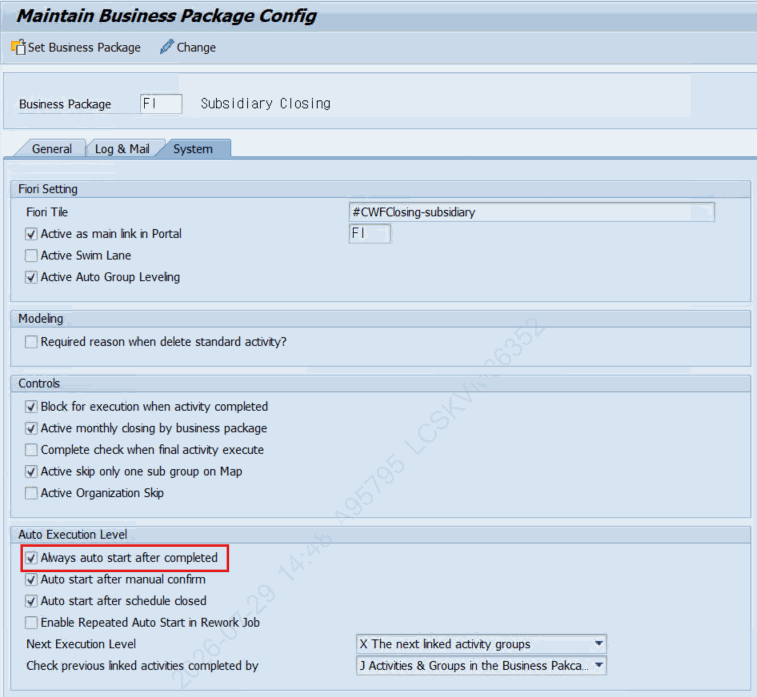

# 2. 관련 오브젝트 설명

## 2.0 사전 설정 : ZLPAC0010 Business Package Config

Auto Trigger가 자동으로 연속 수행되려면 ZLPAC0010 (Maintain Business Package Config) 화면의 Auto Trigger 설정 탭에서 "Always auto start after completed" 항목이 체크되어 있어야 합니다. 이 설정은 ZTPAC_CONFIG 테이블의 XAUTO_START 필드에 저장됩니다.

설정 경로 : T-Code ZLPAC0010 → Business Package 선택 → [변경 모드] → Auto Trigger 설정 탭 → "Always auto start after completed" 체크 → [저장]

*[그림] ZLPAC0020 Business Package Config에서 Trigger 설정 화면*

| ZTPAC_CONFIG 필드 | 화면 항목명 | 설명 |
|---|---|---|
| XAUTO_START | Always auto start after completed | X 체크 시 : 완료 즉시 자동 연속 수행 활성화. 아래 3개 필드가 자동으로 X로 설정됨 |
| AFTER_CONF | Auto Start after manual confirm | XAUTO_START=X 설정 시 자동으로 X로 세팅 (수동 확인 후 자동 시작) |
| AFTER_CLSD | Auto Start after schedule closed | XAUTO_START=X 설정 시 자동으로 X로 세팅 (스케줄 종료 후 자동 시작) |
| XAUTO_NEXT | Always auto next | XAUTO_START=X 설정 시 자동으로 X로 세팅 |
| CONFLVL | Check previous linked activities completed by | XAUTO_START=X 설정 시 자동으로 'J'(By all linked activities)로 세팅 |

> 📌 XAUTO_START 체크 시 자동 세팅 동작 ( ZLPAC0010_F01)
> XAUTO_START = X 체크하면 AFTER_CONF, AFTER_CLSD, XAUTO_NEXT 가 모두 X로 자동 설정됩니다.
> CONFLVL 은 'J'(By all linked activities) 로 자동 고정됩니다.
> XAUTO_START = X 인 경우 AFTER_CONF / AFTER_CLSD / XAUTO_NEXT / CONFLVL 필드는 입력 불가(화면 잠금) 상태가 됩니다.
> 반대로 XAUTO_START 를 해제하면 위 4개 필드를 수동으로 개별 설정해야 합니다.

> 📌 주의 사항
> XAUTO_START 미체크(공백) 상태에서는 Auto Trigger가 Trigger Code에 설정되어 있어도 자동 수행되지 않습니다.
> Business Package 단위로 설정되므로, 적용할 BP를 정확히 선택 후 설정하십시오.
> 설정 변경 후 반드시 [저장]을 클릭해야 ZTPAC_CONFIG에 반영됩니다.

## 2.1 트랜잭션 코드

| T-Code | 프로그램명 | 설명 |
|---|---|---|
| ZLPAC0020 | ZLPAC0020 | Activity 마스터 정의. Activity에 Trigger Definition(CRS Code)을 연결하는 화면 (MCP 확인: Define Activity Master, ZPAC 패키지) |
| ZLPAC0070 | ZLPAC0070 | Trigger Code(CRS Code) 정의 및 관리. Auto Trigger의 유형, Auto Next 여부, Auto Execution Type 등을 설정 (MCP 확인: Define Trigger Code, ZPAC 패키지) |

## 2.2 관련 테이블

| 테이블명 | 설명 | 주요 필드 |
|---|---|---|
| ZTPAC_PROC | Activity Definition Master. Activity의 모든 속성을 저장 | CRSCODE : Inbound Trigger Code
TG_CRSCODE : Outbound Trigger Code |
| ZTPAC_CROSS_IF | Cross System Trigger Master. CRS Code별 Trigger 유형과 Auto 설정을 저장 (MCP 소스 확인) | CRSCODE, TRIG_TYPE, XAUTO, AUTO_TYPE
SOURCE_INFO, TG_BUPAK, XREWORK |

> 📌 ZTPAC_CROSS_IF 테이블 주요 필드 상세
> CRSCODE : Trigger Code (고유 식별자)
> TEXT : Trigger Code 설명
> TRIG_TYPE : Trigger 유형 (L=레거시, B=BP간, S=타모듈, O=조직간)
> SOURCE_INFO : Trigger 발생 시스템/소스 정보
> TG_BUPAK : Trigger 대상 Business Package
> XAUTO : Auto Next 여부 (X=자동수행, 공백=수동)
> AUTO_TYPE : Auto Execution Type A=Activity : 해당 Sub Group 내의 Activity 실행 여부 체크 B=Business Package : Business Package 단위의 선행 Activity 실행 여부 체크
> XREWORK : Rework 허용 여부

### 2.2.1 ZTPAC_TRIG_LOG — Trigger 실행 로그

Auto Trigger가 실행될 때마다 실행 결과를 기록하는 이력 테이블입니다. Trigger 실행 시각, 대상 조직, 실행 결과 메시지가 저장되며, 운영 중 오류 발생 시 SE16에서 이 테이블을 조회하여 원인을 파악합니다.

| 필드 | 설명 |
|---|---|
| TIMESTAMPL | 실행 시각 (Primary Key — 동일 시각 중복 방지) |
| BUPAK | Trigger가 발생한 Business Package |
| BUKRS / GSBER / CUNIT | 회사코드 / 사업영역 / 결산단위 (어느 조직에서 발생했는지) |
| GJAHR / MONAT | 회계연도 / 회계기간 |
| TRIG_MODE | Trigger 실행 모드 (자동/수동 구분) |
| CRSCODE | 실행된 Trigger Code |
| MSGTY | 결과 메시지 유형 (S=성공, E=오류, W=경고, I=정보) |
| LOGMSGTXT | 실행 결과 메시지 텍스트 |
| 📌 운영 활용 방법 |  |
| Auto Trigger 오류 발생 시 SE16 → ZTPAC_TRIG_LOG 조회 |  |
| CRSCODE + GJAHR + MONAT 조건으로 필터링하면 특정 Trigger의 실행 이력 확인 가능 |  |
| MSGTY = 'E' 행을 확인하면 오류 발생 시점과 오류 메시지를 파악할 수 있음 |  |

### 2.2.2 ZTPAC_TRIG_ORG — 조직간 Trigger 매핑 마스터

TRIG_TYPE = 'O' (Between Organization, 조직간 Trigger)일 때, 어느 조직(법인)의 Activity가 완료되면 어느 조직의 후행 Activity를 기동할지 매핑을 정의하는 설정 테이블입니다. ZLPAC0070에서 TRIG_TYPE=O로 등록한 Trigger Code의 실제 조직 연계 규칙이 이 테이블에 저장됩니다.

| 구분 | 필드 | 설명 |
|---|---|---|
| 선행(Source) | CRSCODE | Trigger Code |
| 선행(Source) | BUPAK / BUKRS / GSBER / CUNIT | 선행 조직 식별자 (Business Package / 회사코드 / 사업영역 / 결산단위) |
| 선행(Source) | PID | 선행 Activity ID |
| 후행(Target) | TG_BUPAK / TG_BUKRS / TG_GSBER / TG_CUNIT | 후행 조직 식별자 |
| 후행(Target) | TG_PID | 후행 Activity ID |
| 공통 | LOEVM | 삭제 플래그 (X = 비활성) |
| 📌 사용 예시 |  |  |
| 한국법인(BUKRS=1000) Legacy Interface Activity 완료 |  |  |
| → 홍콩법인(TG_BUKRS=2000) 후행 Activity 자동 기동 |  |  |
| 위와 같은 조직 간 연계 규칙을 이 테이블에 행으로 등록 |  |  |
| 설정은 ZLPAC0070에서 TRIG_TYPE=O로 Trigger Code 생성 후 조직 매핑 입력 |  |  |

## 2.3 주요 Function Module / 클래스

| 오브젝트 | 유형 | 역할 |
|---|---|---|
| ZFPAC_GET_CAN_START | Function Module | 지정된 PCSGP의 수행 가능 여부를 판단. IV_BUPAK, IV_BUKRS 등 조직 정보와 IV_PCSGP를 입력받아 EV_CANSTART(X/공백) 반환 |
| ZFPAC_CREATE_PCSGP_JOB | Function Module | 지정된 PCSGP를 백그라운드 잡으로 기동. IV_BUPAK, IV_GJAHR, IV_MONAT, IV_PCSGP 등을 입력. Auto Trigger 실행의 최종 단계 |
| ZCL_PAC_SAIL | ABAP Class | PAC 자동화 실행 엔진. START_FROM_AUTO_TRIGGER 메서드에서 ZFPAC_GET_CAN_START → ZFPAC_CREATE_PCSGP_JOB 순으로 호출 (MCP 소스 확인) |
| ZFPAC_AUTOTRIG_LEGACY | Function Module | Activity Type이 Auto Trigger From Legacy인 경우 수동 재실행(Reset) 시 사용. SE37에서 직접 실행 |
