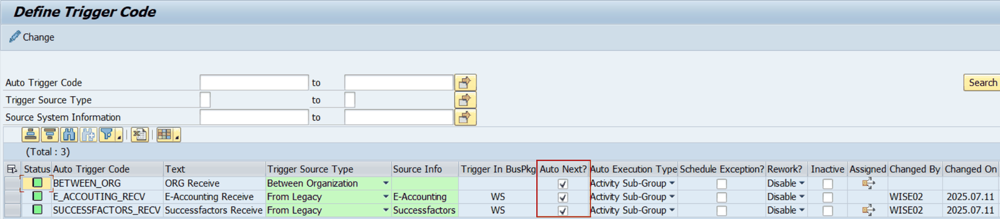
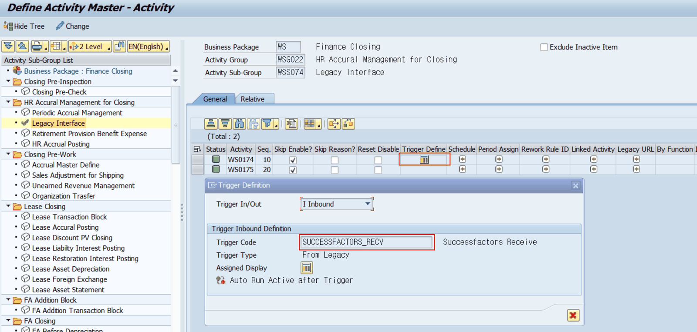
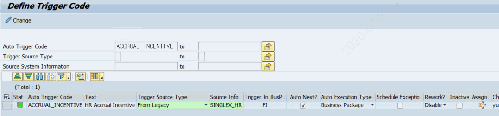

# 3. Auto Trigger 설정 방법

## 3.1 설정 전 준비 사항

Auto Trigger를 설정하기 전에 아래 사항이 사전 정의되어 있어야 합니다.

- 연결할 선행 Activity와 후행 Activity(또는 Business Package)가 PAC에 등록되어 있을 것
- 각 Activity가 속한 Business Package 식별자(BUPAK)를 확인할 것
- ZLPAC0070 설정 권한이 있는 계정으로 접속할 것

## 3.2 STEP 1 : Trigger Code 등록 (ZLPAC0070)

Trigger Code는 Auto Trigger의 핵심 설정 단위입니다. 어떤 방식으로 Trigger를 발생시키고, Auto 수행 여부와 수행 범위를 결정합니다.

ZLPAC0070 실행 순서:

1. SAP GUI에서 T-Code ZLPAC0070 실행
2. 우측 상단 [변경 모드] 버튼 클릭 (연필 아이콘)
3. [행 추가] 버튼 클릭하여 신규 행 추가
4. 아래 표를 참고하여 각 필드 입력
5. [저장] 버튼 클릭

*[그림] ZLPAC0070 Trigger Code 화면*

| 필드명 | 입력 내용 | 비고 |
|---|---|---|
| CRSCODE | Trigger Code명 (예: PAC_TRIG_001) | 영문 대문자, 숫자 조합 권장. 저장 후 변경 불가 |
| TEXT | Trigger Code 설명 (예: A법인 → B법인 연계) | 30자 이내 |
| Trigger Source Type | Trigger 유형 선택 | 하단 Trigger 유형 표 참조 |
| Source Info | Trigger 발생 소스 정보 | TRIG_TYPE이 B 또는 O이면 미입력 |
| Trigger In BusPkg | 후행 Business Package 식별자 | TRIG_TYPE이 O이면 미입력 |
| Auto Next? | Auto Next 체크 여부 | 체크(X) = 자동수행 / 미체크 = 수동 기동 필요 |
| Auto Execution Type | Auto Execution Type | XAUTO=X인 경우 필수. 하단 표 참조 |
| Schedule Exception | 예외 Schedule 인지 선택 |  |
| Rework? | Rework를 할 것인지 선택 |  |
| Inactive | 삭제 여부 표시 | 삭제 표시 |
| Assigned | Trigger Assign된 내역 | 아이콘 클릭해서 확인 가능 |

### Trigger 유형 (TRIG_TYPE) 상세

| 코드값 | 표시명 | 설명 |
|---|---|---|
| L | From Legacy | 레거시 시스템(SAP 외부 시스템)에서 PAC로 Trigger를 발생시키는 유형 |
| B | Between Business Package | 동일 SAP 시스템 내 서로 다른 Business Package 간 Trigger |
| S | From Other Module | SAP 내 다른 모듈(예: MM, SD 등)에서 PAC로 Trigger 발생 |
| O | Between Organization | 동일 Business Package 내에서 조직(법인) 간 Trigger |

### Auto Execution Type (AUTO_TYPE) 상세

| 코드값 | 표시명 | 설명 |
|---|---|---|
| A | Activity | 후행 Activity를 직접 자동 실행 |
| B | Business Package | 후행 Business Package 전체를 자동 실행 |
| G | Activity Group | 후행 Activity Group을 자동 실행 |
|  | No Auto Run | 자동 실행 없음 (XAUTO와 함께 사용하지 않음) |

> 📌 주의 사항
> XAUTO = 'X'로 설정한 경우 AUTO_TYPE도 반드시 입력해야 합니다. 미입력 시 저장 오류가 발생합니다.
> CRSCODE는 저장 후 변경이 불가합니다. 잘못 입력한 경우 삭제 후 재등록이 필요합니다.

## 3.3 STEP 2 : Activity 마스터에 Trigger Definition 연결 (ZLPAC0020)

생성한 Trigger Code를 실제 Activity에 연결합니다.

1. T-Code ZLPAC0020 실행
2. 해당 Business Package(BUPAK) 및 Closing ID 선택
3. Trigger를 설정할 Activity 행을 선택
4. [Trigger Definition] 버튼 클릭 (또는 해당 셀 직접 입력)
5. CRSCODE 필드에 ZLPAC0070에서 등록한 Trigger Code 입력
6. CRSCODE : Inbound(수신) Trigger, TG_CRSCODE : Outbound(송신) Trigger
7. [저장] 클릭

| 필드 | 의미 | 예시 |
|---|---|---|
| CRSCODE | Inbound Trigger : 이 Activity가 완료될 때 발동할 Trigger Code | PAC_TRIG_001 |
| TG_CRSCODE | Outbound Trigger : 이 Activity가 외부에서 받는 Trigger Code | PAC_TRIG_EXT |

*[그림] ZLPAC0020 Activity 마스터 Trigger Definition 설정 화면*

## 3.4 STEP 3 : 설정 확인 (ZLPAC0070 조회)

설정이 완료된 후 ZLPAC0070에서 다음과 같이 확인합니다.

1. T-Code ZLPAC0070 실행
2. 'Auto Trigger Code' 필드에 등록한 CRSCODE 입력 후 [조회] 클릭

1. 아래 항목 확인
*[그림] ZLPAC0070 Trigger Code 항목 확인 화면*

- XAUTO = 'X' (Auto Next 체크됨)
- AUTO_TYPE = A/B/G 중 하나 설정됨
- TRIG_TYPE 및 SOURCE_INFO 정상 입력됨
- [ICON] 컬럼에 아이콘이 표시되면 ZTPAC_PROC에 이미 연결된 Activity가 있다는 의미
