# 2. Define Schedule ID (ZLPAC7010)

## 2.1 개요

**화면명** Define Schedule ID    **T-Code** ZLPAC7010

통제가 필요한 업무별로 Schedule ID를 등록하는 프로그램입니다. 여기서 정의한 통제 항목이 이후 결산 일정 배포와 회계 기표 통제의 기준이 됩니다.

- 등록된 Schedule ID는 ZLPAC0020(Define Activity Master)에서 Activity Type을 C(Closing Schedule)에 매핑하여 사용한다.
화면 상단의 실행 영역에서 다음을 지정한 뒤 우측 하단의 Execute 버튼으로 실행합니다.

| 항목 | 설명 |
|---|---|
| Schedule Type | 정의할 Schedule ID의 묶음(종류)을 선택 |
| Schedule ID | 신규 생성 시 ID를 입력하여 정의 |
| Execution Type | 조회 / 변경 / 생성 / 삭제 중 실행 유형을 선택 |

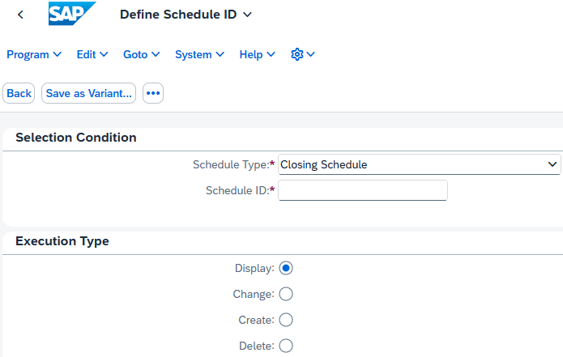

[ZLPAC7010] Define Schedule ID — Selection Condition 및 Execution Type

## 2.2 Schedule Type

Schedule Type은 Schedule ID의 묶음이며, 각 Schedule ID에 점검 항목 정보를 정의합니다. 3가지 유형이 있습니다.

| Schedule Type | 설명 |
|---|---|
| ① Closing Schedule | 시간 또는 순서에 의한 기표 통제가 이루어지는 Schedule ID 묶음 결산 일정 배포 시 메일링 항목에 포함 Closing Calendar에 항상 표시 |
| ② Closing Reporting | 결산 일정 배포 시 메일링 항목에 포함할지 선택할 수 있음 Closing Calendar 표시 여부를 선택할 수 있음 |
| ③ Other Schedule | ①, ② 이외의 Schedule ID를 정의할 때 사용 Closing Calendar 표시 여부를 선택할 수 있음 |

> 시스템 확인 — Schedule Type 값 Schedule Type은 Schedule ID 마스터(ZTPAC_SCH_ID)의 SCHTYPE 필드로 관리되며, 시스템에 등록된 고정값은 다음 3가지입니다. C = Closing Schedule, R = Closing Reporting, O = Other Schedule

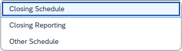

[ZLPAC7010] Schedule Type 선택 (Closing Schedule / Closing Reporting / Other Schedule)

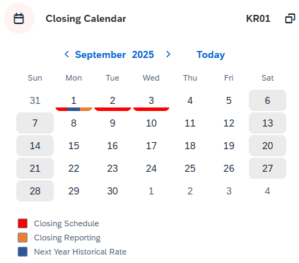

Closing Dashboard — Closing Calendar 표시 예시

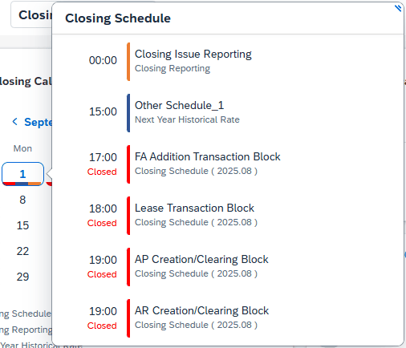

Closing Calendar 일자 클릭 시 Schedule 상세 표시

## 2.3 Schedule ID 생성 — Selection Condition

신규 Schedule ID 생성 시 기본 식별 정보를 입력합니다.

| 항목 | 설명 |
|---|---|
| ① Schedule ID | Schedule Type에 매핑되는 Schedule ID 생성 후에는 변경 불가 |
| ② Schedule Description | 사용자에게 제공되는 Schedule ID 수행 정보로, 필요 시 수정 가능 필수 입력 필드 |
| ③ Inactive | 미사용 시 Inactive 처리하여 화면에서 숨김 |

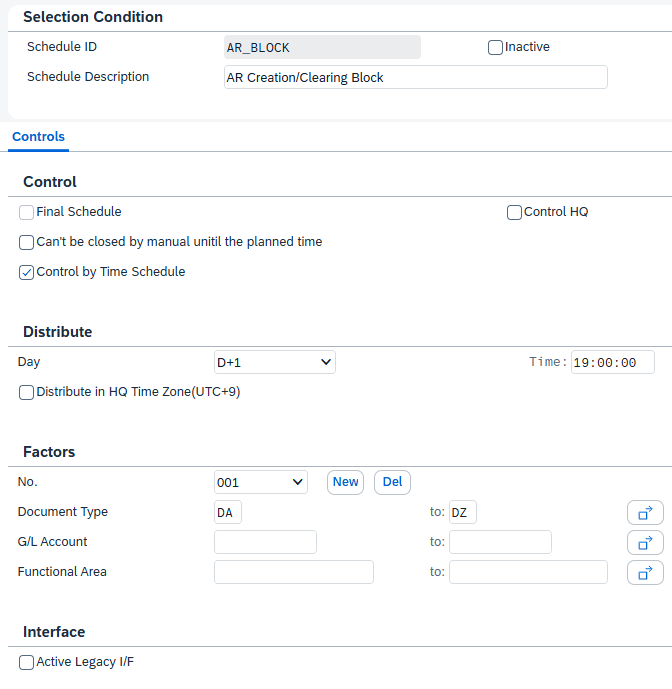

[ZLPAC7010] Schedule ID 생성 — Controls 탭 전체 (Control / Distribute / Factors / Interface)

## 2.4 Controls 탭 — Control

Control 영역에서는 Schedule ID의 핵심 통제 속성을 설정합니다.

| 항목 | 설명 |
|---|---|
| ① Final Schedule | 결산 최종 Activity로 수행할 경우 선택 Schedule Type이 Closing Schedule인 Schedule ID 중 1개만 설정 가능 해당 Schedule ID 시점 도래 시 해당 법인의 standard posting period가 Close됨 |
| ② Can’t be closed by manual
until the planned time | 결산 일정이 배포되었더라도, 계획된 시간 전에는 강제로 Close하지 못하도록 통제할 경우 선택 |
| ③ Control by Time Schedule | 체크 시: 시간에 의한 제어를 받는 Schedule ID로 설정됨. 기표 시간이 초과되면 자동으로 일정이 통제됨 미체크 시: 순서에 의한 Schedule ID로 설정됨. 앞선 Activity가 모두 수행되어 순서가 도래하면 자동으로 통제됨 → Distribute 구간의 Day/Time 입력 불가, 일정 배포 항목에서 제외되고 모델링 순서로만 통제 |
| ④ Control HQ | 본사에서만 해당 Schedule ID를 관리하고자 할 때 체크 본사 외 법인 담당자는 절대 수정 불가한 Schedule ID로 정의됨 |

> 시스템 확인 — Control 필드 위 통제 항목은 Schedule ID 마스터(ZTPAC_SCH_ID)의 다음 필드로 저장됩니다. Final Schedule → FINAL(Final Closing Process Flag), Control HQ → STDFLAG(HQ Control), Control by Time Schedule → XTIME_CNTR, Can’t be closed by manual → NO_MANUAL

## 2.5 Controls 탭 — Distribute

Distribute 구간은 Control by Time Schedule이 체크된 경우에만 활성화됩니다. 입력한 날짜·시간을 초과하면 자동으로 기표가 Block되어 일정이 통제됩니다. 매월 ZLPAC7030(Monthly Closing Calendar Control)에서 입력한 날짜로 Schedule ID가 통제됩니다.

| 항목 | 설명 |
|---|---|
| ① Day | 해당 Schedule ID 항목을 통제할 날짜 지정 D-5 ~ D+5 사이에서 선택 |
| ② Time | 해당 Schedule ID 항목을 통제할 시간 지정 |
| ③ Distribute in HQ Time Zone (UTC+9) | 결산 일정을 본사(한국) 시간 기준으로 실행하고 싶을 때 선택 예: 해외 법인의 17시가 본사 15시인 경우, 모든 법인에서 본사 시간 기준 17시에 결산이 동시에 실행됨 |

> 시스템 확인 — Day 필드 Day는 정수형(부호 있는 숫자) 필드로 저장되며, 마이너스(D-n)와 플러스(D+n)를 모두 표현합니다. Distribute 구간의 입력 범위(D-5 ~ D+5)는 프로그램에서 제어됩니다.

## 2.6 Controls 탭 — Factors

Factors 구간은 Document type, G/L Account, Function Area 단위로 세부 통제 Factor를 사용하여 통제합니다. 전표 Validation과 연계되어, 일정 마감 시 회계 기표를 통제합니다.

| 항목 | 설명 |
|---|---|
| ① No. (Factor 고유 번호) | 하나의 No.에 최대 3개의 Factor를 적용할 수 있으며, Factor가 여러 개인 경우 설정한 모든 조건의 결산 일정이 수행됨 List Box를 클릭하여 Schedule ID에 등록된 각 Factor 정보 확인 |
| ② 예시 1 (Factor 1개) | 전표유형 ‘SA’이고 계정과목이 지정 범위에 해당하는 경우에만 적용 |
| ③ 예시 2 (Factor 2개) | 전표유형 ‘DA’~‘DZ’이거나, 계정과목이 지정 범위이면서 기능 영역이 ‘0001’인 경우 모두 적용 Factor 간에는 OR 조건이 적용됨 |

> 시스템 확인 — Factor 저장 구조 Factor 조건은 통제 기준별로 별도 테이블에 저장됩니다. 전표유형은 ZTPAC_SCH_BLART, G/L 계정은 ZTPAC_SCH_RACCT, 기능 영역은 ZTPAC_SCH_FKBER에 보관되며, 하나의 메소드 순번(No.)으로 묶여 관리됩니다.

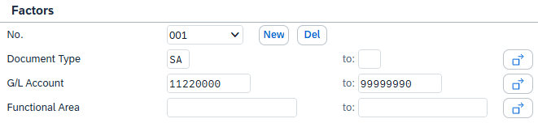

예시 1 — Factor 1개: 전표유형 ‘SA’ + 계정과목 범위(11220000~99999990)

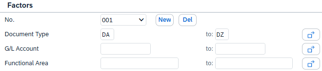

예시 2 (No.001) — 전표유형 ‘DA’~‘DZ’

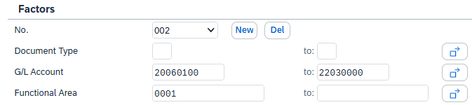

예시 2 (No.002) — 계정과목 20060100~22030000 + 기능 영역 0001

## 2.7 Controls 탭 — Interface

유관 시스템과의 인터페이스를 통제하기 위한 속성입니다.

| 항목 | 설명 |
|---|---|
| ① Active Legacy I/F | 스케줄이 open/close될 때 유관 시스템으로 인터페이스되는 경우 체크 |
| ② Assign Cut Off Group | Cut Off Group을 지정하여 Journal Accounting Rule의 카테고리 단위로 인터페이스를 연계하는 경우 체크 |

> 시스템 확인 — Interface 필드 Active Legacy I/F는 ZTPAC_SCH_ID의 LEGIF(Active Legacy Interface), Assign Cut Off Group은 ACT_CSP(Active Cut Off Group) 필드로 저장됩니다. 두 필드 모두 운영 대상 시스템에 존재합니다.

### 2.7.1 Active Legacy I/F — Schedule 인터페이스 (LG 특화)

LG 환경에서는 스케줄 open/close 시점에 유관 시스템으로 인터페이스하는 Schedule I/F가 2개 등록되어 있습니다. 각 스케줄은 ZLPACEXIT(Maintain PAC User Exit)의 Exit Group ‘SCH_IF’에 등록된 Exit Function을 호출합니다.

| Schedule ID | Exit Function | Job Code |
|---|---|---|
| GENERAL_EXPENSE_UAS | ZFPAC_CSP_LEG_SCHIF | UAS |
| FA_ADDITION | ZFPAC_CSP_LEG_SCHIF_EPS | EPS |

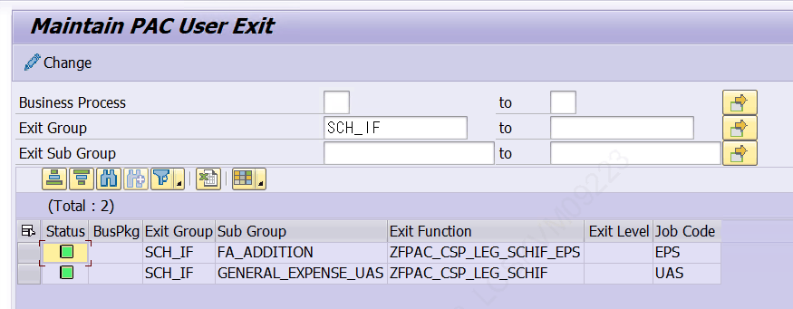

[ZLPACEXIT] Exit Group SCH_IF에 등록된 Schedule 인터페이스 2건

Exit Function은 결산 스케줄 상태 정보를 JSON 본문(Request Body)으로 구성하여 인터페이스 API(POST_DATA)로 전송합니다. 전송 결과에 따라 IF_BLOCKED / CONNECTION_CREATE_ERROR / REQUEST_ERROR 예외를 처리하며, 오류 시 메시지를 표시합니다.

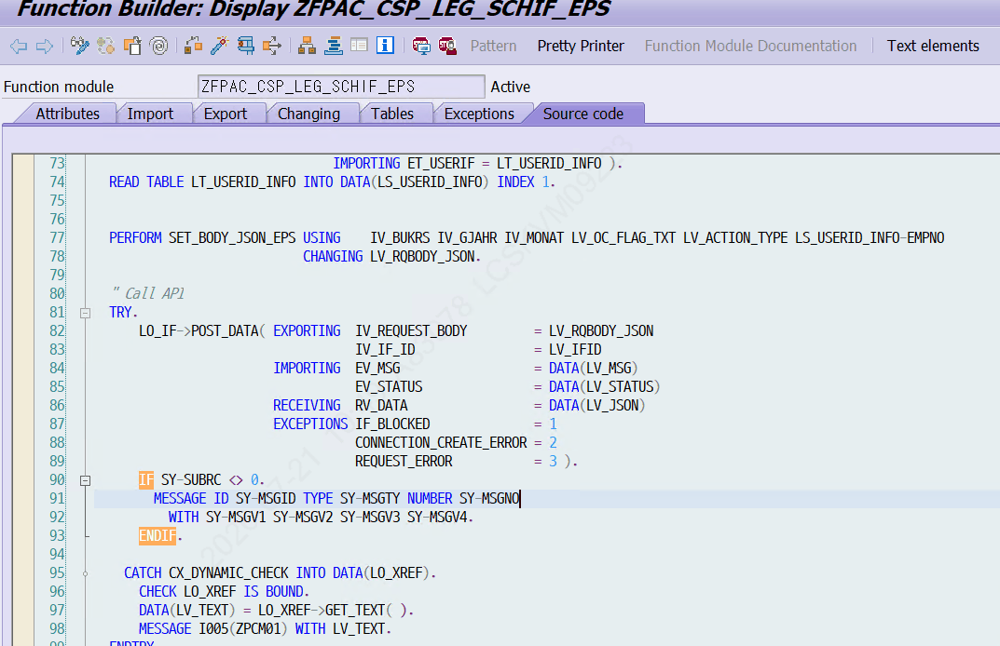

[ZFPAC_CSP_LEG_SCHIF_EPS] 인터페이스 호출 로직 (POST_DATA API 전송 및 예외 처리)

> LG 특화 위 2개 Schedule(GENERAL_EXPENSE_UAS, FA_ADDITION)은 LG 시스템에서 ZTPAC_SCH_ID-LEGIF = ‘X’로 설정되어 있습니다. Exit Function(ZFPAC_CSP_LEG_SCHIF / ZFPAC_CSP_LEG_SCHIF_EPS)은 LG 고유 인터페이스 구현으로, 본 표준 시스템 검색에는 조회되지 않으며 위 내용은 LG 시스템 화면 기준으로 정리했습니다.

### 2.7.2 Assign Cut Off Group (LG 특화)

Assign Cut Off Group(ZTPAC_SCH_ID-ACT_CSP)을 체크하면 Interface 구간에 Cut Off Group을 지정하는 영역이 활성화됩니다. 기존에 정의된 Cut Off Group을 추가하여 사용합니다. (Cut Off Group 자체의 정의·관리는 GL 영역 소관)

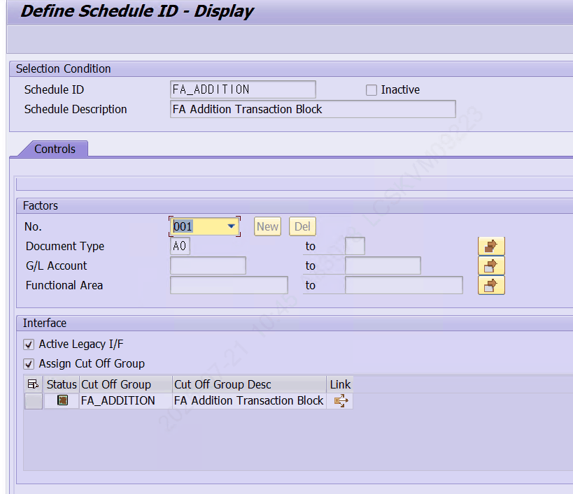

[ZLPAC7010] Interface — Active Legacy I/F 및 Assign Cut Off Group 활성화, Cut Off Group 지정

Cut Off Group 행의 Link를 클릭하면 Inquiry Journal Accounting Rule Setup 화면으로 이동합니다. 이 프로그램은 제공받아 연계한 것으로, Journal Accounting Rule의 카테고리를 관리합니다. 하나의 Cut Off Group 안에는 여러 Category Group이 포함되며, Journal Category 탭에서 System · Category Group · Category · Module in Charge · Cut Off Group 등을 확인할 수 있습니다.

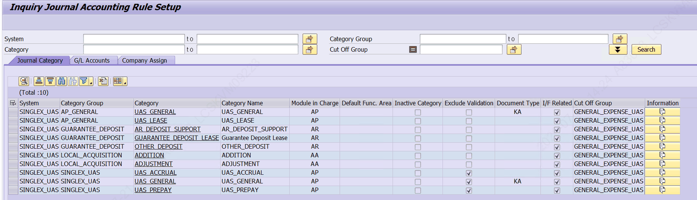

[Inquiry Journal Accounting Rule Setup] Cut Off Group에 속한 Category Group / Category 목록

여기에 등록된 Category Group 또는 Category를 기준으로 인터페이스를 호출할 수 있습니다. 인터페이스는 CATEGRP · CATEGORY로 검색·매핑되는 구조입니다.

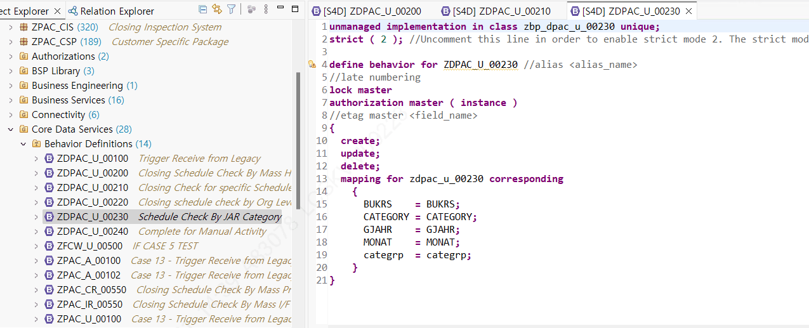

[CDS ZDPAC_U_00230 : Schedule Check By JAR Category] CATEGRP / CATEGORY 매핑 구조

> LG 특화 필드 ACT_CSP(Active Cut Off Group)는 본 표준 시스템에도 존재합니다. 다만 이와 연결되는 Inquiry Journal Accounting Rule Setup 프로그램과 카테고리 기반 인터페이스(CDS ZDPAC_U_00230 ‘Schedule Check By JAR Category’, BUKRS·CATEGORY·GJAHR·MONAT·CATEGRP 매핑)는 본 표준 시스템 검색에는 조회되지 않으며, LG 시스템 화면 기준으로 정리했습니다.

## 2.8 Organization Assign 탭

Organization Assign 탭은 ZLPAC7000(Maintain Closing Schedule Config)에서 Organization Type을 ‘By Schedule Organization’으로 설정한 경우에만 활성화됩니다. 활성화되면 Assign Level을 지정해야 합니다.

| 항목 | 설명 |
|---|---|
| ① Assign Level | 해당 Schedule이 적용될 레벨 설정 Business Type 또는 Organization으로 설정 |
| ② Business Type | Schedule에 Business Type을 등록하면, 일정 배포 시 해당 Business Type의 조직이 리스트에 포함됨 ZLPAC7020(Assign Schedule to Organization)에서 해당 Business Type의 조직에 Assigned Schedule로 표시됨 |
| ③ Organization | Schedule ID를 조직별로 설정 ZLPAC7020(Assign Schedule to Organization)에서 설정 |

> 시스템 확인 — Organization Type 값 Organization Type은 결산일정 설정(ZTPAC_SCH_CONFIG)의 ORGTYP 필드로 관리되며, 시스템에 등록된 고정값은 다음 2가지입니다. M = By Modeling Assigned Organization, S = By Schedule Organization Organization Assign 탭은 값이 S(By Schedule Organization)일 때 활성화됩니다. Assign Level 값은 B = Business Type, O = Organization으로 구분됩니다.

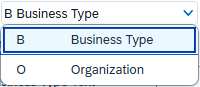

Assign Level 선택 (B Business Type / O Organization)

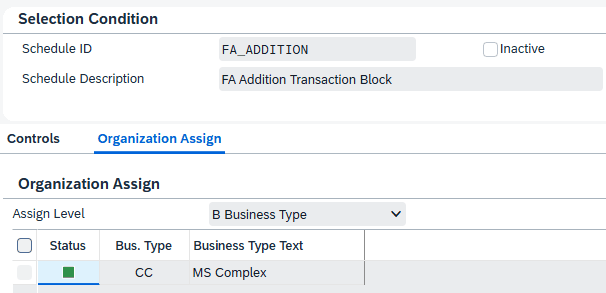

Assign Level = Business Type 설정 예시 (CC / MS Complex)

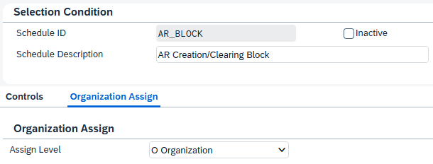

Assign Level = Organization 설정 예시
