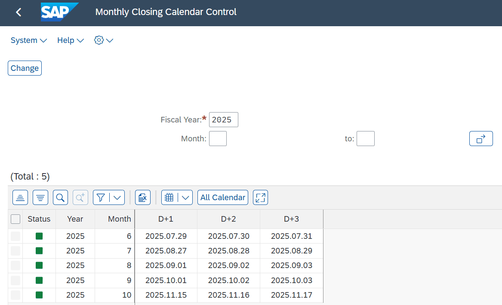
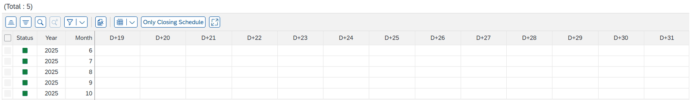

# 3. Monthly Closing Calendar (ZLPAC7030)

## 3.1 개요

**화면명** Monthly Closing Calendar Control    **T-Code** ZLPAC7030

결산 일정 배포 시 사용할 Closing Calendar를 정의하는 프로그램으로, 배포가 필요한 연·월에 결산 일자를 지정합니다.

- 결산 일정 배포월에 Calendar가 미설정된 경우 결산 일정 배포가 불가능하다.

## 3.2 All Calendar / Only Closing Schedule

| 구분 | 설명 |
|---|---|
| ① Only Closing Schedule | 선택 시, ZLPAC7010(Define Schedule ID)에서 Schedule Type을 ‘Closing Schedule’로 설정한 Schedule ID의 Day만 표시 Closing Schedule로 지정된 Day 필드는 필수 입력 필드 (예: D+1/D+2/D+3 3개 필드는 필수 입력) |
| ② All Calendar | 선택 시, 전체 Day(D-10 ~ D+31)를 표시 Closing Schedule로 지정된 Day가 아니면서 Schedule Type이 Closing Reporting 또는 Other Schedule인 경우, 해당 Day에 날짜를 등록해야 함 (미지정 시 Monitoring Dashboard의 Closing Calendar에서 확인 불가) |

[ZLPAC7030] Only Closing Schedule — 필수 Day(D+1/D+2/D+3) 표시

All Calendar — 전체 Day(D-10 ~ D+31) 표시
