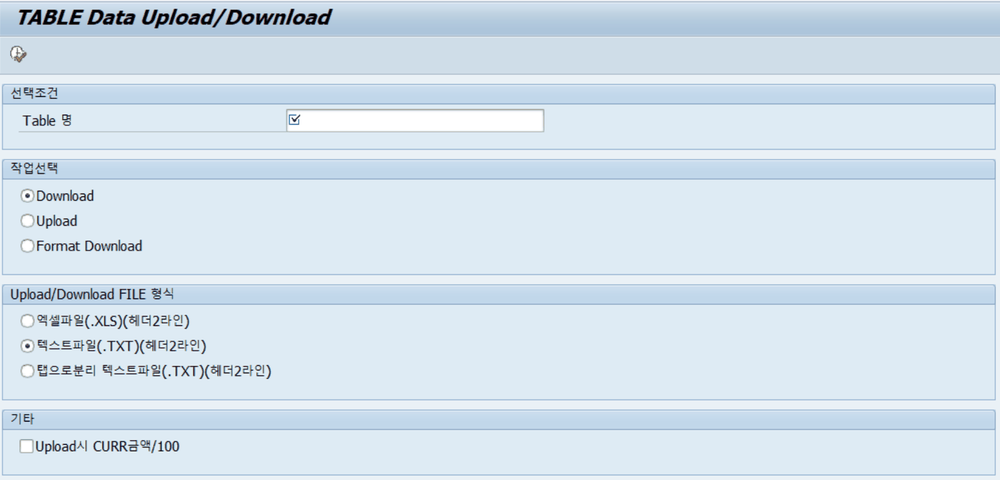

# 2. ZLPACMIG010 — TABLE Data Upload/Download

## 2.1 프로그램 개요

| 프로그램명 | ZLPACMIG010 |
|---|---|
| 설명 | TABLE Data Upload/Download |
| 용도 | 단일 Z/Y 테이블의 데이터를 로컬 PC로 다운로드하거나, 로컬 파일로부터 테이블에 업로드 |
| 대상 테이블 | Z 또는 Y로 시작하는 커스텀 테이블만 사용 가능 |

## 2.2 화면 설명

프로그램을 실행하면 아래와 같은 선택 화면이 표시됩니다.

[그림 2-1] ZLPACMIG010 선택 화면 — TABLE Data Upload/Download

| 필드 / 옵션 | 설명 | 입력 방법 |
|---|---|---|
| Table 명 (선택조건) | 데이터를 다운로드/업로드할 Z 또는 Y로 시작하는 테이블명 | 직접 입력 (예: ZTPAC_BUPAK) |
| Download (작업선택) | 테이블의 현재 데이터를 파일로 다운로드 | 라디오 버튼 선택 |
| Upload (작업선택) | 파일에서 데이터를 읽어 테이블에 저장 | 라디오 버튼 선택 |
| Format Download (작업선택) | 테이블 구조(헤더 포맷)만 파일로 다운로드 | 라디오 버튼 선택 |
| 엑셀파일(.XLS)(헤더2라인) | Excel 형식으로 다운로드/업로드 | 라디오 버튼 선택 |
| 텍스트파일(.TXT)(헤더2라인) | 탭 구분 텍스트 형식 (기본값) | 라디오 버튼 선택 — 기본 권장 |
| 탭으로분리 텍스트파일(.TXT)(헤더2라인) | 탭 구분 텍스트 (헤더 2라인) | 라디오 버튼 선택 |
| Upload시 CURR금액/100 (기타) | 업로드 시 통화 금액을 100으로 나눔 (특수한 경우만 사용) | 체크박스 |

## 2.3 사용 방법

### 2.3.1 데이터 다운로드

1. T-Code SA38 또는 SE38에서 ZLPACMIG010을 실행합니다.
2. Table 명에 다운로드할 테이블명을 입력합니다. (예: ZTPAC_PROC)
3. 작업선택에서 Download를 선택합니다.
4. 파일 형식을 선택합니다. 일반적으로 텍스트파일(.TXT)(헤더2라인)을 권장합니다.
5. 실행(F8) 버튼을 누르면 파일 저장 경로를 묻는 다이얼로그가 표시됩니다.
6. 저장 위치와 파일명을 지정한 후 저장합니다.

### 2.3.2 데이터 업로드

1. Table 명에 데이터를 저장할 테이블명을 입력합니다.
2. 작업선택에서 Upload를 선택합니다.
3. 다운로드 시 사용한 동일한 파일 형식을 선택합니다.
4. 실행(F8) 버튼을 누르면 업로드할 파일을 선택하는 다이얼로그가 표시됩니다.
5. 파일을 선택하면 데이터가 해당 테이블에 저장됩니다.

> ⚠ 주의사항 • Table 명에는 반드시 Z 또는 Y로 시작하는 테이블명만 입력할 수 있습니다. 다른 문자로 시작하는 표준 테이블은 오류 메시지가 출력됩니다. • 업로드 전 해당 테이블의 기존 데이터를 반드시 확인하십시오. 업로드된 데이터는 기존 데이터에 추가(INSERT)됩니다.
