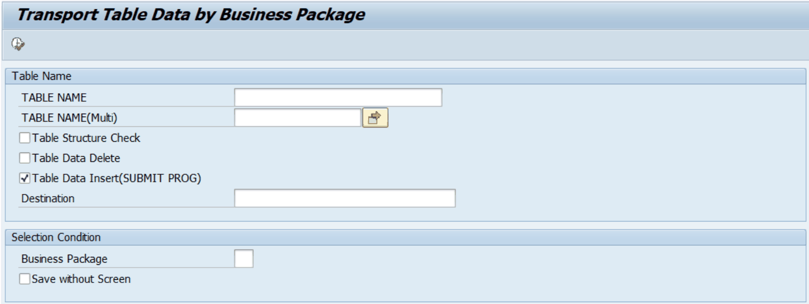

# 3. ZLPACMIG020 — Transport Table Data by Business Package

## 3.1 프로그램 개요

| 프로그램명 | ZLPACMIG020 |
|---|---|
| 설명 | Transport Table Data by Business Package |
| 용도 | Business Package 단위로 여러 Z 테이블 데이터를 RFC를 통해 타 시스템에서 읽어와 현재 시스템에 저장 |
| 내부 호출 | 내부적으로 ZLPACMIG030(단일 테이블 이관)을 반복 호출 |

## 3.2 화면 설명

ZLPACMIG020 실행 시 아래 화면이 표시됩니다.

[그림 4-1] ZLPACMIG020 기본 화면 — Transport Table Data by Business Package

| 필드 / 옵션 | 설명 | 비고 |
|---|---|---|
| Table 명 (P_TABNM) | 단일 테이블명 직접 입력 시 해당 테이블만 이관 | 선택 입력 |
| Table 목록 (S_TABNM) | 여러 테이블명을 범위/목록으로 입력 (다중 선택) | 선택 입력 |
| 테이블 구조 체크 (P_DBCHK) | 목적지 시스템과 현재 시스템의 테이블 구조 동일 여부 사전 확인 | 체크박스 |
| 테이블 데이터 삭제 (P_DBDEL) | 이관 전 목적 테이블 데이터 삭제 (개발 시스템에서는 비활성) | 체크박스 |
| 테이블 데이터 저장 (P_DBINS) | 원본 시스템 데이터를 읽어 현재 테이블에 INSERT (기본값: 체크) | 체크박스 (기본 체크) |
| RFC Destination (P_DEST) | 원본 데이터를 읽어올 SM59 등록 RFC 목적지명 | 필수 입력 |
| Business Package (P_BUPAK) | BUPAK 필드가 있는 테이블에서 특정 Business Package만 이관 | 선택 입력 |
| Save without Screen (P_NO_POP) | ALV 확인 화면 없이 즉시 저장 | 체크박스 |

## 3.3 사용 방법

1. SA38 또는 SE38에서 ZLPACMIG020을 실행합니다.
2. 이관할 테이블명을 Table 명(단일) 또는 Table 목록(다중)에 입력합니다.
3. RFC Destination에 원본 시스템의 SM59 목적지명을 입력합니다.
4. (선택) 테이블 구조 체크를 활성화하여 테이블 레이아웃이 동일한지 사전 확인합니다.
5. (선택) Business Package를 입력하면 해당 BUPAK의 데이터만 이관합니다. 빈칸 시 전체 이관.
6. 실행(F8)을 누르면 내부적으로 ZLPACMIG030을 호출하여 테이블별로 데이터를 이관합니다.
7. Save without Screen을 체크하지 않은 경우, 각 테이블마다 ALV 확인 화면이 표시됩니다. 내용 확인 후 저장합니다.

> 💡 RFC Destination 사전 확인 • RFC Destination(목적지)은 T-Code SM59에서 사전에 등록되어 있어야 합니다. • 목적지가 존재하지 않으면 "Destination XXX does not exist. Check SM59" 오류가 발생합니다. • 테이블 구조 체크(P_DBCHK)를 먼저 수행하면 이관 전 레이아웃 불일치를 미리 발견할 수 있습니다.
