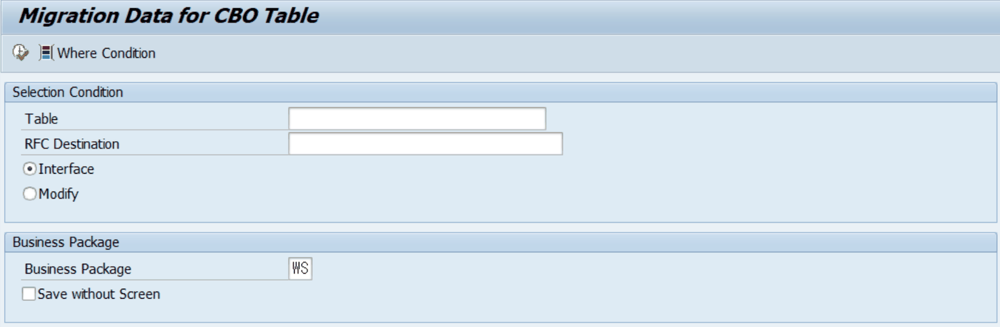
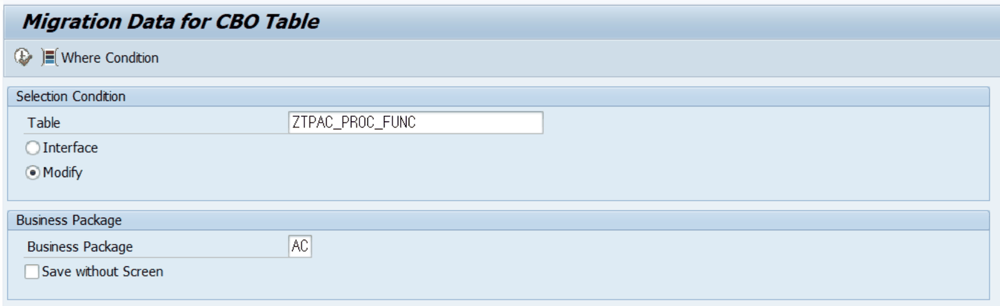

# 4. ZLPACMIG030 — Migration Data for CBO Table

## 4.1 프로그램 개요

| 프로그램명 | ZLPACMIG030 |
|---|---|
| 설명 | Migration Data for CBO Table |
| 용도 | 단일 CBO(커스텀) 테이블 데이터를 RFC로 읽어 현재 시스템에 저장, 또는 직접 조회·수정 |
| 호출 방식 | ZLPACMIG020에서 내부 호출(SUBMIT) 또는 직접 단독 실행 모두 가능 |

## 4.2 화면 설명

### 4.2.1 기본 선택 화면 (Interface 모드)

RFC Destination을 통해 원본 시스템에서 데이터를 읽어오는 기본 화면입니다.

[그림 4-1] ZLPACMIG030 기본 화면 — Migration Data for CBO Table (Interface 모드)

| 필드 / 옵션 | 설명 | 비고 |
|---|---|---|
| Table | 이관 대상 CBO 테이블명 (Z/Y 시작) | 필수 |
| RFC Destination | 원본 데이터를 읽어올 RFC 목적지 (SM59 등록 필요) | Interface 모드 시 필수 |
| Interface (라디오) | 원격(RFC)에서 데이터를 읽어와 이관하는 모드 | 기본값 |
| Modify (라디오) | 현재 시스템의 테이블 데이터를 직접 조회·수정하는 모드 | 직접 수정 시 선택 |
| Business Package | 특정 BUPAK의 데이터만 이관 (빈칸: 전체) | 선택 입력 |
| Save without Screen | ALV 확인 화면 없이 즉시 저장 | 체크박스 |

### 4.2.2 Modify 모드 — 데이터 직접 수정

현재 시스템의 테이블 데이터를 직접 조회하고 수정할 때 사용합니다. RFC Destination 없이 현재 서버 데이터를 직접 편집합니다.

[그림 4-2] ZLPACMIG030 Modify 모드 — ZTPAC_PROC_FUNC 테이블 직접 수정 예시

## 4.3 Where Condition (조회 조건)

화면 상단의 Where Condition 버튼을 클릭하면 SQL WHERE 절을 직접 입력할 수 있는 추가 조건 창이 표시됩니다. 특정 조건의 데이터만 조회·이관할 때 유용합니다.

- 예시: BUKRS = 'EKHQ' 입력 시 회사 코드 EKHQ의 데이터만 조회
- 예시: GJAHR = '2025' 입력 시 2025년도 데이터만 조회

## 4.4 RFC Destination 일괄 수정 (운영 주요 작업)

AC, AE Business Package에서는 Activity Type이 Function Type인 경우가 많습니다. Function Type Activity가 다른 서버에서 실행될 경우 RFC Destination 설정이 필요하며, 이 값을 이관 후 일괄 수정해야 합니다.

**다음 절차로 RFC Destination을 일괄 수정합니다.**

1. ZLPACMIG030을 실행합니다.
2. Table 필드에 ZTPAC_PROC_FUNC를 입력합니다.
3. Modify 라디오 버튼을 선택합니다.
4. Business Package에 수정할 Business Package 코드를 입력합니다. (예: AC)
5. 실행(F8)을 누르면 ALV 목록이 표시됩니다.
6. ALV 편집 모드에서 RFC Destination 필드를 원하는 값으로 일괄 변경합니다.
7. 저장(Ctrl+S 또는 저장 버튼)을 클릭합니다.

> 💡 ZTPAC_PROC_FUNC 테이블이란? • ZTPAC_PROC_FUNC는 PAC Activity의 Function(함수) 실행 정의가 저장된 테이블입니다. • By Function Activity Type인 경우 이 테이블에 RFC Destination을 지정해야 해당 함수가 목적 서버에서 정상 실행됩니다. • AC(Accounts Closing), AE(Accounts Entry) 등 Business Package에서 주로 사용됩니다.
