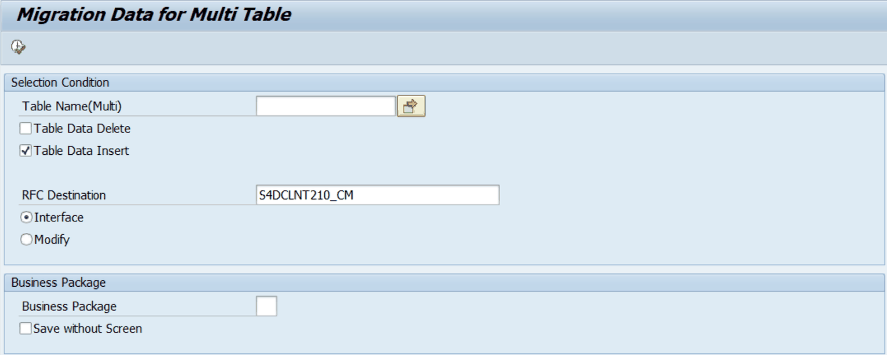

# 5. ZLPACMIG040 — Migration Data for Multi Table

## 5.1 프로그램 개요

| 프로그램명 | ZLPACMIG040 |
|---|---|
| 설명 | Migration Data for Multi Table |
| 용도 | 여러 테이블을 한 번에 지정하여 이관 (ALV 확인 화면 없이 즉시 저장) |
| 자동 호출 | ZLPACMIG030이 호출 횟수 32건을 초과하면 자동으로 ZLPACMIG040을 SUBMIT |
| 제한 사항 | Business Package를 지정하면 BUPAK 필드가 없는 테이블은 이관 대상에서 제외됨 |

## 5.2 화면 설명

[그림 5-1] ZLPACMIG040 선택 화면 — Migration Data for Multi Table

| 필드 / 옵션 | 설명 | 비고 |
|---|---|---|
| Table Name(Multi) | 이관할 여러 테이블명을 목록으로 입력 (복수 선택 가능) | 필수 |
| Table Data Delete | 이관 전 목적 테이블 기존 데이터 삭제 (개발 시스템 제외) | 체크박스 |
| Table Data Insert | 원본 데이터를 읽어 현재 테이블에 INSERT (기본값: 체크) | 체크박스 (기본 체크) |
| RFC Destination | Interface 모드 시 원본 데이터를 읽어올 RFC 목적지 | Interface 선택 시 필수 |
| Interface (라디오) | RFC를 통해 원격 시스템에서 데이터를 읽어오는 모드 | 기본값 |
| Modify (라디오) | 현재 시스템 테이블 데이터를 직접 조회·수정 | 직접 수정 시 선택 |
| Business Package | 특정 BUPAK 데이터만 대상 (빈칸: 전체) | 선택 입력 |
| Save without Screen | ALV 화면 없이 즉시 저장 | 체크박스 |

## 5.3 사용 방법

1. SA38 또는 SE38에서 ZLPACMIG040을 실행합니다.
2. Table Name(Multi) 입력란에 이관할 테이블명을 복수로 입력합니다.
3. RFC Destination에 원본 시스템 SM59 목적지명을 입력합니다.
4. 필요에 따라 Table Data Delete를 체크하여 이관 전 기존 데이터를 삭제합니다.
5. Business Package를 입력하면 BUPAK 필드가 있는 테이블에서 해당 패키지 데이터만 이관합니다.
6. 실행(F8)을 누르면 ALV 확인 없이 즉시 이관이 수행됩니다.

> ⚠ 주의사항 • Table Data Delete 체크 후 Business Package를 입력하면, BUPAK 필드가 없는 테이블은 이관 대상에서 제외됩니다. • Table Data Delete 체크 후 Business Package를 입력하지 않으면, 해당 테이블의 모든 데이터가 삭제됩니다. 신중하게 사용하십시오. • 개발 시스템에서는 테이블 데이터 삭제 기능이 제한됩니다.
