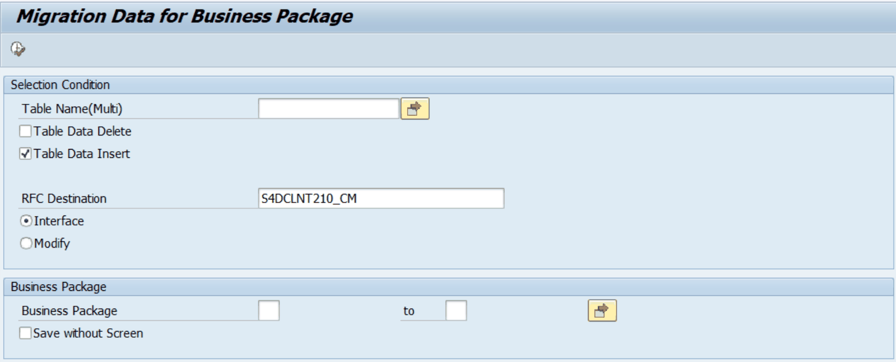

# 6. ZLPACMIG050 — Migration Data for Business Package

## 6.1 프로그램 개요

| 프로그램명 | ZLPACMIG050 |
|---|---|
| 설명 | Migration Data for Business Package |
| 용도 | 여러 Business Package를 범위로 지정하거나 특정 Business Package를 제외하여 대량 이관 |
| ZLPACMIG040과의 차이 | ZLPACMIG040은 Business Package를 1개만 지정 가능, ZLPACMIG050은 범위(S_BUPAK)로 복수 지정 가능 |

## 6.2 화면 설명

[그림 6-1] ZLPACMIG050 선택 화면 — Migration Data for Business Package

| 필드 / 옵션 | 설명 | 비고 |
|---|---|---|
| Table Name(Multi) | 이관할 테이블명 목록 (복수 선택) | 필수 |
| Table Data Delete | 이관 전 기존 데이터 삭제 (개발 시스템 제외) | 체크박스 |
| Table Data Insert | 데이터 INSERT 여부 (기본값: 체크) | 체크박스 |
| RFC Destination | Interface 모드 RFC 목적지 | Interface 선택 시 필수 |
| Interface (라디오) | RFC를 통해 원격 읽기 | 기본값 |
| Modify (라디오) | 현재 시스템 직접 수정 |  |
| Business Package (범위) | 이관할 Business Package를 범위(from~to)로 지정 | 핵심 기능: 복수 BP 지정 가능 |
| Save without Screen | ALV 없이 즉시 저장 | 체크박스 |

## 6.3 ZLPACMIG040과의 비교

| 항목 | ZLPACMIG040 | ZLPACMIG050 |
|---|---|---|
| Business Package 지정 | 단일 값(P_BUPAK) — 1개 | 범위(S_BUPAK) — 복수 또는 범위 지정 |
| 삭제 시 BUPAK 조건 | S_BUPAK[] 범위로 삭제 | S_BUPAK[] 범위로 삭제 (동일) |
| 주요 사용 케이스 | 특정 1개 BP 이관 | 여러 BP를 한 번에 또는 특정 BP 제외 이관 |

> 💡 사용 시나리오 예시 • 신규 법인 추가 시: 신규 Business Package를 S_BUPAK에 입력하여 개발→운영 이관 • 연간 초기화 작업: 특정 연도 BP 범위를 지정하여 일괄 이관 • 대규모 이관: 모든 BP를 한 번에 이관할 때 ZLPACMIG020 대신 ZLPACMIG050 사용
