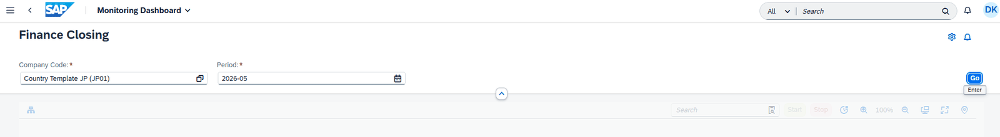
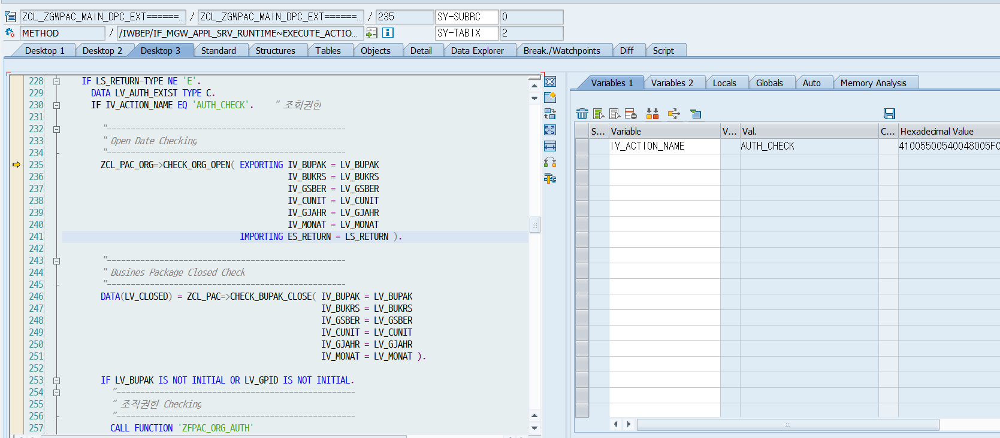
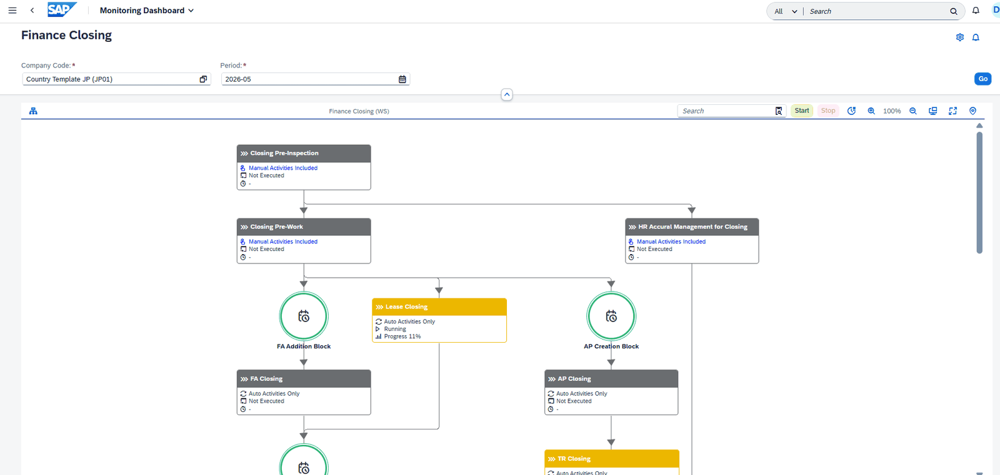
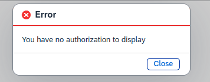
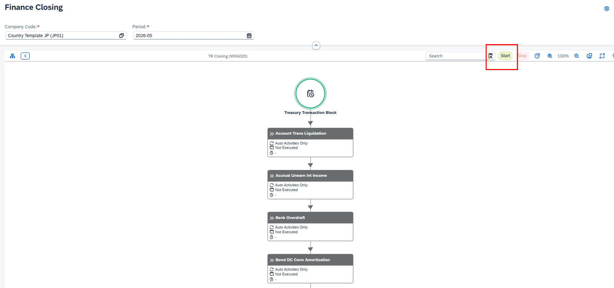
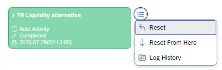
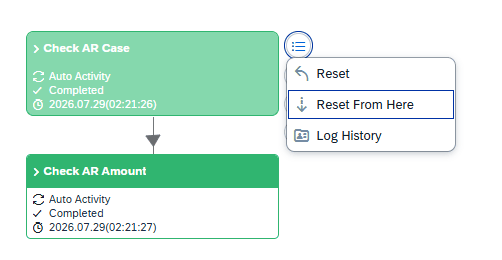
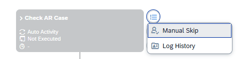

# Fiori Action 호출 로직 운영자 매뉴얼

> Fiori 화면에서 호출되는 Action(권한체크·Start·Reset·Reset From Here·Confirm)의 처리 위치, 파라미터, 내부 로직과 오류 메시지

Monitoring Dashboard Action(Go · Start · Reset · Confirm) 처리 로직 가이드

| 문서명 | Fiori Action 호출 로직 운영자 메뉴얼 |
|---|---|
| 대상 솔루션 | PAC (Process Automatic Channel) |
| 대상 독자 | SAP 결산자동화 운영 · 유지보수 담당자 |
| 문서 버전 | v1.0 |
| 작성일 | 2026-07-29 |

## 1. Fiori Action 호출 구조

### 1.1 처리 위치

PAC의 Monitoring Dashboard(Fiori)에서 **Go**, **Start**, **Reset**, **Confirm** 등의 버튼을 누르면 Fiori 화면이 OData Action을 호출합니다. Action을 실제로 처리하는 로직은 Fiori(Front-End)가 아니라 SAP(Back-End)에 있으며, 다음 클래스의 메소드가 모든 Action의 진입점입니다.

> Action 처리 진입점 ZCL_ZGWPAC_MAIN_DPC_EXT 클래스의 /IWBEP/IF_MGW_APPL_SRV_RUNTIME~EXECUTE_ACTION 메소드 Fiori가 전달한 Action 이름(IV_ACTION_NAME)과 파라미터(IT_PARAMETER)를 받아, Action 별로 권한·마감 체크를 수행한 뒤 해당 Function을 호출하는 구조입니다. 소스 주석의 설명은 "Execute Function by Action Code"입니다.

[그림 1-1] Monitoring Dashboard — Company Code와 Period를 입력하고 Go를 누르면 Action이 호출된다.

[그림 1-2] EXECUTE_ACTION 메소드 내부(SAP GUI 디버깅 화면) — IV_ACTION_NAME = AUTH_CHECK로 진입한 모습.

### 1.2 Action 목록

EXECUTE_ACTION 메소드가 처리하는 Action과 호출되는 Function은 다음과 같습니다.

| Action Name | 화면 동작 | 호출 Function / 처리 |
|---|---|---|
| AUTH_CHECK | Go 클릭(조회 진입) 시 조회권한 체크 | ZFPAC_ORG_AUTH 호출 + Open Date / Closed Check |
| AUTH_TCODE | T-Code 실행 권한 체크 | ZCL_PAC_AUTH=>CHECK_TCODE_AUTH |
| LINK_CHECK | 노드 더블클릭 시 프로그램 실행 가능 여부 체크 | ZCL_PAC=>CHECK_LINK_TO_TCODE |
| PCSGP_START | Start 버튼 (Business Package / Activity Group 실행) | ZFPAC_CREATE_GPID_JOB / ZFPAC_CREATE_BUPAK_JOB / ZFPAC_CREATE_PCSGP_JOB |
| PCSGP_STOP | Stop 버튼 | ZFPAC_STOP_PCSGP_JOB |
| PID_START | 개별 Activity 실행 | ZFPAC_CREATE_PID_JOB |
| RESET_ITEM | Reset 메뉴 | ZFPAC_RESET_ITEM |
| RESET_FROM | Reset From Here 메뉴 | ZFPAC_RESET_FROM_HERE |
| RESET_LINKED | Link된 Activity Reset | ZFPAC_RESET_LINKED |
| CONFIRM_ITEM | Confirm(Manual Confirm) 수행 | ZFPAC_CONFIRM_ITEM |
| LINK_CHANGE | Link 연결 변경 | ZFPAC_LINK_CONNECT_CHANGE |
| INFO_SAVE | 사용자 정보 저장 | 테이블 ZTPAC_USERINFO 갱신 |
| NOTICE_READ | 공지 읽음 처리 | 테이블 ZTPAC_NOTICE_RD 갱신 |

### 1.3 Fiori에서 전달되는 파라미터

Fiori는 Action 호출 시 IT_PARAMETER에 아래 값들을 담아 전달하며, EXECUTE_ACTION은 이를 내부 변수로 옮긴 뒤 각 Function에 그대로 전달합니다.

| 파라미터 | 의미 |
|---|---|
| BUPAK | Business Package |
| GPID | Global Package ID (있으면 대표 BUPAK을 ZTPAC_GPID에서 조회) |
| BUKRS / GSBER / CUNIT | 법인(Company Code) / 사업영역(BA) / 기타 조직 |
| GJAHR / MONAT | 회계연도 / 회계기간(월) |
| PCSGP | Activity Group |
| PID | Activity ID |
| PNODE / RNODE / CONNECTED | Link 변경(LINK_CHANGE)용 선행·후행 노드와 연결 여부 |
| HERE | Start 위치 구분 (Activity Group 내 Start 시 사용) |
| TCODE | T-Code 권한 체크(AUTH_TCODE)용 트랜잭션 코드 |
| REASON | Manual Confirm 사유 (Confirm Reason) |

### 1.4 공통 처리 순서와 결과 메시지

모든 Action은 아래 순서로 처리됩니다. 앞 단계에서 오류(E)가 발생하면 뒤 단계는 수행되지 않습니다.

- ① 파라미터 입력 — Fiori가 전달한 값을 내부 변수로 세팅
- ② 권한 체크 — 조회권한(AUTH_CHECK), 수행권한(ZFPAC_USER_AUTH, ZCL_PAC_AUTH=>CHECK_AUTH_BY_PID) 등 Action 별 체크
- ③ 마감 체크 — Business Package 마감 여부(ZCL_PAC=>CHECK_BUPAK_CLOSE) 확인. 마감된 경우 실행성 Action은 오류 처리
- ④ Action 수행 — 1.2의 표에 따라 해당 Function 호출
- ⑤ 결과 반환 — 메시지 타입(S/E/I)과 메시지를 TS_FNC_RETURN 구조로 Fiori에 반환. Fiori는 오류(E)인 경우 팝업으로 표시

> 결과 메시지 타입 S (성공): Successfully Executed E (오류): Error Occured 또는 각 단계에서 만든 오류 메시지 I (안내): 마감된 기간을 조회한 경우 You can display only because period is closed — 조회만 가능함을 안내

## 2. 권한 체크 (AUTH_CHECK)

### 2.1 호출 시점

Monitoring Dashboard에서 Company Code와 Period를 입력하고 **Go**를 누르면 AUTH_CHECK Action이 호출되어, 해당 조직·기간을 조회할 수 있는지 먼저 확인합니다. 체크는 다음 3단계로 진행됩니다.

### 2.2 Open Date / Closed 체크

- Open Date Checking — ZCL_PAC_ORG=>CHECK_ORG_OPEN : 입력한 조직(BUPAK·법인·BA·기타조직)과 기간(년·월)이 Open된 상태인지 확인합니다.
- Business Package Closed Check — ZCL_PAC=>CHECK_BUPAK_CLOSE : 해당 Business Package가 마감(Closed)되었는지 확인합니다. 마감된 경우에도 조회는 가능하며, 안내 메시지(I 타입)가 반환됩니다.

### 2.3 조직권한 체크 (ZFPAC_ORG_AUTH)

조직권한은 Function ZFPAC_ORG_AUTH(Function Group ZPAC040)가 체크하며, 문제가 없는 경우 정상적으로 화면이 조회됩니다.

> 보완 설명 — ZFPAC_ORG_AUTH 내부 체크 순서 (소스 검증) ① HQ 권한 체크 — ZCL_PAC_AUTH=>CHECK_AUTH_HQ : HQ 권한 보유 시 전체 조직 조회 가능 ② TF(특수) 권한 체크 — ZCL_PAC_AUTH=>CHECK_SPECIAL_AUTH(AUTH_TYPE = T) ③ PAC 조직권한 체크 — 권한 테이블 ZTPAC_PROC_AUTH에서 BUPAK(GPID인 경우 소속 BUPAK 전체)·법인·BA·기타조직 조합으로 사용자 권한 등록 여부를 조회 ④ 미등록 시 — 설정 테이블 ZTPAC_CONFIG의 REQ_BUKRS가 X이면 Company Level 권한을 재확인하고, 아니면 Reviewer 권한(ZCL_PAC_CIS=>GET_AUTH_REVIEWER)을 확인 소스 주석 기준 권한 레벨: TF·HQ는 전체(ALL), C Level은 법인 체크, B Level은 법인·BA 조합 체크, U Level 순으로 세분화되어 있습니다.

[그림 2-1] 조직권한이 있는 경우 — Go 이후 결산 프로세스 차트가 정상 조회된다.

### 2.4 권한이 없는 경우

조직권한이 없으면 오류 타입(E)과 메시지 You have no authorization to display가 반환되어, 화면에 조회할 수 없다는 팝업이 표시됩니다.

[그림 2-2] 조회권한이 없는 경우의 오류 팝업.

## 3. Start (PCSGP_START)

### 3.1 호출 시점

차트 상단의 **Start** 버튼을 누르면 PCSGP_START Action이 호출됩니다. Start는 실행성 Action이므로 조회권한 외에 추가 체크가 수행됩니다.

[그림 3-1] TR Closing(Activity Group) 화면의 Start 버튼.

### 3.2 실행 전 체크

- 마감 체크 — 마감된 법인(기간)이면 실행할 수 없습니다. ZCL_PAC=>CHECK_BUPAK_CLOSE로 확인하며, 마감 시 오류 메시지 Business Package & is closed on &가 반환됩니다.
- Start Enable Exit — ZCL_PAC_SAIL=>ON_CHECK_START_ENABLE : 고객사별 특화 조건으로 Start 가능 여부를 추가 점검합니다.
- 수행권한(Execution 권한) 체크 — ZFPAC_USER_AUTH로 사용자의 수행권한(AUTHEXEC)을 확인합니다. Controller이거나 해당 Activity에 참여자로 세팅되어 있어야 수행할 수 있습니다. 권한이 없으면 You have no authorization to start 오류 팝업이 표시됩니다.
- Job 생성 가능 여부 체크 — ZFPAC_CHECK_JOB_BALANCING : Batch 프로세스 여유가 있어 Job 생성이 가능한 경우에만 수행합니다. 불가한 경우 Can not start because batch process is busy now 오류 팝업이 표시됩니다.

### 3.3 Job 생성 분기

위 체크를 모두 통과하면 Job을 생성하는 Function을 호출합니다. Start All Process인 경우 Business Package Level로 실행되며, 호출 위치에 따라 다음과 같이 분기됩니다.

| 실행 레벨 | 조건 | 호출 Function |
|---|---|---|
| Global Package Level | GPID가 있는 경우 (Start All Process) | ZFPAC_CREATE_GPID_JOB |
| Business Package Level | GPID가 없고 PCSGP = BUPAK인 경우 | ZFPAC_CREATE_BUPAK_JOB |
| Activity Group Level | Activity Group 내에서 Start 호출 | ZFPAC_CREATE_PCSGP_JOB |
| Activity Level | 개별 Activity 실행 (PID_START Action) | ZFPAC_CREATE_PID_JOB |

> 보완 설명 — Job 생성 Function (ZPAC050, 소스 검증) Job 생성 Function들은 Function Group ZPAC050에 있습니다. ZFPAC_CREATE_BUPAK_JOB 기준 처리 순서는 다음과 같습니다. ① 동일 레벨 Job 실행중 여부 확인(ZFPAC_GET_RUNNING_JOB) — 이미 실행 중이면 Business Package Level Batch Job is running now ② Period 유효성 체크 및 Precheck 완료 여부 확인 — Precheck 사용 설정 시 미완료면 Closing Precheck is not completed yet! ③ 일정 마감 여부 체크(ZCL_PAC_CLOSING=>CHK_CLOSING_ALL) ④ 실행 프로그램 ZLPAC0100을 ZFPAC_CREATE_BATCHJOB으로 Batch Job 생성(즉시 실행). Job 이름은 ZCL_PAC_SAIL=>GET_BATCH_JOBNAMING으로 생성하며, 성공 시 Batch Job is successfully created (&) 로그를 남깁니다.

참고로 **Stop** 버튼(PCSGP_STOP Action)은 ZFPAC_STOP_PCSGP_JOB을 호출하여 실행 중인 Job을 중지합니다.

## 4. Reset (RESET_ITEM)

### 4.1 호출 시점

Activity의 컨텍스트 메뉴에서 **Reset**을 선택하면 RESET_ITEM Action이 호출됩니다. Reset도 Start와 동일하게 마감된 월인지, 권한이 있는지(Reset 권한: ZCL_PAC_AUTH=>CHECK_AUTH_BY_PID) 체크한 뒤, ZFPAC_RESET_ITEM Function을 호출하여 Activity 상태를 초기화합니다. 권한이 없으면 You have no authorization to reset 오류가 표시됩니다.

[그림 4-1] Activity 컨텍스트 메뉴 — Reset / Reset From Here / Log History.

### 4.2 ZFPAC_RESET_ITEM 처리 내용

ZFPAC_RESET_ITEM(Function Group ZPAC052, 설명: Reset Activity Status)은 선택된 Activity(PID)가 실행 중인지 확인한 후 상태를 초기화합니다. 내부 처리 순서는 다음과 같습니다.

- ① 조직·기간 유효성 체크 — ZCL_PAC_ORG=>CHECK_VALID_ORG / CHECK_VALID_PERIOD
- ② Reset Exit 체크 — ZCL_PAC_SAIL=>ON_RESET_ITEM (고객사 특화 Reset 제한 로직)
- ③ Reset Disable 체크 — Activity 설정(XRESET)이 Reset 금지인 경우 권한 보유자만 가능. 불가 시 & is reset disable activity 오류
- ④ 일정 마감 체크 — ZCL_PAC_CLOSING=>CHK_CLOSING_ALL. 마감된 경우 마감 Confirm 권한(ZCL_PAC=>CHECK_MANUAL_ENABLE)이 있어야 진행
- ⑤ 실행 중 여부 체크 — 실행 중인 Job(GET_RUNNING_JOB), 수기 수행 Lock(CHECK_LOCK), Batch Job(TBTCO 상태 R/S/Y)을 확인. 실행 중이면 Activity is running now by & 또는 &1 Batch Job is running now 오류로 중단
- ⑥ Reset 수행 — Cross Interface 대상이면 ZFPAC_AUTOTRIG_CROSS_BUPAK/ZFPAC_AUTOTRIG_CROSS_ORG, Individual Activity면 RESET_ITEM_INDIVIDUAL, 결산일정(REPTY=C)이면 SCHEDULE_OPEN_BY_PID, 그 외에는 RESET_ITEM 메소드로 상태를 초기화. 성공 시 Activity ID &1 is reset. 로그를 남김

## 5. Reset From Here (RESET_FROM)

### 5.1 호출 시점

컨텍스트 메뉴에서 **Reset From Here**를 선택하면 RESET_FROM Action이 호출됩니다. 선택한 Activity부터 Link로 연결된 이후의 Activity를 모두 Reset할 때 사용합니다. Reset과 동일하게 마감된 월인지와 권한이 있는지 체크하며, 권한이 없으면 You have no authorization to reset from here 오류가 표시됩니다.

[그림 5-1] Reset From Here — 선택 Activity부터 Link된 후행 Activity까지 모두 Reset한다.

### 5.2 ZFPAC_RESET_FROM_HERE 처리 내용

ZFPAC_RESET_FROM_HERE(Function Group ZPAC052, 설명: Reset Activity Status From Here)는 ZFPAC_RESET_ITEM과 동일한 조직·기간 유효성, Reset Exit, 일정 마감, Batch Job 실행 중 체크를 수행한 뒤 다음을 처리합니다.

- ① Node·Link 정보 조회 — SELECT_NODE / SELECT_LINK로 선택 Activity 이후의 연결 구조를 조회
- ② 하위 Node 상태 초기화 — 연결된 후행 Activity들의 상태를 일괄 Refresh. 이때 실행 중인 Activity가 있으면 There is a running Activity IDs. Please check it. 오류로 중단
- ③ 상위 Activity Group 상태 동기화 — SYNC_PCSGP_STATUS로 상위 레벨 상태를 갱신. 성공 시 From Activity ID &1 status was reset. 로그를 남김

## 6. Confirm (CONFIRM_ITEM)

### 6.1 호출 시점

Manual Activity를 완료 처리하거나 Activity를 수기로 완료 확정할 때 CONFIRM_ITEM Action이 호출됩니다. Confirm도 동일하게 마감된 월인지와 권한이 있는지 체크하며, 권한이 없으면 You have no authorization to manual confirm 오류가 표시됩니다. 체크 통과 후 ZFPAC_CONFIRM_ITEM Function을 호출하여 Confirm합니다.

[그림 6-1] Manual Activity의 컨텍스트 메뉴 (Manual Skip / Log History).

### 6.2 ZFPAC_CONFIRM_ITEM 처리 내용

ZFPAC_CONFIRM_ITEM(Function Group ZPAC052, 설명: Confirm Activity by Manual)은 입력받은 Activity ID가 실행 중인지 확인한 후 Manual Confirm을 수행합니다. 내부 처리 순서는 다음과 같습니다.

- ① 조직·기간 유효성 체크 및 Activity 존재 확인 — ZTPAC_PROC에 없으면 The Activity ID & does not exist! 오류
- ② Confirm Reason 체크 — Activity 설정(XCONF_REASON)상 사유 입력이 필수인데 사유가 없으면 Reason is required for manual confirm 오류
- ③ Manual Confirm 가능 여부 체크 — 수기 Confirm이 허용되지 않은 Activity면 This Activity ID can't be confirmed by manually. 오류
- ④ Final Activity 체크 — 최종(Final) Activity이고 설정(XFINAL_CHK)이 켜져 있으면 전체 완료 여부를 확인. 미완료 건이 있으면 All process have to be completed! 오류
- ⑤ 일정 마감 체크 — 마감 이후에는 마감 Confirm 권한(CHECK_MANUAL_ENABLE) 보유자만 Confirm 가능
- ⑥ 실행 중 여부 체크 — 실행 중 Job·Lock·Batch Job 확인 (Reset과 동일)
- ⑦ Confirm 수행 — 결산일정(REPTY=C)이면 SCHEDULE_CLOSE_BY_PID, 그 외에는 MANUAL_CONFIRM 메소드 수행. Individual Activity는 사용자별 중복 Confirm을 차단(User & is already confirmed by individual)
- ⑧ 후속 처리 — 설정(XMAIL)에 따라 완료 메일 발송(ZFPAC_MAILING), 상위 Activity Group 상태 동기화(SYNC_PCSGP_STATUS), 설정(AFTER_CONF)에 따라 다음 Activity 자동 시작(ZFPAC_NEXT_AUTO_START). 성공 시 Activity ID &1 is confirmed. 로그를 남김

## 7. 주요 오류 메시지 정리

Action 수행 중 화면 팝업으로 표시되는 주요 메시지와 원인·확인 사항입니다.

| 메시지 | 발생 시점 / 원인 | 확인 사항 |
|---|---|---|
| You have no authorization to display | Go(AUTH_CHECK) 시 조직권한 없음 | 권한 테이블 ZTPAC_PROC_AUTH에 사용자·조직 등록 여부 |
| You have no authorization to start | Start 시 수행권한 없음 | Controller 여부 또는 해당 Activity 참여자 세팅 여부 |
| You have no authorization to reset / reset from here / manual confirm | Reset·Confirm 시 수행권한 없음 | Activity 단위 권한(CHECK_AUTH_BY_PID) 등록 여부 |
| Can not start because batch process is busy now | Batch 프로세스 여유가 없어 Job 생성 불가 | 실행 중 Batch Job 현황(SM37) 확인 후 재시도 |
| Business Package & is closed on & | 마감된 기간에 실행성 Action 시도 | 마감 여부 확인. 마감 후에는 조회만 가능 |
| You can display only because period is closed | 마감된 기간 조회(정상 안내) | 오류 아님 — 조회 전용 모드 안내 |
| Activity is running now by & | 다른 사용자가 해당 Activity를 수기 수행 중(Lock) | SM12에서 Lock 사용자 확인 |
| &1 Batch Job is running now | 동일 Activity의 Batch Job이 실행/대기 중 | SM37에서 Job 상태(R/S/Y) 확인 |
| Reason is required for manual confirm | Confirm 사유 필수 Activity에서 사유 미입력 | Confirm 시 Reason 입력 |
| This Activity ID can't be confirmed by manually. | 수기 Confirm이 허용되지 않는 Activity | Activity 설정(Manual Confirm 허용 여부) 확인 |
| All process have to be completed! | Final Activity Confirm 시 미완료 Activity 존재 | 선행 Activity 완료 여부 확인 |
| The Activity ID & does not exist! | Activity가 마스터(ZTPAC_PROC)에 없음 | Activity 마스터 등록·삭제 여부 확인 |

— 문서 끝 —
