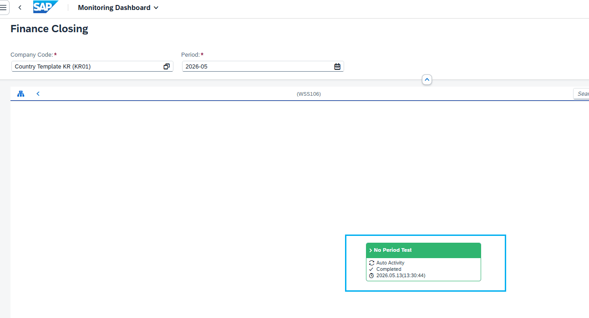
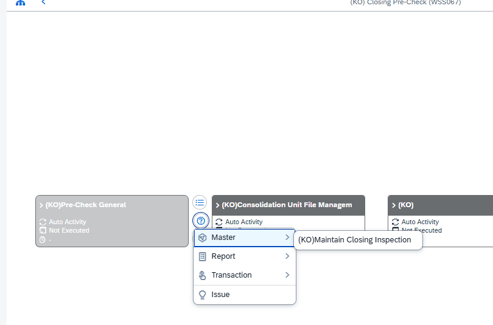
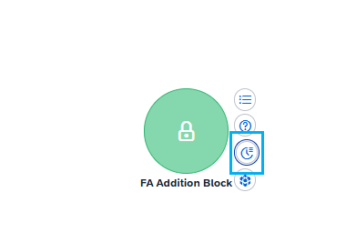
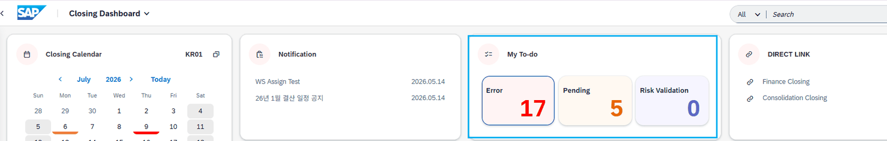

# 4. 호출 유형별 상세 동작

각 분기가 실제로 어떤 프로그램을 어떤 방식으로 실행하는지 정리합니다. 모든 호출은 AND RETURN 을 사용하여, 대상 화면 종료 후 제어가 호출 세션으로 되돌아옵니다.

## 4.1 Activity 직접 실행 — SUBMIT_PID

Fiori에서 Activity를 직접 클릭했을 때의 기본 경로입니다(③-e). Activity에 지정된 트랜잭션의 실행 프로그램을 찾아, 정의된 호출 방식(CALLTYP)에 따라 두 가지로 실행합니다.

| 항목 | 내용 |
|---|---|
| 대상 조회 | TSTC 에서 GS_PROC-TCODE의 실행 프로그램(PGMNA)·화면번호(DYPNO) 조회 |
| 조직·기간 전달 | ZCL_PAC_SAIL=>SET_EXEC_PARAM 으로 셀렉션 파라미터·BDCDATA 구성 |
| PAC 호출 표식 | EXPORT PS_PAC_INPUT_PARAM TO MEMORY ID ZPAC0_INPUT_PARAM (PAC_CALLED='X') |
| 실행 — 프로그램형 | CALLTYP = 'P' : SUBMIT (프로그램) WITH SELECTION-TABLE … AND RETURN |
| 실행 — 트랜잭션형 | 그 외(‘T’) : SET PARAMETER ID 세팅 후 CALL TRANSACTION 실행 |

[그림 4-1] SUBMIT_PID — 실행 프로그램 조회 및 SUBMIT/CALL TRANSACTION 처리 (시스템 소스)

> 보완 설명 — 프로그램형(SUBMIT)과 트랜잭션형(CALL TRANSACTION) 프로그램형(CALLTYP='P') : 대상 리포트를 SUBMIT 합니다. XSKIP이면 바로, 아니면 VIA SELECTION-SCREEN으로 실행합니다. 트랜잭션형(그 외) : RS_IMPORT_DYNPRO로 대상 화면의 입력 필드를 확인한 뒤, 존재하는 필드에 한해 SET PARAMETER ID(BUK·GSB·GJA·POPR·SPMON 등)로 값을 채우고 CALL TRANSACTION 합니다. BDCDATA가 구성된 경우에는 CTU_PARAMS 옵션과 함께 배치 방식으로 호출합니다.

## 4.2 Relative 실행 — CALL_RELATIVE

Fiori에서 Relative(연관 Activity) 실행 시의 경로입니다(①). P_RTYPE가 채워져 있으면 다른 분기를 평가하지 않고 네트워크 클래스의 메소드를 직접 호출합니다.

| 항목 | 내용 |
|---|---|
| 호출 | ZCL_PAC_NETGRAPH=>CALL_RELATIVE( … ) |
| 전달 인자 | IV_BUPAK·IV_BUKRS·IV_GSBER·IV_CUNIT·IV_GJAHR·IV_MONAT·IV_PID·IV_ITMSEQ·IV_TCODE |
| 트리거 | P_RTYPE (Relative 유형) 값 존재 |

[그림 4-2] Relative 분기 — ZCL_PAC_NETGRAPH=>CALL_RELATIVE 호출 (시스템 소스)

> ■ 시스템 확인 — Relative 대상 클래스 클래스 ZCL_PAC_NETGRAPH : 설명 “Process Automatic Channel - Network”. 메소드 CALL_RELATIVE 호출 확인됨.

## 4.3 결산일정 변경 — SUBMIT_SCHEDULE_CHANGE

Closing Schedule 화면에서 일정 변경 버튼을 눌렀을 때의 경로입니다(③-a). Activity 정의의 REPTY가 'C' 인 경우에 해당하며, PID로 연결된 일정 ID(SCHID)를 찾아 일정 변경 프로그램을 실행합니다.

| 항목 | 내용 |
|---|---|
| 트리거 | GS_PROC-REPTY = 'C' |
| 일정 ID 조회 | ZCL_PAC_CLOSING=>GET_SCHID_BY_PID (IV_BUPAK, IT_PID) → 일정 ID 목록 |
| 실행 | SUBMIT ZLPAC7170 WITH SELECTION-TABLE … AND RETURN |
| 전달 파라미터 | P_BUKRS·P_GSBER·P_CUNIT·P_GJAHR·P_MONAT + 조회된 S_SCHID(다건) |

[그림 4-3] 결산일정 변경 분기 — REPTY='C' 판정 후 SUBMIT_SCHEDULE_CHANGE (시스템 소스)

> ■ 시스템 확인 — 일정 변경 대상 프로그램 프로그램 ZLPAC7170 : 설명 “Change Closing Schedule”. SUBMIT 대상으로 확인됨.

## 4.4 To-Do 조회 — CALL_TODO_DISPLAY

Closing Dashboard에서 To-Do를 클릭했을 때의 경로입니다(②). P_TDTYPE 값에 따라 To-Do 조회 프로그램의 유형 범위(S_TDTYPE)를 구성하여 실행합니다.

| 항목 | 내용 |
|---|---|
| 트리거 | P_TDTYPE 값 존재 |
| 실행 | SUBMIT ZLPAC0600 WITH SELECTION-TABLE … AND RETURN |

P_TDTYPE 입력값은 다음과 같이 To-Do 조회 화면의 유형 범위로 확장되어 전달됩니다.

| P_TDTYPE 입력 | 확장되는 S_TDTYPE 범위 |
|---|---|
| E | E, R, CN, CS |
| M | M |
| CR | CR, CC |

[그림 4-4] To-Do 분기 — P_TDTYPE별 범위 구성 후 SUBMIT ZLPAC0600 (시스템 소스)

> ■ 시스템 확인 — To-Do 조회 대상 프로그램 프로그램 ZLPAC0600 : 설명 “Display To Do”. SUBMIT 대상으로 확인됨.

## 4.5 Category(CID) 기반 실행 — SUBMIT_CID

결산점검 Category(CID)로 진입하는 경로입니다(③-d). Category 유형(CTYPE)에 따라 대상 점검 트랜잭션을 결정하고, CID로 연결된 PID와 조직·기간을 넘겨 실행합니다.

| Category 유형(CTYPE) | 대상 트랜잭션 | 설명(시스템 등록값) |
|---|---|---|
| R | ZLPAC5100 | Financial Risk Validation Monitoring |
| C | ZLPAC5200 | Closing Inspection Monitoring |
| S | ZLPAC5300 | Closing Inspection by Simulation Run Monitoring |

> ■ 시스템 확인 — CID 마스터 및 대상 트랜잭션 테이블 ZTPAC_CIS_CID : 설명 “Closing Inspection Category Master” (CID→CTYPE 조회원). 대상 ZLPAC5100/5200/5300의 설명(등록값)은 위 표와 같이 확인됨.

## 4.6 직접 트랜잭션 호출 — CALL_DIRECT_TCODE

P_TCODE가 지정되고 P_PID가 비어 있는 경우의 경로입니다(③-c). 별도 파라미터 매핑 없이 지정된 트랜잭션을 그대로 호출합니다.

> FORM CALL_DIRECT_TCODE . CALL TRANSACTION P_TCODE. ENDFORM.

[코드 4-1] CALL_DIRECT_TCODE (시스템 소스)

## 4.7 레거시 URL 연계 — CALL_URL

Activity에 트랜잭션 대신 레거시 RFC/URL이 지정된 경우의 경로입니다(③-b). GUI 트랜잭션이 아니라 레거시 링크 연계 함수를 호출합니다.

| 항목 | 내용 |
|---|---|
| 트리거 | TCODE 없음 + (LEGACY_RFC 또는 LEGACY_URL) 존재 |
| 호출 | CALL FUNCTION 'ZFPAC_LEGACY_LINK' |
| 주요 인자 | IV_BUPAK·조직·기간·IV_PID, IV_CALLWEB='X', IV_TYPE='A' |

> ■ 시스템 확인 — 레거시 링크 함수 함수모듈 ZFPAC_LEGACY_LINK : 함수그룹 ZPAC270, 설명 “Link Legacy URL”. 확인됨.
