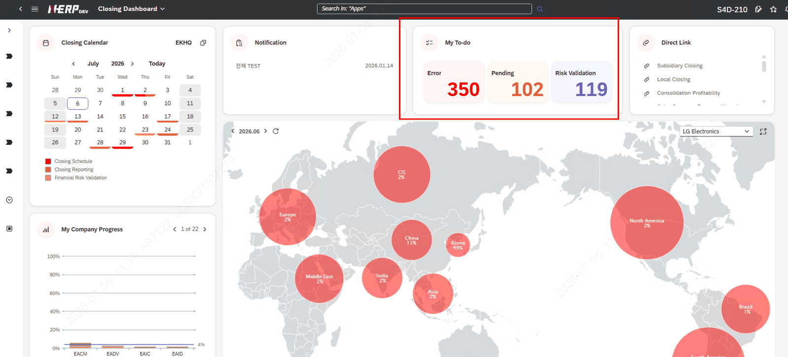
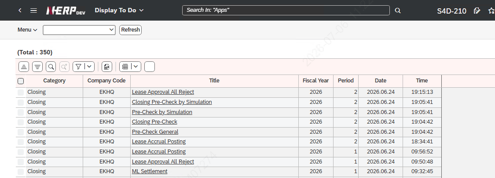
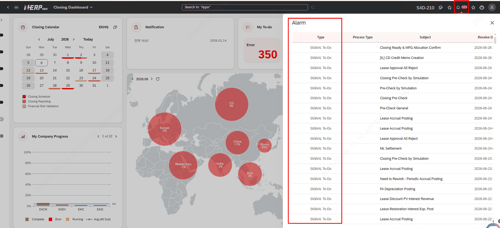
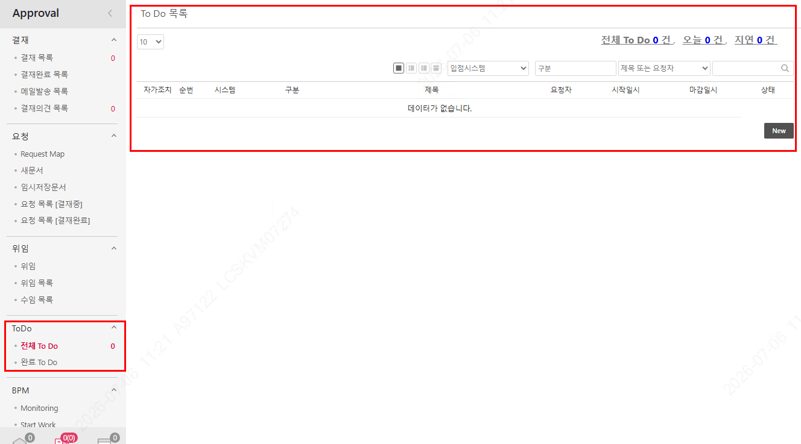
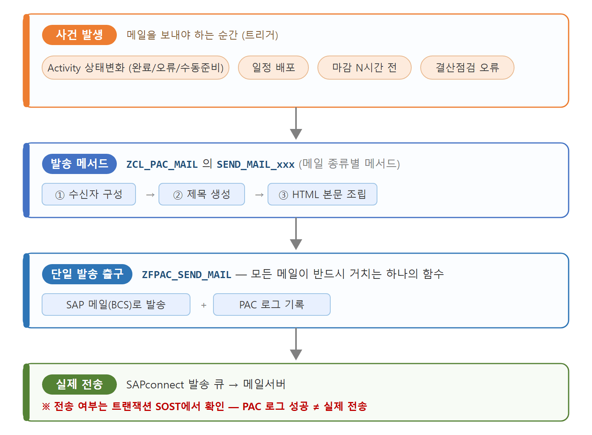

# 2. PAC 메일링 개념 잡기

Activity는 자동으로 실행되면서 상태(준비/실행/완료/오류 등)가 바뀝니다. 이렇게 상태가 바뀌거나, 결산 일정이 배포되거나, 마감이 임박할 때 담당자에게 자동으로 알림을 보내는 것이 바로 PAC 메일링입니다.

## 2.1 메일링이 쓰이는 곳 (한눈에)

PAC에서 메일은 크게 다음 상황에서 발생합니다.

| 발생 상황 | 메일 종류 | 발송 방식 |
|---|---|---|
| Activity가 완료됨 | 완료(Complete) 메일 | 상태 변경 시 자동 |
| Activity가 실패/경고 → 재작업 필요 | 에러(Error) = Rework 메일 | 상태 변경 시 자동 |
| Activity가 수동 처리 대기 상태가 됨 | 수동준비(Manual Ready) 메일 | 상태 변경 시 자동 |
| 결산 일정을 각 법인에 배포 | 배포(Distribution) 메일 | 운영자가 화면에서 발송 |
| 마감 N시간 전 | 마감 알람(Alarm) 메일 | 예약 배치로 자동 |
| 결산점검(CIS)에서 오류 발견 | CIS 컨트롤러/리뷰어 메일 | 점검 후처리에서 자동 |

## 2.2 알림 3채널 (메일 · To-Do · 메신저)

PAC는 같은 사건을 세 가지 채널로 알릴 수 있습니다. 본 매뉴얼은 메일을 중심으로 다루되, 함께 동작하는 To-Do/메신저는 참고용

- **메일(Email):** SAP가 직접 발송. 본 매뉴얼의 주 대상.
- **To-Do(할 일):** PAC 전용 테이블에 기록하고, Closing Dashboard포털 화면에 실시간으로 띄움.

**그림(Closing Dashboard Home의 My To-Do**

- **메신저(Messenger):** 현재는 수신 플래그(XMSGR_*)만 선택할 수 있도록 개발되어 있고, 실제 발송 기능은 구현되어 있지 않음. 향후 고객사에서 메신저 개발을 요청하면 인터페이스 관련 CSP 로직을 개발해 추가해야 함. (3.7절·8장 참고)
**특화– LG전자 (To-Do 관련)**

Closing Dashboard 홈 화면에 표시되는 My To-Do뿐 아니라, LG전자에서 사용하는 Signal To-Do와도 연계해 알림을 받습니다. 따라서 PAC의 To-Do 테이블과 Signal To-Do 테이블의 상태가 일치해야 하며, 이 불일치를 점검·동기화하기 위한 운영자용 프로그램이 별도로 제공됩니다.

**참고) To-Do 관련 Tcode**

- **ZLPAC0600** – Display To Do: 실제 Home 화면과 연계되는 To-Do 조회 화면
- **ZLPACCSP0020** – Signal Abnormal Monitoring: Signal과 CWF의 차이를 조회하고 동기화 수행
- **ZLPACTODOS** – To Do Abnormal Monitoring: CWF 상태와 실제 To-Do 발송 차이를 조회하고 동기화 수행
그림) LG전자 Signal To-Do 화면

그림) EP Todo 목록 화면

## 2.3 메일 전체 동작 흐름

PAC의 모든 메일은 본문을 만든 뒤, 마지막에 하나의 발송 함수(ZFPAC_SEND_MAIL)를 통해 나갑니다. 큰 그림은 다음과 같습니다.

> [ 사건 발생 ] · Activity 상태변화(완료/오류/수동준비) · 일정 배포 · 마감 N시간 전 · 결산점검 오류 │ ▼ [ 발송 메서드 ] ZCL_PAC_MAIL 의 SEND_MAIL_xxx (수신자 구성 → 제목 → HTML 본문) │ ▼ [ 단일 발송 출구 ] ZFPAC_SEND_MAIL → SAP 메일(BCS)로 발송 + 로그 기록 │ ▼ [ 실제 전송 ] SAPconnect 발송 큐 → 메일서버 (※ 전송 여부는 트랜잭션 SOST 에서 확인)

> [ 화면 캡처 필요 ] PAC 메일 동작 흐름을 도식화한 그림 또는 화이트보드 캡처. (위 텍스트 흐름도를 이미지로 대체하면 가독성이 좋아집니다.) 

## 2.4 꼭 알아야 할 3대 원리

1. **2단 수신제어:** ① 시스템에서 메일 종류를 켜고(ZLPACSYS) → ② 사용자별로 수신 체크(ZLPAC1000). ①이 꺼지면 ②에 체크 항목 자체가 보이지 않습니다.
2. **단일 발송 출구:** 어떤 메일이든 마지막에는 ZFPAC_SEND_MAIL 로 나갑니다. 발송 추적은 이 지점과 SOST 가 기준입니다.
3. **본문은 HTML 템플릿:** 메일 디자인/문구는 코드가 아니라 HTML 양식(ZLPAC_HTML)에서 관리합니다. 다만 '새 데이터'를 넣으려면 발송 프로그램(ABAP) 수정이 필요합니다. (6장)
