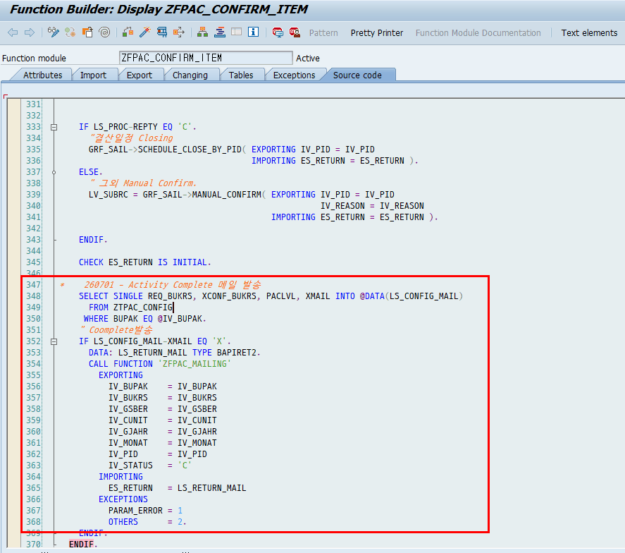

# 3. 메일 종류별 상세

각 메일이 언제 나가고, 누가 받고, 무엇이 담기는지 정리합니다. 수신 여부를 결정하는 플래그는 모두 테이블 ZTPAC_PROC_AUTH(사용자별 설정)에 있습니다.

## 3.1 완료(Complete) 메일

| 항목 | 내용 |
|---|---|
| 언제 | Activity가 정상 완료(상태 C)되었을 때 자동 발송 |
| 수신자 | ZTPAC_PROC_AUTH 에서 XMAIL_COM = 'X' 인 사용자에게 발송 |
| 본문 | 완료 로그 + Activity 경로 + PAC 화면 바로가기 링크 (LXI의 경우에는 해당 Activity의 참여자 리스트까지 발송됨) |
| 발송 함수 | ZFPAC_SEND_COMPLETE_MAIL → ZCL_PAC_MAIL=>SEND_MAIL_COMPLETE |
| 로그 | ZTPAC_MAIL_HIST (SENDTYPE='E') |

추가) Auto 로 수행되었을 때 Complete되어지는 것 뿐만 아니라, Manual Confirm 버튼을 클릭했을때에도 Complete 메일이 발송되어야 함.

ZFPAC_CONFIRM_ITEM 로직에 메일발송로직 추가. (테스트 방법은 8.1 참고)

## 3.2 에러(Error) 메일 = 재작업(Rework) 메일

PAC에는 WS서버에는 'Rework 전용' 메일 함수가 따로 없습니다. Activity가 실패(F)/경고(W)가 되어 사람이 다시 작업해야 하는 상황을 알리는 메일이 곧 '재작업 메일'이며, 이는 에러 메일과 동일합니다.

참고) LXI 서버는 에러메일과 Rework 메일을 펑션 분리해두엇음.

| 항목 | 내용 |
|---|---|
| 언제 | Activity가 실패/경고(상태 F 또는 W)로 끝났을 때 자동 발송 |
| 수신자 | ZTPAC_PROC_AUTH 에서 XMAIL_ERR = 'X' 인 사용자 |
| 본문 | 무엇이 왜 실패했는지 에러 로그 + Activity 경로 + 바로가기 링크 |
| 발송 함수 | ZFPAC_SEND_ERROR_MAIL → ZCL_PAC_MAIL=>SEND_MAIL_ERROR |
| 로그 | ZTPAC_MAIL_HIST (SENDTYPE='E') |

## 3.3 Manual Ready 메일

| 항목 | 내용 |
|---|---|
| 언제 | Activity가 Manual Ready(상태 M)로 진입했을 때 |
| 수신자 | ZTPAC_PROC_AUTH 에서 XMAIL_ERR = 'X' 인 사용자 (※아래 주의) |
| 본문 | '수동 처리 준비됨' 통보 (에러 로그는 포함하지 않음) |
| 발송 함수 | ZFPAC_SEND_MREADY_MAIL → ZCL_PAC_MAIL=>SEND_MAIL_MREADY |
| 로그 | ZTPAC_MAIL_HIST (SENDTYPE='E') |

## 3.4 배포(Distribution) 메일

ZLPAC7100에서 운영자가 결산 일정을 각 법인에 배포할 때, 화면에서 직접 '발송'을 눌러 보내는 메일입니다. 법인(BUKRS)별로 한 통씩 발송됩니다. – 결산 일정 운영자 매뉴얼쪽에서 추가 내용 확인 가능

| 항목 | 내용 |
|---|---|
| 언제 | 운영자가 배포메일 화면에서 발송할 때 (사람이 직접) |
| 진입 | 함수 ZFPAC_GET_MAIL_RECEIVER 가 배포메일 화면(SCREEN 100)을 띄움 |
| 수신자 | 화면 체크박스(결산점검 담당/워크플로우 담당/추가 수신자)로 선택 |
| 본문 | 법인·기간·일정표 + 코멘트 + 첨부(GOS) 가능 |
| 발송 함수 | ZCL_PAC_MAIL=>SEND_MAIL_DIST |
| 로그 | ZTPAC_MAIL_SCH_D (SENDTYPE='D') |

## 3.5 마감 알람(Alarm) 메일

ZLPAC7200 프로그램에서 세팅할수 있고, 배포된 일정이 실제 마감되기 N시간 전에 자동으로 보내는 알림입니다. '1분마다 도는 배치'가 아니라, '마감 N시간 전' 정확한 시각에 1회 실행되도록 예약된 배치(ZLPAC7210)가 보냅니다.

| 항목 | 내용 |
|---|---|
| 언제 | 마감 계획시각 − N시간 (예약된 배치가 자동 실행) |
| N시간 위치 | 테이블 ZTPAC_SCH_ALARM 의 SCH_ALARM 필드 (활성은 ASTATUS='A') |
| 예약 생성 | 운영자가 ZLPAC7200(알람 설정) 저장 시 → ZFPAC_CREATE_ALARM_BATCH |
| 발송 리포트 | ZLPAC7210 → ZCL_PAC_MAIL=>SEND_MAIL_ALARM |
| 로그 | ZTPAC_MAIL_SCH_D (SENDTYPE='A') |

## 3.6 결산점검(CIS) 메일 — 컨트롤러 / 리뷰어

CIS(Closing Inspection, 결산점검)는 결산 데이터에 대해 미리 정의된 시나리오(SNID)를 실행해 재무 리스크를 검증하는 기능입니다. 오류(상태 F/S)가 나면 두 종류의 메일을 보냅니다.

| 구분 | Controller(관리자) 메일 | Reviewer(검토자) 메일 |
|---|---|---|
| 성격 | 전체 N건 중 M건 오류 요약 | 내 담당 시나리오 오류 검토 요청 |
| 수신자 | ZTPAC_PROC_AUTH 의 XMAIL_ERR='X' | ZTPAC_CIS_USER 의 시나리오 담당자 |
| 발송 함수 | ZFPAC_SEND_CIS_CONT | ZFPAC_SEND_CIS_MAIL |
| 로그 SENDTYPE | C | R (ZTPAC_CIS_MAIL) |

> [ 주의 / 확인 필요 ] CIS 메일은 카테고리 설정 ZTPAC_CIS_CID 의 XMAIL='X' 가 켜져 있어야 발송됩니다. 또한 발송을 호출하는 시점은 설정 테이블 ZTPACEXIT 에 등록된 함수로 동작하므로, 정확한 트리거는 운영 환경의 ZTPACEXIT 설정에서 확인이 필요합니다.

## 3.7 To-Do / 메신저 (보조 채널)

- **To-Do:** Activity가 에러(E)/재작업(R)이면 생성(Open), 정상 완료되면 닫힘(Close). 저장 테이블은 ZTPAC_TODO_STU / ZTPAC_TODO_HIST. 수신자는 XTODO_ERR / XTODO_MRD 로 결정. 포털 실시간 갱신은 ABAP Push Channel(APC)로 처리. 엘지(LXI)에서는 PAC Closing Dashboard 홈 화면의 To-Do 기능을 사용하며, 추가로 외부 Signal To-Do와 인터페이스해 알림도 함께 수신합니다.
- **메신저:** PAC ABAP에는 메신저 발송관련 기능 구현되어있지 않음. 현재는 수신 플래그(XMSGR_ERR/XMSGR_MRD)만 선택할 수 있도록 개발되어 있고, 실제 발송·인터페이스 기능은 구현되어 있지 않습니다. 향후 고객사에서 메신저 개발을 요청하면 인터페이스 관련 CSP 로직을 개발해 추가해야 합니다.
