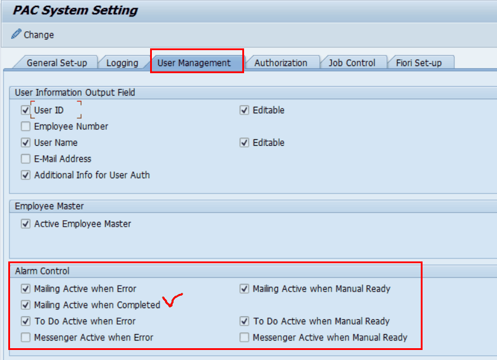
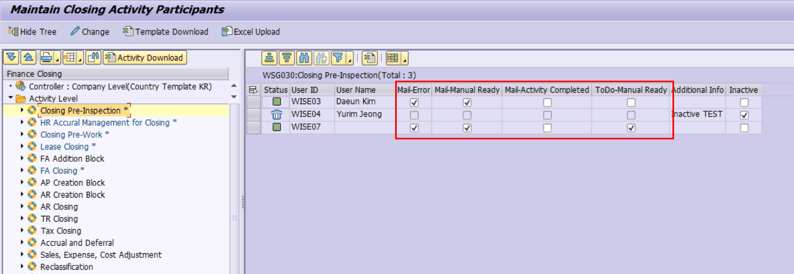
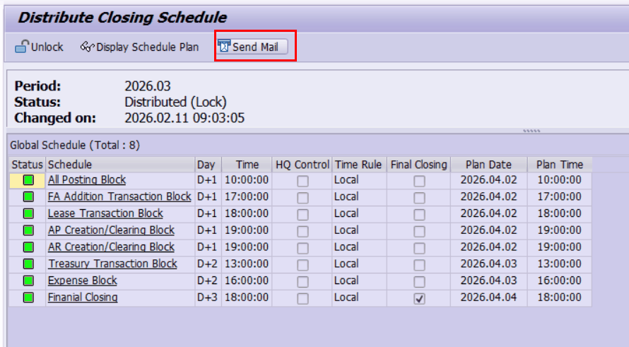
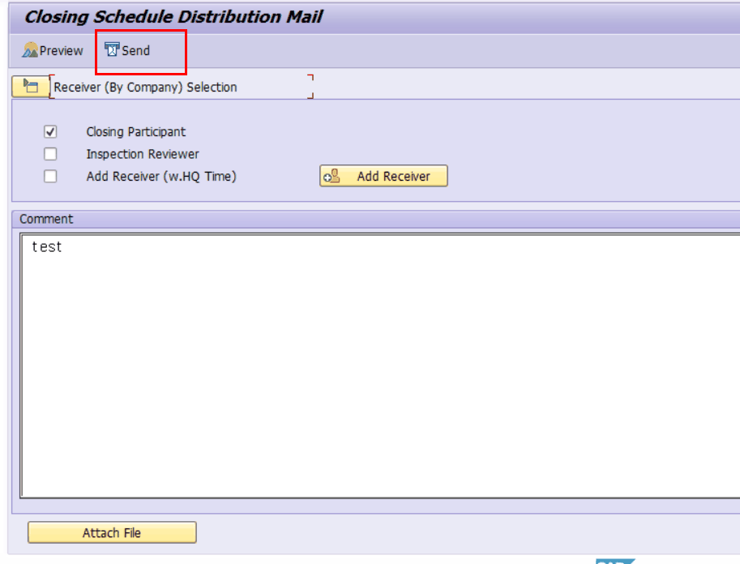
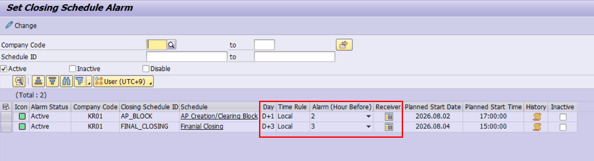
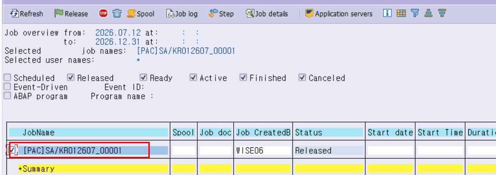
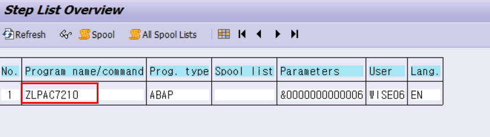
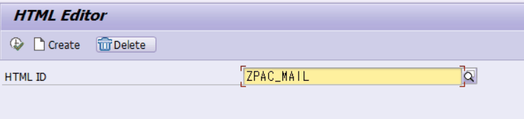
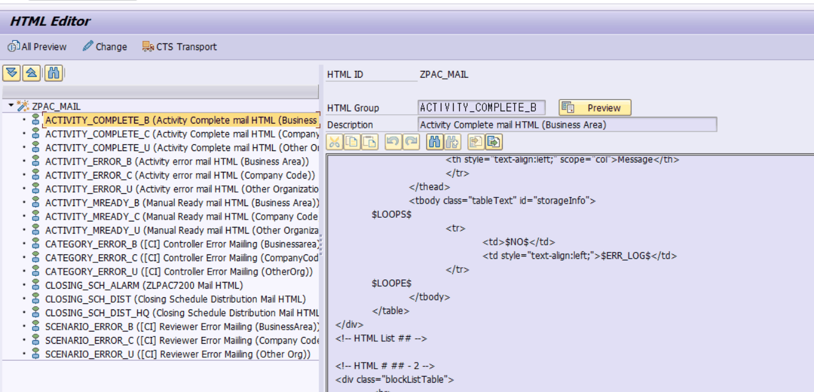
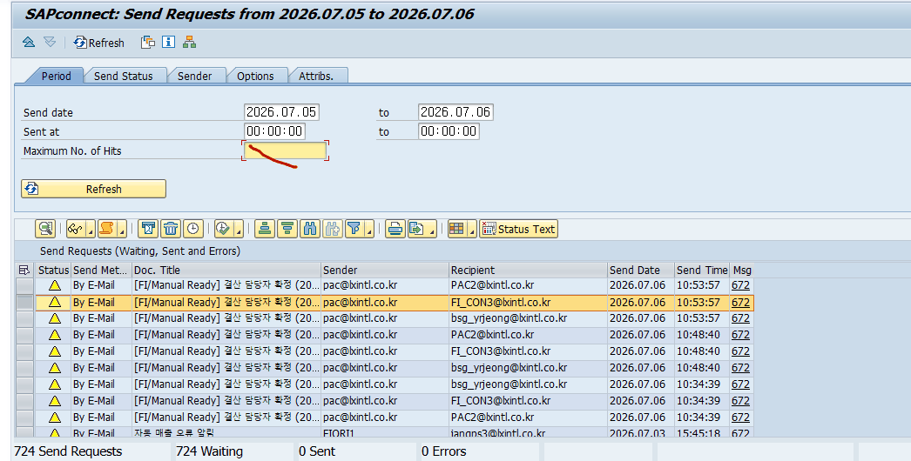

# 5. 운영자 업무 절차 (단계별)

실제 업무를 단계별로 따라 합니다. 쓰기 작업(등록/발송/저장)은 가능하면 테스트 시스템에서 먼저 연습하세요.

## 5.1 메일 종류 시스템 ON/OFF — ZLPACSYS

어떤 메일 종류를 회사 전체에서 사용할지 켜고 끄는 마스터 설정입니다. 여기서 끄면 ZLPAC1000 화면에 해당 수신 체크박스 자체가 보이지 않습니다.

1. 프로그램 ZLPACSYS 를 실행합니다. (변경은 관리자 권한 필요)
2. 참여자 등록을 통해서 메일 수신할 항목을 활성화합니다. XMAIL_ERR(에러), XMAIL_MRD(수동준비), XMAIL_COM(완료).
3. 저장합니다. 설정은 테이블 ZTPACSYS(클라이언트당 1행)에 저장됩니다.

> [ 화면 캡처 필요 ] ZLPACSYS 설정 화면에서 User management 탭-> Alarm Control 항목에서 추가. 
아래 캡쳐는 LXI 기준임. (Mailing Active when completed 만 LXI 특화로 추가한 항목 ZTPACSYS-XMAIL_COM 필드에 저장됨.) 

## 5.2 Business Package별 Mailing 서비스 활성화 (ZLPAC0010)

ZLPAC0010(Business Package Config)에서 Business Package별로 Mailing 서비스를 활성화해야 합니다.

## 5.3 사용자별 수신자 등록 — ZLPAC1000

특정 사용자가 특정 Activity의 메일을 받도록 등록합니다. 저장 테이블은 ZTPAC_PROC_AUTH 입니다.

1. 트랜잭션 ZLPAC1000 실행 → 비즈니스 패키지/조직 선택 → 변경 모드 진입.
2. 좌측 트리에서 메일을 보낼 Activity(PID)를 더블클릭하면, 우측 ALV에 참여자 목록이 나타납니다.
3. 행을 추가하고 사용자 ID(또는 사번/이메일)를 입력하면 이름·이메일이 사용자 마스터에서 자동으로 채워집니다.
4. 받을 메일 종류 체크박스를 켭니다: XMAIL_ERR(에러), XMAIL_MRD(수동준비), XMAIL_COM(완료).
5. 저장합니다.

> [ 화면 캡처 필요 ] ZLPAC1000 좌측 트리 + 우측 참여자 ALV(수신 체크박스 XMAIL_* 컬럼이 보이는 상태)를 캡처. 

> [ 주의 ] 이메일(SMTP_ADDR)이 비어 있으면 플래그가 켜져 있어도 발송 대상에서 자동 제외됩니다. 사용자 마스터에 이메일이 등록되어 있는지 먼저 확인하세요.

## 5.4 결산 스케줄 배포 메일 발송

결산 일정을 각 법인에 배포 안내하는 메일입니다.

1. ZLPAC7100에서 배포단계까지 와서, 배포메일 화면(함수 ZFPAC_GET_MAIL_RECEIVER로 진입)에서 대상 연도/월을 확인합니다.
2. 수신자 소스를 체크합니다: 결산점검 담당 / 워크플로우 담당 / 추가 수신자(ZTPAC_MAIL_ADD).
3. 코멘트(하단 안내문)와 첨부파일을 준비합니다. (당월 설정이 없으면 직전월 설정이 자동 복사됩니다)
4. 미리보기(PRE_100)로 본문을 확인합니다. (이 단계는 실제 발송하지 않습니다)
5. 발송(SEND_100)을 누르면 법인별로 한 통씩 발송되고, 로그는 ZTPAC_MAIL_SCH_D에 남습니다.

> [ 화면 캡처 필요 ] 배포메일 화면(수신자 체크박스/코멘트/미리보기 버튼)과 미리보기 결과 본문을 각각 캡처. ZLPAC7100  ZFPAC_GET_MAIL_RECEIVER RECEIVER 선택, COMMENT 입력 및 SEND 버튼 클릭 통해 결산일정 배포시점에 메일 발송함. 

## 5.5 마감 알람 설정 — ZLPAC7200

마감 N시간 전 알람 메일이 자동으로 나가도록 예약합니다. 저장하는 순간 배치 예약이 생성됩니다.

1. 트랜잭션 ZLPAC7200 실행 → 대상 조직/스케줄 선택.
2. 알람 시간(N)과 수신자를 등록합니다. (N은 테이블 ZTPAC_SCH_ALARM의 SCH_ALARM, 활성 상태는 ASTATUS='A')
3. 저장하면 ZFPAC_CREATE_ALARM_BATCH가 호출되어, '마감 N시간 전' 시각에 ZLPAC7210을 실행하는 배치 잡이 예약됩니다.
4. SM37에서 예약된 알람 잡 상태를 확인합니다.

> [ 화면 캡처 필요 ] ZLPAC7200 알람 설정 화면(알람 시간/수신자 입력)과 SM37의 예약 잡 목록을 캡처. ZLPAC7200 
> 
> 

## 5.6 HTML 메일 양식 등록/수정 — ZLPAC_HTML

메일 본문 디자인/문구를 관리합니다. 저장 시 양식 이름은 ZTPAC_HTML, 본문은 ZTPAC_HTML_BODY에 들어갑니다.

1. 트랜잭션 ZLPAC_HTML 실행. (편집은 ZTPACSYS의 HTML_EDIT='E'일 때 가능)
2. HTML ID(양식 이름)를 생성하고, 그 아래 HTML Group(블록)을 추가합니다.
3. 본문 에디터에 HTML을 작성합니다. 값이 채워질 자리는 $필드명$ 형식으로, 표(여러 줄)는 loop 마커로 감쌉니다. (작성 원리는 6장)
4. 미리보기(Preview)로 렌더 모양을 확인하고 저장합니다.

> [ 화면 캡처 필요 ] ZLPAC_HTML 편집 화면(좌측 트리 + 우측 본문 에디터, $변수$가 보이는 상태)과 Preview 결과를 캡처.  

## 5.7 발송 결과 확인 — SOST + PAC 로그

'메일이 실제로 나갔는지'는 반드시 SOST에서 확인합니다. PAC 로그는 '발송 요청을 만들었다'까지를 의미합니다.

1. PAC 로그 조회(SE16N): Activity 계열은 ZTPAC_MAIL_HIST, 배포/알람은 ZTPAC_MAIL_SCH_D, CIS는 ZTPAC_CIS_MAIL. 해당 행의 LOGKEY 확인.
2. LOGKEY로 ZTPAC_MAIL_LOG 조회 → 발신/수신/제목/본문/상태 확인.
3. SOST 실행 → 기간/수신자/제목으로 검색 → 실제 전송 상태(전송완료/대기/오류) 확인. 대기·오류 건은 재전송 가능.
위에서 조회하는 로그 테이블 4종의 역할 구분 — 앞의 3종은 메일 종류별로 나뉜 **발송 이력**이고, ZTPAC_MAIL_LOG는 모든 메일의 실제 내용이 담기는 **공통 상세 로그**입니다. 이력의 LOGKEY로 상세가 연결됩니다.

| 테이블 | 성격 | 대상 메일 (SENDTYPE) | 주요 내용 / 역할 |
|---|---|---|---|
| ZTPAC_MAIL_HIST | 발송 이력 | Activity 계열 — 완료/에러(=Rework)/수동준비 ('E' 공용) | Activity 메일의 발송 건 단위 기록. STATUS(S/E) + LOGKEY 보유 |
| ZTPAC_MAIL_SCH_D | 발송 이력 | 스케줄 계열 — 배포('D') / 마감 알람('A') | 법인(BUKRS)별 발송 건 기록. STATUS + LOGKEY 보유 |
| ZTPAC_CIS_MAIL | 발송 이력 | CIS 결산점검 — Controller('C') / Reviewer('R') | 점검 단위(CID/SNID)별 발송 기록. STATUS + LOGKEY 보유 |
| ZTPAC_MAIL_LOG | 공통 상세 로그 | 모든 메일 (키 = LOGKEY) | 발신/수신/CC/BCC 주소, 제목, 본문, 첨부, 전송상태·오류사유. ZFPAC_SEND_MAIL이 메일 1통마다 기록 |

**즉 "어떤 메일이 나갔나"는 종류에 맞는 이력 테이블에서, "실제로 누구에게 무엇을 보냈나"는 ZTPAC_MAIL_LOG에서 확인합니다.** (실제 SMTP 전송 여부는 SOST 기준)

> [ 화면 캡처 필요 ] SOST 발송 큐 목록(상태 컬럼이 보이는 화면)과 오류 건 상세를 캡처. 

> [ 참고 ] PAC 로그가 성공(STATUS='S')인데 메일이 안 왔다는 문의가 오면, 1순위 점검은 항상 SOST의 전송 상태입니다.

## 5.8 직접 해보기 실습 (🟢 조회 / 🟡 쓰기)

아래 실습은 직원이 SAP GUI에서 직접 따라 하며 익히는 용도입니다. (클로드/AI가 대신 실행하지 않습니다 — 이 문서는 따라 할 절차서입니다.) 각 실습의 안전등급을 지키세요.

| 등급 | 의미 |
|---|---|
| 🟢 조회 | 보기만 하므로 운영 시스템에서도 가능 |
| 🟡 쓰기 | 등록·발송·저장 등 변경 작업 — 연습은 반드시 테스트 시스템에서, 운영(PRD)에서는 하지 말 것 |

**실습 1 — 수신자 설정 조회 🟢**

1. SE16N → 테이블 ZTPAC_PROC_AUTH 입력.
2. USRID(또는 EMPNO)로 대상 사용자 조회.
3. XMAIL_ERR / XMAIL_MRD / XMAIL_COM(수신 플래그)과 SMTP_ADDR(이메일) 확인. (이메일이 비면 발송 제외)
**실습 2 — 발송 이력 → 실제 전송 추적 🟢**

1. SE16N → ZTPAC_MAIL_HIST(Activity) / ZTPAC_MAIL_SCH_D(배포·알람) / ZTPAC_CIS_MAIL(CIS)에서 발송 기록의 LOGKEY 확인.
2. ZTPAC_MAIL_LOG에서 같은 LOGKEY로 발신/수신/제목/상태 확인.
3. SOST에서 실제 전송 상태(전송완료/대기/오류) 확인. (PAC 로그 성공 ≠ 실제 전송)
**실습 3 — HTML 양식 열어 보기·미리보기 🟢**

1. ZLPAC_HTML 실행 → 서치헬프로 등록된 HTML ID 확인.
2. 양식을 열어 $필드명$(단건)과 loop 마커(여러 건) 구조를 눈으로 확인.
3. Preview로 렌더 모양 확인. (수정·저장은 🟡)
**실습 4 — 수신자 등록 🟡 (테스트 시스템)**

1. ZLPACSYS에서 해당 메일 종류 토글(XMAIL_ERR 등)이 켜져 있는지 확인.
2. ZLPAC1000 변경 모드 → 좌측 트리에서 Activity(PID) 더블클릭.
3. 우측 ALV에 사용자 추가(이름·이메일 자동 채움) → 받을 메일 체크박스 ON → 저장.
4. SE16N으로 ZTPAC_PROC_AUTH에 저장 결과 확인.
**실습 5 — 마감 알람 설정·예약 확인 🟡/🟢**

1. SE16N → ZTPAC_SCH_ALARM에서 대상 스케줄의 SCH_ALARM(N시간)·ASTATUS('A') 확인. 🟢
2. ZLPAC7200에서 알람시간·수신자 등록·저장(테스트). 🟡
3. SM37에서 예약된 알람 잡(ZLPAC7210) 상태 확인. 🟢
각 메일 종류를 실제로 발송시켜 케이스별로 확인하는 방법은 8.1(케이스별 메일링 테스트 방법)을 참고하세요.

> [ 디버깅 포인트 ] 실습 중 값이 의심되면 7.2 디버깅 포인트 표를 참고해 중단점을 건다. 백그라운드(배치) 발송은 외부 중단점(External Breakpoint) + SM37/ST22로 확인.
