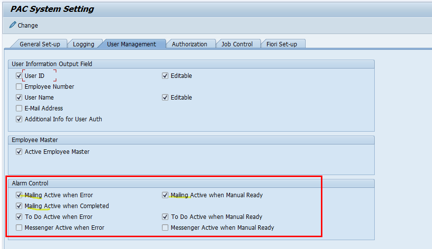
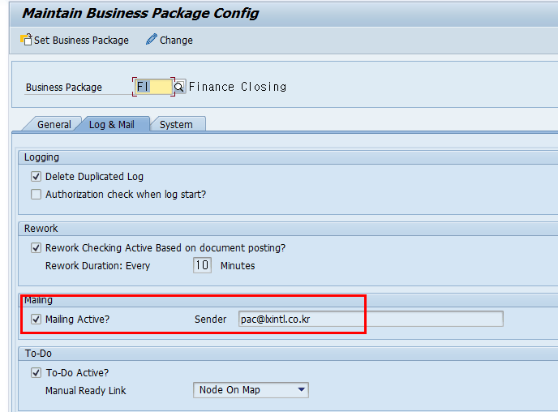
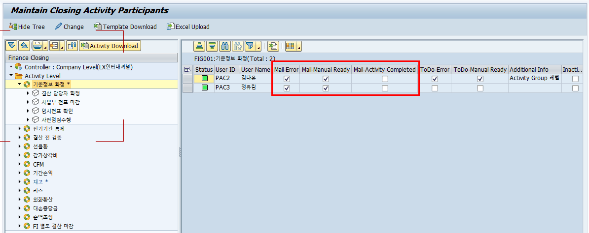
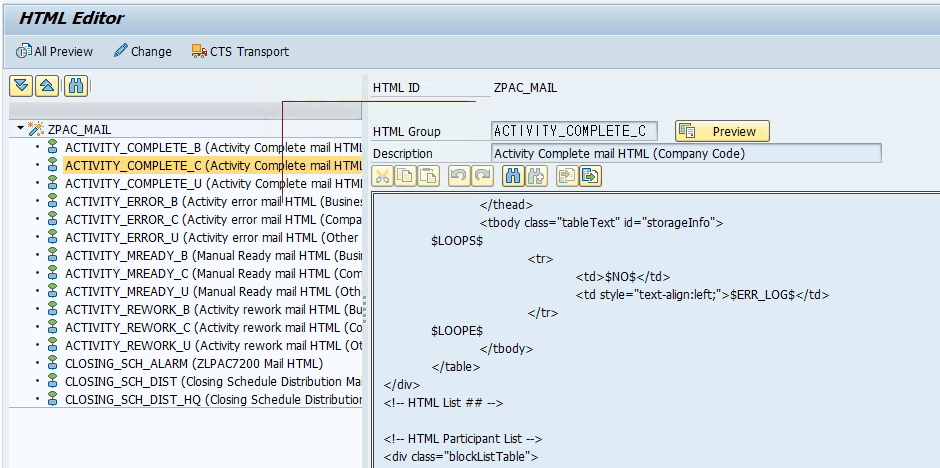
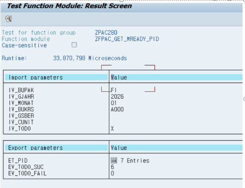
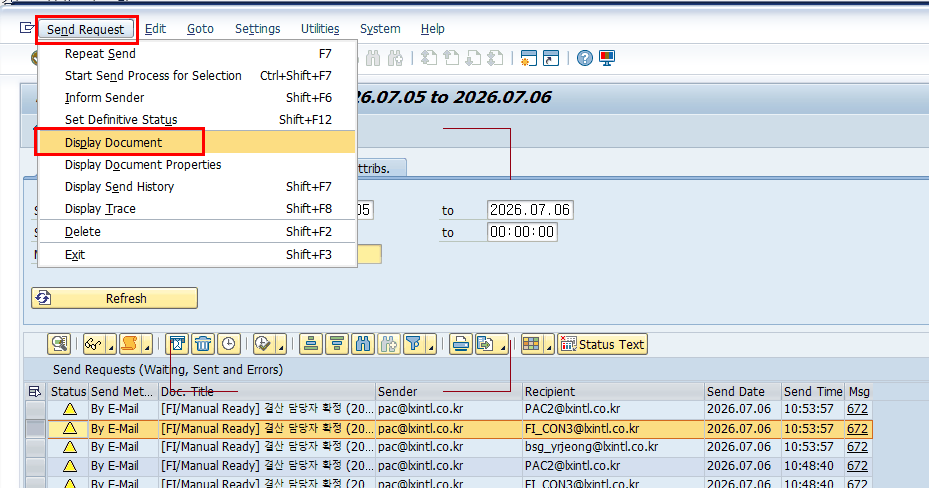
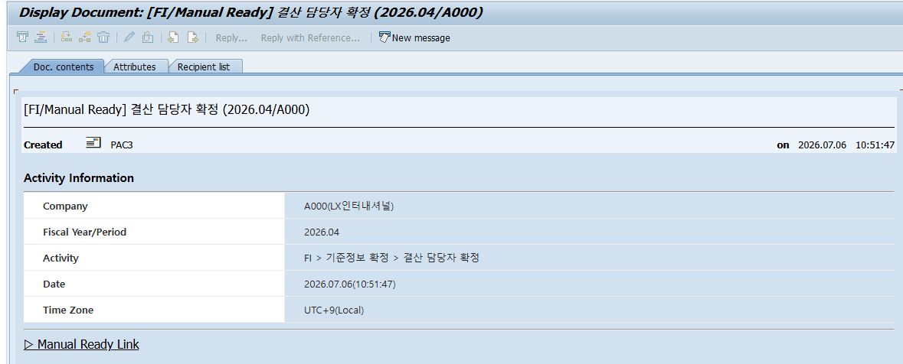
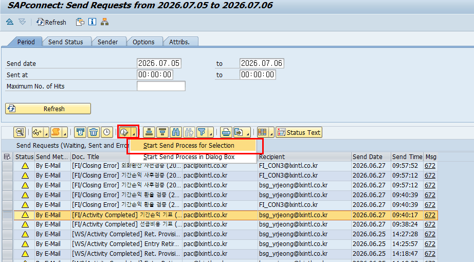
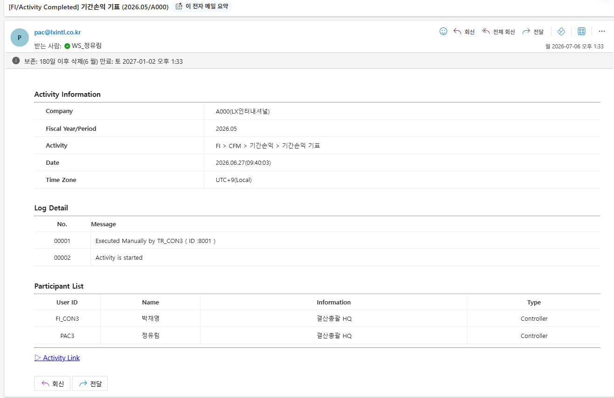

# 8. 개발 후 검증 절차

메일링 관련 개발·수정 사항을 운영에 반영한 뒤에는 아래 순서로 검증합니다. 설정 → 발송 → 수신 → 보조 채널 순서로 확인하면 누락 없이 점검할 수 있습니다.

## 8.1 케이스별 메일링 테스트 방법

각 메일이 실제로 발송되는지 케이스별로 직접 트리거해 확인하는 방법입니다. 모든 케이스는 발송 후 5.7(SOST + PAC 로그)에서 실제 전송을 확인합니다. 발송·쓰기가 포함되므로 테스트 시스템에서 수행하세요.

| 케이스 | 트리거 방법 | 관련 오브젝트 | 확인 포인트 |
|---|---|---|---|
| 수동준비(Mready) | ZLPAC7191(Rework All Closing Check)에서 ZFPAC_GET_MREADY_PID 펑션이 수행되며 Todo·이메일이 함께 발송됩니다. 펑션을 단독 수행해 테스트합니다. | ZLPAC7191 / ZFPAC_GET_MREADY_PID / SEND_MAIL_MREADY | Todo 발송 이력이 있으면 메일이 나가지 않습니다. 다시 보내려면 Todo 테이블 행을 지우고 펑션을 재수행하세요. (EV_TODO_SUC = 발송 성공 건수) |
| 완료(Complete) | Auto 수행으로 상태가 C에 도달하거나, Manual Confirm(ZFPAC_CONFIRM_ITEM) 시 발송됩니다. 실제 MAP에서 흘려보고 수신을 확인합니다. | ZFPAC_CONFIRM_ITEM / SEND_MAIL_COMPLETE | Manual Confirm에도 발송되도록 ZFPAC_CONFIRM_ITEM에 로직이 추가되어 있습니다. (3.1 참고) |
| 마감 알람(Alarm) | ZLPAC7200에서 알람 받을 시각·수신자를 저장하면 CREATE_MAIL_BATCH → ZFPAC_CREATE_ALARM_BATCH가 ZLPAC7210 배치잡을 예약하고, 예약 시각에 ZLPAC7210이 실행되며 SEND_MAIL_ALARM이 발송합니다. | ZLPAC7200 / ZFPAC_CREATE_ALARM_BATCH / ZLPAC7210 / SEND_MAIL_ALARM | 저장한 알람 시각에 메일이 오는지 확인. 예약 잡 상태는 SM37에서 확인합니다. |
| 일정 배포(Distribution) | ZLPAC7100에서 배포를 직접 수행하고, ZFPAC_GET_MAIL_RECEIVER로 지정된 Receiver를 조회한 뒤 SEND 버튼을 누르면 SEND_MAIL_DIST로 발송됩니다. | ZLPAC7100 / ZFPAC_GET_MAIL_RECEIVER / SEND_MAIL_DIST | 법인(BUKRS)별로 한 통씩 발송되므로 대상 법인 수신을 확인합니다. |
| 에러(=Rework) | Activity를 실패/경고(F/W) 상태로 유도하면 UPDATE_PAC_STATUS → ZFPAC_MAILING → SEND_MAIL_ERROR로 발송됩니다. (LXI는 Rework를 SEND_MAIL_REWORK로 별도 발송 — 10장 참고) | UPDATE_PAC_STATUS / ZFPAC_SEND_ERROR_MAIL | 에러 로그가 곧 본문이므로 로그(IT_LOG)가 있어야 발송됩니다. (4.2 참고) |

> [ 참고 — 발송 후 확인 ] 발송 후에는 반드시 5.7의 SOST에서 실제 전송 상태를 확인하세요. 특정 메일을 즉시 전송해 보려면 SOST의 Start Send Process for Selection 버튼을 사용합니다. 백그라운드(배치) 발송 디버깅은 외부 중단점(External Breakpoint) + SM37/ST22로 확인합니다. (증상별 중단점 위치는 7.2 참고)

## 8.2 개발 후 검증 체크리스트

| 순서 | 확인 항목 | 트랜잭션 / 도구 | 확인 내용 |
|---|---|---|---|
| 1 | 시스템 설정 | ZLPACSYS | 해당 메일 종류(완료·에러·알람 등)의 발송 설정이 ON인지 확인 |
| 2 | 서비스 활성화 | ZLPAC0010 | Business Package별 Mailing 서비스 활성 여부 확인 |
| 3 | 수신자 등록 | ZLPAC1000 | 대상 사용자의 수신 플래그와 이메일 주소 확인(ZTPAC_PROC_AUTH) |
| 4 | HTML 양식 | ZLPAC_HTML | 메일 양식 존재 여부와 $필드명$ 치환 자리 확인 (PACLVL별 양식이 나뉘어 있음) |
| 5 | 테스트 발송 | 대상 시나리오 실행 | 완료·에러·알람 등 실제 트리거를 발생시켜 메일 발송 유도 ZCL_PAC=>UPDATE_PAC_STATUS 에서 상태별 메일 발송 로직을 타게됨. Manual Ready 는 ZFPAC_SEND_MREADY_MAIL 로 발송 테스트한다. |
| 6 | PAC 로그 | SE16N | HIST / SCH_D / CIS_MAIL에 발송 이력이 기록되고 STATUS=S인지 확인 |
| 7 | 발송 상태 | SOST | 대기·오류·완료 상태 확인. 대기가 지속되면 발송 잡(RSCONN01) 가동 확인 |
| 8 | 수신 확인 | 메일함 | 실제 수신 여부와 본문 치환값이 올바르게 채워졌는지 확인 |
| 9 | To-Do 동기화 | ZLPAC0600 / ZLPACCSP0020 / ZLPACTODOS | Home To-Do 표시 확인, 시그널·CWF·To-Do 간 차이 조회 및 동기화 |

검증 중 문제가 발견되면 7장(트러블슈팅 & 디버깅 가이드)의 케이스별 대응과 빠른 점검 흐름을 참고하세요.

참고) 순서별 캡쳐

1

2

3.

4

5. 참고 - manual ready(ZFPAC_GET_MREADY_PID) 발송 펑션의 경우 zlpac7191(Rework All Closing Check)을 통해서 수행되는 펑션임. Zlpac7191은 배포시점에 자동으로 몇분에 한번씩 돌도록 생성되면서 Rework 감지, Manual Ready 를 발송한다.

ZFPAC_GET_MREADY_PID에서는 Todo 랑 Mail 같이 보내는 구조인데, todo 발송이력 있으면 메일 안보내지게끔 되어있음.

메일 다시보내고 싶으면 todo 테이블 지우고 이 펑션 실행시켜서 발송시킨다

Ev_todo_suc – 발송 성공건수

7발송 상태 확인 – sost

상단의 send request – Display document 로 이동해서 상세 발송 본문 확인

특정 메일을 실제로 발송시켜보고싶은경우 아래 start send process for selection 버튼 클릭

실제 메일 발송 내역 확인

