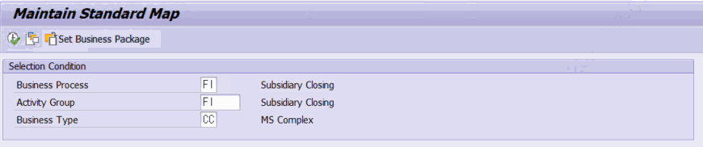
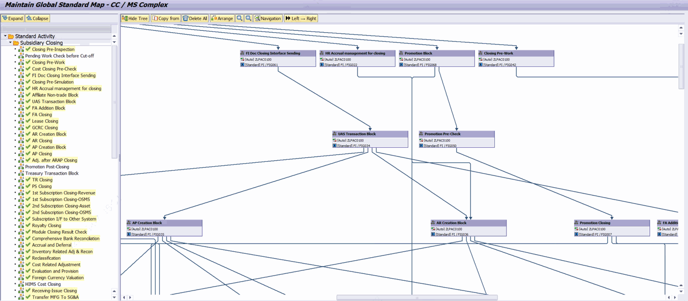

# 3. 표준 모델링 — ZLPAC0030 (Standard Modeling)

프로그램 ZLPAC0030 (표준 설명: Maintain Standard Map)은 조직과 무관한 '표준 프로세스 맵'을 정의·유지보수하는 프로그램입니다. Business Type 단위로 표준 모델을 만들어 두면, 이후 조직 모델링(4장)의 기준이 됩니다.

## 3.1 선택 화면 입력 항목

| 파라미터 | 항목 | 필수 | 설명 |
|---|---|---|---|
| PA_BUPAK | Business Package | 필수 | Memory ID ZBUPAK. 매치코드 ZHPAC_BUPAK. |
| PA_PCSGP | Activity Group | 필수 | 액티비티 그룹. 매치코드 ZHPAC_PCSGPALL_LIST. |
| PA_BUSTY | Business Type | 필수 | 비즈니스 유형. 매치코드 ZHPAC_BUSTY. 미지정 시 메시지(E091). |

화면 하단의 기능키(FUNCTION KEY 1, 'Set Business Package')를 누르면 ZFPAC_SET_BUPAK 함수를 통해 다른 Business Package로 전환할 수 있습니다.

## 3.2 실행 시 주요 동작 순서

1. Web GUI 여부 검사 → Web GUI면 중단(S112).
2. 필수 값 검사: Activity Group(S197)·Business Type(S091) 미입력 시 중단.
3. GPID 조회: ZCL_PAC=>SELECT_GPID_FROM_BUPAK 로 해당 Business Package의 Global Package ID를 조회.
4. 잠금 검사(CHECK_LOCK) → 3.4 참조.
5. 모델 객체 생성(CREATE_OBJ) 후 화면 0100 호출 → 네트워크 그래프 표시.

## 3.3 화면 제목과 저장 대상 (PACLVL='C' 고정)

표준 모델링은 조직 개념이 없으므로 모델 객체 생성 시 PACLVL='C' 로 고정하여 그래프를 엽니다. 화면 제목은 Maintain Standard Map - <BUSTY> / <유형명> 형태로 표시됩니다.

## 3.4 글로벌 표준 맵으로의 자동 전환

표준 모델링은 조건이 맞으면 자동으로 '글로벌 표준 맵'으로 전환됩니다. 소스(CREATE_OBJ)에서 확인된 전환 조건은 다음과 같습니다.

- Activity Group이 Business Package와 같고(PA_PCSGP EQ PA_BUPAK),
- 해당 Business Package에 GPID가 존재하며,
- Business Type의 레벨(ZTPAC_BUSTY-BLEVEL)이 'C' 인 경우
→ 위 세 조건을 모두 만족하면 글로벌 모드 플래그(GV_GPID_FLAG='X')가 켜지고, 조회 모드가 아닐 때 안내 메시지(S429, "Converted to Business Package Modeling")가 표시되며, 제목이 Maintain Global Standard Map 으로 바뀝니다.

> 보완 설명 — 표준 모델링의 잠금 키 잠금 키는 상황에 따라 달라집니다. 위 글로벌 전환 조건(PCSGP=BUPAK & GPID 존재)일 때는 ZLPAC0031 + GPID + BUSTY 를, 그 외 일반 표준 모델링일 때는 ZLPAC0030 + BUPAK + PCSGP + BUSTY 를 키로 사용합니다. 즉 같은 대상을 ZLPAC0030(전환)과 ZLPAC0031(직접) 어느 쪽으로 열어도 동일 잠금 키가 적용되어 두 사람이 동시에 편집하는 것을 방지합니다.
