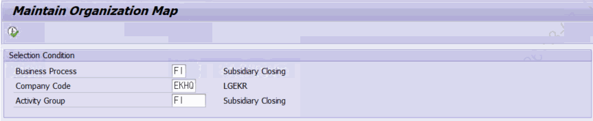
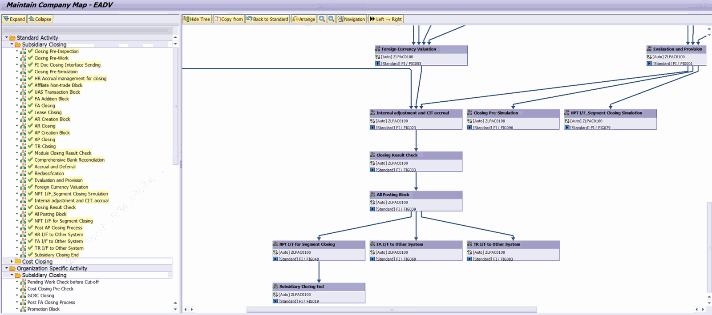

# 4. 조직 모델링 — ZLPAC0040 (Organization Modeling)

프로그램 ZLPAC0040 (표준 설명: Maintain Organization Map)은 특정 조직(회사코드·사업영역·결산단위)에 실제로 적용되는 프로세스 맵을 정의·유지보수합니다. 표준 모델링(3장)이 '기준'이라면, 조직 모델링은 조직별로 실제 수행되는 '실물' 모델입니다.

## 4.1 선택 화면 입력 항목

| 파라미터 | 항목 | 설명 |
|---|---|---|
| PA_BUPAK | Business Package | 필수. Memory ID ZPAC0_PARA_BUPAK. |
| PA_BUKRS | 회사코드(Company Code) | 매치코드 ZHPAC_BUKRS_CON. |
| PA_GSBER | 사업영역(Business Area) | 매치코드 ZHPAC_GSBER_CON. |
| PA_CUNIT | 결산단위(Closing Unit) | 매치코드 ZHPAC_CUNIT_CON. 라벨은 패키지별로 다르게 표시될 수 있음. |
| PA_PCSGP | Activity Group | 액티비티 그룹. |
| 보완 설명 — 조직 필드는 조직 레벨에 따라 화면에 다르게 나타납니다 입력 항목은 항상 모두 보이는 것이 아니라, 해당 Business Package의 조직 레벨(PACLVL)에 따라 필요한 필드만 필수로 검사됩니다. (2.2 조직 레벨 참조) CO 모델링 변경시 Standard Map(ZLPAC0030)에서 삭제 후 OZLPAC0040에서도 함께 삭제하고 Status(ZTPAC_STATUS)도 함께 |  |  |

## 4.2 조직 레벨별 유효성 검사

실행 시 ZTPAC_CONFIG 의 PACLVL·REQ_BUKRS 값을 읽어 아래와 같이 필수 입력과 조직 등록 여부를 검사합니다. 검사에 통과하지 못하면 오류 메시지를 표시하고 중단합니다.

| PACLVL | 필수 입력 | 조직 등록 확인 테이블 | 미등록 시 메시지 |
|---|---|---|---|
| C (회사코드) | 회사코드 | ZTPAC_CONFIG_COM | S253 (회사코드 미할당) |
| B (사업영역) | 회사코드*+사업영역 | ZTPAC_CONFIG_BA | S254 (사업영역 미할당) |
| U (결산단위) | 회사코드*+결산단위 | ZTPAC_CONFIG_UNI | S255 (결산단위 미할당) |

* 회사코드 필수 여부는 REQ_BUKRS='X' 또는 PACLVL='C'일 때 적용됩니다. 유효성 검사에는 공통 클래스 메소드 ZCL_PAC_ORG=>CHECK_VALID_ORG 가 사용됩니다.

## 4.3 실행 시 주요 동작 순서

1. Web GUI 여부 검사 → Web GUI면 중단(S112).
2. 조직 유효성 검사(CHECK_VALID_ORG) 및 Activity Group 필수 검사(S197).
3. PACLVL/REQ_BUKRS 기준 조직 등록 여부 검사(위 4.2 표).
4. 잠금 검사(CHECK_LOCK). 잠금 키 = 프로그램ID + BUPAK + PCSGP + BUKRS + GSBER + CUNIT.
5. 조직 레벨/Business Type 조회(SELECT_DATA) → SELECT_PACLVL, SELECT_BUSTY.
6. 모델 객체 생성(CREATE_OBJ) 후 화면 0100 호출.

## 4.4 글로벌 조직 맵으로의 자동 전환

조직 모델링도 표준 모델링과 유사하게, Activity Group이 Business Package와 같고(PA_PCSGP EQ PA_BUPAK) 대표 GPID가 존재하면(ZTPAC_GPID 에서 MAIN='X') 글로벌 모드로 전환됩니다. 이때 안내 메시지 S429가 표시되고, Business Type은 SELECT_BUSTY_FROM_COMPANY 로 회사코드 기준으로 결정됩니다.

화면 제목은 조직 레벨에 따라 (C) 회사코드 / (B) 사업영역 / (U) 결산단위 값을 뒤에 붙여 표시됩니다.

- Organization Specific Activity의 Tree를 통해서 법인 단위의 모델링을 할 수 있습니다.
- 상단의’Back to Standard’버튼을 클릭하면 Organization Specific Activity의 모델링 내역이 삭제 되고 Standard Activity의 모델링 내역만 남게됩니다.

## 4.5 조직 레벨별 조회 화면

- 회사코드 ‘C’ – Company Code
- 사업영역 ‘B’ – Business Area
- 결산단위 ‘U’
