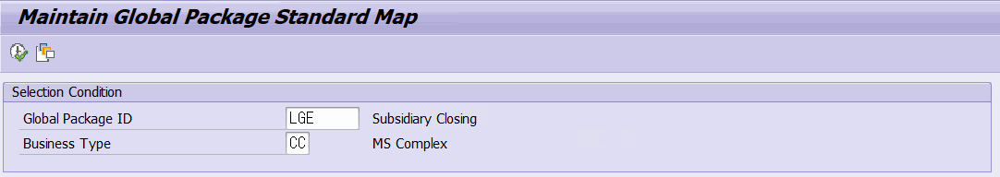
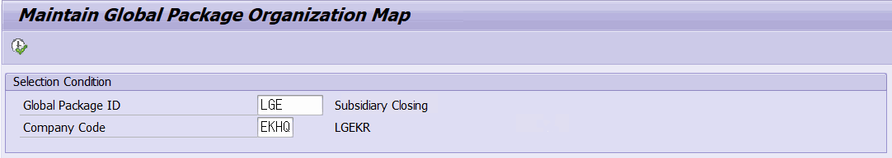

# 5. 글로벌 패키지 모델링 구조 — ZLPAC0031 / ZLPAC0041

글로벌 패키지(Global Package)는 여러 Business Package를 하나의 글로벌 프로세스로 묶어 관리하기 위한 구조입니다. 글로벌 패키지에 대한 모델링은 표준(ZLPAC0031)과 조직(ZLPAC0041)으로 나뉩니다.

## 5.1 글로벌 패키지 구조 이해

글로벌 패키지 관련 마스터·매핑 테이블은 다음과 같습니다.

| 테이블 | 표준 설명 | 핵심 필드 |
|---|---|---|
| ZTPAC_GPID_MAST | Global Process Master | GPID(글로벌패키지ID), GTEXT(명칭), APPID(APC 애플리케이션 ID) |
| ZTPAC_GPID | Assign Business Package to Global Process | BUPAK, GPID, MAIN(대표 패키지 여부), SEQ |
| 핵심 포인트 — 대표(Main) Business Package 한 글로벌 패키지(GPID)에는 여러 Business Package가 연결되며, 그중 하나가 대표(Main) 패키지입니다(ZTPAC_GPID-MAIN='X'). 글로벌 모델링 프로그램은 GPID로부터 이 대표 Business Package를 찾아(GET_MAIN_BUPAK) 권한 검사·Business Type 결정 등에 사용합니다. |  |  |

## ZLPAC0031 — 글로벌 표준 맵 (Global Standard Map)

프로그램 ZLPAC0031 (표준 설명: Maintain Global Package Standard Map)은 ZLPAC0030의 글로벌 버전입니다. 조직 대신 글로벌 패키지 단위로 표준 맵을 정의합니다.

| 파라미터 | 항목 | 설명 |
|---|---|---|
| PA_GPID | Global Package ID | 필수. Memory ID ZGPID. 매치코드 ZHPAC_GPID. 명칭은 ZTPAC_GPID_MAST에서 조회. |
| PA_BUSTY | Business Type | 비즈니스 유형. 대표 Business Package 기준으로 기본값 결정. |

- 모델 객체는 PACLVL='C' 로 생성하며, Activity Group 자리에는 GPID 값을 사용합니다.
- 잠금 키 = 프로그램ID + GPID + BUSTY. 권한 검사는 대표 Business Package 기준.

## 5.3 ZLPAC0041 — 글로벌 조직 맵 (Global Organization Map)

프로그램 ZLPAC0041 (표준 설명: Maintain Global Package Organization Map)은 ZLPAC0040의 글로벌 버전입니다. 단, 조직 기준은 회사코드(Company Code) 하나만 사용합니다.

| 파라미터 | 항목 | 설명 |
|---|---|---|
| PA_GPID | Global Package ID | 필수. Memory ID ZGPID. |
| PA_BUKRS | 회사코드(Company Code) | 필수. GPID의 대표 Business Package에 연결된 회사코드만 선택 가능. |

- Business Type은 SELECT_BUSTY_FROM_COMPANY (대표 BUPAK + 회사코드)로 결정됩니다.
- 잠금 키 = 프로그램ID + GPID + BUKRS. 화면 제목에 회사코드를 붙여 표시.

> 보완 설명 — 글로벌 조직 맵이 회사코드 레벨만 쓰는 이유 ZLPAC0041의 선택 화면에는 사업영역·결산단위 입력 필드가 없고 회사코드만 필수입니다. 이는 글로벌 모델링이 회사(Company) 레벨을 기준으로 동작하기 때문입니다. 검증된 소스 범위에서 확인된 사실이며, 사업영역·결산단위 단위의 세부 조직 모델은 일반 조직 모델링(ZLPAC0040)에서 다룹니다.

## 5.4 진입 경로 정리

| 대상 모델 | 직접 실행 | 자동 전환 진입 |
|---|---|---|
| 글로벌 표준 맵 | ZLPAC0031 (GPID 입력) | ZLPAC0030에서 PCSGP=BUPAK·GPID·BLEVEL='C' 조건 충족 시 |
| 글로벌 조직 맵 | ZLPAC0041 (GPID+회사코드) | ZLPAC0040에서 PCSGP=BUPAK·대표 GPID 존재 시 |
