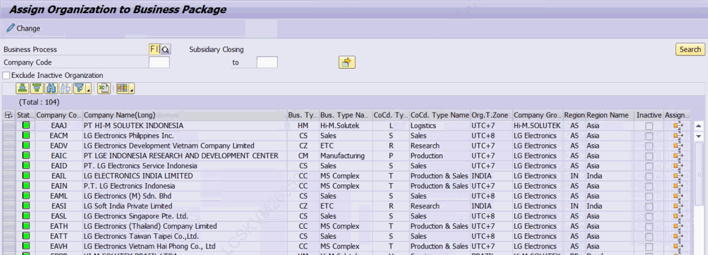
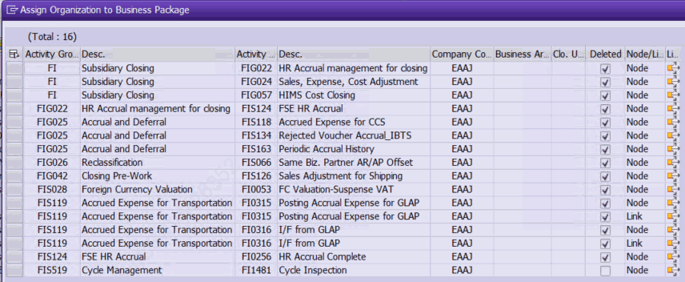

# 6. CO 모델링 및 조직 등록 — ZLPAC0050

> 이 장의 전제 (운영 기준) CO(관리회계) 모델링은 다른 모델링과 구분되는 운영 기준을 가집니다. 운영 기준상 CO 모델링은 Company Level(회사코드 레벨)에서 별도로 수행되며, Business Area(사업영역) 단위로 조직이 등록됩니다. 그리고 그 조직 등록 및 모델 매핑 현황은 ZLPAC0050 화면에서 확인합니다. 아래 6.2~6.5는 이 운영 기준을 뒷받침하는 ZLPAC0050 프로그램의 실제 동작(MCP 검증)을 정리한 것입니다.

## 6.1 CO 모델링의 위치와 운영 규칙

CO 모델링은 3~5장에서 다룬 표준/조직/글로벌 모델링과 화면 편집 방식(네트워크 그래프)은 동일하지만, 운영상 다음과 같이 별도로 취급됩니다.

- 모델링 단위: **회사코드(Company Code)별 사업영역(Business Area) 단위** 로 모델링되어 있으며, 사업영역(BA)별로 수행됩니다.
- 사업영역(BA) 정의 위치: ZLPAC0050 (Assign Organization to Business Package)에서 정의합니다.
- 삭제 확인: CO 모델링 삭제 시 ZLPAC0140 (Display Modeling List)에서 조회하여 최하위 레벨(Closing ID)까지 삭제가 정확히 이루어졌는지 확인합니다.

> 주의 — 특정 BA 미사용 처리 특정 법인의 특정 사업영역(BA)만 미사용하려는 경우, Inactive 처리가 아니라 모델링 변경으로 처리해야 합니다. (조직 등록의 Inactive 플래그로 끄는 방식과 구분) 특정 법인 삭제 처리 특정 법인 미사용으로 삭제 처리 해야 하는 경우 이전 결산 내역이 있으면 삭제가 아니라 Inactive 처리해야 한다. (이전 결산 내역 조회를 위해)

## 6.2 ZLPAC0050 — Assign Organization to Business Package

프로그램 ZLPAC0050 (표준 설명: Assign Organization to Business Package, 트랜잭션 코드 동일)은 Business Package에 조직 구조(회사코드·사업영역·결산단위)를 등록·유지보수하는 ALV 편집 화면입니다. 소스 주석에도 "조직구조인 회사코드, 사업영역, 결산단위를 유지보수한다"라고 명시되어 있습니다.

| 항목 | 필드 | 설명 |
|---|---|---|
| Business Package | P_BUPAK | 필수 조회 조건. 조직 레벨(PACLVL)을 결정. |
| 회사코드 | S_BUKRS | 회사코드 범위(Select-Options). |
| 사업영역 | S_GSBER | 사업영역 범위. CO 등록 시 사용되는 단위. |
| 결산단위 | S_CUNIT | 결산단위 범위. |
| Inactive 제외 | P_EXCD | 체크 시 비활성(Inactive) 항목 제외 조회. |

## 6.3 조직 레벨별 저장 대상

ZLPAC0050은 조직 모델링(4장)과 동일하게 조직 레벨(PACLVL)에 따라 서로 다른 설정 테이블에 저장합니다. CO의 운영 기준(회사코드 레벨 수행 · 사업영역 단위 등록)은 아래 표의 C·B 레벨에 대응합니다.

| PACLVL | 저장 테이블(폼) | 필수 키 | 삭제 함수 |
|---|---|---|---|
| C (회사코드) | ZTPAC_CONFIG_COM (INSERT_ZTPAC_CONFIG_COM) | 회사코드 | DELETE ZTPAC_CONFIG_COM |
| B (사업영역) | ZTPAC_CONFIG_BA (INSERT_ZTPAC_CONFIG_BA) | 회사코드+사업영역 | DELETE ZTPAC_CONFIG_BA |
| U (결산단위) | ZTPAC_CONFIG_UNI (INSERT_ZTPAC_CONFIG_UNI) | 회사코드+결산단위 | DELETE ZTPAC_CONFIG_UNI |

## 6.4 Business Type 입력 규칙

ALV에서 Business Type(BUSTY) 컬럼의 입력 가능 여부는 조건에 따라 달라집니다. 소스에서 확인된 규칙은 다음과 같습니다.

- 조직 매핑(모델)이 이미 존재하는 조직 행은 Business Type·비활성 지시자 입력이 불가합니다(check_exist_org_specific 결과가 존재). 이때 해당 행의 LINK 컬럼에 아이콘이 표시됩니다.
- SPECIFIC(모듈별 특정) Business Type이 정의된 경우에는 입력이 가능합니다. 단, 입력 값이 해당 모듈의 특정 Business Type과 다르면 오류(E604)로 처리됩니다.
- 조직 레벨이 U(결산단위)인 경우 Business Type은 마스터(ZTPAC_CUNIT_MAST) 값으로 결정되어 ALV에서 직접 변경하지 않습니다.

## 6.5 조직에 매핑된 모델(맵) 확인

ZLPAC0050에서 특정 조직 행의 **LINK** 컬럼(아이콘)을 클릭하면, 해당 조직에 매핑된 모델의 노드/링크 목록(사용 중인 PID)을 팝업(화면 0120)으로 보여줍니다. 목록은 ZTPAC_ORG_NODE, ZTPAC_ORG_LINK 에서 조회합니다.

이 팝업에서 다시 항목의 LINK를 클릭하면 조직 모델링 프로그램 ZLPAC0040 이 해당 조직(회사코드·사업영역·결산단위·Activity Group) 파라미터로 실행되어(SUBMIT ZLPAC0040 ... AND RETURN), 실제 모델을 열어 확인·수정할 수 있습니다.

- Assigned 필드를 클릭하면 Assign된모델링 내역을 확인 할 수 있습니다.
- 모델링에서 삭제된 내역은 Deleted 필드에 체크박스에 표시됩니다. (Node, Link)

> 핵심 포인트 — 'ZLPAC0050에서 모델링을 확인한다'의 의미 ZLPAC0050 자체는 '조직 등록' 화면이며, 네트워크 그래프를 직접 편집하지 않습니다. 다만 각 조직 행의 LINK를 통해 해당 조직에 연결된 모델(맵)의 사용 노드를 조회하고, 거기서 ZLPAC0040을 호출해 실제 모델링 화면으로 이동할 수 있습니다. 따라서 CO 조직 등록(회사코드/사업영역 단위)과 그 조직에 적용된 모델을 한 화면에서 연결해 확인하는 진입점이 ZLPAC0050 입니다.
> 현장확인 필요 CO 모듈에서 '회사코드 레벨 수행 · 사업영역 단위 등록'이 특정 Business Package의 PACLVL/REQ_BUKRS 설정(예: PACLVL='B' 또는 'C' + REQ_BUKRS='X')으로 어떻게 매핑되는지는 실제 운영 Business Package의 ZTPAC_CONFIG 값으로 확인하시기 바랍니다. 본 문서는 프로그램 동작을 사실 기반으로 정리한 것이며, 특정 CO 패키지의 설정값은 시스템별로 다를 수 있습니다. 법인 삭제시에는 해당 법인에 Assign된 모델링이 없어야 삭제가 가능합니다.
