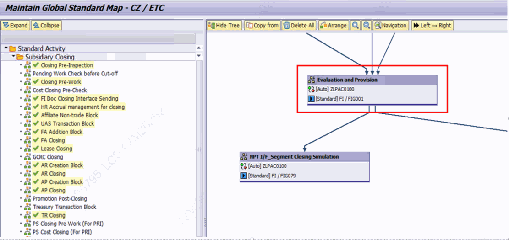
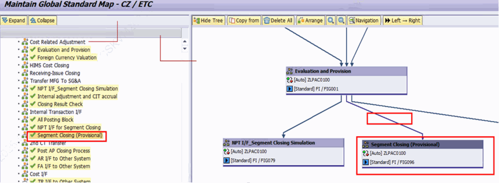
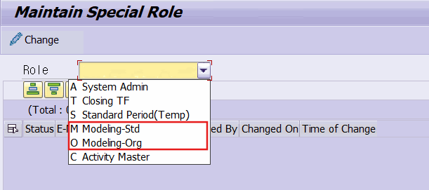

# 7. 실무 모델링 변경 절차

이 장은 실제로 모델링을 변경(생성·수정)할 때의 표준 절차를 정리합니다. 앞서 설명한 표준 모델링(ZLPAC0030)과 조직 모델링(ZLPAC0040)을 사용하며, 화면 캡처는 운영 담당자가 제공한 실제 작업 화면입니다.

> 운영 서버에서의 변경 방식 (중요) 운영 서버(P)의 경우, 사용자가 직접 수정하지 않고 CWF 인원을 통해 별도의 요청 파일로 변경을 진행합니다. 개발(D)·품질(Q) 등 그 외 서버에서는 사용자가 직접 수정할 수 있습니다. 개발·품질·운영에서 Activity Name이 서로 다를 수 있으므로, 반드시 정확한 Activity Name을 확인한 뒤 진행합니다.

## 7.1 모델링 변경 순서

모델링 변경은 다음 순서로 진행합니다.

1. Activity Master(ZLPAC0020, Define Activity Master)에서 Activity Group 번호와 Name을 확인합니다.
2. Modeling Map(ZLPAC0030 표준 / ZLPAC0040 조직)에서 해당 법인을 선택하여 모델링을 진행합니다.

[그림 7-1] 모델링 변경 순서 ② — Modeling Map에서 해당 법인 선택 후 모델링 진행

1. 좌측 메뉴 Tree에서 모델링하려는 Activity를 더블 클릭한 뒤, 오른쪽 화면에 생성된 Node를 원하는 위치에 놓고 Link로 연결한 후 저장합니다.

[그림 7-2] 모델링 변경 순서 ③ — 좌측 Tree에서 Activity 더블 클릭 → Node 배치 → Link 연결 → 저장

> 보완 설명 — 표준 → 조직 순서 먼저 표준 맵(Standard Map, ZLPAC0030)에서 표준 프로세스를 모델링한 뒤, 조직 맵(Organization Map, ZLPAC0040)에서 조직별로 모델링합니다. (1.1 참조)

## 7.2 2·3 Level 모델링 수정 권한 (ZLPAC1050)

2·3 Level(하위 레벨)의 모델링은 별도 권한이 있어야 수정할 수 있으며, 권한은 ZLPAC1050 (Maintain Special Role)에서 부여합니다. 운영 담당자 자료 기준으로 표준/조직 맵에 대응하는 권한 값은 다음과 같습니다.

| 구분 | 권한 값(Role) | 설명 |
|---|---|---|
| Standard Map | M (Modeling-Std) | 표준 맵(ZLPAC0030) 모델링 수정 권한 |
| Organization Map | O (Modeling-Org) | 조직 맵(ZLPAC0040) 모델링 수정 권한 |

[그림 7-3] ZLPAC1050 — Standard Map 권한(M, Modeling-Std), Organization Map 권한(O, Modeling-Org)

> 현장확인 필요 권한 값 M/O(Modeling-Std/Modeling-Org)는 운영 담당자 제공 자료 기준입니다. ZLPAC1050의 실제 Role 코드·명칭 체계는 운영 시스템에서 확인하시기 바랍니다.
