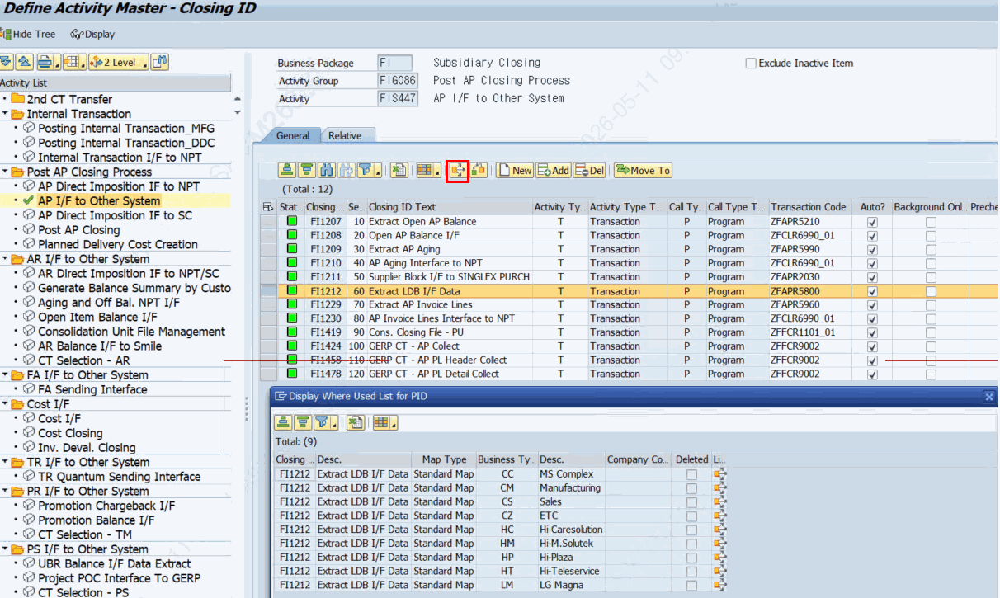
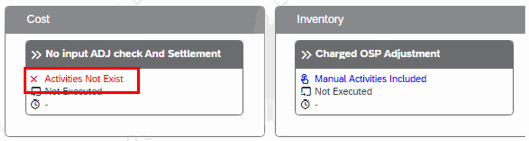

# 8. 모델링 조회 · 삭제 및 자주 묻는 질문

## 8.1 모델링 조회 — ZLPAC0140 (Display Modeling List)

프로그램 ZLPAC0140 (Display Modeling List)은 모델링 결과를 레벨별로 조회하는 프로그램입니다. 모델링이 최하위(Closing ID)까지 제대로 되었는지, 삭제가 완전히 이루어졌는지 확인하는 데 사용합니다.

선택 화면의 주요 항목은 다음과 같습니다.

| 블록 | 항목 | 설명 |
|---|---|---|
| 카테고리 | R_ORG2 / R_STD / R_ORG1 | 조회 대상 구분(조직/표준). 기본값 R_ORG2. |
| 기본 조건 | P_BUPAK, S_BUKRS/S_GSBER/S_CUNIT, S_PHASE | Business Package(필수)와 조직·Phase 범위. |
| Activity 선택 | S_PCSGP / S_PCSUB / S_PID / S_BUSTY | Activity Group/Sub/PID/Business Type 범위. |
| Level 선택 | R_LEV1 / R_LEV2 / R_LEV3 | 조회 레벨. 기본값 R_LEV3(최하위=Closing ID). |
| 보완 설명 — 레벨(Level) 구조 확인 ZLPAC0140의 Level 선택(1/2/3)은 모델링 계층(Activity Group → Activity → Closing ID)에 대응하며, 기본값이 Level 3(최하위)입니다. 조회 데이터는 표준 노드 테이블(ZTPAC_STD_NODE) 등을 기준으로 합니다. |  |  |

**Modeling Type(조회 카테고리) 라디오 버튼별 기능**

선택 화면 최상단의 라디오 버튼 3개는 단순한 필터가 아니라 **조회 대상 테이블과 결과 화면 자체를 바꾸는 스위치**입니다. 라디오 버튼을 클릭하면 즉시 화면이 다시 그려지면서(USER-COMMAND) 사용할 수 없는 입력 항목이 감춰집니다.

| 라디오 버튼 | 화면 표기 | 조회 내용 · 조회 테이블 | 결과 화면 |
|---|---|---|---|
| Activity List by Organization (R_ORG2- 기본값) | Organization Map - All | 조직에 실제로 적용된 최종 모델링 결과 전체. 표준 모델에 조직별 변경분을 반영한 결과를 공통 클래스 메서드로 조회. | ALV 화면 200 (조직 · Activity 계층 목록) |
| Modeling : Standard Map (R_STD) | Standard Map | 조직과 무관한 표준 모델. ZTPAC_STD_NODE 를 Business Package + Business Type 기준으로 직접 조회(삭제분 LOEVM = 'X' 제외). | ALV 화면 100 (표준 노드 목록) |
| Modeling : Org Map-Changed (R_ORG1) | Organization Map - Changed Only | 표준 대비 조직별로 변경된 내역만. ZTPAC_ORG_NODE 를 직접 조회하여 LOEVM = 'X' 는 Delete, 그 외는 Add 로 표시. | ALV 화면 100 (변경 내역 목록) |

**라디오 버튼별 상세 동작**

- **Organization Map - All (R_ORG2, 기본값)** — 운영에서 가장 많이 쓰는 조회입니다. 표준 모델에 조직별 변경분을 반영한 최종 결과를 ZCL_PAC=>SELECT_PID_BY_CONDITION 메서드로 조회합니다. "이 법인은 지금 무엇을 수행하게 되어 있는가"를 그대로 보여줍니다. Phase · Activity 범위 · Level(1/2/3) 조건을 모두 사용할 수 있고, Activity 자동화 여부(XAUTO) · T-Code · Activity Type · 개별 설정 여부(Individual)까지 함께 표시됩니다.
- **Standard Map (R_STD)** — 표준 모델 자체를 확인할 때 사용합니다. 조직 정보가 없는 조회이므로 회사코드 · 사업영역 · 결산단위 · Phase · Activity · Level 입력이 모두 감춰지고, **Business Package 와 Business Type 만** 조건으로 남습니다. 결과 목록에서도 조직 관련 컬럼(회사코드 / 사업영역 / 결산단위 / 사유 / 구분)은 표시되지 않습니다.
- **Organization Map - Changed Only (R_ORG1)** — 표준 모델을 그대로 쓰지 않고 조직에서 별도로 손댄 부분만 뽑아 봅니다. 각 행의 **구분(Add /Delete)** 컬럼으로 "조직에서 추가한 Activity"인지 "조직에서 제외한 Activity"인지 구분합니다. 조직별 예외 설정 현황을 점검하거나, 표준 변경 전에 영향 범위를 확인할 때 유용합니다. 표준 기준 항목인 Business Type 컬럼은 표시되지 않습니다.
**라디오 버튼별 입력 항목 활성 규칙**

| 입력 항목 | Standard Map (R_STD) | Org Map - Changed Only (R_ORG1) | Org Map - All (R_ORG2) |
|---|---|---|---|
| Business Package (P_BUPAK) | 활성 (필수) | 활성 (필수) | 활성 (필수) |
| 조직 (S_BUKRS / S_GSBER / S_CUNIT) | 비활성 | 조직 레벨(PACLVL)에 따라 활성 | 조직 레벨(PACLVL)에 따라 활성 |
| Business Type (S_BUSTY) | 활성 | 비활성 | 비활성 |
| Phase (S_PHASE) | 비활성 | 활성 | 활성 |
| Activity 선택 (S_PCSGP / S_PCSUB / S_PID) | 비활성 | 비활성 | 활성 |
| Level 선택 (R_LEV1 / R_LEV2 / R_LEV3) | 비활성 | 비활성 | 활성 (기본값 Level 3) |
| 하위 Activity 없는 노드만 (P_NOPID) | 비활성 | 비활성 | Level 1 · 2 선택 시에만 활성 |

조직 입력 항목은 Business Package의 조직 레벨(ZTPAC_CONFIG-PACLVL) 값에 따라 다시 걸러집니다.

| PACLVL | 활성되는 조직 입력 항목 | 감춰지는 항목 |
|---|---|---|
| C (회사코드) | 회사코드(S_BUKRS) | 사업영역 · 결산단위 |
| B (사업영역) | 회사코드(S_BUKRS) + 사업영역(S_GSBER) | 결산단위 |
| U (결산단위) | 결산단위(S_CUNIT) | 회사코드 · 사업영역 |

> 보완 설명 — Level 라벨과 P_NOPID 체크박스 Level 선택 라디오 버튼의 라벨은 고정 문구가 아니라 Business Package별 레벨 명칭 테이블(ZTPAC_MDLVLT)에서 읽어 Level 1 : <액티비티 그룹명> 형태로 동적으로 표시됩니다. 패키지마다 다른 용어를 쓰더라도 화면에는 해당 패키지의 용어가 나타납니다. P_NOPID 체크박스는 하위 Activity가 없는 노드만 골라 보는 옵션입니다. Level 1 또는 Level 2로 조회할 때만 나타나며(Level 3에서는 감춰짐), 체크하면 하위가 하나도 없는 노드만 남습니다. 모델링을 하다 만 노드, 즉 노드에 'Activities Not Exist' 가 표시되는 대상을 목록으로 찾아낼 때 가장 빠른 방법입니다. (8.4 참조) 조회 레벨 3(최하위 = Closing ID)이 기본값이므로, Closing ID까지 모델링되지 않은 노드는 기본 조회에서 아예 보이지 않습니다. "모델링했는데 ZLPAC0140에 안 보인다"는 문의는 대부분 이 경우입니다.

## 8.2 전 법인 모델링 삭제

특정 Activity의 모델링을 전 법인에서 삭제하려는 경우, 다음을 유의합니다.

- 해당 Activity의 **Where UsedList** 에 존재하는 모든 모델링을 삭제해야 합니다.
- 상태 이력 데이터가 남아 있으면 삭제되지 않으며, 다음 에러가 표시됩니다:
- It cannot be deleted because there is status history data. (FI000)

[그림 8-1] 전 법인 삭제 — Where Used List 확인 및 상태 이력 존재 시 삭제 에러(FI000)

## 8.3 노드에 'Activities Not Exist' 메시지가 표시되는 경우

모델링을 마친 뒤 네트워크 그래프의 노드에 **'Activities Not Exist'** 메시지가 표시되는 것은 오류가 아니라, **해당 노드 아래에 Closing ID가 셋업되지 않았다**는 안내입니다. PAC의 모델링 계층은 Activity Group → Activity → Closing ID 순이며, 최하위인 Closing ID까지 연결되어야 비로소 수행 가능한 모델이 됩니다.

[그림 8-3] Node에 'Activities Not Exist' 메시지 — Closing ID 미모델링 상태

| 구분 | 내용 |
|---|---|
| 현상 | 모델링 후 노드에 'Activities Not Exist' 메시지가 표시됨. |
| 원인 | 해당 노드의 최하위 레벨인 Closing ID가 모델링(Setup)되지 않음. 노드는 만들어졌으나 그 아래에 연결된 Activity가 하나도 없는 상태입니다. |
| 조치 | 해당 노드를 열어 Closing ID 레벨까지 모델링을 완료합니다. 표준 맵이면 ZLPAC0030, 조직 맵이면 ZLPAC0040에서 작업합니다. |
| 확인 | ZLPAC0140에서 Organization Map - All 선택 → Level 1 또는 Level 2 선택 → P_NOPID(하위 Activity 없는 노드만) 체크 후 조회하면, Closing ID가 없는 노드만 목록으로 확인할 수 있습니다. |
| 참고 | Closing ID가 없으면 ZLPAC0140의 기본 조회(Level 3)에서도 해당 모델이 조회되지 않습니다. '모델링했는데 조회되지 않는다'와 'Activities Not Exist'는 같은 원인입니다. |
