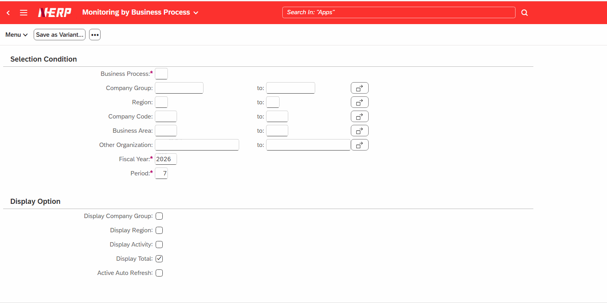
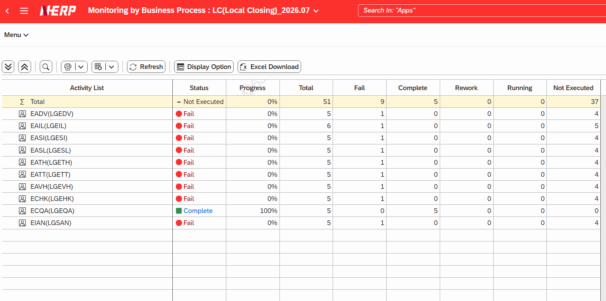
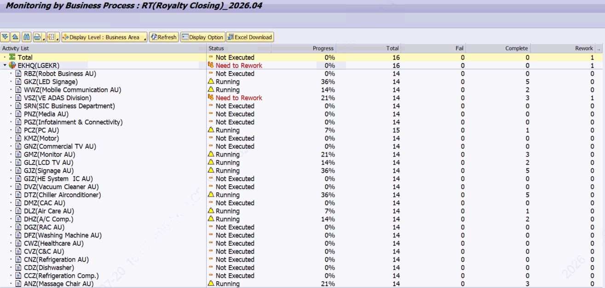

# 4. 비즈니스 패키지별 모니터링 — ZLPAC_MONITOR_BUPAK

**소스 설명 :** Monitoring by Business Process. 한 비즈니스 패키지의 진행 상황을 액티비티 그룹 단위로 요약해 보여주는 데 초점이 있습니다. 조회 레벨 기본값이 '액티비티 그룹(G)'입니다.

- FI를 제외한 모듈 모니터링

## 4.1 선택화면 항목

| 구분 | 필드 | 설명 |
|---|---|---|
| 기본검색 | Company Group | 비즈니스 패키지 (필수) |
|  | Region Company Code | 조직 조건 |
|  | Fiscal Year, Period | 회계연도 / 월 |
| 조회옵션 | Display Company Group Display Region Display Activity | 회사그룹 / 지역 / 액티비티 표시 조회 레벨 (기본 G 액티비티 그룹) |
|  | Display Level | 액티비티 그룹 조회 레벨 (기본 G 액티비티 그룹) (검색도움말 ZHPAC_PCSGP_LIST, 단일 값) |
|  | Display Open Phase | Opne Phase 표시 |
|  | Display Total | Display Total (기본 체크) |
|  | Active Auto Refresh | 자동 새로고침 사용 / 주기 / 종료 |

> 보완 설명 (ACT와의 차이) ACT는 조회 레벨 기본값이 액티비티(A), BUPAK은 액티비티 그룹(G)입니다. 즉 BUPAK은 그룹 단위 요약, ACT는 액티비티 단위 상세가 기본 관점입니다. BUPAK에는 'Display Total(P_D_TOT)' 체크박스가 있어 합계 표시를 제어합니다. 세부 액티비티 조건(S_PCSUB / S_PID)은 제공하지 않고 그룹(S_PCSGP)만 제공합니다.

## 4.2 처리 흐름

실행 흐름은 ACT와 동일하게 GET_AUTH_ORG_MAST → READ_TEXT_TABLE → READ_DATA → START_TIMER → CALL SCREEN 100 순서로 진행되며, 데이터 소스(ZFPAC_PAC_MONITOR)·상태 표현·새로고침·로그 연계는 2장 공통 기반과 같습니다.
