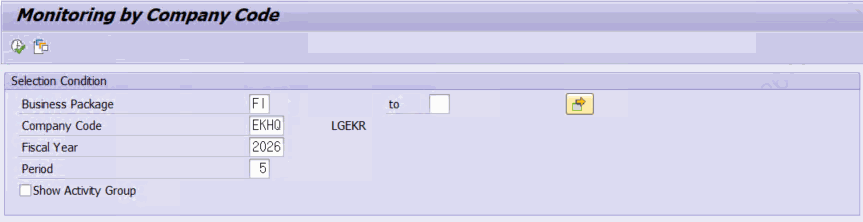
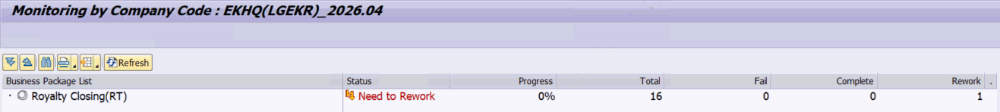

# 5. 회사코드별 모니터링 — ZLPAC_MONITOR_COM

**소스 설명 :** Monitoring By Company Code. 특정 회사코드 한 곳을 지정하여, 그 회사코드에 걸린 비즈니스 패키지들의 진행 상황을 보는 프로그램입니다. 자동 새로고침 기능은 없습니다.

## 5.1 선택화면 항목

| 필드 | 설명 |
|---|---|
| Business Package | 비즈니스 패키지 (구간 입력 가능) |
| Company Code | 회사코드 (필수, 검색도움말 ZHPAC_BUKRS_MAST) |
| Fiscal Year / Period | 회계연도 / 월 (필수) |
| Show Activity Group | Show Activity Group — 체크 시 그룹·서브그룹·PID 상세 트리, 미체크 시 비즈니스 패키지 요약 |

> 보완 설명 (MCP 검증) 대상 비즈니스 패키지는 조직레벨이 회사코드(PACLVL='C')이거나 회사코드 필수(REQ_BUKRS='X')인 패키지만, 지정한 회사코드가 포함된 것을 골라 읽습니다(ZTPAC_CONFIG_COM / _BA / _UNI 조인). 요약 조회 시 ZFPAC_PAC_MONITOR 를 IV_SUM='X' 로 호출해 비즈니스 패키지당 1건 요약만 받아옵니다. 회사코드가 비어 있으면 ZCL_PAC=>GET_BUKRS_DEFAULT 로 사용자 기본 회사코드가 설정됩니다.

## 5.2 트리 구성

P_DETAIL 미체크 시에는 1레벨에 비즈니스 패키지만 표시(요약)하고, 체크 시에는 비즈니스 패키지 → 액티비티 그룹 → 서브그룹 → 액티비티(PID) 4레벨로 펼칩니다. 상세 조회일 때만 툴바에 상태별 건수 버튼(Total/Fail/Complete/Rework/Running/Not Executed)이 나타납니다.
