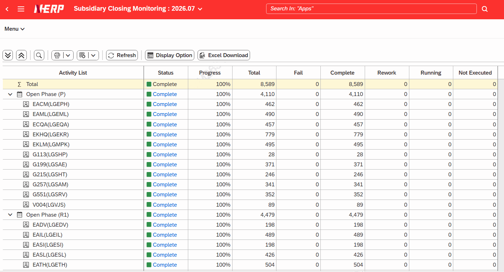
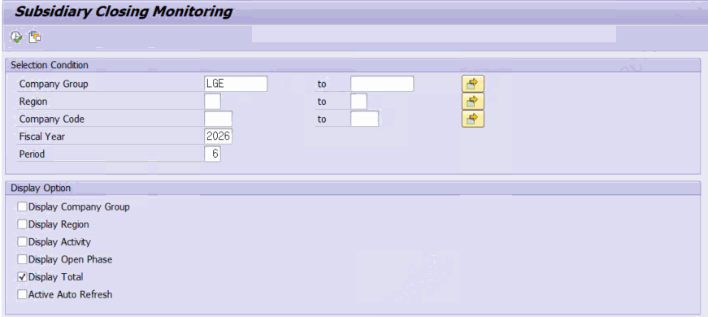
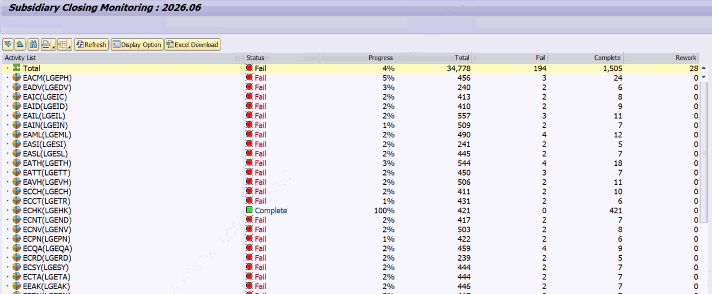

# 6. 글로벌 프로세스 모니터링 — ZLPAC_MONITOR_GPID

**소스 설명 :** Global Process Monitoring. 여러 법인·지역을 아우르는 글로벌 패키지(GPID) 단위로 결산 진행 상황을 집계해 보여주는, 계열 중 가장 기능이 많은 프로그램입니다. 회사그룹·지역·차수 상위 집계, Excel 다운로드, 표시 옵션 팝업, 조회 레벨 툴바를 제공합니다.

## 6.1 선택화면 항목

| 구분 | 필드 | 설명 |
|---|---|---|
| 기본검색 | Company Group / Region / Company Code | 회사그룹 / 지역 / 회사코드 |
|  | Fiscal Year, Period | 회계연도 / 월 (필수) |
| 조회옵션 | Display Company Group | 회사그룹 / 지역 / 액티비티 표시 |
|  | Display Open Phase | Display Open Phase (오픈 차수 레벨 표시) |
|  | Display Total | Display Total (기본 체크) |
|  | Display Activity | 조회 레벨(기본 G) / 액티비티 그룹 |
|  | Active Auto Refresh | 자동 새로고침 사용 / 주기 / 종료 |

## 6.2 트리 계층과 표시 옵션

표시 옵션 조합에 따라 상위 집계 노드가 추가됩니다. 완전한 형태의 계층은 다음과 같습니다.

(Total) → 회사그룹 → 지역 → (오픈차수) → 회사코드

→ 액티비티 그룹 → 서브그룹 → 액티비티(PID)

- Display Company Group / Region / Open Phase 체크 여부에 따라 해당 상위 레벨이 삽입/생략됩니다.
- Display Total 체크 시 1레벨 데이터를 합산한 'Total' 노드가 트리 최상단에 표시됩니다.
- 툴바의 'Display Option' 버튼을 누르면 팝업(화면 200)에서 조회 옵션을 바꿔 즉시 다시 그릴 수 있고, 'Display Level' 드롭다운으로 특정 레벨까지 펼치거나 접을 수 있습니다.

## 6.3 Excel 다운로드

툴바의 Excel 버튼(EXCEL_DOWNLOAD_100)은 현재 트리를 레벨만큼 들여쓰기한 평면 목록으로 만들어 표준 클래스 CL_SALV_TABLE 로 XLSX 파일을 생성하고 프론트엔드에 저장합니다. 컬럼은 Name / Status / Progress / Total / Fail / Complete / Rework / Running / Not Executed 입니다.

> 보완 설명 (MCP 검증) 대상 비즈니스 패키지는 ZTPAC_GPID 에서 해당 GPID에 연결된 패키지를 읽어, 패키지마다 ZFPAC_PAC_MONITOR(IV_MLEVEL='C')를 호출해 집계합니다. P_GPID 는 화면에 보이지 않으며, 값이 없으면 ZTPAC_GPID_MAST 의 첫 번째 ITMSEQ에 해당하는 GPID가 기본값으로 사용됩니다. 건수 더블클릭 시 로그 연계는 HQ 권한(ZCL_PAC_AUTH=>CHECK_AUTH_HQ)이 있는 경우에만 동작합니다. 오픈 차수(Open Phase) 레벨은 비교적 최근 추가된 기능입니다(소스 변경 표기 260625).
