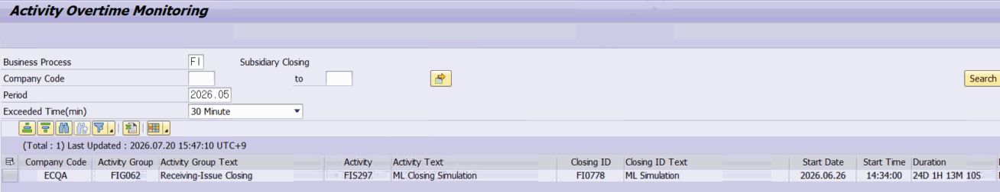

# 7. 액티비티 실행시간 초과 모니터링 — ZLPAC_OVERTIME_PID

**소스 설명 :** Activity OverTime Monitoring. 자동 수행 중인 액티비티 가운데 실행 시간이 기준(예: 30분)을 넘겨 계속 진행 중인 건을 찾아, 이번 달 경과 시간·지난달 소요 시간·최근 3개월 평균 소요 시간과 함께 목록(ALV 그리드)으로 보여주는 감시용 프로그램입니다.

## 7.1 선택화면 항목

| 필드 | 설명 |
|---|---|
| Business Process | 비즈니스 패키지 (필수) |
| Company Code | 회사코드 |
| Period | 조회 연월 (필수). 기본값 = ZTPAC_SCH_DISTM 의 최신 배포 상태(STATUS L/D) |
| Exceded Time(min) | 초과 기준 리스트박스: 2=20분 / 3=30분(기본) / 4=40분 / 5=50분 |

## 7.2 판정 로직 (MCP 검증)

이 프로그램은 '지금도 돌고 있는데 기준 시간을 넘긴' 자동 액티비티를 골라냅니다. 구체적으로는 다음 조건을 모두 만족하는 로그를 추출합니다.

- 액티비티 정의(ZTPAC_PROC)가 자동 수행 대상(XAUTO='X')이고 삭제되지 않은 것
- 현재 상태(ZTPAC_STATUS)가 진행 중(R) 또는 시작(S)
- 조회 연월(P_SPMON)에 해당하고, 시작 시각이 (현재 시각 − 초과기준)보다 이전 → 즉 기준 시간을 이미 넘겨 계속 수행 중
데이터 소스는 ZTPAC_PROC ⋈ ZTPAC_LOG_HDR ⋈ ZTPAC_STATUS 조인입니다.

## 7.3 표시 컬럼

| 컬럼 | 의미 / 계산 |
|---|---|
| 조직 / 액티비티 | 회사코드·사업영역·결산단위, 액티비티 그룹/서브그룹/PID 및 명칭 |
| JobName / 시작일시 | 배치 잡 이름, 시작 날짜·시각(로그 헤더) |
| Duration (경과) | 시작 시각부터 현재까지 경과(SWI_DURATION_DETERMINE) — 'nD nH nM nS' 형식 |
| Duration Last Month(지난달) | 지난달 동일 액티비티 완료(C) 건의 소요 시간(EXETM) |
| Duration Avg (평균) | 최근 3개월 완료 건 소요 시간의 평균 |
| Link (URL) | Fiori 타일로 이동하는 링크. 클릭 시 CALL_BROWSER 로 브라우저 열기 |

> 운영 활용 포인트 이 화면의 목적은 '평소보다 오래 걸리는 액티비티'를 조기에 발견하는 것입니다. 경과 시간(Duration)을 지난달·최근 3개월 평균과 비교해, 특정 액티비티가 비정상적으로 지연되는지 판단하고 필요 시 Link로 해당 Fiori 화면에 들어가 상세를 확인하십시오.
> 보완 설명 (MCP 검증) P_SPMON 기본값은 ZTPAC_SCH_DISTM 에서 배포 상태(STATUS)가 'L' 또는 'D'인 최신 연월을 사용합니다. 선택한 비즈니스 패키지가 GPID의 대표(FI) 패키지이면 연결된 CO 패키지도 함께 조회 대상에 포함됩니다. 권한은 ZCL_PAC_AUTH=>CHECK_BUPAK_AUTH 로 검증하며, 권한이 없으면 조회되지 않습니다.
