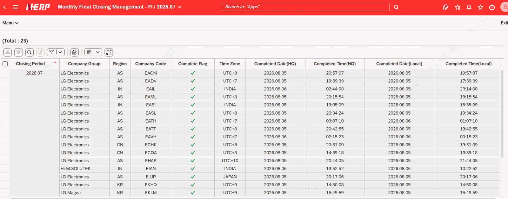
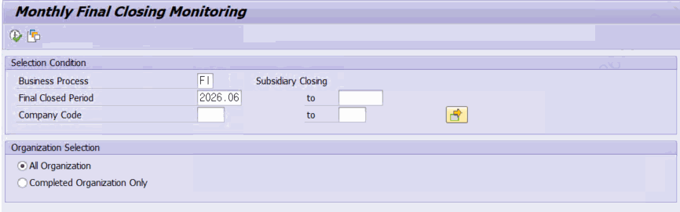
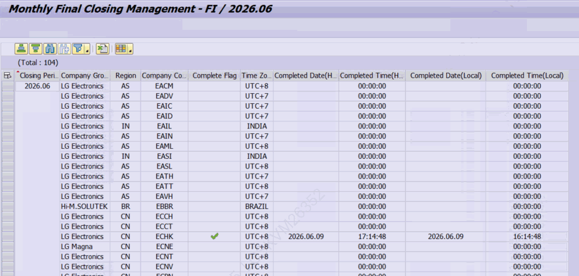

# 8. 월 최종결산 완료 모니터링 — ZLPAC0170

**소스 설명 :** Monthly Final Closing Monitoring. 결산 대상 월(CLMON)에 대해 조직별로 '월 최종결산'이 완료되었는지 여부를 한눈에 보여주는 프로그램입니다. 완료 여부는 체크 아이콘으로 표시됩니다.

## 8.1 선택화면 항목

| 필드 | 설명 |
|---|---|
| Business Process | 비즈니스 패키지 (필수) |
| Final Closed Period | 결산 월 (필수, 기본값=당월, 구간 확장 불가) |
| Company Code / Business Area / Closing Unit | 조직 조건 (조직 레벨에 따라 표시 항목이 달라짐) |
| All Organization / Completed Organization Only | 조회 대상 라디오 버튼 (All Organization기본) |

## 8.2 처리와 표시 (MCP 검증)

- **대상 패키지 제한 :** 월 최종결산이 활성화된 패키지(ZTPAC_CONFIG-ACT_XFINAL='X')만 조회할 수 있습니다. 그 외 패키지를 입력하면 오류 메시지가 표시됩니다.
- **완료 현황 조회 :** ZCL_PAC=>GET_COMPLETE_ORG_LIST 메소드로 조직별 완료 정보를 받아옵니다. P_RAD1 선택 시 조직 레벨 파라미터를 'A'로 전달합니다.
- **완료 아이콘 :** 완료일자(COMP_DATE-Completed Date, Completed Time)가 채워진 조직은 체크 아이콘(CLOSED)으로 표시됩니다.
- **‘Subsidiary Closing End’Activity가Complete되면ZTPAC_CLOSE 테이블에 담기고Complete Flag필드에 체크되며,Complete되는 년월,시간으로 표시됨**
- **미래 기간 제한 :** 결산 월을 현재 월보다 미래로 조회할 수 없습니다(오류 처리).

> 보완 설명 — 표시 컬럼 결산월(CLMON), 완료 여부(CLOSED 아이콘), 완료 일시/이전 완료 일시, 조직명(회사·사업영역·결산단위), 회사그룹·지역, 생성/변경자 정보가 표시됩니다. 조직 레벨(PACLVL=C/B/U)에 따라 사업영역·결산단위 등 표시 컬럼이 자동으로 조정됩니다. 라디오 버튼(P_RAD1/P_RAD2)의 화면 라벨 의미는 프로그램 텍스트 요소에 정의되어 있어, 정확한 표기는 운영 시스템 화면에서 확인이 필요합니다(11장 참조).
