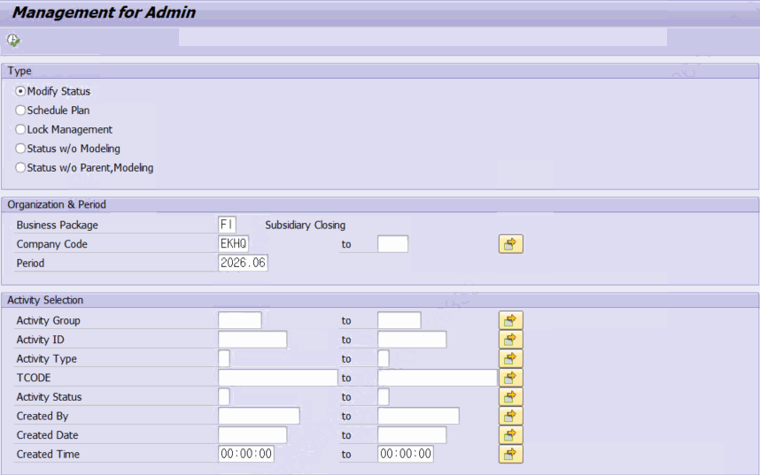
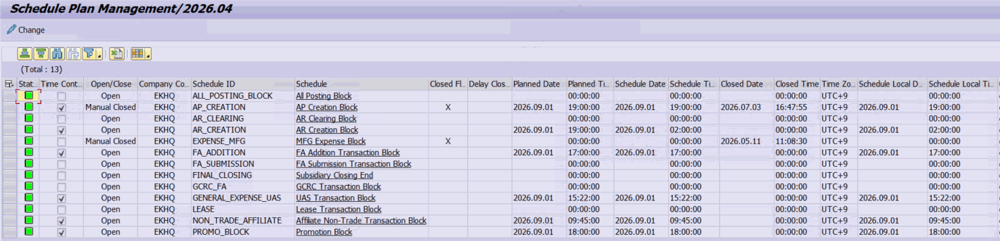
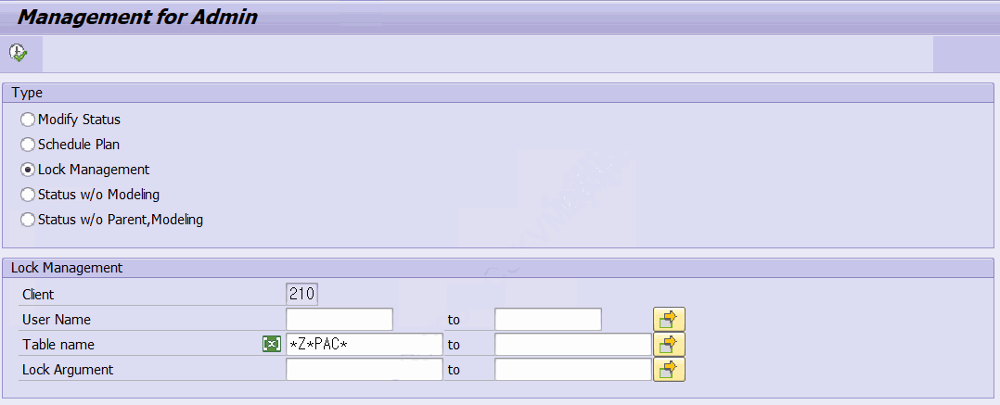
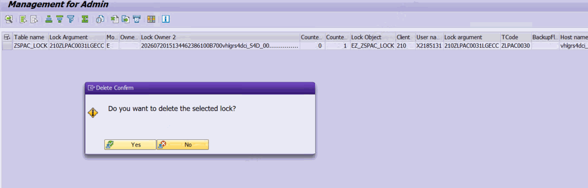

# 9. 관리자용 상태 관리 — ZLPACSTATUSM

**소스 설명 :** Status Management for Admin. 관리자가 결산 데이터를 직접 조정하기 위한 도구로, 하나의 프로그램에서 라디오 버튼으로 세 가지 모드를 전환합니다. 데이터를 직접 변경·삭제하므로 특히 신중한 사용이 필요합니다.

## 9.1 세 가지 모드

| 라디오 | 모드 | 대상 / 화면 |
|---|---|---|
| Modify Status | 액티비티 상태 관리 (기본) | ZTPAC_STATUS — 화면 100 (편집 가능 ALV) |
| Schedule Plan | 스케줄 계획 관리 | ZTPAC_SCH_PLAN — 화면 200 (편집 가능 ALV) |
| Lock Menagement | SAP 잠금(Lock) 관리 | 잠금 목록(SM12 유사) — ALV |
| Status w/o Parent, Modeling | 고아 노드 관리 |  |

## 9.2 상태 관리 모드 (Modify Status)

액티비티 상태 레코드(ZTPAC_STATUS와 ZTPAC_PROC 조인)를 조회·편집합니다. 검색 조건으로 비즈니스 패키지, 조직(회사코드/사업영역/결산단위), 기간(P_SPMON), 액티비티 그룹/PID, 액티비티 유형(REPTY)·트랜잭션 코드(TCODE)·상태·생성자·생성일시 등을 지정할 수 있습니다.

- Status 강제 Reset – Activity Status 값을 변경하여 Activity의 상태를 변경 할 수 있습니다.
- 조회 결과에서 액티비티 그룹(REPTY='S')·마스터(REPTY='M') 성격의 행은 제외되고 실제 액티비티만 표시됩니다.
- 변경 모드로 전환할 때 잠금(ENQUEUE_EZ_ZSPAC_LOCK)을 걸어 동시 편집을 방지하며, 다른 사용자가 사용 중이면 변경할 수 없습니다.
- 행 추가/삽입/삭제 후 저장하면 ZTPAC_STATUS 에 반영되고, 이어서 ZCL_PAC=>SYNC_PCSGP_STATUS 로 상위 액티비티 그룹 상태가 동기화됩니다.

> ⚠ 주의 — 상태 직접 변경 이 모드는 결산 진행 상태를 직접 바꿉니다. 상태를 잘못 변경하면 이후 자동수행 판단·진행률·상위 그룹 상태가 함께 틀어질 수 있습니다. 저장 시 상위 그룹 동기화(SYNC_PCSGP_STATUS)가 함께 수행되므로, 변경 대상·기간·조직을 정확히 지정한 뒤 신중하게 저장하십시오.

## 9.3 스케줄 관리 모드 (Schedule Plan)

결산 스케줄 계획(ZTPAC_SCH_PLAN)을 조회·편집합니다. 조회에는 연월(P_SPMON)이 필수이며, 스케줄 ID(S_SCHID)·조직으로 조건을 지정합니다. 계획일시(Planned Date, Planned Time)·수행일시(Scheduel Date, Schedule Time)·완료(Closed FIag) 플래그·지연(Delay Closed) 등을 편집할 수 있습니다.

- **저장 시 동작(중요) :** ZTPAC_SCH_PLAN 저장 후 PID_STATUS_CHANGE 로직이 수행되어, 해당 스케줄에 연결된 결산(REPTY='C') 액티비티의 상태를 완료(C)·부분(R)·취소(공백)로 갱신하고, 최종(Final) 액티비티에 대해서는 CLOSE_BUPAK_FINAL / OPEN_BUPAK_FINAL 을 호출하며, Fiori 화면 실시간 갱신(ZCL_PAC_FIORI=>CALL_APC)과 상위 그룹 동기화(SYNC_PCSGP_STATUS)를 수행합니다.
- 스케줄 ID 텍스트 컬럼을 더블클릭하면 결산 스케줄 프로그램 ZLPAC7010(표시 모드)로 이동합니다.

> ⚠ 주의 — 스케줄 변경의 파급 이 모드의 저장은 단순 데이터 저장이 아니라 결산 확정(Close)·오픈(Open)과 상태 갱신·APC 알림까지 연쇄적으로 실행합니다. 특히 완료 플래그·최종 액티비티 관련 값을 변경하면 실제 결산 상태에 직접 영향을 줍니다. 변경 전 대상과 영향 범위를 반드시 확인하십시오.

## 9.4 잠금 관리 모드 (Lock Management)

SAP 표준 트랜잭션 SM12와 유사하게, PAC 관련 잠금(Lock) 항목을 조회하고 필요 시 삭제하는 모드입니다.

사용자에게 Lock 해제 요청이 오면 해당 기능으로 Lock해제 할 수 있습니다.

- **조회 :** 표준 함수 ENQUE_READ 로 잠금 목록을 읽고, 클라이언트(P_MANDT)·사용자(User Name)·테이블명(S_GNAME, 필수)·잠금 인수(S_GARG) 조건으로 필터링합니다.
- **안전 필터 :** 조회 결과는 이름이 'Z*PAC*' 패턴인 잠금만 남기도록 고정 필터가 적용됩니다. 즉 PAC 이외의 잠금은 이 화면에서 다루지 않아, 다른 업무 잠금을 실수로 삭제하는 것을 방지합니다.
- **삭제 :잠금 행을 더블클릭하면 삭제 확인 팝업**이 뜨고, 확인 시 표준 함수 ENQUE_DELETE 로 삭제합니다. 이때 CHECK_UPD_REQUESTS=1 옵션으로 V1/V2 업데이트가 진행 중인 잠금은 보호됩니다.

> ⚠ 주의 — 잠금 삭제 잠금을 강제 삭제하면 진행 중이던 처리가 비정상 종료되거나 데이터 정합성 문제가 생길 수 있습니다. Z*PAC* 필터와 업데이트 보호 옵션이 있으나, 일시적으로 보이는 잠금은 정상일 수 있습니다. 장시간 비정상적으로 남아 있는 잠금에 한해, 해당 사용자·세션 상황을 확인한 뒤에만 삭제하십시오.
