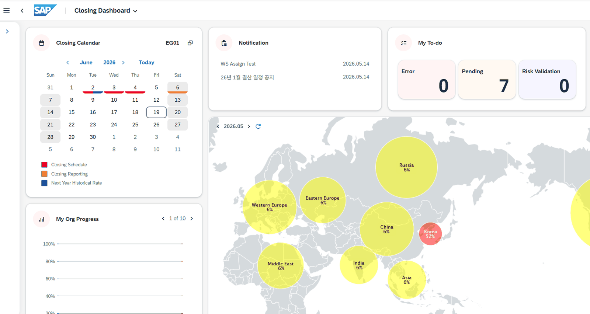
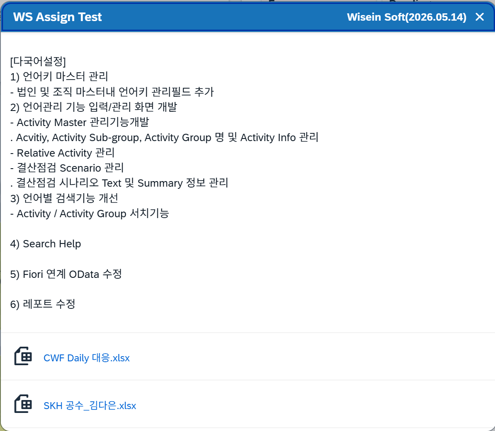
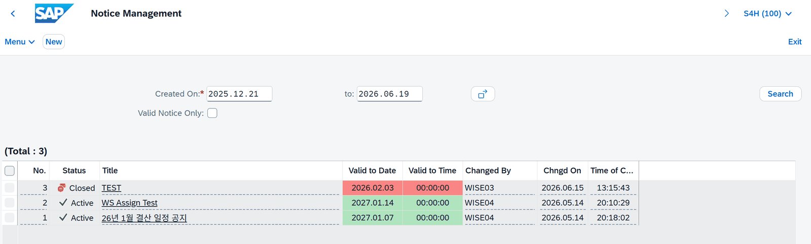
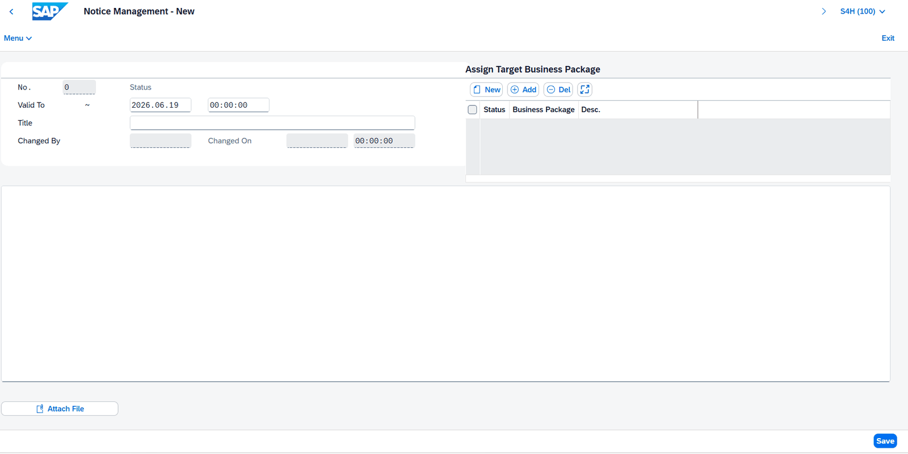
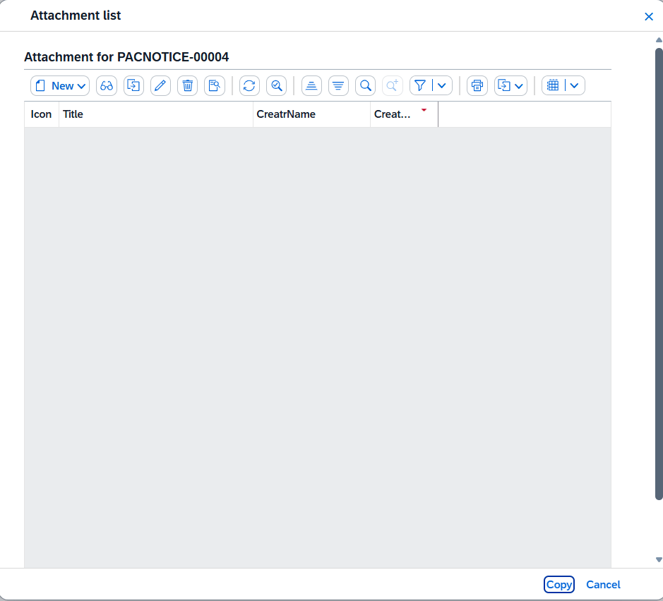
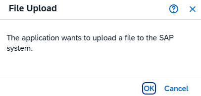
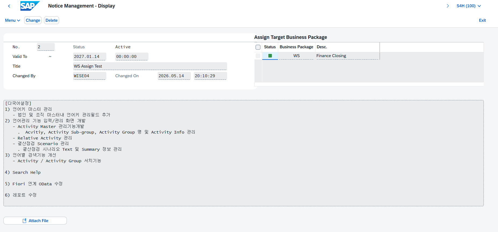

# 공지사항 운영자 매뉴얼

> 공지사항 관리 프로그램(ZLPAC0060)에서의 생성·수정·삭제와 첨부 파일 등록, APC를 통한 Fiori 실시간 반영 구조

| 문서명 | 공지사항 운영자 메뉴얼 |
|---|---|
| 대상 솔루션 | PAC (Process Automatic Channel) |
| 대상 독자 | SAP 결산자동화 운영 · 유지보수 담당자 |
| 문서 버전 | v1.0 |
| 작성일 | 2026-06-19 |

## 1. 공지사항 기본 개념

### 1.1 공지사항이란

공지사항(Notice)은 PAC 결산자동화 솔루션에서 운영 담당자가 결산 참여자에게 전달해야 하는 안내 사항을 Fiori 화면을 통해 공유하는 기능입니다.

등록된 공지사항은 Closing Dashboard 상단의 Notification 영역에 실시간으로 표시되며, 사용자가 별도로 새로고침하지 않아도 APC(ABAP Push Channel)를 통해 자동 반영됩니다.

> 💡 핵심 포인트 • Notification 영역에는 최대 3개까지 공지사항이 표시되며, 가장 최근에 등록된 공지사항이 가장 하단에 출력됩니다. • 공지사항은 Business Package(모듈) 단위로 대상을 지정할 수 있어, 특정 법인·조직에만 공지를 발송할 수 있습니다. • 유효기간(Valid To Date/Time)이 지난 공지사항은 목록에서 빨간색으로 표시되며, 'Valid Notice Only' 필터로 제외하여 조회할 수 있습니다.

### 1.2 Closing Dashboard에서 공지사항 확인

사용자는 Closing Dashboard의 Notification 영역에서 등록된 공지사항 목록을 확인할 수 있습니다. 공지사항 제목을 클릭하면 상세 내용이 팝업으로 표시됩니다.

[그림 1-1] Closing Dashboard — Notification 영역에 공지사항 표시 예시

[그림 1-2] 공지사항 상세 팝업 — 제목 클릭 시 내용 및 첨부 파일 확인

## 2. 공지사항 관리 프로그램 (ZLPAC0060)

### 2.1 프로그램 개요

| 프로그램명 | ZLPAC0060 |
|---|---|
| 프로그램 설명 | Notice Management — 공지사항 생성·변경·삭제 |
| 저장 테이블 | ZTPAC_NOTICE (공지사항 마스터), ZTPAC_NOTICE_ORG (공지 대상 조직) |
| APC 연계 | ZFPAC_CALL_APC_NOTICE 함수를 통해 Fiori Closing Dashboard에 실시간 반영 |
| Fiori 화면 | Notice Management (ZLPAC00020) |

### 2.2 공지사항 목록 화면

ZLPAC0060 실행 시 아래와 같은 공지사항 목록 화면이 표시됩니다.

이 화면에서 공지사항 조회·생성·변경·삭제를 수행합니다.

[그림 2-1] ZLPAC0060 공지사항 목록 화면 (Notice Management)

| 화면 요소 | 설명 |
|---|---|
| Created On (조회 기간) | 공지사항 등록일 기준 조회 기간을 설정합니다. From ~ To 날짜 범위로 입력합니다. |
| Valid Notice Only (체크박스) | 체크 시 유효기간이 지나지 않은 공지사항만 조회합니다. 미체크 시 만료된 공지도 포함하며 빨간색으로 표시됩니다. |
| Search 버튼 | 설정한 조회 조건으로 공지사항 목록을 검색합니다. |
| New 버튼 | 새로운 공지사항 생성 화면으로 이동합니다. |
| No. | 공지사항 번호 (자동 채번). |
| Status | Active: 유효기간 내 활성 공지 / Closed: 유효기간 만료 공지 (빨간색 표시). |
| Title | 공지사항 제목. 클릭(더블클릭) 시 상세 화면으로 이동합니다. |
| Valid to Date / Time | 공지사항 유효기간 만료일 및 만료 시각. |
| Changed By / Changed On | 마지막 변경자 및 변경 일시. |
| 💡 Status 색상 안내 • ✅ Active (녹색): 현재 유효기간 내 공지사항. Closing Dashboard Notification 영역에 표시됩니다. • 🔴 Closed (빨간 배경): 유효기간이 만료된 공지사항. 대시보드에는 표시되지 않습니다. |  |

## 3. 공지사항 생성

### 3.1 신규 공지사항 생성 화면

목록 화면에서 New 버튼을 클릭하면 아래와 같은 공지사항 생성 화면이 표시됩니다.

[그림 3-1] Notice Management - New 화면 (공지사항 생성)

### 3.2 입력 필드 설명

| 필드명 | 설명 | 필수 여부 |
|---|---|---|
| No. | 공지사항 번호. 저장 시 시스템이 자동으로 채번합니다. | 자동 |
| Status | 공지사항 활성 상태. 저장 후 유효기간에 따라 Active / Closed가 자동 설정됩니다. | 자동 |
| Valid To (날짜) | 공지사항 유효기간 만료일. 이 날짜 이후에는 대시보드에 더 이상 표시되지 않습니다. | 필수 |
| Valid To (시간) | 공지사항 유효기간 만료 시각 (HH:MM:SS). 기본값 00:00:00. | 필수 |
| Title | Closing Dashboard Notification 영역에 표시되는 공지사항 제목(요약 내용). | 필수 |
| Changed By / Changed On | 변경자 및 변경 일시. 저장 시 자동 입력됩니다. | 자동 |
| 본문 영역 (하단 텍스트 박스) | 공지사항 상세 본문 내용. 사용자가 제목을 클릭 시 표시되는 전체 내용. | 선택 |
| Assign Target Business Package | 이 공지를 표시할 Business Package(모듈)를 지정합니다. 미지정 시 전체 공개. | 선택 |

### 3.3 Business Package 지정

화면 우측의 Assign Target Business Package 영역에서 이 공지사항을 표시할 대상 모듈을 지정합니다.

| 버튼 | 설명 |
|---|---|
| New | 새 Business Package 항목 행을 추가합니다. |
| Add | 기존 Business Package 목록에서 선택하여 추가합니다. |
| Del | 선택한 Business Package 항목을 제거합니다. |
| 💡 Business Package 미지정 시 동작 • Assign Target Business Package에 아무 항목도 지정하지 않으면 전체 사용자(모든 모듈)에게 공지가 표시됩니다. • 특정 법인·조직에만 공지를 보내야 하는 경우 반드시 Business Package를 지정하십시오. • APC 전송 시 Business Package 지정 여부에 따라 메시지 형식이 달라집니다: - 전체 공개: N\|**\|A 형식으로 전송 - 특정 조직 지정: N\|{BUPAK}\|O\|{BUKRS}\|{GSBER}\|{CUNIT}\| 형식으로 전송 |  |

### 3.4 공지사항 생성 절차

**새공지사항을생성하는전체절차입니다.**

1. ZLPAC0060을 실행합니다. (T-Code: SA38 또는 SE38 → 프로그램명 입력 후 실행)
2. 목록 화면 상단의 New 버튼을 클릭합니다.
3. Valid To(날짜)에 이 공지사항이 표시될 마지막 날짜를 입력합니다.
4. Title에 Notification 영역에 표시될 제목(요약)을 입력합니다.
5. 하단 본문 영역에 상세 내용을 입력합니다.
6. (선택) 우측 Assign Target Business Package에서 대상 모듈을 지정합니다.
7. Save 버튼을 클릭하여 저장합니다. 저장 완료 시 번호(No.)가 자동 채번됩니다.
8. 저장 후 APC가 자동 발생하여 Closing Dashboard Notification 영역에 실시간 반영됩니다.

> ⚠ 주의사항 • 첨부 파일(Attach File)은 저장 완료 후에만 등록할 수 있습니다. 신규 생성 직후에는 첨부 기능이 비활성 상태입니다. • Title은 Notification 영역에 표시되는 핵심 내용이므로 간결하고 명확하게 작성하십시오.

## 4. 첨부 파일 등록

### 4.1 첨부 파일 기능 개요

공지사항에 관련 파일(Excel, PDF, 이미지 등)을 첨부하여 사용자가 Notification 팝업에서 바로 다운로드할 수 있도록 제공합니다.

첨부 파일은 공지사항 저장 이후에만 등록 가능합니다. 신규 생성(New) 화면에서는 Attach File 버튼이 비활성 상태입니다.

### 4.2 첨부 파일 등록 절차

1. 공지사항을 먼저 저장합니다. (4. 공지사항 생성 절차 참조)
2. 저장 완료된 공지사항을 더블클릭하여 Display 화면으로 이동합니다.
3. Change 버튼을 클릭하여 편집 모드로 전환합니다.
4. 화면 하단의 Attach File 버튼을 클릭합니다.

[그림 4-1] Attachment list 팝업 — 첨부 파일 목록 조회 화면

1. Attachment list 팝업이 표시됩니다. New 버튼을 클릭합니다.

[그림 4-2] File Upload 확인 팝업 — OK 클릭 시 파일 선택 다이얼로그 표시

1. "The application wants to upload a file to the SAP system." 확인 팝업에서 OK를 클릭합니다.
2. 파일 선택 다이얼로그에서 첨부할 파일을 선택합니다.
3. 파일이 업로드되면 Attachment list에 항목이 추가됩니다. Copy 버튼으로 확정합니다.

> 💡 첨부 파일 확인 • 첨부된 파일은 Closing Dashboard에서 공지사항 팝업을 열면 하단에 링크 형태로 표시됩니다. • 첨부 파일 번호는 PACNOTICE-XXXXX 형식으로 자동 채번됩니다.

## 5. 공지사항 수정 및 삭제

### 5.1 공지사항 상세 조회 및 수정

목록 화면에서 공지사항 Title을 더블 클릭하면 상세 조회(Display) 화면으로 이동합니다.

[그림 5-1] Notice Management - Display 화면 — 공지사항 상세 조회 및 수정

| 버튼/요소 | 설명 |
|---|---|
| Change 버튼 | 공지사항을 편집 가능한 상태로 전환합니다. Title, 본문, Valid To, Business Package 수정 가능. |
| Delete 버튼 | 공지사항을 삭제합니다. 삭제 전 확인 메시지가 표시됩니다. |
| Assign Target Business Package | 우측 영역에서 이 공지의 대상 Business Package와 조직 배정 현황을 확인합니다. |
| Attach File 버튼 | 첨부 파일을 추가하거나 기존 첨부 파일을 관리합니다. |

### 5.2 공지사항 수정 절차

1. 목록에서 수정할 공지사항 Title을 더블클릭합니다.
2. Display 화면에서 Change 버튼을 클릭합니다.
3. 수정할 내용(Title, 본문, Valid To 날짜 등)을 변경합니다.
4. 필요 시 우측 Business Package 영역에서 대상을 추가/삭제합니다.
5. Save 버튼을 클릭하여 저장합니다.
6. 저장 시 APC가 자동 발생하여 변경 내용이 Closing Dashboard에 실시간 반영됩니다.

### 5.3 공지사항 삭제 절차

1. 목록에서 삭제할 공지사항 Title을 더블클릭합니다.
2. Display 화면에서 Delete 버튼을 클릭합니다.
3. 확인 메시지가 표시되면 확인(OK)을 클릭합니다.
4. 삭제된 공지사항은 Closing Dashboard에서 즉시 제거됩니다.

> ⚠ 삭제 주의사항 • 삭제된 공지사항은 복구할 수 없습니다. 삭제 전 반드시 대상 공지사항을 확인하십시오. • 유효기간 만료가 목적이라면 삭제 대신 Valid To 날짜를 현재 날짜 이전으로 변경하는 방법을 권장합니다. 이력이 보존됩니다.

## 6. APC 연동 — 실시간 반영 구조

### 6.1 공지사항 APC 동작 개요

공지사항을 저장(생성/수정)하면 내부적으로 ZFPAC_CALL_APC_NOTICE 함수가 자동 호출됩니다. 이 함수는 APC(ABAP Push Channel)를 통해 메시지를 Fiori 화면으로 Push하여 Closing Dashboard가 즉시 갱신되도록 합니다.

### 6.2 ZFPAC_CALL_APC_NOTICE 함수 상세

| 함수명 | ZFPAC_CALL_APC_NOTICE |
|---|---|
| Function Group | ZPAC111 |
| 입력 파라미터 | IV_ITMSEQ: 공지사항 번호 (ZPAC_NOTICE_SEQ) |
| 출력 파라미터 | ES_RETURN: 처리 결과 (BAPIRET2) |

### 6.3 APC 메시지 전송 흐름

공지사항 저장 후 다음 순서로 APC 메시지가 전달됩니다.

| 단계 | 동작 | 비고 |
|---|---|---|
| 1 | Portal Notice APC 호출: ZPAC_NOTICE APC로 "NOTICE" 메시지 전송 | 연결된 Fiori 세션에 수신 알림 |
| 2 | ZTPAC_NOTICE 테이블에서 해당 공지사항 유효 여부 조회 | DATBI / TATBI 기준으로 유효 공지만 대상 |
| 3-A | Business Package 미지정(XCOMP 미설정) 시: N\|**\|A 형식으로 전체 대상 메시지 전송 | 전체 사용자 공지 |
| 3-B | Business Package 지정(XCOMP 설정) 시: ZTPAC_NOTICE_ORG에서 대상 조직 조회 후 조직별 메시지 전송 | N\|{BUPAK}\|O\|{BUKRS}\|... 형식 |
| 4 | 해당 ID로 연결된 Fiori 세션이 메시지를 수신하여 Notification 영역 갱신 | Closing Dashboard 자동 Refresh |

### 6.4 관련 데이터베이스 테이블

| 테이블명 | 설명 | 주요 필드 |
|---|---|---|
| ZTPAC_NOTICE | PAC 공지사항 마스터 테이블 | ITMSEQ(번호), NOTICEDESC(제목), LTEXT(본문), DATBI(만료일), TATBI(만료시각), ACTIVE(활성), XCOMP(조직지정여부) |
| ZTPAC_NOTICE_ORG | 공지사항 대상 조직 테이블 (Assign Target Business Package) | BUPAK(BP코드), ITMSEQ(공지번호), BUKRS(회사코드), GSBER(사업영역), CUNIT(기타조직) |
| 💡 APC 동작 전제 조건 • ZPAC_NOTICE APC가 SICF에서 활성(녹색) 상태여야 합니다. T-Code: SICF → 경로: /sap/bc/apc/sap/zpac_notice • AMC Authorized Program에 ZPAC111 Function Group이 등록되어 있어야 합니다. T-Code: SAMC • 공지사항 APC 동작 이상 시 APC 운영자 메뉴얼의 점검 가이드를 참고하십시오. |  |  |

## 7. 운영 · 유지보수 점검 가이드

### 7.1 정상 동작 확인 체크리스트

| 점검 항목 | 확인 방법 | 정상 기준 |
|---|---|---|
| SICF 서비스 활성화 | SICF에서 /sap/bc/apc/sap/zpac_notice 경로 조회 | 서비스가 활성(녹색) 상태 |
| AMC 인가 프로그램 등록 | SAMC에서 ZPAC_NOTICE 채널 → Authorized Program 확인 | ZPAC111(Function Group) 등록 확인 |
| 공지사항 저장 후 실시간 반영 | ZLPAC0060에서 공지사항 저장 후 Closing Dashboard 확인 | Notification 영역에 즉시 표시 |
| Valid to Date 기준 표시 | 만료일이 지난 공지사항이 목록에서 빨간색 표시 여부 | Closed 상태로 빨간색 표시 |

### 7.2 증상별 점검 가이드

| 증상 | 우선 점검 사항 | 조치 방법 |
|---|---|---|
| 공지사항 저장 후 대시보드에 미표시 | ① SICF 서비스 활성화 여부 ② Valid to Date가 현재 날짜 이후인지 확인 | SICF 활성화 또는 유효기간 재설정 |
| 특정 사용자에게만 공지 미표시 | Assign Target Business Package에서 해당 사용자의 BP가 등록되어 있는지 확인 | 대상 BP를 추가하거나 전체 공개(BP 미지정)로 변경 |
| 공지사항이 전혀 실시간 반영 안 됨 | APC 운영자 메뉴얼 5.2절 "공지사항(Notice) 실시간 표시 안 됨" 항목 확인 | SICF, SAMC, APC SAPC Test Run 순서로 점검 |
| Notification 영역에 4개 이상 표시 안 됨 | 최대 3개까지 표시되는 PAC 설계 스펙 확인 | 설계 스펙 정상 동작. 오래된 공지 만료일 조정 권장 |
| 첨부 파일이 팝업에 표시 안 됨 | 공지사항 저장 후 Attach File을 통해 파일 업로드 완료 여부 확인 | 파일 업로드 재시도 또는 세션 재로그인 |
| 💡 APC 상세 점검은 APC 운영자 메뉴얼 참조 • 공지사항 실시간 반영 오류의 근본 원인이 APC 설정에 있을 경우, 별도 APC 운영자 메뉴얼의 5장 "운영 · 유지보수 점검 가이드"를 참고하십시오. • SICF 경로: /sap/bc/apc/sap/zpac_notice • SAMC 채널: ZPAC_NOTICE |  |  |

## 8. 용어집 (Glossary)

본 문서에 등장하는 주요 용어와 약어를 정리합니다.

| 용어 / 약어 | 설명 |
|---|---|
| PAC | Process Automatic Channel. 본 문서의 대상인 SAP 결산자동화 솔루션. |
| Notice (공지사항) | PAC에서 운영 담당자가 결산 참여자에게 전달하는 공지. ZTPAC_NOTICE 테이블에 저장됨. |
| ZLPAC0060 | PAC 공지사항 관리 프로그램 (Notice Management). 생성·변경·삭제 기능 제공. |
| Notification 영역 | Closing Dashboard 상단에 표시되는 공지사항 목록 영역. 최대 3개까지 표시. |
| Closing Dashboard | PAC의 메인 Fiori 화면. 결산 현황 캘린더, 공지사항, My To-Do 등을 표시. |
| APC (ABAP Push Channel) | ABAP 서버가 Fiori 화면으로 메시지를 Push하는 실시간 통신 기술. WebSocket 기반. |
| ZFPAC_CALL_APC_NOTICE | 공지사항 저장 시 APC 메시지를 발송하는 PAC 함수. Function Group: ZPAC111. |
| ZPAC_NOTICE (APC명) | 공지사항 실시간 반영을 위한 PAC 전용 APC. SICF 경로: /sap/bc/apc/sap/zpac_notice. |
| ZTPAC_NOTICE | 공지사항 마스터 테이블. 번호(ITMSEQ), 제목(NOTICEDESC), 본문(LTEXT), 유효기간(DATBI/TATBI) 저장. |
| ZTPAC_NOTICE_ORG | 공지사항 대상 조직 테이블. Business Package별 공지 대상 법인·조직 정보 저장. |
| Business Package (BP, BUPAK) | PAC 결산 프로세스의 업무 단위(모듈). 공지사항에서 수신 대상 범위를 지정하는 키. |
| Valid to Date / Time | 공지사항 유효기간 만료일 및 시각. 이후에는 Active → Closed 상태로 전환. |
| XCOMP (조직지정여부) | ZTPAC_NOTICE 테이블 필드. 공지 대상 조직이 지정된 경우 값이 설정됨. |
| Assign Target Business Package | 공지사항 생성·수정 화면의 우측 영역. 공지를 표시할 BP 및 조직을 지정. |
| Attach File (첨부 파일) | 공지사항에 파일을 첨부하는 기능. 저장 완료 후에만 이용 가능. |
| Status (Active/Closed) | Active: 유효기간 내 공지(녹색). Closed: 만료 공지(빨간색). |
| SICF | ICF 서비스 활성화 트랜잭션. APC WebSocket 서비스를 활성화할 때 사용. |
| SAMC | AMC 채널 관리 트랜잭션. 채널 인가 프로그램(Authorized Program) 등록 시 사용. |
| AMC (ABAP Messaging Channel) | APC와 짝을 이루어 메시지를 채널에 실어 나르는 SAP 표준 기술. |
| Fiori | SAP의 웹 기반 사용자 인터페이스(UI). Closing Dashboard(zfrpac00020) 포함. |
| SA38 / SE38 | ABAP 프로그램을 실행하는 SAP 표준 트랜잭션. |

— 문서 끝 —
