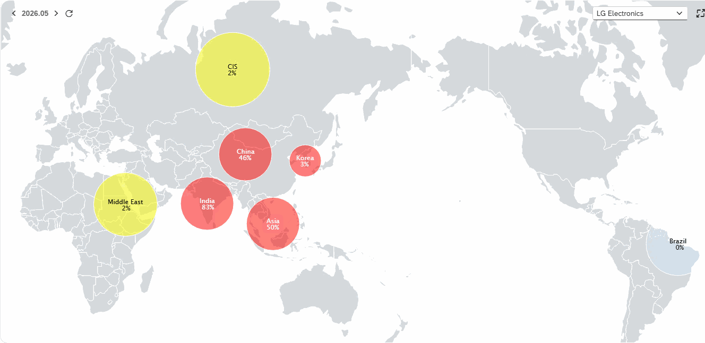
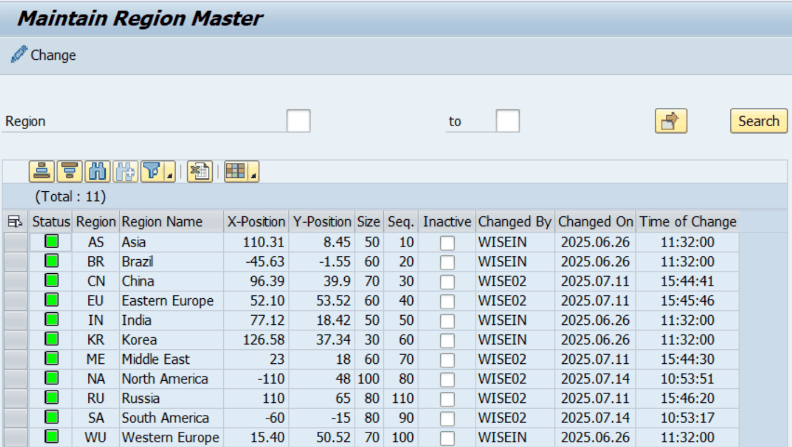
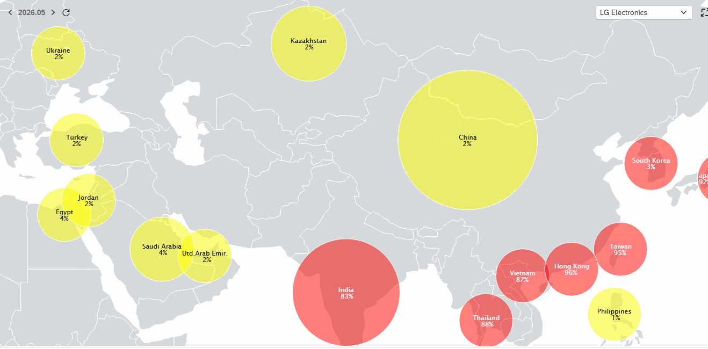
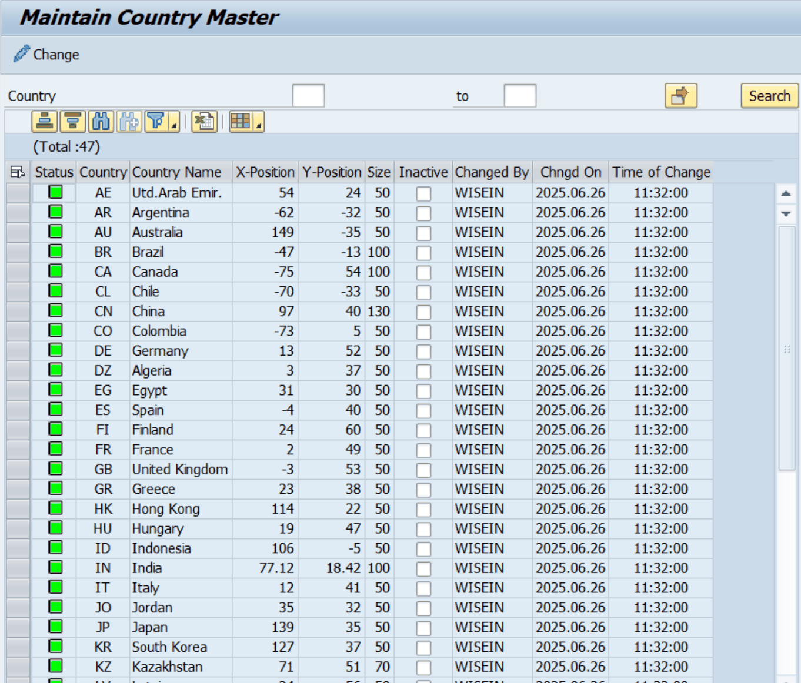

# 2. 기초 조직 분류 마스터 (지역 · 국가 · 회사그룹)

이 장의 세 프로그램은 조직을 지도·그룹으로 분류·표시하기 위한 기준 정보를 관리합니다. 회사코드·사업영역·결산단위 마스터(3·4장)에서 이 값들을 참조하므로, 일반적으로 가장 먼저 등록합니다.

## 2.1 ZLPAC0091 — 지역(Region) 마스터

| 구분 | 내용 |
|---|---|
| 프로그램 / 트랜잭션 | ZLPAC0091 |
| 프로그램 설명 | Maintain Region Master (지역 마스터 유지보수) |
| 유지보수 테이블 | ZTPAC_REGION (Region Master) |
| 기능 | 결산 현황을 지역 단위로 묶어 지도/대시보드에 표시하기 위한 지역 코드를 등록·관리합니다. |

지역(Region)은 회사코드 마스터에서 각 회사가 속한 지역을 지정할 때 사용됩니다. 지도 표시를 위한 좌표와 원(circle) 크기, 정렬 순서를 함께 관리합니다.

| 필드 | 의미 | 설명 | 키 |
|---|---|---|---|
| REGION | 지역 코드 | 키. 지역을 식별하는 코드 | ★ |
| Region Name | 지역명 | 지역 코드의 설명 텍스트 |  |
| X-Position / Y-Position | 지도 좌표 | 지도 표시용 X / Y 위치 값 |  |
| Size | 원 크기 | 지도에 표시되는 원의 크기 |  |
| Seq | 정렬 순서 | 화면 표시 순서(항목 시퀀스) |  |
| Inactive | 삭제 플래그 | 삭제 표시(논리 삭제) |  |

## 2.2 ZLPAC0092 — 국가(Country) 마스터

| 구분 | 내용 |
|---|---|
| 프로그램 / 트랜잭션 | ZLPAC0092 |
| 프로그램 설명 | Maintain Country Master (국가 마스터 유지보수) |
| 유지보수 테이블 | ZTPAC_COUNTRY (Country Master) |
| 기능 | 국가 코드별 지도 표시 정보(좌표·원 크기)를 등록·관리합니다. |

국가 코드(LAND1)는 SAP 표준 국가키를 사용하며, 지도 시각화를 위한 좌표와 원 크기를 관리합니다. 국가명은 SAP 표준 국가 테이블(T005T)의 텍스트를 참조합니다(소스의 GT_LAND1 내부 테이블).

| 필드 | 의미 | 설명 | 키 |
|---|---|---|---|
| Country | 국가 키 | 키. SAP 표준 국가 코드 | ★ |
| Country Name | 국가명 | 국가 키의 설명 텍스트 |  |
| X-Position / Y-Position | 지도 좌표 | 지도 표시용 X / Y 위치 값 |  |
| Size | 원 크기 | 지도에 표시되는 원의 크기 |  |
| Inactive | 삭제 플래그 | 삭제 표시(논리 삭제) |  |

## 2.3 ZLPAC0093 — 회사그룹(Company Group) 마스터

| 구분 | 내용 |  |  |
|---|---|---|---|
| 프로그램 / 트랜잭션 | ZLPAC0093 |  |  |
| 프로그램 설명 | Maintain Company Group Master (회사그룹 마스터 유지보수) |  |  |
| 유지보수 테이블 | ZTPAC_COM_GRP (Company Group Master) |  |  |
| 기능 | 여러 회사코드를 하나의 그룹으로 묶는 회사그룹 코드를 등록·관리합니다. |  |  |
| 필드 | 의미 | 설명 | 키 |
| Company Group | 회사그룹 코드 | 키. 회사그룹을 식별하는 코드 | ★ |
| Company Group Text | 회사그룹명 | 회사그룹 코드의 설명 텍스트 |  |
| Seq | 정렬 순서 | 화면 표시 순서(항목 시퀀스) |  |
| Inactive | 삭제 플래그 | 삭제 표시(논리 삭제) |  |
| 보완 설명 (SAP 표준·소스 확인) 프로그램 소스 내부 주석 일부에는 이 프로그램을 ‘Region Group을 정의한다’ 로 기재한 부분이 있으나, 프로그램·트랜잭션 설명과 유지보수 테이블(ZTPAC_COM_GRP, DDIC 라벨 ‘Company Group Master’)은 회사그룹 마스터입니다. 본 문서는 권위 있는 정의인 테이블 라벨·트랜잭션 텍스트를 기준으로 회사그룹으로 기술합니다. |  |  |  |
