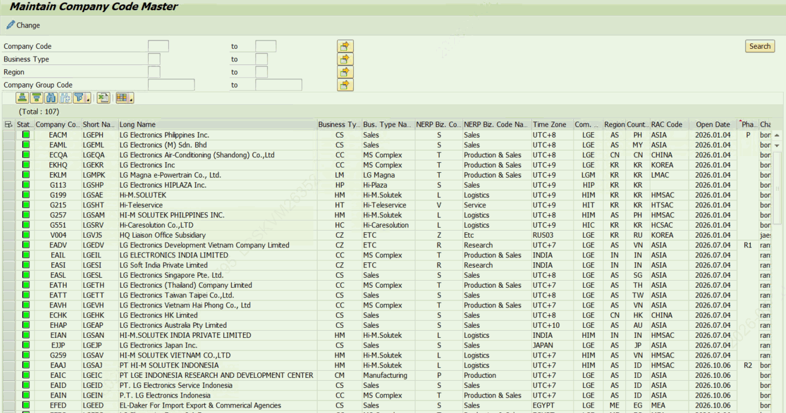
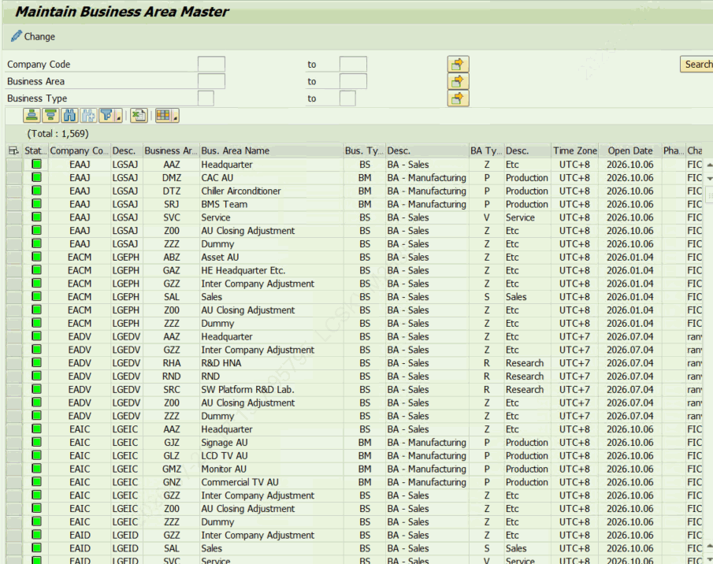

# 4. 조직 마스터 (회사코드 · 사업영역 · 기타조직)

이 장의 세 프로그램은 실제 결산 대상 조직을 관리합니다. 비즈니스 패키지의 조직 레벨(PACLVL)에 따라 사용하는 마스터가 달라집니다 — 회사코드 레벨(C)은 4.1, 사업영역 레벨(B)은 4.2, 결산단위 레벨(U)은 4.3을 사용합니다.

## 4.1 ZLPAC0018 — 회사코드(Company Code) 마스터

| 구분 | 내용 |
|---|---|
| 프로그램 / 트랜잭션 | ZLPAC0018 |
| 프로그램 설명 | Maintain Company Code Master (회사코드 마스터 유지보수) |
| 유지보수 테이블 | ZTPAC_COM_MAST (Company Code Master for PAC) |
| 기능 | PAC 결산 대상 회사코드별 속성(비즈니스 유형·지역·회사그룹·시간대·오픈 정보 등)을 등록·관리합니다. |

회사명은 SAP 표준 회사코드 테이블(T001)에서, 시간대명은 TTZZ / TTZ5 에서 참조합니다. 지역·회사그룹·비즈니스 유형은 2·3장의 마스터에서 등록한 값을 지정합니다.

- 법인정보가 담겨있는 조회용 프로그램입니다.
- Open Date, Phase 수정 요청시 해당 프로그램에서 수정가능 합니다.
- (Opne Date 수정 시 ZLPAC0019의 Open Date도 함께 수정해야 합니다.)

| 필드 | 의미 | 설명 | 키 |
|---|---|---|---|
| Company Code | 회사코드 | 키. SAP 표준 회사코드 | ★ |
| Short Name | 회사코드명 |  |  |
| Business Type | 비즈니스 유형 | 회사코드에 적용할 비즈니스 유형(ZLPAC0013) |  |
| Bus.Type Name | 비즈니스 유형 명 |  |  |
| NERP Biz.Code | 회사코드 유형 |  |  |
| NERP Biz.Code Name | 회사코드 유형명 |  |  |
| Time Zone | 시간대 | 회사의 표준 시간대 |  |
| Company Group | 회사그룹 | 소속 회사그룹(ZLPAC0093) |  |
| Region | 지역 | 소속 지역(ZLPAC0091) |  |
| Country | 국가 | 국가(ZLPAC0092) |  |
| RAC Code | RAC Code |  |  |
| Open Date | 오픈일 | 결산 오픈(개시) 일자 |  |
| Phase | 오픈 순서 | 결산 오픈 순서/차수 |  |
| SPRA | 언어 키 | 기준 언어 |  |

## 4.2 ZLPAC0019 — 사업영역(Business Area) 마스터

| 구분 | 내용 |
|---|---|
| 프로그램 / 트랜잭션 | ZLPAC0019 |
| 프로그램 설명 | Maintain Business Area Master (사업영역 마스터 유지보수) |
| 유지보수 테이블 | ZTPAC_BA_MAST (Business Area Master for PAC) |
| 기능 | 회사코드 + 사업영역 단위로 결산 속성(비즈니스 유형·시간대·오픈 정보)을 등록·관리합니다. |

사업영역명은 SAP 표준 테이블(TGSBT)에서 참조합니다. 이 프로그램에는 비즈니스 패키지 선택을 위한 보조 화면(화면번호 0200)이 있어, 특정 비즈니스 패키지에 대한 기본 조직을 함께 처리할 수 있습니다(소스의 GS_200, GT_DEFAULT_ORG).

- 법인의Open Date가 ZLPAC0018에 세팅 된 Open Date와 동일해야 합니다.

| 필드 | 의미 | 설명 | 키 |
|---|---|---|---|
| Company Code | 회사코드 | 키. SAP 표준 회사코드 | ★ |
| Business Area | 사업영역 | 키. SAP 표준 사업영역 | ★ |
| Bus.Type | 비즈니스 유형 | 적용할 비즈니스 유형(ZLPAC0013) |  |
| Time Zone | 시간대 | 표준 시간대 |  |
| Open Date | 오픈일 | 결산 오픈(개시) 일자 |  |
| Phase | 오픈 순서 | 결산 오픈 순서/차수 |  |
| SPRAS | 언어 키 | 기준 언어 |  |

## 4.3 ZLPAC0200 — 기타조직(결산단위) 정의

| 구분 | 내용 |
|---|---|
| 프로그램 / 트랜잭션 | ZLPAC0200 |
| 프로그램 설명 | Define Other Organization ‘U’ (기타조직 정의) |
| 유지보수 테이블 | ZTPAC_CUNIT_MAST (Other Organization Master) |
| 기능 | 회사코드·사업영역이 아닌 별도의 결산단위(기타조직, Closing Unit)를 비즈니스 패키지별로 정의합니다. |

결산단위(기타조직, CUNIT)는 회사코드/사업영역만으로 표현하기 어려운 결산 관리 단위를 위한 조직입니다. 비즈니스 패키지(BUPAK) + 회사코드(BUKRS) + 결산단위(CUNIT)가 키가 됩니다.

**Organization Level이‘U’인Business Package만 조회 가능**합니다.

| 필드 | 의미 | 설명 | 키 |
|---|---|---|---|
| Business Package | 비즈니스 패키지 | 키. 결산단위가 속한 비즈니스 패키지 | ★ |
| Company Code | 회사코드 | 키. SAP 표준 회사코드 | ★ |
| CUNIT | 결산단위(기타조직) | 키. 결산단위 코드 | ★ |
| CTEXT | 결산단위명 | 결산단위의 설명 텍스트 |  |
| Bus.Type | 비즈니스 유형 | 적용할 비즈니스 유형 |  |
| Bus.Type Text | 비즈니스 유형명 | 비즈니스 유형의 설명 텍스트 |  |
| Time Zone | 시간대 | 표준 시간대 |  |
| Open Date / Open Pnase | 오픈일 / 오픈 순서 | 결산 오픈 일자 및 순서 |  |
