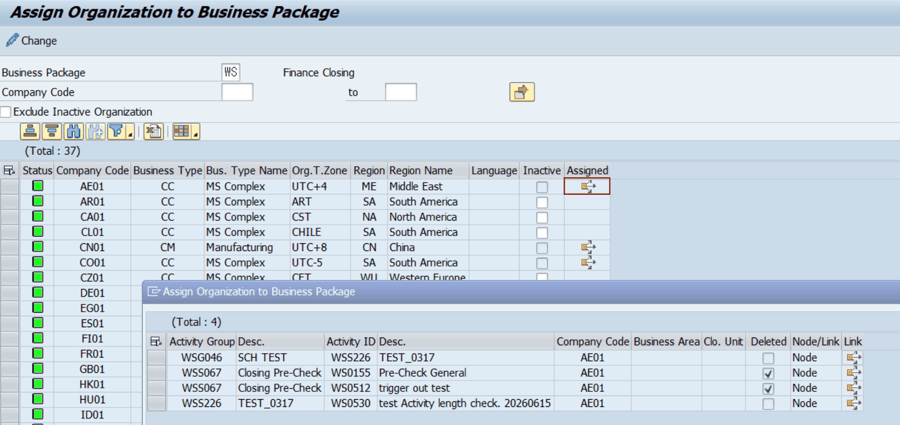

# 5. 비즈니스 패키지 조직 배정

## 5.1 ZLPAC0050 — 비즈니스 패키지 조직 배정

| 구분 | 내용 |
|---|---|
| 프로그램 / 트랜잭션 | ZLPAC0050 |
| 프로그램 설명 | Assign Organization to Business Package (비즈니스 패키지에 조직 배정) |
| 유지보수 테이블 | ZTPAC_CONFIG_COM / ZTPAC_CONFIG_BA / ZTPAC_CONFIG_UNI |
| 기능 | 선택한 비즈니스 패키지의 조직 레벨(PACLVL)에 따라 회사코드·사업영역·결산단위를 결산 대상으로 배정(설정)합니다. |

이 프로그램은 4장에서 등록한 조직 마스터를 실제 결산 대상으로 **연결(배정)**하는 핵심 설정 프로그램입니다. 소스 상단 설명에 ‘조직구조인 회사코드, 사업영역, 결산단위를 유지보수한다’ 로 명시되어 있습니다. 선택한 비즈니스 패키지의 조직 레벨(PACLVL: C/B/U)에 따라 대상 설정 테이블이 결정됩니다.

● Assigned 필드의 아이콘을 클릭하면 해당 Company Code Assign된 Activity를 확인 할 수 있습니다.

-모델링에서 삭제된 Activity는 Delete 필드에 체크로 표시됩니다. (Node, Link로 표시)

-Link 아이콘을 클릭하면 해당 Activity가 모델링 된 Map으로 바로 이동합니다.

| PACLVL | 배정 대상 조직 | 설정 테이블 |
|---|---|---|
| C | 회사코드 | ZTPAC_CONFIG_COM |
| B | 사업영역 | ZTPAC_CONFIG_BA |
| U | 결산단위(기타조직) | ZTPAC_CONFIG_UNI |

[표 5-1] 조직 레벨별 배정 설정 테이블 — ZLPAC0050 TOP 인클루드 기준.

> 핵심 포인트 비즈니스 유형(BUSTY) 입력 규칙(소스 주석 기준): • SPECIFIC BUSTY인 경우 입력 가능하나, 조직 매핑이 이미 존재하면 BUSTY 입력 불가. • 조직 레벨이 U(결산단위) 인 경우 BUSTY는 결산단위 마스터의 값으로 결정되므로 여기서 직접 입력하지 않습니다. • INACTIVE 필드로 배정을 비활성화할 수 있으며, 중복 배정 여부를 저장 전에 검증합니다(GT_DUP_COM/BA/UNI).
> ⚠ 주의 이미 결산이 진행 중이거나 사용 중인 조직의 배정을 변경·삭제하면 결산 상태에 영향을 줄 수 있습니다. 법인 삭제의 경우 결산 내역이 있으면 삭제가 아닌 Inactive처리 해야 합니다. 소스에서도 조직이 매핑에 사용된 경우 삭제를 제한합니다(ORG_MAP_EXIST). 마스터 구조를 변경한 경우에는 6장의 상태 동기화 배치를 이어서 수행하는 것을 권장합니다.
