# REWORK 운영자 매뉴얼

> 완료된 Activity의 재작업 발생 감지 체계, REWORK Rule 활성화와 점검 주기, Linked Activity 동작, 모니터링 화면 기준 시나리오

추가 기표(Rework) 점검 · Linked Activity 운영 가이드

| 항목 | 내용 |
|---|---|
| 문서명 | REWORK 운영자 메뉴얼 |
| 대상 솔루션 | PAC (Process Automatic Channel) |
| 대상 독자 | SAP 결산자동화 운영 · 유지보수 담당자 |
| 문서 버전 | v1.0 |
| 작성일 | 2026-06-23 |

## 1. REWORK 기본 개념

### 1.1 REWORK란 무엇인가

REWORK(재작업)는 이미 수행이 완료된 결산 Activity에 대해, 그 이후 추가 기표(전표)가 발생했을 때 해당 Activity의 결과를 다시 수행해야 하는지를 자동으로 점검·표시하는 기능입니다. 결산은 선행 Activity의 결과를 후행 Activity가 이어받는 구조이므로, 완료된 단계의 전제(기표 내역)가 바뀌면 그 단계와 연결된 이후 라인의 결과도 더 이상 유효하지 않을 수 있습니다. REWORK는 이러한 상황을 시스템이 스스로 감지하여 담당자에게 알리는 장치입니다.

REWORK 점검은 Activity Master의 Rework 설정을 기준으로 동작합니다. 점검이 활성화(Active)된 경우에만 추가 기표에 대한 Rework 판단이 수행됩니다.

### 1.2 REWORK가 발생하는 상황

Activity가 완료된 이후, 그 Activity가 다루는 계정(G/L Account) 등에 해당하는 전표가 추가로 기표되면 REWORK 점검 대상이 됩니다. 점검 결과 추가 기표가 Rework 대상으로 판정되면, 시스템은 다음 두 가지를 수행합니다.

- 해당 Activity의 상태를 'Rework Occurred'(재작업 필요)로 변경한다.
- 해당 Activity와 연결(Linked)된 라인의 자동수행을 중단한다.
즉 REWORK는 '잘못되었음'을 의미하는 것이 아니라, '전제가 바뀌었으니 다시 확인·수행이 필요함'을 운영자에게 알리는 신호입니다.

### 1.3 중복 점검 방지 (점검 시각 기록)

동일한 전표를 반복해서 점검하지 않도록, 시스템은 Rework 점검을 수행한 시각을 Activity 상태 테이블에 기록합니다. 이후에는 그 시각 이후에 발생한 전표 내역만 점검 대상으로 삼아 중복 점검을 회피합니다.

> 시스템 확인 — 점검 시각 저장 위치 테이블 ZTPAC_STATUS (PAC Activity Status) RWDT (데이터요소 ZPAC_REWORK_DATE) — Rework 점검 수행 일자 RWTM (데이터요소 ZPAC_REWORK_TIME) — Rework 점검 수행 시각 두 필드가 운영 시스템 테이블 구조에서 실재함을 확인하였습니다.

## 2. REWORK 점검 대상 판단 체계

추가 기표가 Rework 대상인지 여부는 다음 세 가지 방식으로 판단합니다. 세 방식은 함께 사용할 수 있으며, 각각의 정의 화면(프로그램)이 정해져 있습니다.

| 구분 | 정의 위치(T-Code / 프로그램) | 역할 |
|---|---|---|
| ① Rework Rule ID | ZLPAC3000 | Rework 판정 규칙의 머리(헤더)를 정의 — CoA, Rule ID, 적요 |
| ② Rework Rule 상세 | ZLPAC3010 | 규칙별 판정 조건을 정의 — G/L 계정·차/대변·Functional Area·외화 여부 |
| ③ Rework Function | ZLPAC0020에서 Activity에 지정 | 전표 정보를 상세 점검하는 EXIT(함수) 방식 판정 |

### 2.1 Rework Rule ID 정의 (ZLPAC3000)

Rework 판정 규칙의 머리글을 등록하는 화면입니다. 계정과목표(Chart of Accounts), Rework Rule ID(코드명), Description(적요)을 입력하여 규칙을 생성합니다.

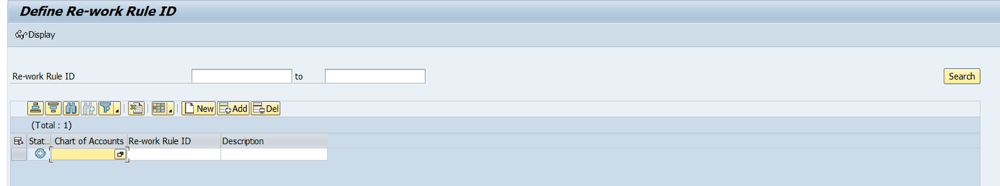

[그림 2-1] ZLPAC3000 — Define Re-work Rule ID 초기(신규 행) 화면

규칙을 입력하고 저장하면 아래와 같이 목록에 등록됩니다. 예시는 계정과목표 CAKR, Rule ID 'FOREIGN', 적요 'Foreign currency valuation'으로 등록한 모습입니다.

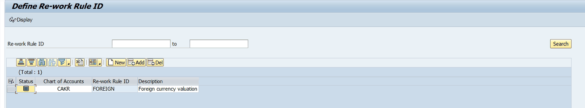

[그림 2-2] ZLPAC3000 — Rework Rule ID 등록 결과

> 시스템 확인 — 프로그램/트랜잭션 ZLPAC3000 : 프로그램 'Define Re-work Rule ID', 동명 트랜잭션 'Define Rework Rule ID' (패키지 ZPAC) 실재 확인

### 2.2 Rework Rule 상세 정의 (ZLPAC3010)

ZLPAC3000에서 생성한 Rework Rule ID를 더블 클릭하면 상세 정의 화면(ZLPAC3010)으로 이동합니다. 여기서 규칙별로 다음 값을 지정하여 어떤 전표를 Rework로 판단할지 결정합니다.

- G/L Account (계정 범위: From ~ To)
- D/C Indicator (차변 'S' / 대변 'H' 지시자)
- Functional Area (기능 영역)
- Only for Foreign Currency (외화 전용 여부)

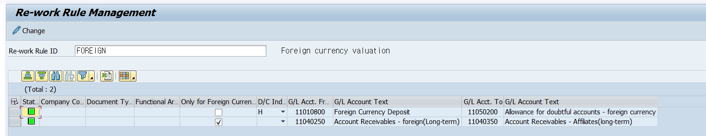

[그림 2-3] ZLPAC3010 — Re-work Rule Management ('FOREIGN' 규칙 상세)

아래는 또 다른 규칙 'SALES_WARRANTY_RESERVE_PL'(Reserve for Warranty on sales PL Method)의 상세 정의 예시로, G/L 계정 21350301을 판정 대상으로 지정한 모습입니다.

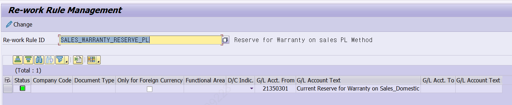

[그림 2-4] ZLPAC3010 — 'SALES_WARRANTY_RESERVE_PL' 규칙 상세

> 시스템 확인 — 프로그램/트랜잭션 ZLPAC3010 : 프로그램 'Re-work Rule Management', 동명 트랜잭션 'Maintain Re-work Rule ID' (패키지 ZPAC) 실재 확인

### 2.3 Activity Master에 Rework Rule 지정 (ZLPAC0020)

정의한 규칙을 실제 결산 Activity에 연결하는 단계입니다. Activity Master 화면(ZLPAC0020)에서 대상 Activity를 선택하고 'Rework Rule ID'를 지정합니다. 지정 팝업에서는 Rework Rule ID와 함께 'Rework Function'(상세 점검 함수)을 함께 지정할 수 있습니다.

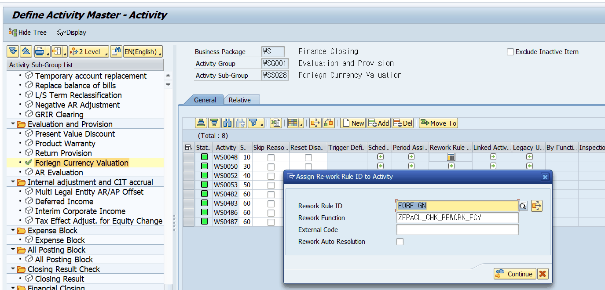

[그림 2-5] ZLPAC0020 — Activity에 Rework Rule ID 지정 (예: Rule 'FOREIGN', Function 'ZFPACL_CHK_REWORK_FCV')

> 시스템 확인 — 프로그램 ZLPAC0020 : 프로그램 'Define Activity Master' (패키지 ZPAC) 실재 확인

### 2.4 Rework Function (EXIT 방식 상세 점검)

Rework Function은 발생 전표 정보를 바탕으로 Rework 발생 여부를 상세하게 확인하는 EXIT(사용자 함수) 개념의 점검 방식입니다. Rule ID·상세 조건만으로 판정하기 어려운 업무 규칙을 함수 로직으로 추가 점검할 때 사용합니다. Activity에 지정한 함수가 호출되어 해당 건이 Rework 대상인지 최종 판정합니다.

> 시스템 확인 — Rework Function 예시 ZFPACL_CHK_REWORK_FCV : 함수모듈 'Check Rework Foreign Currency Valuation' (함수그룹 ZPACL120, 패키지 ZPAC_CL) 실재 확인 외화평가(Foreign Currency Valuation) Activity에 지정되는 Rework 상세 점검 함수입니다.

## 3. REWORK 활성화 및 점검 주기

### 3.1 Rework 활성화 설정

REWORK 점검은 Business Package 단위의 설정 값에 따라 켜지고 꺼집니다. 설정이 활성화된 Business Package에 대해서만 추가 기표 점검과 주기적 일괄 점검이 수행됩니다.

> 시스템 확인 — 활성화/주기 설정 필드 테이블 ZTPAC_CONFIG (PAC - Global Config) XREWORK (데이터요소 ZPAC_XREWORK) — Rework 점검 활성화 여부('X'=활성) RWTMOUT (데이터요소 ZPAC_REWORK_TIMEOUT) — Rework 주기 점검 간격(분, Rework Duration) 두 필드가 운영 시스템 테이블 구조에서 실재함을 확인하였습니다.

### 3.2 점검 주기

Rework 점검은 크게 두 시점에 수행됩니다.

- **자동수행 중 수시 점검 —** 결산 자동수행(Start)이 진행되는 동안, 각 수행 단계에서 Rework 점검 로직이 함께 호출됩니다.
- **주기적 일괄(배치) 점검 —** Rework가 활성화된 Business Package에 대해 일괄 점검 배치 작업을 생성하여, 설정된 주기(Rework Duration, 분 단위)마다 반복 점검합니다.

> 시스템 확인 — 자동수행 중 수시 점검 ZCL_PAC_SAIL (클래스 'Process Automatic Channel - Execute')의 START_REWORK_CHECK 메소드가 SAIL_START / SAIL_PROCESS_GROUP / SAIL_BUSINESS_PACKAGE 수행 흐름에서 호출됨을 소스에서 확인하였습니다.

### 3.3 Rework 일괄 점검 배치 (ZLPAC7191)

주기적 일괄 점검은 Business Package별 배치 작업으로 생성되어 수행됩니다. 배치 생성 로직은 Rework가 활성화된 Business Package를 선별하여 각각에 대해 점검 배치 잡을 등록하고, 즉시 실행 또는 설정된 주기(분) 이후 실행으로 스케줄링합니다.

> 시스템 확인 — 배치 생성 로직 ZCL_PAC_SAIL=>CREATE_REWORK_BUPAK_JOB 메소드 (소스 확인) • 대상 선별: ZTPAC_CONFIG에서 XREWORK='X' 이고 (PACLVL='C' 또는 REQ_BUKRS='X')인 Business Package • 실행 리포트: ZLPAC7191 ('Rework All Closing Check - Batch Session') • 배치 잡 명: [PAC]REWORK(<Business Package>)_<년>/<월> • 주기 실행: 즉시실행이 아닌 경우 ZTPAC_CONFIG-RWTMOUT(분)을 더한 시각으로 다음 실행 예약 • 전달 파라미터: P_BUPAK · P_GJAHR · P_MONAT

## 4. Linked Activity (연관 라인) 동작

### 4.1 Linked Activity 개념

Linked Activity(연관 Activity)는 하나의 Activity와 업무적으로 연결되어 함께 다뤄져야 하는 다른 Activity들을 지정한 것입니다. Rework가 발생하면 대상 Activity뿐 아니라, 그와 연결된 Linked Activity 라인의 자동수행도 함께 중단되어 'Rework Occurred' 상태로 전파됩니다. 즉 Linked Activity는 '전제가 바뀌면 함께 재확인이 필요한 작업들'을 묶어 둔 집합입니다.

### 4.2 Linked Activity 등록 (ZLPAC0020)

Activity Master(ZLPAC0020) 화면에는 Activity별로 'Rework Rule ID' 열과 'Linked Activity' 열이 제공됩니다. 아래는 Business Package FI(Subsidiary Closing)의 Activity Group FIG001 하위, (PL Method) Sales Warranty(FIS121)에 속한 Closing ID 목록(FI0247 / FI0250 / FI0251 / FI0248)과 두 열의 모습입니다.

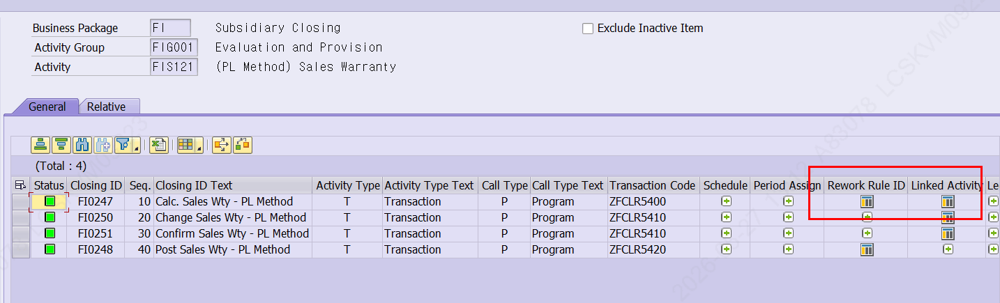

[그림 4-1] ZLPAC0020 — Activity 목록의 Rework Rule ID · Linked Activity 열

'Linked Activity' 열에서 기준 Closing ID(예: FI0247)에 연결할 다른 Closing ID들을 지정합니다. 아래 팝업은 FI0247에 FI0248 / FI0250 / FI0251을 연관 라인으로 등록한 모습이며, 'Active Mass Reset Button for linked activities' 옵션으로 연관 항목의 일괄 리셋 버튼 사용 여부를 함께 지정할 수 있습니다.

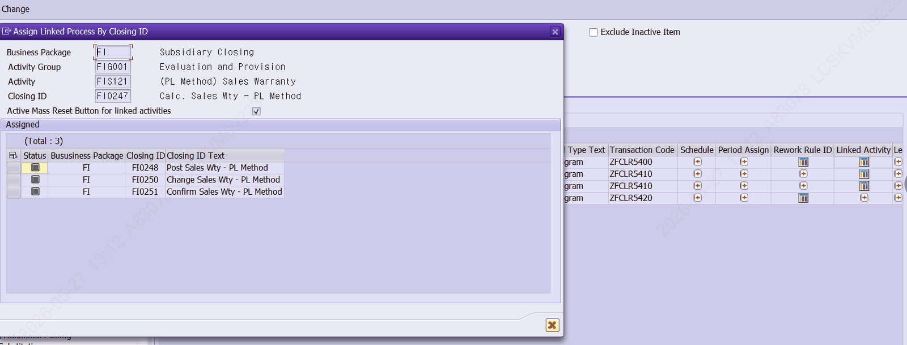

[그림 4-2] ZLPAC0020 — Assign Linked Process By Closing ID 팝업

### 4.3 Linked Rework 전파

기준 Activity에서 Rework가 발생하면, 연결된 Linked Activity에도 Rework가 전파되어 함께 'Rework Occurred' 상태가 됩니다. 이때 연관 라인의 로그에는 어느 Activity로부터 Rework가 전파되었는지가 기록되어, 원인 Activity를 역추적할 수 있습니다(5장 시나리오의 [그림 5-7] 참조).

## 5. REWORK 동작 시나리오 (모니터링 화면 기준)

실제 추가 기표가 발생했을 때 모니터링 화면(Subsidiary Closing)에서 REWORK가 어떻게 표시되는지를 순서대로 정리합니다.

예시는 (PL Method) Sales Warranty(FIS121) 라인 — Calc → Change → Confirm → Post Sales Wty — 을 사용합니다. (개발서버 기준)

### 5.1 초기 상태 (수행 전)

수행 전에는 라인의 각 Activity가 'Not Executed' 상태로 표시됩니다. Activity Information 패널에서 선택한 Activity(예: Calc. Sales Wty - PL Method, Closing ID FI0247)의 정보를 확인할 수 있습니다.

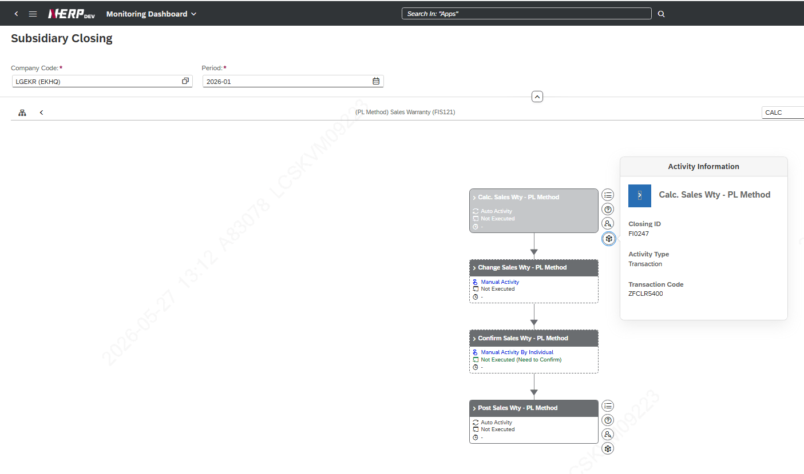

[그림 5-1] 모니터링 화면 — 수행 전(Not Executed) 라인

### 5.2 추가 기표 발생

Rework 판정 대상 계정에 전표가 추가로 기표되면 Rework 점검 대상이 됩니다. 아래는 추가 기표된 전표(Document Number 2100000231, Category SALES_WARRANTY_RESERVE_PL)와 관련 G/L 계정(예: 21350301) 내역을 조회한 화면입니다.

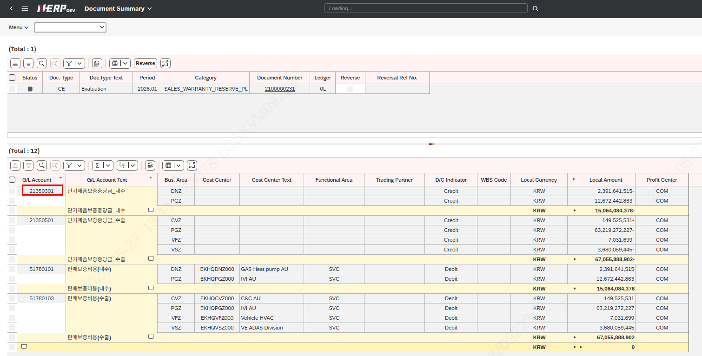

[그림 5-2] 추가 기표된 전표 조회 (Document Summary)

### 5.3 자동수행 시작

라인을 Start 하면 자동수행이 진행됩니다. 'Start Option' 다이얼로그에서 이후 Activity를 자동으로 이어서 수행할지(또는 해당 그룹만 수행할지)를 선택할 수 있습니다.

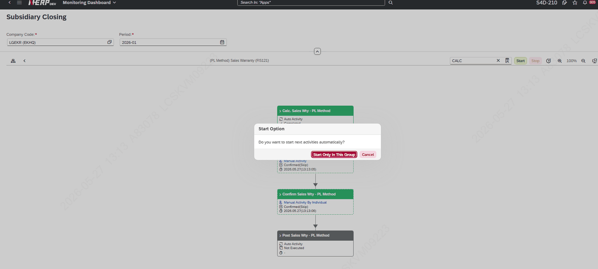

[그림 5-3] 자동수행 Start 옵션 다이얼로그

### 5.4 Rework 발생 표시

Rework 점검 결과 추가 기표가 대상으로 판정되면, 해당 Activity와 연결된 라인이 'Rework Occurred' 상태(붉은색)로 표시되고 자동수행이 중단됩니다. 아래 화면에서 라인 전체가 Rework Occurred로 전환된 것을 확인할 수 있습니다.

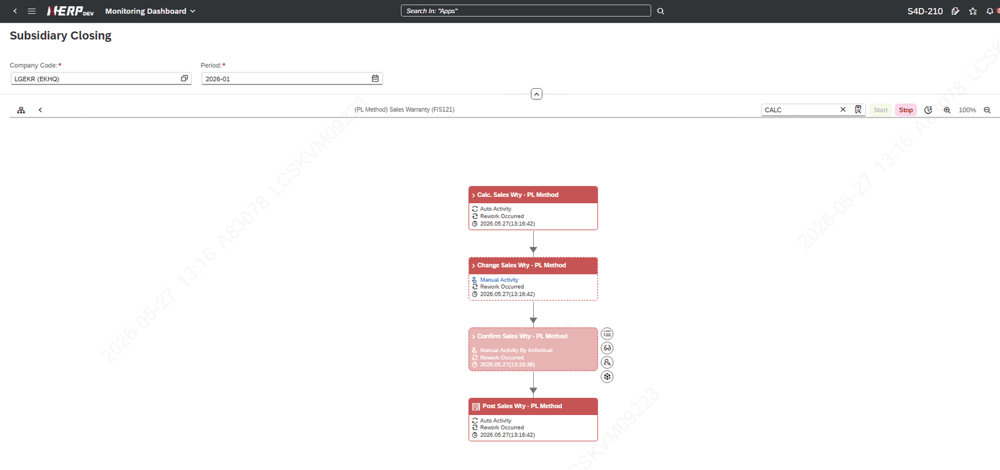

[그림 5-4] 라인이 'Rework Occurred' 상태로 전환된 모습

### 5.5 점검 로그 확인

Detail Log Display에서 수행·점검 로그를 확인합니다. 로그 중 'It is necessary to rework' 메시지로 Rework가 필요함이 기록되며, 성공/경고/오류 건수가 함께 표시됩니다.

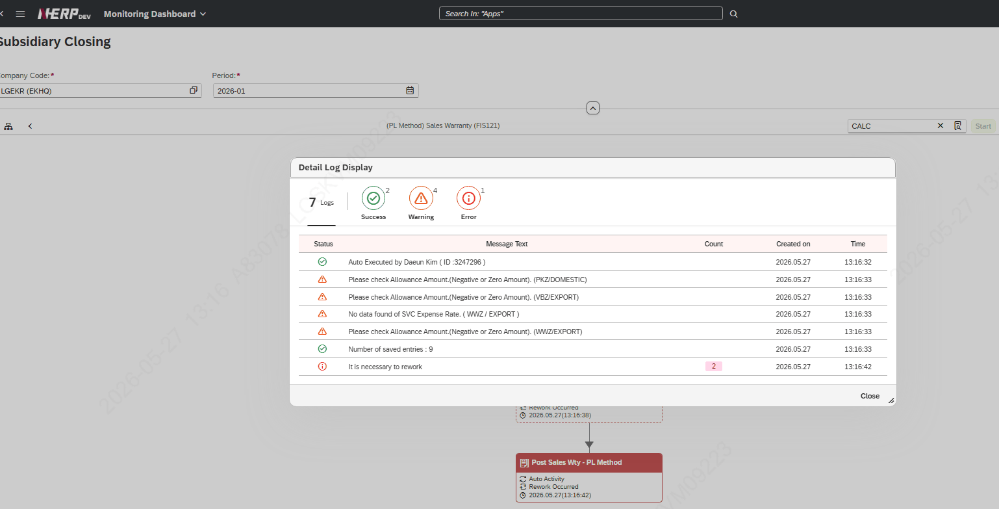

[그림 5-5] Detail Log Display — 'It is necessary to rework' 기록

### 5.6 Rework 대상 전표 확인

Display Rework Document 화면에서 Rework를 유발한 전표 내역(기간, 전표번호, 전표유형, G/L 계정, 사업영역 등)을 조회할 수 있습니다. 아래는 G/L 계정 21350301에 대해 추가 기표된 Rework 전표(2100000234) 예시입니다.

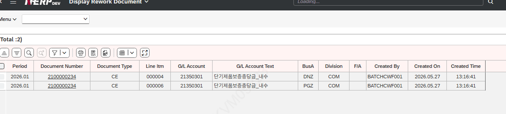

[그림 5-6] Display Rework Document — Rework 유발 전표 조회

### 5.7 Linked Rework 로그 확인

연관 라인(Linked Activity)의 로그에는 어느 Activity로부터 Rework가 전파되었는지가 기록됩니다. 아래 로그의 'Linked Rework occurred from Calc. Sales Wty - PL Method(FI0247)' 메시지로 원인 Activity(FI0247)를 확인할 수 있습니다.

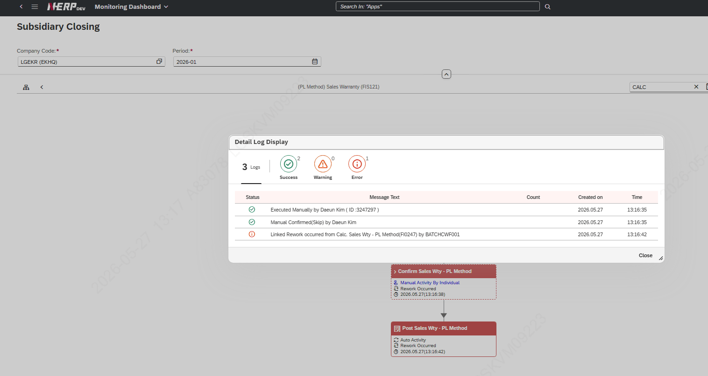

[그림 5-7] Detail Log Display — Linked Rework 전파 기록

## 6. 운영 · 유지보수 점검 가이드

### 6.1 정상 동작 확인 체크리스트

| 점검 항목 | 확인 방법 | 정상 기준 |
|---|---|---|
| Rework 활성화 | 대상 Business Package의 ZTPAC_CONFIG-XREWORK 설정 확인 | XREWORK = 'X'(활성) |
| Rework Rule 정의 | ZLPAC3000 / ZLPAC3010에서 Rule ID와 상세 조건 조회 | 대상 계정·차/대변 등 조건이 등록됨 |
| Activity 지정 | ZLPAC0020에서 대상 Activity의 Rework Rule ID 열 확인 | Rule ID(필요 시 Rework Function) 지정됨 |
| Linked Activity | ZLPAC0020의 Linked Activity 열 / 팝업 확인 | 연관 라인이 의도대로 등록됨 |
| 주기 배치 | Rework 일괄 점검 배치([PAC]REWORK...) 등록/수행 여부 확인 | 활성 Business Package에 배치 잡 존재 |

### 6.2 증상별 점검 가이드

| 증상 | 우선 점검 사항 |
|---|---|
| 추가 기표를 해도 Rework가 발생하지 않음 | ① XREWORK 활성 여부 ② Rule ID/상세 조건이 해당 계정을 포함하는지 ③ 대상 Activity에 Rework Rule ID가 지정되었는지 |
| 특정 계정만 Rework로 안 잡힘 | ZLPAC3010의 G/L 계정 범위·차/대변·Functional Area·외화 여부 조건 일치 확인 |
| 연관 라인이 함께 중단되지 않음 | ZLPAC0020의 Linked Activity 등록 내역 확인(기준 Closing ID에 대상 라인이 연결되어 있는지) |
| 주기 점검이 동작하지 않음 | ① XREWORK 활성 ② RWTMOUT(주기, 분) 값 ③ [PAC]REWORK... 배치 잡 등록/스케줄 상태(SM37) |
| 같은 전표가 반복 점검되는 듯함 | ZTPAC_STATUS의 RWDT/RWTM(점검 시각) 기록 여부 확인 — 해당 시각 이후 내역만 점검됨 |
